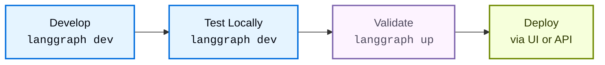

本指南涵盖如何在本地开发和测试 [Agent Server](/langsmith/agent-server) 应用程序。[LangGraph CLI](/langsmith/cli) 为本地开发提供了两个命令，每个命令针对工作流程的不同阶段进行了优化：

- [`langgraph dev`](#langgraph-dev)：用于快速迭代的轻量级开发服务器。
- [`langgraph up`](#langgraph-up)：用于验证的类生产测试环境。

| 功能 | `langgraph dev` | `langgraph up` |
|---------|----------------|----------------|
| **需要 Docker** | 否 | 是 |
| **安装** | `pip install langgraph-cli[inmem]` | `pip install langgraph-cli` |
| **主要用例** | 快速开发与测试 | 类生产验证 |
| **状态持久化** | 内存中并保存到本地目录 | PostgreSQL |
| **热重载** | 是（默认） | 可选（`--watch` 标志） |
| **默认端口** | `2024` | `8123` |
| **资源使用** | 轻量级 | 较重（为服务器、PostgreSQL 和 Redis 构建并运行单独的 docker 容器） |
| **IDE 调试** | 内置 [DAP](https://microsoft.github.io/debug-adapter-protocol/) 支持 | 常规容器调试 |
| **自定义认证** | 是 | 是（需要许可证密钥） |

<Tip>
有关完整的参考详细信息，请参阅 [LangGraph CLI 参考](/langsmith/cli) 页面。
</Tip>

## 开发

构建应用程序时的典型工作流程如下：



| 阶段 | 工具 | 目的 |
|-------|------|---------|
| **本地开发和测试** | [`langgraph dev`](/langsmith/cli#dev) | 编写和迭代您的图，支持热重载 |
| **验证** | [`langgraph up`](/langsmith/cli#up) | 使用完整栈测试类生产行为 |
| **部署** | [`langgraph deploy`](/langsmith/cli#deploy) | 自信地部署到生产环境 |

### 推荐工作流程

1. **日常开发**：使用 `langgraph dev` 进行快速迭代。
1. **定期验证**：使用 `langgraph up` 测试主要更改。
1. **部署前检查**：运行 `langgraph up --recreate` 进行全新构建。
1. **部署**：通过 [LangSmith UI](/langsmith/deployment-quickstart) 或[控制平面 API](/langsmith/api-ref-control-plane) 推送到生产环境。

## `langgraph dev`

[`langgraph dev`](/langsmith/cli#dev) 命令直接在您的环境中运行轻量级服务器，旨在在主动开发期间实现速度和便利。关键功能包括：

- **无需 Docker**：直接在您的环境中运行。
- **热重载**：更改代码时自动重新加载。
- **快速启动**：几秒钟内准备就绪。
- **内置[调试适配器协议](https://microsoft.github.io/debug-adapter-protocol/)支持**：将您的 IDE 调试器附加到服务器以进行行级断点和调试。
- **本地存储**：状态持久化到本地目录。

<Note>
`dev` 服务器使用与生产相同的集成测试套件进行测试，以确保其在开发期间的行为相同，同时使用最少的资源。
</Note>

<Accordion title="开始使用 langgraph dev">

在开始之前，请确保您具备以下条件：
- [LangSmith](https://smith.langchain.com/settings) 的 API 密钥（免费注册）。
- 适用于 Python 的 [uv](https://docs.astral.sh/uv/getting-started/installation/) 或适用于 TypeScript 的 [npx](https://docs.npmjs.com/cli/commands/npx)。

<Steps>
<Step title="创建 LangGraph 应用">

从 [`new-langgraph-project-python` 模板](https://github.com/langchain-ai/new-langgraph-project) 或 [`new-langgraph-project-js` 模板](https://github.com/langchain-ai/new-langgraphjs-project) 创建一个新应用。此模板展示了一个单节点应用程序，您可以使用自己的逻辑进行扩展。

<Tabs>
    <Tab title="Python server">
    ```shell
    uvx --from langgraph-cli@latest langgraph new path/to/your/app --template new-langgraph-project-python
    ```
    </Tab>
    <Tab title="Node server">
    ```shell
    npx @langchain/langgraph-cli new path/to/your/app --template new-langgraph-project-js
    ```
    </Tab>
</Tabs>

<Tip>
**其他模板**<br></br>
如果您使用 [`langgraph new`](/langsmith/cli) 但不指定模板，系统会为您提供一个交互式菜单，让您可以从可用模板列表中进行选择。
</Tip>

</Step>
<Step title="安装依赖">

<Tabs>
    <Tab title="Python server">
    ```shell
    cd path/to/your/app
    uv sync --dev -U
    ```
    </Tab>
    <Tab title="Node server">
    ```shell
    cd path/to/your/app
    yarn install
    ```
    </Tab>
</Tabs>

</Step>
<Step title="启动 Agent Server">

<Tabs>
    <Tab title="Python server">
    ```shell
    uv run langgraph dev
    ```
    </Tab>
    <Tab title="Node server">
    ```shell
    npx @langchain/langgraph-cli dev
    ```
    </Tab>
</Tabs>

示例输出：

```
>    Ready!
>
>    - API: [http://localhost:2024](http://localhost:2024/)
>
>    - Docs: http://localhost:2024/docs
>
>    - Studio Web UI: https://smith.langchain.com/studio/?baseUrl=http://127.0.0.1:2024
```

</Step>
<Step title="测试 API">

<Tabs>
    <Tab title="Python SDK (async)">
    1. 安装 LangGraph Python SDK：
      ```shell
      pip install langgraph-sdk
      ```
    2. 向助手发送消息（无线程运行）：
      ```python
      from langgraph_sdk import get_client
      import asyncio

      client = get_client(url="http://localhost:2024")

      async def main():
          async for chunk in client.runs.stream(
              None,  # Threadless run
              "agent", # Name of assistant. Defined in langgraph.json.
              input={
              "messages": [{
                  "role": "human",
                  "content": "What is LangGraph?",
                  }],
              },
          ):
              print(f"Receiving new event of type: {chunk.event}...")
              print(chunk.data)
              print("\n\n")

      asyncio.run(main())
      ```
    </Tab>
    <Tab title="Python SDK (sync)">
    1. 安装 LangGraph Python SDK：
      ```shell
      pip install langgraph-sdk
      ```
    2. 向助手发送消息（无线程运行）：
      ```python
      from langgraph_sdk import get_sync_client

      client = get_sync_client(url="http://localhost:2024")

      for chunk in client.runs.stream(
          None,  # Threadless run
          "agent", # Name of assistant. Defined in langgraph.json.
          input={
              "messages": [{
                  "role": "human",
                  "content": "What is LangGraph?",
              }],
          },
          stream_mode="messages-tuple",
      ):
          print(f"Receiving new event of type: {chunk.event}...")
          print(chunk.data)
          print("\n\n")
      ```
    </Tab>
    <Tab title="Javascript SDK">
    1. 安装 LangGraph JS SDK：
      ```shell
      npm install @langchain/langgraph-sdk
      ```
    2. 向助手发送消息（无线程运行）：
      ```js
      const { Client } = await import("@langchain/langgraph-sdk");

      // only set the apiUrl if you changed the default port when calling langgraph dev
      const client = new Client({ apiUrl: "http://localhost:2024"});

      const streamResponse = client.runs.stream(
          null, // Threadless run
          "agent", // Assistant ID
          {
              input: {
                  "messages": [
                      { "role": "user", "content": "What is LangGraph?"}
                  ]
              },
              streamMode: "messages-tuple",
          }
      );

      for await (const chunk of streamResponse) {
          console.log(`Receiving new event of type: ${chunk.event}...`);
          console.log(JSON.stringify(chunk.data));
          console.log("\n\n");
      }
      ```
    </Tab>
    <Tab title="Rest API">
    ```bash
    curl -s --request POST \
        --url "http://localhost:2024/runs/stream" \
        --header 'Content-Type: application/json' \
        --data "{
            \"assistant_id\": \"agent",
            \"input\": {
                \"messages\": [
                    {
                        \"role\": \"human\",
                        \"content\": \"What is LangGraph?\"
                    }
                ]
            },
            \"stream_mode\": \"messages-tuple\"
        }"
    ```
    </Tab>
</Tabs>

</Step>
</Steps>

</Accordion>

### 用例

使用 `langgraph dev` 作为您的主要开发工具：

- **日常功能开发**：更改代码，服务器自动重新加载。无需重建容器即可立即测试——非常适合快速迭代周期。
- **快速原型设计和实验**：几秒钟内启动服务器以测试想法，无需 Docker 设置开销。
- **没有 Docker 的环境**：在 CI/CD 管道或没有 Docker 的轻量级 VM 中：
    ```bash
    langgraph dev --no-browser
    ```

- **调试器附加**：使用 `--debug-port` 附加您的 IDE 调试器以便在开发期间进行逐步调试。

## `langgraph up`

[`langgraph up`](/langsmith/cli#up) 命令编排完整的基于 Docker 的栈，镜像生产基础设施，帮助在生产之前捕获部署问题。关键功能包括：

- **验证构建和依赖**：测试您的构建过程和依赖。
- **隔离网络**：真实的容器网络。
- **生产验证**：验证部署准备情况。

<Accordion title="开始使用 langgraph up">

```bash
# Ensure Docker is running
docker ps

# Start production-like stack
langgraph up
```

您的服务器在 `http://localhost:8123` 启动，具有完全持久化存储。

</Accordion>

### 用例

使用 `langgraph up` 进行验证和生产准备测试：

- **部署前验证**：在部署到生产环境之前，您可以使用全新构建运行最终检查，以确保您的所有依赖都正确指定。

    ```bash
    langgraph up --recreate
    ```
    这可以捕获与容器中的依赖解析相关的以及其他任何构建过程问题。

- **主要功能验证**：在实现重大更改后，定期使用完整生产栈进行测试，以确保一切在容器化环境中正常工作。
- **Docker 故障排除**：调试容器特定问题、网络问题或仅在生产中出现的环境变量配置。

## 部署前清单

在部署应用程序之前，使用 `langgraph up` 验证以下内容：

- 所有[依赖](/langsmith/setup-app-requirements-txt)在容器中正确安装。
- 应用程序启动无错误。
- 图执行成功。
- 所有[环境变量](/langsmith/env-var)正确工作。
- [认证/授权](/langsmith/cli#adding-custom-authentication)按预期工作。

## 依赖配置

`langgraph dev` 和 `langgraph up` 都从您的[配置文件](/langsmith/application-structure#configuration-file)中的[依赖](/langsmith/application-structure#dependencies)读取应用程序的依赖，但它们在不同的环境中运行：

- **`langgraph dev`** 直接在本地环境（Python 或 Node.js）中运行您的代码，无需 Docker。
- **`langgraph up`** 构建 Docker 容器并在该隔离容器内运行您的代码。

正确配置依赖可确保两个命令正常工作，并且您在本地测试的内容与部署到生产环境的内容一致。

### `langgraph.json` 文件

`dependencies` 字段告诉 [CLI](/langsmith/cli) **在哪里**找到您的应用程序代码。`dependencies` 字段可以指向：
- **带有包配置的目录**（包含 `pyproject.toml`、`setup.py`、`requirements.txt` 或 `package.json`）
- **特定子目录**：`"dependencies": ["./my_agent"]`
- **特定包**：`"dependencies": ["my-package==1.0.0"]`（Python）或 `"dependencies": ["my-package@1.0.0"]`（JavaScript）

<Tabs>
<Tab title="Python">
```json
{
  "dependencies": ["."],
  "graphs": {
    "my_agent": "./my_agent/agent.py:graph"
  },
  "env": "./.env"
}
```
</Tab>
<Tab title="JavaScript">
```json
{
  "dependencies": ["."],
  "graphs": {
    "my_agent": "./my_agent/agent.js:graph"
  },
  "env": "./.env"
}
```
</Tab>
</Tabs>

### 包依赖文件

这些文件定义您的应用程序需要**什么**包：

<Tabs>
<Tab title="Python">
**pyproject.toml 示例：**
```toml
[project]
name = "my-agent"
version = "0.1.0"
dependencies = [
    "langchain-openai",
    "langchain-anthropic",
    "langgraph",
]
```

**requirements.txt 示例：**
```
langchain-openai
langchain-anthropic
langgraph
```
</Tab>
<Tab title="JavaScript">
**package.json 示例：**
```json
{
  "name": "my-agent",
  "version": "1.0.0",
  "dependencies": {
    "@langchain/openai": "^0.3.0",
    "@langchain/anthropic": "^0.3.0",
    "@langchain/langgraph": "^0.2.0"
  }
}
```
</Tab>
</Tabs>

### 依赖解析过程

当您运行 [`langgraph up`](/langsmith/cli#up) 时，CLI 遵循以下步骤来安装应用程序的依赖：

1. [`langgraph.json`](/langsmith/application-structure#configuration-file) 告诉 CLI **在哪里**查找应用程序代码。`dependencies: ["."]` 字段指向当前目录。
1. **查找包配置**：CLI 在该目录中查找包配置文件（[`pyproject.toml`](/langsmith/setup-pyproject)、[`requirements.txt`](/langsmith/setup-app-requirements-txt) 或 [`package.json`](/langsmith/setup-javascript)）。
1. **读取依赖列表**：CLI 从配置文件中读取包列表。
1. **安装包**：CLI 使用适合您的语言的包管理器安装所有包（Python 使用 `uv` 或 `pip`，JavaScript 使用 `npm`）。

这种两文件方法分离了关注点：`langgraph.json` 处理应用程序结构和位置，而包配置文件处理特定语言的包依赖。

有关安装程序的更多信息，请参阅 [CLI 配置文件](/langsmith/cli#configuration-file)。

### 故障排除

如果遇到依赖安装问题，请尝试切换到 `pip`：

```json
{
  "dependencies": ["."],
  "pip_installer": "pip"
}
```

然后重建：
```bash
langgraph up --recreate
```

## 调试本地 Docker 设置

生产部署可能成功，即使 `langgraph up` 在您的本地计算机上失败。这是因为生产使用托管基础设施，而 `langgraph up` 在您的计算机上运行完整栈。

以下是不影响生产的常见本地环境问题。

### Docker 配置问题

`langgraph up` 需要本地 Docker：

```bash
# Check if Docker is running
docker ps
```

[云部署](/langsmith/cloud) 不使用您的本地 Docker。

**解决方案**：安装 Docker，或使用 `langgraph dev` 进行本地测试。

### 端口冲突

`langgraph up` 使用可能已被占用的端口 `8123`、`5432` 和 `6379`：

```bash
# Check for conflicts
lsof -i :8123  # API server
lsof -i :5432  # PostgreSQL
lsof -i :6379  # Redis
```

**解决方案**：停止冲突服务或使用 [`--port`](/langsmith/cli#dev) 标志。

### 资源约束

`langgraph up` 需要更多 RAM 和磁盘用于：

- PostgreSQL 容器
- Redis 容器
- API 服务器容器

**解决方案**：释放资源或使用 `langgraph dev`。

### 网络配置

VPN 连接、防火墙规则或公司代理设置可能会影响本地 Docker 网络。

**解决方案**：使用 `langgraph dev` 进行测试，或暂时禁用 VPN/防火墙以隔离问题。

## 下一步

现在您已经在本地运行了一个 LangGraph 应用，您已准备好部署它：

**选择 LangSmith 的托管选项：**
- [**云**](/langsmith/cloud)：最快的设置，完全托管（推荐）。
- [**混合**](/langsmith/hybrid)：<Tooltip tip="您的 Agent Server 和代理执行的运行时环境。">数据平面</Tooltip> 在您的云中，<Tooltip tip="用于管理部署的 LangSmith UI 和 API。">控制平面</Tooltip> 由 LangChain 管理。
- [**自托管**](/langsmith/self-hosted)：在您的基础设施中完全控制。

有关更多详细信息，请参阅[平台设置比较](/langsmith/platform-setup)。

**然后部署您的应用：**
- [部署到云快速入门](/langsmith/deployment-quickstart)：快速设置指南。
- [完整的云设置指南](/langsmith/deploy-to-cloud)：全面的部署文档。

**探索功能：**
- **[Studio](/langsmith/studio)**：使用 Studio UI 可视化、交互和调试您的应用程序。尝试 [Studio 快速入门](/langsmith/quick-start-studio)。
- **API 参考**：[LangSmith 部署 API](https://langchain-ai.github.io/langgraph/cloud/reference/api/api_ref/)、[Python SDK](/langsmith/langgraph-python-sdk)、[JS/TS SDK](/langsmith/langgraph-js-ts-sdk)

## 相关资源

- [CLI 参考](/langsmith/cli)：所有 CLI 命令的详细文档
- [应用程序结构](/langsmith/application-structure)：如何构建您的 LangGraph 应用程序
- [故障排除](/langsmith/troubleshooting-studio)：常见问题和解决方案
- [使用 pyproject.toml 进行设置](/langsmith/setup-pyproject)：配置 Python 依赖
- [使用 requirements.txt 进行设置](/langsmith/setup-app-requirements-txt)：替代依赖配置
