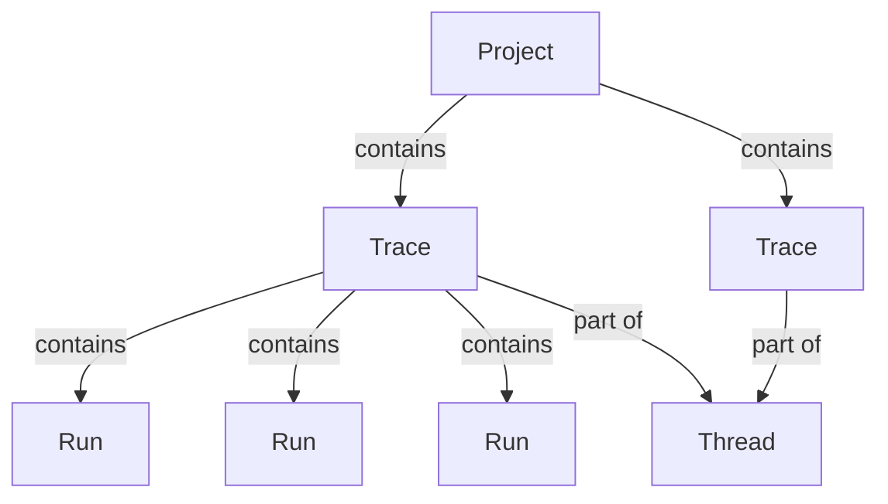

import MaxRunsPerTrace from '/snippets/langsmith/max-runs-per-trace.mdx';

LangSmith 可观测性让您可以记录、检查和分析大型语言模型应用程序采取的每个步骤。本页面解释了 LangSmith 中数据的结构以及如何发送追踪。

## LangSmith 如何构建数据

LangSmith 在一个[_项目_](#projects)中分组多个[_追踪_](#traces)。每个追踪记录应用程序单个操作采取的步骤序列，由单独的[_运行_](#runs)组成。您可以将多轮对话的追踪链接为一个[_线程_](#threads)。

### 项目

_项目_是单个应用程序或服务相关所有追踪的容器。

[将追踪记录到项目](/langsmith/log-traces-to-project)。

### 追踪

_追踪_是单个操作的运行集合。例如，如果用户请求触发了调用大型语言模型然后调用输出解析器的链，所有这些运行都属于同一个追踪。运行通过唯一的追踪 ID 绑定到追踪。如果您熟悉 [OpenTelemetry](https://opentelemetry.io/)，可以将 LangSmith 追踪视为span的集合。

<Note><MaxRunsPerTrace /></Note>

### 运行

_运行_是表示大型语言模型应用程序中单个工作单元的span：对大型语言模型的调用、提示词格式化步骤、检索调用或任何其他离散操作。如果您熟悉 [OpenTelemetry](https://opentelemetry.io/)，可以将运行视为一个 span。

### 线程

_线程_是表示单个对话的追踪序列。多轮对话中的每一轮都是自己的追踪，但追踪通过共享标识符链接。要将追踪分组为线程，请传递带有唯一值的特殊元数据键（`session_id`、`thread_id` 或 `conversation_id`）。

[了解如何配置线程](/langsmith/threads)。

<Callout type="info" icon="feather">
使用 **[Polly](/langsmith/polly)** 分析追踪、运行和线程。Polly 帮助您了解代理性能、调试问题，并从对话线程获取洞察，而无需手动深入研究数据。
</Callout>

## 追踪增强

### 反馈

_反馈_允许您根据某些标准对单个运行进行评分。每个反馈条目由一个标签和一个分数组成，并通过唯一的运行 ID 绑定到运行。反馈可以是连续的或离散的（分类的），标签可以在组织内的运行中重复使用。

有关反馈如何存储的更多信息，请参阅[反馈数据格式指南](/langsmith/feedback-data-format)。

### 标签

_标签_是您可以附加到运行上的字符串，用于在 LangSmith UI 中对它们进行分类、过滤和分组。

[了解如何将标签附加到您的追踪](/langsmith/add-metadata-tags)。

### 元数据

_元数据_是您可以附加到运行的键值对集合。例如，应用程序版本、环境或任何其他上下文信息。与标签类似，您可以使用元数据来过滤和分组运行。

[了解如何向您的追踪添加元数据](/langsmith/add-metadata-tags)。

## 发送追踪

有两种方式可以将追踪数据发送到 LangSmith。

### 集成

LangSmith _集成_ 为流行的大型语言模型提供商和代理框架提供自动追踪（相当于一般可观测性中的自动仪器仪表）。当您使用支持的框架（如 LangChain、LangGraph、OpenAI、Anthropic 或 CrewAI）时，集成会捕获输入、输出和元数据，无需手动更改代码。

[浏览所有集成](/langsmith/integrations)。

### 手动仪器仪表

_手动仪器仪表_允许您向任何代码添加追踪，无论框架如何。当您不使用支持的集成或需要对追踪内容进行细粒度控制时使用它。LangSmith 提供三种机制：

- `@traceable` / `traceable`：追踪任何函数的装饰器
- `trace` 上下文管理器（Python）：包装特定代码块
- `RunTree` API：低级、显式追踪构建

[了解如何添加手动仪器仪表](/langsmith/annotate-code)。

## 数据保留

LangSmith（ SaaS ）保留追踪数据自摄入之日起 400 天。之后，追踪将被永久删除，保留有限的元数据用于使用统计信息。有关保留层级和定价的详细信息，请参阅[使用和计费：数据保留](/langsmith/administration-overview#data-retention)。

<Note>
要将数据保留超过保留期，请将其添加到[数据集](/langsmith/manage-datasets)。数据集无限期保留，即使源追踪被删除后仍然存在。
</Note>

要在到期日之前删除追踪，请参阅[管理追踪](/langsmith/manage-trace#delete-a-trace)。