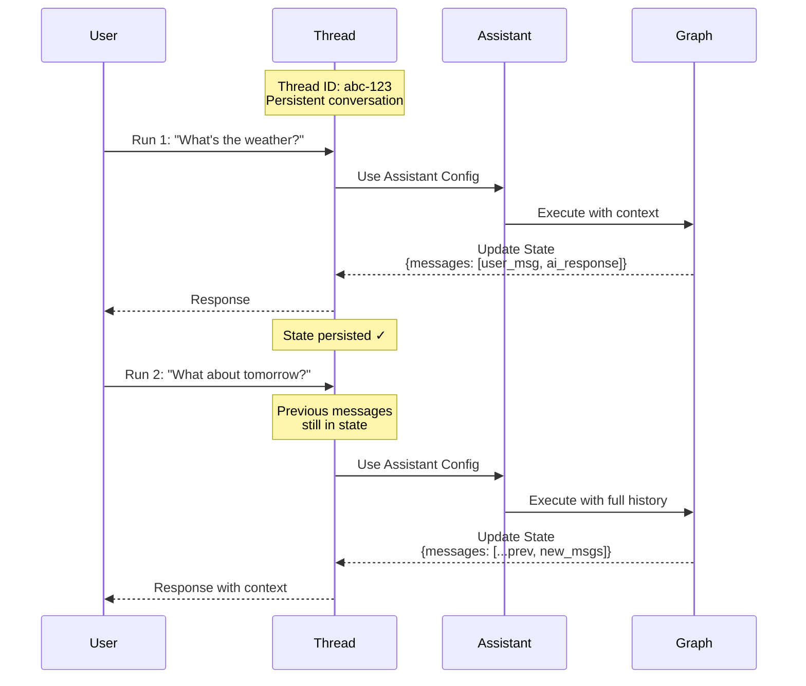

本指南向您展示如何创建、查看和检查_线程_。线程与[助手](/langsmith/assistants)协同工作，以实现[部署图](/langsmith/deployment)的[有状态](/oss/langgraph/persistence)执行。

## 了解线程

线程是一个持久的对话容器，在多次运行中维护状态。每次在线程上执行运行时，图会使用线程的当前状态处理输入，并用新信息更新该状态。

线程通过在运行之间保留对话历史和上下文来实现有状态的交互。没有线程，每次运行都是无状态的，没有对先前交互的记忆。线程特别适用于：

- 需要助手记住所讨论内容的多轮对话。
- 需要在多个步骤中维护上下文的长时间运行的任务。
- 每个用户都有自己的对话历史的用户特定状态管理。

该图说明线程如何在两次运行中维护状态。第二次运行可以访问第一次运行的消息，使助手能够理解"明天怎么样？"的上下文指的是第一次运行的天气查询：



- 线程维护一个具有唯一线程 ID 的持久对话。
- 每次运行将助手的配置应用于图执行。
- 状态在每次运行后更新，并为后续运行保留。
- 后续运行可以访问完整的对话历史。

<Note>
- **[助手](/langsmith/assistants)** 定义图执行的配置（模型、提示词、工具）。创建运行时，您可以指定**图 ID**（例如 `"agent"`）以使用默认助手，或指定**助手 ID**（UUID）以使用特定配置。
- **线程**维护状态和对话历史。
- **运行**将助手和线程组合起来，以特定配置和状态执行您的图。
</Note>

<Tip>
最佳实践：当在线程（对话）中追踪运行时，确保在所有运行（父运行和子运行）上设置 `thread_id`。这是线程过滤、令牌计数和线程级评估正常工作的必要条件。
</Tip>

## 创建线程

要使用状态持久化运行您的图，您必须首先创建一个线程：

<Tabs>
<Tab title="SDK">

### 空线程

要创建新线程，请使用以下方法之一：

<CodeGroup>
```python Python
from langgraph_sdk import get_client

# Initialize the client with your deployment URL
client = get_client(url=<DEPLOYMENT_URL>)

# Create an empty thread
# This creates a new thread with no initial state
thread = await client.threads.create()

print(thread)
```

```javascript JavaScript
import { Client } from "@langchain/langgraph-sdk";

// Initialize the client with your deployment URL
const client = new Client({ apiUrl: <DEPLOYMENT_URL> });

// Create an empty thread
// This creates a new thread with no initial state
const thread = await client.threads.create();

console.log(thread);
```

```bash cURL
curl --request POST \
    --url <DEPLOYMENT_URL>/threads \
    --header 'Content-Type: application/json' \
    --data '{}'
```
</CodeGroup>

有关更多信息，请参阅 @[Python][ThreadsClient.create] 和 @[JS][ThreadsClient.create] SDK 文档，或 [REST API](/langsmith/agent-server-api/threads/create-thread) 参考。

Output:

```json
{
  "thread_id": "123e4567-e89b-12d3-a456-426614174000",
  "created_at": "2025-05-12T14:04:08.268Z",
  "updated_at": "2025-05-12T14:04:08.268Z",
  "metadata": {},
  "status": "idle",
  "values": {}
}
```

### 复制线程

或者，如果您已经有了一个要复制其状态的线程，您可以使用 `copy` 方法。这将创建一个独立线程，其历史与操作时原始线程的历史相同：

<CodeGroup>
```python Python
# Copy an existing thread
# The new thread will have the same state as the original at the time of copying
copied_thread = await client.threads.copy(thread["thread_id"])
```

```javascript JavaScript
// Copy an existing thread
// The new thread will have the same state as the original at the time of copying
const copiedThread = await client.threads.copy(thread["thread_id"]);
```

```bash cURL
curl --request POST --url <DEPLOYMENT_URL>/threads/thread["thread_id"]/copy \
--header 'Content-Type: application/json'
```
</CodeGroup>

有关更多信息，请参阅 @[Python][ThreadsClient.copy] 和 @[JS][ThreadsClient.copy] SDK 文档，或 [REST API](/langsmith/agent-server-api/threads/copy-thread) 参考。

### 预填充状态

您可以通过在 `create` 方法中提供 `supersteps` 列表来创建具有任意预定义状态的线程。`supersteps` 描述了建立线程初始状态的状态更新序列。当您想要以下操作时，这很有用：

- 使用现有对话历史创建线程。
- 从另一个系统迁移对话。
- 使用特定初始状态设置测试场景。
- 从上一个会话恢复对话。

有关检查点和状态管理的更多信息，请参阅 [LangGraph 持久化文档](/oss/langgraph/persistence)。

<CodeGroup>
```python Python
from langgraph_sdk import get_client

# Initialize the client
client = get_client(url=<DEPLOYMENT_URL>)

# Create a thread with pre-populated conversation history
# The supersteps define a sequence of state updates that build up the initial state
thread = await client.threads.create(
  graph_id="agent",  # Specify which graph this thread is for
  supersteps=[
    {
      updates: [
        {
          values: {},
          as_node: '__input__',  # Initial input node
        },
      ],
    },
    {
      updates: [
        {
          values: {
            messages: [
              {
                type: 'human',
                content: 'hello',
              },
            ],
          },
          as_node: '__start__',  # User's first message
        },
      ],
    },
    {
      updates: [
        {
          values: {
            messages: [
              {
                content: 'Hello! How can I assist you today?',
                type: 'ai',
              },
            ],
          },
          as_node: 'call_model',  # Assistant's response
        },
      ],
    },
  ])

print(thread)
```

```javascript JavaScript
import { Client } from "@langchain/langgraph-sdk";

// Initialize the client
const client = new Client({ apiUrl: <DEPLOYMENT_URL> });

// Create a thread with pre-populated conversation history
// The supersteps define a sequence of state updates that build up the initial state
const thread = await client.threads.create({
    graphId: 'agent',  // Specify which graph this thread is for
    supersteps: [
    {
      updates: [
        {
          values: {},
          asNode: '__input__',  // Initial input node
        },
      ],
    },
    {
      updates: [
        {
          values: {
            messages: [
              {
                type: 'human',
                content: 'hello',
              },
            ],
          },
          asNode: '__start__',  // User's first message
        },
      ],
    },
    {
      updates: [
        {
          values: {
            messages: [
              {
                content: 'Hello! How can I assist you today?',
                type: 'ai',
              },
            ],
          },
          asNode: 'call_model',  // Assistant's response
        },
      ],
    },
  ],
});

console.log(thread);
```

```bash cURL
curl --request POST \
    --url <DEPLOYMENT_URL>/threads \
    --header 'Content-Type: application/json' \
    --data '{"metadata":{"graph_id":"agent"},"supersteps":[{"updates":[{"values":{},"as_node":"__input__"}]},{"updates":[{"values":{"messages":[{"type":"human","content":"hello"}]},"as_node":"__start__"}]},{"updates":[{"values":{"messages":[{"content":"Hello\u0021 How can I assist you today?","type":"ai"}]},"as_node":"call_model"}]}]}'
```
</CodeGroup>

Output:

```json
{
  "thread_id": "f15d70a1-27d4-4793-a897-de5609920b7d",
  "created_at": "2025-05-12T15:37:08.935038+00:00",
  "updated_at": "2025-05-12T15:37:08.935046+00:00",
  "metadata": {
    "graph_id": "agent"
  },
  "status": "idle",
  "config": {},
  "values": {
    "messages": [
      {
        "content": "hello",
        "additional_kwargs": {},
        "response_metadata": {},
        "type": "human",
        "name": null,
        "id": "8701f3be-959c-4b7c-852f-c2160699b4ab",
        "example": false
      },
      {
        "content": "Hello! How can I assist you today?",
        "additional_kwargs": {},
        "response_metadata": {},
        "type": "ai",
        "name": null,
        "id": "4d8ea561-7ca1-409a-99f7-6b67af3e1aa3",
        "example": false,
        "tool_calls": [],
        "invalid_tool_calls": [],
        "usage_metadata": null
      }
    ]
  }
}
```

</Tab>
<Tab title="UI">

You can also create threads directly from the [LangSmith UI](https://smith.langchain.com):

1. Navigate to your [deployment](/langsmith/deployment).
2. Select the **Threads** tab.
3. Click **+ New thread**.
4. Optionally provide metadata or initial state for the thread.
5. Click **Create thread**.

The newly created thread will appear in the threads table and can be used for runs immediately.

</Tab>
</Tabs>

## 列出线程

<Tabs>
<Tab title="SDK">

要列出线程，请使用 `search` 方法。这将列出应用程序中与提供的过滤器匹配的线程：

### 按线程状态过滤

使用 `status` 字段根据线程状态进行过滤。支持的值有 `idle`、`busy`、`interrupted` 和 `error`。例如，要查看 `idle` 线程：

<CodeGroup>
```python Python
# Search for idle threads
# The status filter accepts: idle, busy, interrupted, error
print(await client.threads.search(status="idle", limit=1))
```

```javascript JavaScript
// Search for idle threads
// The status filter accepts: idle, busy, interrupted, error
console.log(await client.threads.search({ status: "idle", limit: 1 }));
```

```bash cURL
curl --request POST \
--url <DEPLOYMENT_URL>/threads/search \
--header 'Content-Type: application/json' \
--data '{"status": "idle", "limit": 1}'
```
</CodeGroup>

有关更多信息，请参阅 @[Python][ThreadsClient.search] 和 @[JS][ThreadsClient.search] SDK 文档，或 [REST API](/langsmith/agent-server-api/threads/search-threads) 参考。

Output:

```json
[
  {
    "thread_id": "cacf79bb-4248-4d01-aabc-938dbd60ed2c",
    "created_at": "2024-08-14T17:36:38.921660+00:00",
    "updated_at": "2024-08-14T17:36:38.921660+00:00",
    "metadata": {
      "graph_id": "agent"
    },
    "status": "idle",
    "config": {
      "configurable": {}
    }
  }
]
```

### 按元数据过滤

`search` 方法允许您按元数据进行过滤。这对于查找与特定图、用户或您添加到线程的自定义元数据关联的线程很有用。

您可以过滤的常见元数据字段包括：

| 元数据键 | 描述 |
|---|---
| `graph_id` | 线程所属的图（部署）。 |
| `assistant_id` | 用于在线程上创建运行的[助手](/langsmith/assistants)。 |
| `langgraph_auth_user_id` | 拥有线程的已认证用户（使用[自定义认证](/langsmith/custom-auth)时自动设置）。 |
| `cron_id` | 在线程上创建运行的[cron 作业](/langsmith/cron-jobs)。 |

您还可以过滤在创建或更新线程时附加的任何自定义元数据。

#### 按图过滤

<CodeGroup>
```python Python
print(await client.threads.search(metadata={"graph_id": "agent"}, limit=1))
```

```javascript JavaScript
console.log(await client.threads.search({ metadata: { "graph_id": "agent" }, limit: 1 }));
```

```bash cURL
curl --request POST \
--url <DEPLOYMENT_URL>/threads/search \
--header 'Content-Type: application/json' \
--data '{"metadata": {"graph_id": "agent"}, "limit": 1}'
```
</CodeGroup>

Output:

```json
[
  {
    "thread_id": "cacf79bb-4248-4d01-aabc-938dbd60ed2c",
    "created_at": "2024-08-14T17:36:38.921660+00:00",
    "updated_at": "2024-08-14T17:36:38.921660+00:00",
    "metadata": {
      "graph_id": "agent"
    },
    "status": "idle",
    "config": {
      "configurable": {}
    }
  }
]
```

#### 按助手过滤

<CodeGroup>
```python Python
print(await client.threads.search(
    metadata={"assistant_id": "fe096781-5601-53d2-b2f6-0d3403f7e9ca"},
    limit=1,
))
```

```javascript JavaScript
console.log(await client.threads.search({
  metadata: { "assistant_id": "fe096781-5601-53d2-b2f6-0d3403f7e9ca" },
  limit: 1,
}));
```

```bash cURL
curl --request POST \
--url <DEPLOYMENT_URL>/threads/search \
--header 'Content-Type: application/json' \
--data '{"metadata": {"assistant_id": "fe096781-5601-53d2-b2f6-0d3403f7e9ca"}, "limit": 1}'
```
</CodeGroup>

#### 按 cron 作业过滤

<CodeGroup>
```python Python
print(await client.threads.search(
    metadata={"cron_id": "8b98a268-e49a-4228-a0d3-1a354e3a54d0"},
    limit=10,
))
```

```javascript JavaScript
console.log(await client.threads.search({
  metadata: { "cron_id": "8b98a268-e49a-4228-a0d3-1a354e3a54d0" },
  limit: 10,
}));
```

```bash cURL
curl --request POST \
--url <DEPLOYMENT_URL>/threads/search \
--header 'Content-Type: application/json' \
--data '{"metadata": {"cron_id": "8b98a268-e49a-4228-a0d3-1a354e3a54d0"}, "limit": 10}'
```
</CodeGroup>

### 排序

SDK 还支持使用 `sort_by` 和 `sort_order` 参数按 `thread_id`、`status`、`created_at` 和 `updated_at` 对线程进行排序。

</Tab>
<Tab title="UI">

You can also view and manage threads in a deployment via the [LangSmith UI](https://smith.langchain.com):

1. Navigate to your [deployment](/langsmith/deployment).
2. Select the **Threads** tab.

This will load a table of all threads in your deployment.

**Filter by thread status:** Select a status in the top bar to filter threads by `idle`, `busy`, `interrupted`, or `error`.

**Sort threads:** Click on the arrow icon for any column header to sort by that property (`thread_id`, `status`, `created_at`, or `updated_at`).

</Tab>
</Tabs>

## 检查线程

<Tabs>
<Tab title="SDK">

### 获取线程

要查看给定其 `thread_id` 的特定线程，请使用 @[`get`][ThreadsClient.get] 方法：

<CodeGroup>
```python Python
# Retrieve a specific thread by its ID
# Returns the thread metadata including status, creation time, and metadata
print((await client.threads.get(thread["thread_id"])))
```

```javascript JavaScript
// Retrieve a specific thread by its ID
// Returns the thread metadata including status, creation time, and metadata
console.log((await client.threads.get(thread["thread_id"])));
```

```bash cURL
curl --request GET \
--url <DEPLOYMENT_URL>/threads/thread["thread_id"] \
--header 'Content-Type: application/json'
```
</CodeGroup>

Output:

```json
{
  "thread_id": "cacf79bb-4248-4d01-aabc-938dbd60ed2c",
  "created_at": "2024-08-14T17:36:38.921660+00:00",
  "updated_at": "2024-08-14T17:36:38.921660+00:00",
  "metadata": {
    "graph_id": "agent"
  },
  "status": "idle",
  "config": {
    "configurable": {}
  }
}
```

有关更多信息，请参阅 @[Python][ThreadsClient.get] 和 @[JS][ThreadsClient.get] SDK 文档，或 [REST API](/langsmith/agent-server-api/threads/get-thread) 参考。

### 检查线程状态

要查看给定线程的当前状态，请使用 @[`get_state`][ThreadsClient.get_state] 方法。这会返回当前值、要执行的下一个节点和检查点信息：

<CodeGroup>
```python Python
# Get the current state of a thread
# Returns values, next nodes, tasks, checkpoint info, and metadata
print((await client.threads.get_state(thread["thread_id"])))
```

```javascript JavaScript
// Get the current state of a thread
// Returns values, next nodes, tasks, checkpoint info, and metadata
console.log((await client.threads.getState(thread["thread_id"])));
```

```bash cURL
curl --request GET \
--url <DEPLOYMENT_URL>/threads/thread["thread_id"]/state \
--header 'Content-Type: application/json'
```
</CodeGroup>

Output:

```json
{
  "values": {
    "messages": [
      {
        "content": "hello",
        "additional_kwargs": {},
        "response_metadata": {},
        "type": "human",
        "name": null,
        "id": "8701f3be-959c-4b7c-852f-c2160699b4ab",
        "example": false
      },
      {
        "content": "Hello! How can I assist you today?",
        "additional_kwargs": {},
        "response_metadata": {},
        "type": "ai",
        "name": null,
        "id": "4d8ea561-7ca1-409a-99f7-6b67af3e1aa3",
        "example": false,
        "tool_calls": [],
        "invalid_tool_calls": [],
        "usage_metadata": null
      }
    ]
  },
  "next": [],
  "tasks": [],
  "metadata": {
    "thread_id": "f15d70a1-27d4-4793-a897-de5609920b7d",
    "checkpoint_id": "1f02f46f-7308-616c-8000-1b158a9a6955",
    "graph_id": "agent_with_quite_a_long_name",
    "source": "update",
    "step": 1,
    "writes": {
      "call_model": {
        "messages": [
          {
            "content": "Hello! How can I assist you today?",
            "type": "ai"
          }
        ]
      }
    },
    "parents": {}
  },
  "created_at": "2025-05-12T15:37:09.008055+00:00",
  "checkpoint": {
    "checkpoint_id": "1f02f46f-733f-6b58-8001-ea90dcabb1bd",
    "thread_id": "f15d70a1-27d4-4793-a897-de5609920b7d",
    "checkpoint_ns": ""
  },
  "parent_checkpoint": {
    "checkpoint_id": "1f02f46f-7308-616c-8000-1b158a9a6955",
    "thread_id": "f15d70a1-27d4-4793-a897-de5609920b7d",
    "checkpoint_ns": ""
  },
  "checkpoint_id": "1f02f46f-733f-6b58-8001-ea90dcabb1bd",
  "parent_checkpoint_id": "1f02f46f-7308-616c-8000-1b158a9a6955"
}
```

有关更多信息，请参阅 @[Python][ThreadsClient.get_state] 和 @[JS][ThreadsClient.get_state] SDK 文档，或 [REST API](/langsmith/agent-server-api/threads/get-thread-state) 参考。

或者，要查看线程在给定检查点的状态，请传入检查点 ID。这对于在执行历史的特定点检查线程状态很有用。

首先，从线程的历史记录中获取检查点 ID：

<CodeGroup>
```python Python
# Get the thread history to find checkpoint IDs
history = await client.threads.get_history(thread_id=thread["thread_id"])
checkpoint_id = history[0]["checkpoint_id"]  # Get the most recent checkpoint
```

```javascript JavaScript
// Get the thread history to find checkpoint IDs
const history = await client.threads.getHistory(thread["thread_id"]);
const checkpointId = history[0].checkpoint_id;  // Get the most recent checkpoint
```

```bash cURL
# Get the thread history to find checkpoint IDs
curl --request POST \
--url <DEPLOYMENT_URL>/threads/thread["thread_id"]/history \
--header 'Content-Type: application/json' \
--data '{"limit": 1}'
```
</CodeGroup>

然后使用检查点 ID 获取该特定点的状态：

<CodeGroup>
```python Python
# Get thread state at a specific checkpoint
# Useful for inspecting historical state or debugging
thread_state = await client.threads.get_state(
  thread_id=thread["thread_id"],
  checkpoint_id=checkpoint_id
)
```

```javascript JavaScript
// Get thread state at a specific checkpoint
// Useful for inspecting historical state or debugging
const threadState = await client.threads.getState(thread["thread_id"], checkpointId);
```

```bash cURL
curl --request GET \
--url <DEPLOYMENT_URL>/threads/thread["thread_id"]/state/<CHECKPOINT_ID> \
--header 'Content-Type: application/json'
```
</CodeGroup>

### 检查完整线程历史

要查看线程的历史记录，请使用 @[`get_history`][ThreadsClient.get_history] 方法。这会返回线程经历的每个状态的列表，允许您追踪完整的执行路径：

<CodeGroup>
```python Python
# Get the full history of a thread
# Returns a list of all state snapshots from the thread's execution
history = await client.threads.get_history(
  thread_id=thread["thread_id"],
  limit=10  # Optional: limit the number of states returned
)

for state in history:
    print(f"Checkpoint: {state['checkpoint_id']}")
    print(f"Step: {state['metadata']['step']}")
```

```javascript JavaScript
// Get the full history of a thread
// Returns a list of all state snapshots from the thread's execution
const history = await client.threads.getHistory(
  thread["thread_id"],
  {
    limit: 10  // Optional: limit the number of states returned
  }
);

for (const state of history) {
  console.log(`Checkpoint: ${state.checkpoint_id}`);
  console.log(`Step: ${state.metadata.step}`);
}
```

```bash cURL
curl --request POST \
--url <DEPLOYMENT_URL>/threads/thread["thread_id"]/history \
--header 'Content-Type: application/json' \
--data '{"limit": 10}'
```
</CodeGroup>

此方法特别适用于：
- 通过查看状态如何演变来调试执行流。
- 理解图中执行的决策点。
- 审计对话历史和状态更改。
- 重放或分析过去的交互。

有关更多信息，请参阅 @[Python][ThreadsClient.get_history] 和 @[JS][ThreadsClient.get_history] SDK 文档，或 [REST API](/langsmith/agent-server-api/threads/get-thread-history) 参考。

</Tab>
<Tab title="UI">

You can also view and inspect threads in the [LangSmith UI](https://smith.langchain.com):

1. Navigate to your [deployment](/langsmith/deployment).
2. Select the **Threads** tab to view all threads.
3. Click on a thread to inspect its current state.

To view the full thread history and perform detailed debugging, click **Open in Studio** to open the thread in [Studio](/langsmith/studio). Studio provides a visual interface for exploring the thread's execution history, state changes, and checkpoint details.

</Tab>
</Tabs>
