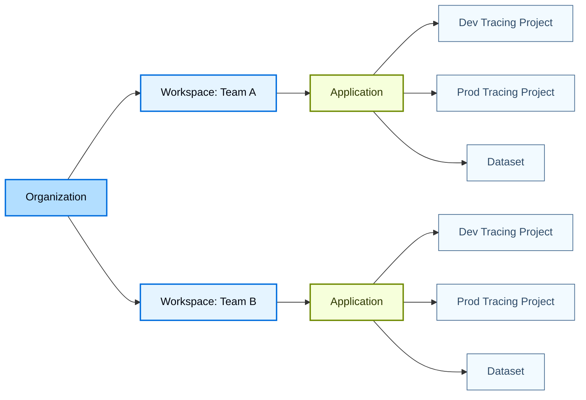
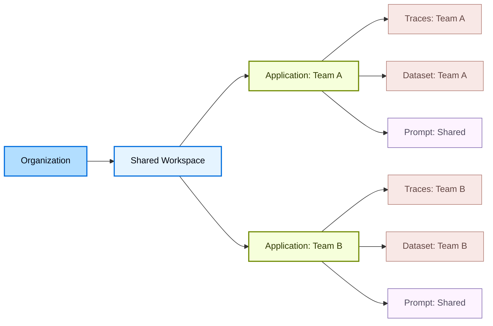
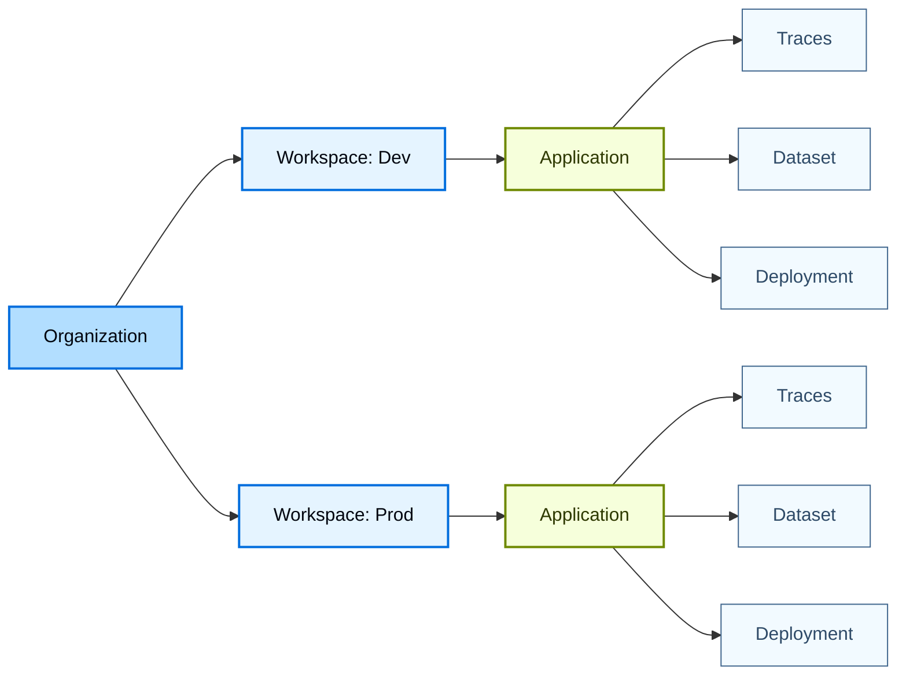

LangSmith 使用分层结构来组织您的工作：[_组织_](/langsmith/administration-overview#organizations)、[_工作区_](/langsmith/administration-overview#workspaces)、[_应用程序_](/langsmith/administration-overview#applications)和[_资源_](/langsmith/administration-overview#resources)。这个结构让您能够平衡协作与访问控制，允许您为团队的需求选择合适的隔离级别。

LangSmith 权限系统建立在这个层次结构之上。通过[基于角色的访问控制 (RBAC)](/langsmith/rbac)，用户[权限](/langsmith/organization-workspace-operations)的作用域是一个或多个工作区，在工作区之间强制执行隔离。通过更细粒度的[基于属性的访问控制](/langsmith/organization-workspace-operations#access-policies) (ABAC)，可以基于工作区内的标签或应用程序等属性进一步限制或授予访问权限（例如，允许用户仅访问开发资源或仅访问与特定应用程序关联的资源）。

本页面解释了基于团队隔离需求组织工作区的三种常见方法：

- [以团队为中心的工作区](#team-centric-workspaces)：每个团队一个工作区（推荐给大多数客户）
- [协作工作区](#collaborative-workspaces)：每个工作区多个团队
- [项目隔离工作区](#project-isolated-workspaces)：每个团队多个工作区（用于严格隔离要求）

<Tip>
有关设置组织和工作区的详细信息，请参阅[设置层次结构](/langsmith/set-up-hierarchy)。
</Tip>

## 以团队为中心的工作区

<Warning>
这是默认模型，是大多数客户的推荐选择。
</Warning>

此模型（每个团队一个工作区）使用单个组织作为顶级边界。在组织内，多个工作区用于隔离不同的团队或业务单元。每个工作区代表特定团队的逻辑边界，并管理该团队可以访问的数据和资源。在工作区内，团队使用多个应用程序将支持同一智能体的资源组合在一起。应用程序还可以包含不同的资源，例如用于开发和生产环境的单独追踪项目。

- **优点：** 单一工作区允许共享所有团队资源，使团队内的协作和迭代变得简单。它还简化了从开发到生产的推广。例如，相同的[提示词](/langsmith/prompt-engineering)可以使用标签进行版本控制和推广到生产，而无需复制或重复。
- **缺点：** 主要权衡是同一团队环境之间的隔离有限。开发、测试和生产资源在同一应用程序中共存，因此团队必须依赖标签和约定来避免对生产造成意外影响。[RBAC](/langsmith/rbac) 的作用域在工作区级别。[ABAC](/langsmith/organization-workspace-operations#access-policies) 通过基于资源属性限制访问来在工作区内提供更细粒度的权限，例如允许用户仅访问开发资源。

## 协作工作区

在此模型（每个工作区多个团队）中，多个团队在组织内共享一个工作区，并使用应用程序和 [ABAC](/langsmith/organization-workspace-operations#access-policies) 来分离资源和管理访问。因此，[提示词](/langsmith/prompt-engineering)和[部署](/langsmith/deployment)等共享资源可以在团队之间重用，而[追踪](/langsmith/observability-concepts#traces)和[数据集](/langsmith/evaluation-concepts#datasets)等敏感资源的访问仅限于拥有团队。

- **优点：** 提示词和部署等常见资源可以在团队之间共享和重用，增加协作并减少重复工作。与以团队为中心的工作区模型不同，协作不限于单个团队，可以跨越工作区内的所有团队。
- **缺点：** 团队和环境之间的隔离比多工作区模型弱，取决于正确使用 ABAC。配置错误的标签或策略可能会在团队之间暴露敏感[追踪](/langsmith/observability-concepts#traces)或[数据集](/langsmith/evaluation-concepts#datasets)，并且跨多个团队管理权限增加了运营复杂性。

## 项目隔离工作区

<Callout icon="check" iconType="solid" color="#C7D2FE">
此方法仅在需要严格隔离时使用。
</Callout>

在此模型（每个团队多个工作区）中，通过为单个团队创建多个工作区来增加隔离。工作区可以按项目或按环境组织，例如分开的开发和生产工作区。每个工作区完全隔离，有自己的用户、数据和资源，访问权限严格限于该工作区。

- **优点：** 团队、项目和环境之间的强隔离。只有开发工作区访问权限的用户无法查看或访问生产数据或任何生产资源，降低了意外更改或跨环境误用的风险。
- **缺点：** 资源无法在工作区之间共享。重用[提示词](/langsmith/prompt-engineering)、[数据集](/langsmith/evaluation-concepts#datasets)或[实验](/langsmith/evaluation-concepts#experiment)，即使是将智能体从开发推广到生产，也需要在工作区之间手动复制，这增加了摩擦和重复。
