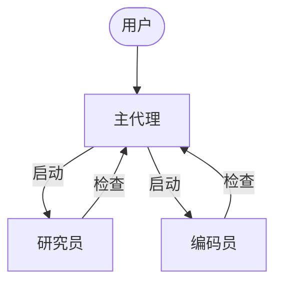
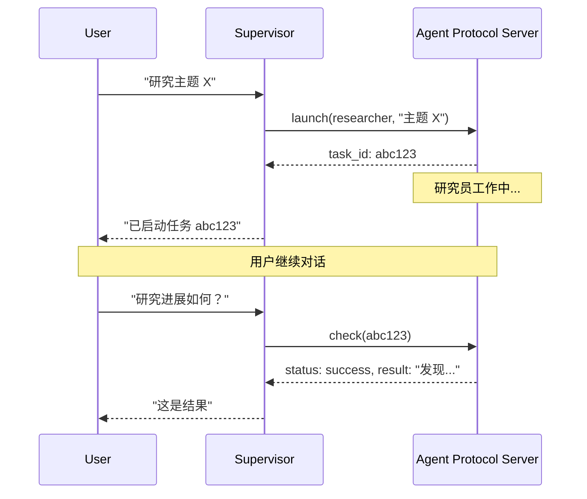

异步子代理允许主代理启动立即返回的后台任务，因此主代理可以在子代理并行工作的同时继续与用户交互。主代理可以随时检查进度、发送后续指令或取消任务。

这是对[子代理](/oss/deepagents/subagents)的扩展，子代理同步运行并阻塞主代理直到完成。当任务长时间运行、可并行化或需要中途转向时，使用异步子代理。

<Note>
:::python
异步子代理是预览功能，在 `deepagents` 0.5.0 中可用。预览功能正在积极开发中，API 可能会更改。
:::

:::js
异步子代理是预览功能，在 `deepagents` 1.9.0 中可用。预览功能正在积极开发中，API 可能会更改。
:::
</Note>



<Note>
异步子代理与任何实现 [Agent Protocol](https://github.com/langchain-ai/agent-protocol) 的服务器通信。您可以使用 [LangSmith Deployments](/langsmith/deployment)，或自托管任何兼容 Agent Protocol 的服务器。每个子代理独立于主代理运行，主代理通过 SDK 控制它们以启动、检查、更新和取消。
</Note>

## 何时使用异步子代理

| 维度             | 同步子代理                                                    | 异步子代理                                                      |
| ---------------- | ------------------------------------------------------------ | ------------------------------------------------------------- |
| **执行模型**     | 主代理阻塞直到子代理完成                                      | 立即返回任务 ID；主代理继续                                   |
| **并发**         | 并行但阻塞                                                    | 并行且非阻塞                                                   |
| **中途更新**     | 不可能                                                        | 通过 `update_async_task` 发送后续指令                          |
| **取消**         | 不可能                                                        | 通过 `cancel_async_task` 取消运行中的任务                      |
| **状态持久性**   | 无状态——调用之间没有持久状态                                  | 有状态——在交互之间维护自己线程上的状态                          |
| **最适合**       | 代理应等待结果再继续的任务                                    | 在聊天中交互管理的长时间运行、复杂任务                          |

## 配置异步子代理

将异步子代理定义为 @[`AsyncSubAgent`] 规范列表，每个指向一个 Agent Protocol 服务器：

:::python
```python
from deepagents import AsyncSubAgent, create_deep_agent

async_subagents = [
    AsyncSubAgent(
        name="researcher",
        description="Research agent for information gathering and synthesis",
        graph_id="researcher",
        # 无 url → ASGI 传输（共同部署在同一部署中）
    ),
    AsyncSubAgent(
        name="coder",
        description="Coding agent for code generation and review",
        graph_id="coder",
        # url="https://coder-deployment.langsmith.dev"  # 可选：远程的 HTTP 传输
    ),
]

agent = create_deep_agent(
    model="google_genai:gemini-3.1-pro-preview",
    subagents=async_subagents,
)
```

| 字段        | 类型            | 描述                                                                 |
| ----------- | --------------- | ------------------------------------------------------------------- |
| `name`      | `str`           | 必需。唯一标识符。主代理在启动任务时使用此名称。                       |
| `description` | `str`         | 必需。此子代理的用途。主代理使用此来决定委托给哪个代理。               |
| `graph_id`  | `str`           | 必需。Agent Protocol 服务器上的图 ID（或助手 ID）。对于基于 LangGraph 的部署，必须与 `langgraph.json` 中注册的图匹配。 |
| `url`       | `str`           | 可选。省略时使用 ASGI 传输（进程内）。设置时使用 HTTP 传输到远程 Agent Protocol 服务器。 |
| `headers`   | `dict[str, str]` | 可选。发送到远程服务器的额外请求头。用于与自托管 Agent Protocol 服务器的自定义身份验证。 |
:::

:::js
```typescript
import { createDeepAgent, AsyncSubAgent } from "deepagents";

const asyncSubagents: AsyncSubAgent[] = [
  {
    name: "researcher",
    description: "Research agent for information gathering and synthesis",
    graphId: "researcher",
    // 无 url → ASGI 传输（共同部署在同一部署中）
  },
  {
    name: "coder",
    description: "Coding agent for code generation and review",
    graphId: "coder",
    // url: "https://coder-deployment.langsmith.dev"  // 可选：远程的 HTTP 传输
  },
];

const agent = createDeepAgent({
  model: "google_genai:gemini-3.1-pro-preview",
  subagents: [...asyncSubagents],
});
```

| 字段          | 类型                        | 描述                                                               |
| ------------- | -------------------------- | ----------------------------------------------------------------- |
| `name`        | `string`                   | 必需。唯一标识符。主代理在启动任务时使用此名称。                    |
| `description` | `string`                   | 必需。此子代理的用途。主代理使用此来决定委托给哪个代理。              |
| `graphId`     | `string`                   | 必需。Agent Protocol 服务器上的图 ID（或助手 ID）。对于基于 LangGraph 的部署，必须与 `langgraph.json` 中注册的图匹配。 |
| `url`         | `string`                   | 可选。省略时使用 ASGI 传输（进程内）。设置时使用 HTTP 传输到远程 Agent Protocol 服务器。 |
| `headers`     | `Record<string, string>`  | 可选。发送到远程服务器的额外请求头。用于与自托管 Agent Protocol 服务器的自定义身份验证。 |
:::

对于基于 LangGraph 的部署，请在同一 `langgraph.json` 中注册所有图：

```json
{
  "graphs": {
    "supervisor": "./src/supervisor.py:graph",
    "researcher": "./src/researcher.py:graph",
    "coder": "./src/coder.py:graph"
  }
}
```

## 使用异步子代理工具

@[`AsyncSubAgentMiddleware`] 为主代理提供五个工具：

| 工具                  | 用途                    | 返回值                              |
| -------------------- | ---------------------- | ---------------------------------- |
| `start_async_task`   | 启动新的后台任务        | 任务 ID（立即返回）                 |
| `check_async_task`    | 获取任务的当前状态和结果| 状态 + 结果（如已完成）             |
| `update_async_task`   | 向运行中的任务发送新指令| 确认 + 更新后的状态                 |
| `cancel_async_task`   | 停止运行中的任务        | 确认                               |
| `list_async_tasks`    | 列出所有跟踪任务及其状态| 所有任务的摘要                      |

主代理的 LLM 像调用任何其他工具一样调用这些工具。中间件自动处理线程创建、运行管理和状态持久化。

### 了解生命周期

典型的交互遵循此顺序：



- **启动** 在服务器上创建一个新线程，使用任务描述作为输入开始运行，并返回线程 ID 作为任务 ID。主代理向用户报告此 ID，不轮询完成状态。
- **检查** 获取当前运行状态。如果运行成功，它检索线程状态以提取子代理的最终输出。如果仍在运行，则向用户报告。
- **更新** 在同一线程上创建一个新运行，使用中断多任务策略。先前的运行被中断，子代理使用完整对话历史记录加新指令重新启动。任务 ID 保持不变。
- **取消** 在服务器上调用 `runs.cancel()` 并将任务标记为 `"cancelled"`。
- **列表** 遍历所有跟踪的任务。对于非终结状态任务，它并行从服务器获取实时状态。终结状态（`success`、`error`、`cancelled`）从缓存返回。

## 了解状态管理

:::python
任务元数据存储在主代理图的专用状态通道（`async_tasks`）中，与消息历史分开。这很关键，因为深度代理在上下文窗口填满时会[压缩其消息历史](/oss/deepagents/context-engineering#summarization)。如果任务 ID 仅存在于工具消息中，它们会在压缩期间丢失。专用通道确保主代理即使在多轮压缩后仍能通过 `list_async_tasks` 召回其任务。

每个跟踪的任务记录任务 ID、代理名称、线程 ID、运行 ID、状态和时间戳（`created_at`、`last_checked_at`、`last_updated_at`）。
:::

:::js
任务元数据存储在主代理图的专用状态通道（`asyncTasks`）中，与消息历史分开。这很关键，因为深度代理在上下文窗口填满时会[压缩其消息历史](/oss/deepagents/context-engineering#summarization)。如果任务 ID 仅存在于工具消息中，它们会在压缩期间丢失。专用通道确保主代理即使在多轮压缩后仍能通过 `list_async_tasks` 召回其任务。

每个跟踪的任务记录任务 ID、代理名称、线程 ID、运行 ID、状态和时间戳（`createdAt`、`checkedAt`、`updatedAt`）。
:::

## 选择传输方式

### ASGI 传输（共同部署）

当子代理规范省略 `url` 字段时，LangGraph SDK 使用 ASGI 传输——SDK 调用通过进程内函数调用路由，而不是 HTTP。对于基于 LangGraph 的部署，这需要两个图都注册在同一个 `langgraph.json` 中。

ASGI 传输消除网络延迟，不需要额外的身份验证配置。子代理仍作为具有自己状态的独立线程运行。这是推荐的默认方式。

### HTTP 传输（远程）

添加 `url` 字段以切换到 HTTP 传输，SDK 调用通过网络发送到远程 Agent Protocol 服务器：

:::python
```python
AsyncSubAgent(
    name="researcher",
    description="Research agent",
    graph_id="researcher",
    url="https://my-research-deployment.langsmith.dev",
)
```
:::

:::js
```typescript
{
  name: "researcher",
  description: "Research agent",
  graphId: "researcher",
  url: "https://my-research-deployment.langsmith.dev",
}
```
:::

对于 LangGraph 部署，身份验证由 LangGraph SDK 使用环境变量中的 `LANGSMITH_API_KEY`（或 `LANGGRAPH_API_KEY`）处理。自托管 Agent Protocol 服务器可能使用不同的身份验证机制。

当子代理需要独立扩展、不同资源配置文件或由不同团队维护时，使用 HTTP 传输。

## 选择部署拓扑

### 单一部署

单一部署意味着所有代理使用 ASGI 传输共同部署在同一服务器上。对于基于 LangGraph 的部署，在一个 `langgraph.json` 中注册所有图。这是推荐的起点——管理一个服务器，代理之间零网络延迟。

### 分离部署

主代理在一个服务器上，子代理通过 HTTP 传输在另一个服务器上。当子代理需要不同的计算配置文件或独立扩展时使用。

### 混合部署

在分离部署中，主代理在一个服务器上，子代理通过 HTTP 传输在另一个服务器上。当子代理需要不同的计算配置文件或独立扩展时使用。

### 混合部署

在混合部署中，某些子代理通过 ASGI 共同部署，其他通过 HTTP 远程：

:::python
```python
async_subagents = [
    AsyncSubAgent(
        name="researcher",
        description="Research agent",
        graph_id="researcher",
        # 无 url → ASGI（共同部署）
    ),
    AsyncSubAgent(
        name="coder",
        description="Coding agent",
        graph_id="coder",
        url="https://coder-deployment.langsmith.dev",
        # 有 url → HTTP（远程）
    ),
]
```
:::

:::js
```typescript
const asyncSubagents: AsyncSubAgent[] = [
  {
    name: "researcher",
    description: "Research agent",
    graphId: "researcher",
    // 无 url → ASGI（共同部署）
  },
  {
    name: "coder",
    description: "Coding agent",
    graphId: "coder",
    url: "https://coder-deployment.langsmith.dev",
    // 有 url → HTTP（远程）
  },
];
```
:::

## 最佳实践

### 为本地开发调整工作池大小

在使用 `langgraph dev` 本地运行时，增加工作池以容纳并行的子代理运行。每个活动运行占用一个工作槽。具有 3 个并发子代理任务的主代理需要 4 个槽（1 个主代理 + 3 个子代理）。资源配置不足会导致启动排队。

```bash
langgraph dev --n-jobs-per-worker 10
```

### 编写清晰的子代理描述

主代理使用描述来决定启动哪个子代理。要具体且以动作为导向：

:::python
```python
# 好
AsyncSubAgent(
    name="researcher",
    description="Conducts in-depth research using web search. Use for questions requiring multiple searches and synthesis.",
    graph_id="researcher",
)

# 差
AsyncSubAgent(
    name="helper",
    description="helps with stuff",
    graph_id="helper",
)
```
:::

:::js
```typescript
// 好
{
  name: "researcher",
  description: "Conducts in-depth research using web search. Use for questions requiring multiple searches and synthesis.",
  graphId: "researcher",
}

// 差
{
  name: "helper",
  description: "helps with stuff",
  graphId: "helper",
}
```
:::

### 使用线程 ID 进行追踪

使用基于 LangGraph 的部署时，每个异步子代理运行都是一个标准 LangGraph 运行，在 LangSmith 中完全可见。主代理的追踪显示 `launch`、`check`、`update`、`cancel` 和 `list` 的工具调用。每个子代理运行显示为单独的追踪，通过线程 ID 链接。使用线程 ID（任务 ID）关联主代理编排追踪与子代理执行追踪。

## 故障排除

### 主代理在启动后立即轮询

**问题**：主代理在启动后立即循环调用 `check`，将异步执行变为阻塞。

**解决方案**：中间件注入系统提示词规则以防止这种情况。如果轮询持续存在，在主代理的系统提示词中强化行为：

:::python
```python
agent = create_deep_agent(
    model="google_genai:gemini-3.1-pro-preview",
    system_prompt="""...your instructions...

    After launching an async subagent, ALWAYS return control to the user.
    Never call check_async_task immediately after launch.""",
    subagents=async_subagents,
)
```
:::

:::js
```typescript
const agent = createDeepAgent({
  model: "google_genai:gemini-3.1-pro-preview",
  systemPrompt: `...your instructions...

    After launching an async subagent, ALWAYS return control to the user.
    Never call check_async_task immediately after launch.`,
  subagents: [...asyncSubagents],
});
```
:::

### 主代理报告过时的状态

**问题**：主代理引用对话历史中较早的任务状态，而不是进行新的 `check` 调用。

**解决方案**：中间件提示词告诉模型"对话历史中的任务状态始终已过时"。如果仍然发生，添加明确指令以始终在报告状态之前调用 `check` 或 `list`。

### 任务 ID 查找失败

**问题**：主代理截断或重新格式化任务 ID，导致 `check` 或 `cancel` 失败。

**解决方案**：中间件提示词告诉模型始终使用完整的任务 ID。如果截断持续存在，这通常是模型特定的问题——尝试不同的模型或在系统提示词中添加"始终显示完整 task_id，切勿截断或缩写"。

### 子代理启动排队而不是运行

**问题**：启动子代理挂起或需要很长时间才能开始。

**解决方案**：工作池可能已耗尽。使用 `--n-jobs-per-worker` 增加池大小。请参阅[为本地开发调整工作池大小](#size-the-worker-pool-for-local-development)。

## 参考实现

[async-deep-agents](https://github.com/langchain-ai/async-deep-agents) 仓库包含在 Python 和 TypeScript 中工作的示例，部署到 LangSmith Deployments。它演示了一个具有研究员和编码员子代理的主代理，作为后台任务运行。