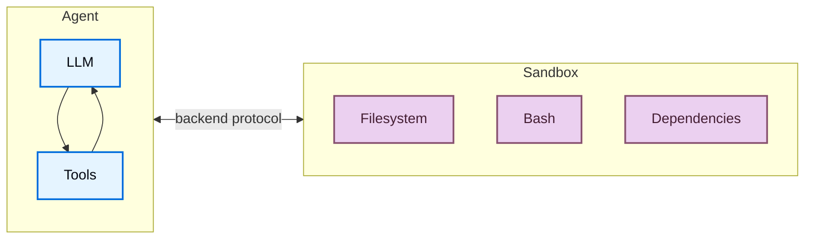
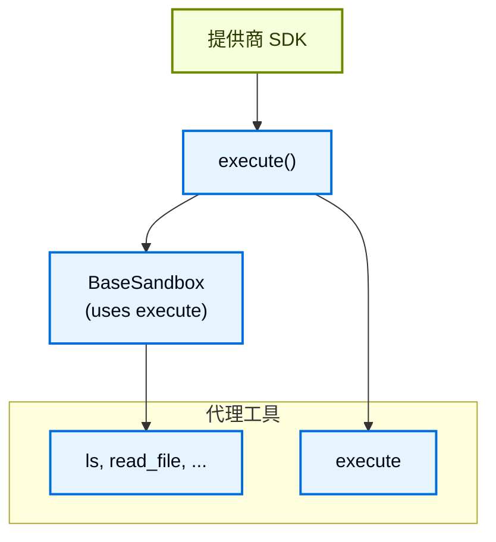
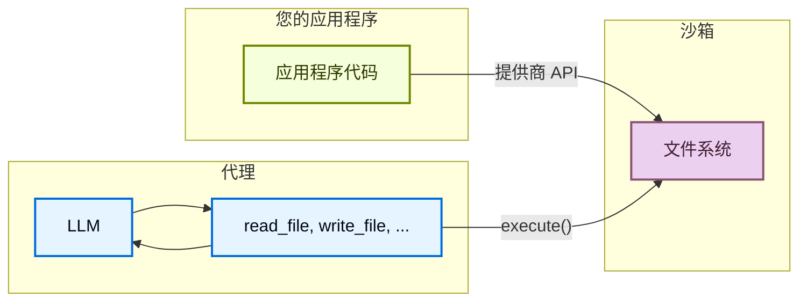

import SandboxBasicPy from '/snippets/deepagents-sandbox-basic-py.mdx';
import SandboxBasicJs from '/snippets/deepagents-sandbox-basic-js.mdx';

代理生成代码、与文件系统交互并运行 shell 命令。因为我们无法预测代理可能做什么，所以重要的是将其环境隔离，以便它无法访问凭证、文件或网络。沙箱通过在代理的执行环境和我方主机系统之间创建边界来提供这种隔离。

在深度代理中，**沙箱是[后端](/oss/deepagents/backends)**，定义了代理操作的环境。与其他只暴露文件操作的后端（State、Filesystem、Store）不同，沙箱后端还为代理提供了用于运行 shell 命令的 `execute` 工具。当您配置沙箱后端时，代理获得：

- 所有标准文件系统工具（`ls`、`read_file`、`write_file`、`edit_file`、`glob`、`grep`）
- 用于在沙箱中运行任意 shell 命令的 `execute` 工具
- 保护您主机系统的安全边界



## 为什么使用沙箱？

沙箱用于安全。它们允许代理执行任意代码、访问文件和使用网络，而不会危及您的凭证、本地文件或主机系统。当代理自主运行时，这种隔离至关重要。

沙箱特别适用于：

- 编码代理：自主运行的代理可以使用 shell、git、克隆仓库（许多提供商提供原生 git API，例如 [Daytona 的 git 操作](https://www.daytona.io/docs/en/git-operations/)），并运行 Docker-in-Docker 进行构建和测试流水线
- 数据分析代理——在安全、隔离的环境中加载文件、安装数据分析库（pandas、numpy 等）、运行统计计算并创建输出（如 PowerPoint 演示文稿）

<Tip>
    **使用深度代理 CLI？** CLI 通过 `--sandbox` 标志内置了沙箱支持。请参阅[使用远程沙箱](/oss/deepagents/cli/overview#use-remote-sandboxes)了解 CLI 特定设置、标志（`--sandbox-id`、`--sandbox-setup`）和示例。
</Tip>

## 基本用法

这些示例假设您已经使用提供商的 SDK 创建了沙箱/devbox 并设置了凭证。有关注册、身份验证和特定于提供商的生命周期详细信息，请参阅[可用的提供商](#available-providers)。

:::js
<SandboxBasicJs />
:::

:::python
<SandboxBasicPy />
::

## 可用的提供商

:::python
有关特定于提供商的设置、身份验证和生命周期详细信息，请参阅[沙箱集成](/oss/integrations/sandboxes)。
:::

:::js
<Note>
技能需要 `deepagents>=1.7.0`。
</Note>

<div className="grid grid-cols-1 md:grid-cols-2 gap-3">
    <a href="/oss/integrations/providers/modal" className="flex items-center justify-center gap-1.5 p-2 rounded-lg border border-gray-200 dark:border-gray-700 hover:border-gray-300 dark:hover:border-gray-600 no-underline">
        
        
        <span className="font-semibold">Modal</span>
    </a>

    <a href="/oss/integrations/providers/daytona" className="flex items-center justify-center gap-1.5 p-2 rounded-lg border border-gray-200 dark:border-gray-700 hover:border-gray-300 dark:hover:border-gray-600 no-underline">
        
        
        <span className="font-semibold">Daytona</span>
    </a>

    <a href="/oss/integrations/providers/deno" className="flex items-center justify-center gap-1.5 p-2 rounded-lg border border-gray-200 dark:border-gray-700 hover:border-gray-300 dark:hover:border-gray-600 no-underline">
        
        
        <span className="font-semibold">Deno</span>
    </a>

    <a href="/oss/integrations/providers/node-vfs" className="flex items-center justify-center gap-1.5 p-2 rounded-lg border border-gray-200 dark:border-gray-700 hover:border-gray-300 dark:hover:border-gray-600 no-underline">
        
        
        <span className="font-semibold">Node VFS</span>
    </a>

    <a href="/langsmith/sandboxes" className="flex items-center justify-center gap-1.5 p-2 rounded-lg border border-gray-200 dark:border-gray-700 hover:border-gray-300 dark:hover:border-gray-600 no-underline">
        
        <span className="font-semibold">LangSmith</span>
    </a>
</div>
:::

没有看到您的提供商？您可以实现自己的沙箱后端。请参阅[贡献沙箱集成](/oss/contributing/integrations-langchain)。

## 生命周期和范围

沙箱消耗资源并花钱，直到它们被关闭。您如何管理它们的生命周期取决于您的应用程序。

选择沙箱生命周期如何映射到您的应用程序资源。请参阅[投入生产](/oss/deepagents/going-to-production#sandboxes)了解有关此决策的更多信息。

### 线程范围（默认）

每次对话获得自己的沙箱。沙箱在第一次运行开始时创建，并重用于同一线程上的后续消息。当线程被清理（或沙箱 TTL 过期）时，沙箱被销毁。这是大多数代理的正确默认值。

示例：一个数据分析机器人，其中每次对话都以干净的环境开始。

### 助手范围

给定[助手](/langsmith/assistants)的所有线程共享一个沙箱。沙箱 ID 存储在助手的配置中，因此每次对话都返回相同的环境。文件、安装的包和克隆的仓库在对话之间持久化。当代理维护长时间运行的 workspace 时使用此选项。

示例：一个维护克隆仓库和跨对话安装依赖项的编码助手。

<Warning>
    助手范围的沙箱会随着时间的推移累积文件、安装的包和其他沙箱内状态。使用沙箱提供商的 TTL 配置，定期使用快照重置，或实施清理逻辑，以防止沙箱的磁盘和内存无限增长。线程范围的沙箱通过每次对话全新开始来避免这种情况。
</Warning>

### 基本生命周期

:::js

```typescript
// Create and initialize
const sandbox = await ModalSandbox.create(options);

// Use the sandbox (directly or via an agent)
const result = await sandbox.execute("echo hello");

// Clean up when done
await sandbox.close();
```
:::

:::python

<Tabs>
    <Tab title="Daytona">

        ```python
        from daytona import Daytona

        from langchain_daytona import DaytonaSandbox

        sandbox = Daytona().create()
        backend = DaytonaSandbox(sandbox=sandbox)

        result = backend.execute("echo hello")
        # ... use sandbox
        sandbox.stop()
        ```

    </Tab>
    <Tab title="Modal">

        ```python
        import modal

        from langchain_modal import ModalSandbox

        app = modal.App.lookup("your-app")
        modal_sandbox = modal.Sandbox.create(app=app)
        backend = ModalSandbox(sandbox=modal_sandbox)

        result = backend.execute("echo hello")
        # ... use sandbox
        modal_sandbox.terminate()
        ```

    </Tab>
    <Tab title="Runloop">

        ```python
        from runloop_api_client import RunloopSDK

        from langchain_runloop import RunloopSandbox

        client = RunloopSDK(bearer_token="...")
        devbox = client.devbox.create()
        backend = RunloopSandbox(devbox=devbox)

        result = backend.execute("echo hello")
        # ... use sandbox
        devbox.shutdown()
        ```

    </Tab>
    <Tab title="AgentCore">

        ```python
        from bedrock_agentcore.tools.code_interpreter_client import CodeInterpreter

        from langchain_agentcore_codeinterpreter import AgentCoreSandbox

        interpreter = CodeInterpreter(region="us-west-2")
        interpreter.start()

        backend = AgentCoreSandbox(interpreter=interpreter)

        result = backend.execute("echo hello")
        # ... use sandbox
        interpreter.stop()
        ```

    </Tab>
    <Tab title="LangSmith">

        ```python
        from langsmith.sandbox import SandboxClient

        from deepagents.backends.langsmith import LangSmithSandbox

        client = SandboxClient()
        ls_sandbox = client.create_sandbox(template_name="deepagents-deploy")

        backend = LangSmithSandbox(sandbox=ls_sandbox)

        result = backend.execute("echo hello")
        # ... use sandbox
        client.delete_sandbox(backend.id)
        ```

    </Tab>
</Tabs>
:::

### 每次对话的生命周期

在聊天应用程序中，对话通常由 `thread_id` 表示。通常，每个 `thread_id` 应该使用自己唯一的沙箱。

在您的应用程序中或在沙箱提供商允许的情况下，将沙箱 ID 和 `thread_id` 之间的映射存储在沙箱中。

<Tip>
**聊天应用程序的 TTL。**当用户可以空闲后重新参与时，您通常不知道他们是否会或何时返回。在沙箱上配置生存时间（TTL）——例如，TTL 到归档或 TTL 到删除——以便提供商自动清理空闲沙箱。许多沙箱提供商支持此功能。
</Tip>

:::python

以下示例显示使用 Daytona 的 get-or-create 模式。对于其他提供商，请参阅沙箱提供商 API 获取等效的标签、元数据和 TTL 选项：

```python
from langchain_core.utils.uuid import uuid7

from daytona import CreateSandboxFromSnapshotParams, Daytona
from deepagents import create_deep_agent
from langchain_daytona import DaytonaSandbox

client = Daytona()
thread_id = str(uuid7())

# Get or create sandbox by thread_id
try:
    sandbox = client.find_one(labels={"thread_id": thread_id})
except Exception:
    params = CreateSandboxFromSnapshotParams(
        labels={"thread_id": thread_id},
        # Add TTL so the sandbox is cleaned up when idle
        auto_delete_interval=3600,
    )
    sandbox = client.create(params)

backend = DaytonaSandbox(sandbox=sandbox)
agent = create_deep_agent(
    model="google_genai:gemini-3.1-pro-preview",
    backend=backend,
    system_prompt="You are a coding assistant with sandbox access. You can create and run code in the sandbox.",
)

try:
    result = agent.invoke(
        {
            "messages": [
                {
                    "role": "user",
                    "content": "Create a hello world Python script and run it",
                }
            ]
        },
        config={
            "configurable": {
                "thread_id": thread_id,
            }
        },
    )
    print(result["messages"][-1].content)
except Exception:
    # Optional: delete the sandbox proactively on an exception
    client.delete(sandbox)
    raise
```
:::

:::js

```typescript
import "dotenv/config";
import { randomUUID } from "node:crypto";
import { Daytona } from "@daytonaio/sdk";
import type { CreateSandboxFromSnapshotParams } from "@daytonaio/sdk";
import { DaytonaSandbox } from "@langchain/daytona";
import { createDeepAgent } from "deepagents";

const client = new Daytona();
const threadId = randomUUID();

// Get or create sandbox by thread_id
let sandbox;
try {
    sandbox = await client.findOne({ labels: { thread_id: threadId } });
} catch {
    const params: CreateSandboxFromSnapshotParams = {
        labels: { thread_id: threadId },
        // Add TTL so the sandbox is cleaned up when idle (minutes)
        autoDeleteInterval: 3600,
    };
sandbox = await client.create(params);
}

const backend = await DaytonaSandbox.fromId(sandbox.id);
const agent = createDeepAgent({
    backend,
    systemPrompt:
        "You are a coding assistant with sandbox access. You can create and run code in the sandbox.",
});

try {
    const result = await agent.invoke(
        {
            messages: [
                {
                role: "user",
                content: "Create a hello world Python script and run it",
                },
            ],
        },
        {
            configurable: {
                thread_id: threadId,
            },
        },
    );
    const lastMessage = result.messages[result.messages.length - 1];
    console.log(
        typeof lastMessage.content === "string"
        ? lastMessage.content
        : String(lastMessage.content),
    );
} catch (err) {
    // Optional: delete the sandbox proactively on an exception
    await client.delete(sandbox);
    throw err;
}
```
:::

## 集成模式

根据代理运行的位置，有两种架构模式将代理与沙箱集成。

### 代理在沙箱中模式

代理在沙箱内运行，您通过网络与它通信。您构建一个预装了代理框架的 Docker 或 VM 镜像，在沙箱内运行它，并从外部连接发送消息。

好处：

- 类似于本地开发。
- 代理和环境之间的紧密耦合。

权衡：

- API 密钥必须存在于沙箱内（安全风险）。
- 更新需要重建镜像。
- 需要通信基础设施（WebSocket 或 HTTP 层）。

要在沙箱中运行代理，请构建镜像并在其中安装 deepagents。

```dockerfile
FROM python:3.11
RUN pip install deepagents-cli
```

然后在沙箱内运行代理。
要在沙箱内使用代理，您必须添加额外的基础设施来处理应用程序和沙箱内代理之间的通信。

### 沙箱作为工具模式

代理在您的机器或服务器上运行。当它需要执行代码时，它调用沙箱工具（如 `execute`、`read_file` 或 `write_file`），这些工具调用提供商的 API 在远程沙箱中运行操作。

好处：

- 更新代理代码无需重建镜像。
- 代理状态和执行之间更清洁的分离。
    - API 密钥保持在沙箱外。
    - 沙箱故障不会丢失代理状态。
    - 可以选择并行在多个沙箱中运行任务。
- 只为执行时间付费。

权衡：

- 每次执行调用的网络延迟。

:::python

```python Example
from daytona import Daytona
from deepagents import create_deep_agent
from dotenv import load_dotenv
from langchain_daytona import DaytonaSandbox


load_dotenv()

# Can also do this with AgentCore, E2B, Runloop, Modal
sandbox = Daytona().create()
backend = DaytonaSandbox(sandbox=sandbox)

agent = create_deep_agent(
    model="google_genai:gemini-3.1-pro-preview",
    backend=backend,
    system_prompt="You are a coding assistant with sandbox access. You can create and run code in the sandbox.",
)

try:
    result = agent.invoke(
        {
            "messages": [
                {
                    "role": "user",
                    "content": "Create a hello world Python script and run it",
                }
            ]
        }
    )
    print(result["messages"][-1].content)
except Exception:
    # Optional: delete the sandbox proactively on an exception
    sandbox.stop()
    raise
```
:::

:::js

```typescript Example
import "dotenv/config";
import { DaytonaSandbox } from "@langchain/daytona";
import { createDeepAgent } from "deepagents";

// Can also do this with E2B, Runloop, Modal
const sandbox = await DaytonaSandbox.create();

const agent = createDeepAgent({
  backend: sandbox,
  systemPrompt:
    "You are a coding assistant with sandbox access. You can create and run code in the sandbox.",
});

try {
  const result = await agent.invoke({
    messages: [
      {
        role: "user",
        content: "Create a hello world Python script and run it",
      },
    ],
  });
  const lastMessage = result.messages[result.messages.length - 1];
  console.log(
    typeof lastMessage.content === "string"
      ? lastMessage.content
      : String(lastMessage.content),
  );
} catch (err) {
  // Optional: delete the sandbox proactively on an exception
  await sandbox.close();
  throw err;
}
```
:::

本文档中的示例使用沙箱作为工具模式。当提供商的 SDK 处理通信层且您希望生产环境镜像本地开发时，请选择代理在沙箱中模式。当您需要快速迭代代理逻辑、将 API 密钥保持在沙箱外或更喜欢更清晰的责任分离时，请选择沙箱作为工具模式。

## 沙箱如何工作

### 隔离边界

所有沙箱提供商保护您的主机系统免受代理的文件系统和 shell 操作。代理无法读取您的本地文件、访问您机器上的环境变量或干扰其他进程。然而，单独的沙箱**不能**防止：

- **上下文注入**：控制代理部分输入的攻击者可以指示它在沙箱内运行任意命令。沙箱是隔离的，但代理在其中有完全控制权。
- **网络泄露**：除非阻止网络访问，否则上下文注入的代理可以通过 HTTP 或 DNS 将数据从沙箱发送出去。一些提供商支持阻止网络访问（例如 Modal 上的 `blockNetwork: true`）。

请参阅[安全注意事项](#security-considerations)了解如何处理 secrets 和缓解这些风险。

### `execute` 方法

沙箱后端有一个简单的架构：提供商必须实现的唯一方法是 `execute()`，它运行 shell 命令并返回其输出。每个其他文件系统操作（`read`、`write`、`edit`、`ls`、`glob`、`grep`）都由 @[`BaseSandbox`] 基类构建在 `execute()` 之上，该基类构造脚本并通过 `execute()` 在沙箱内运行它们。



这种设计意味着：
- **添加新提供商很简单。**实现 `execute()`——基类处理其他一切。
- **`execute` 工具是有条件可用的。** 每次模型调用时，工具检查后端是否实现了 @[`SandboxBackendProtocol`]。如果没有，工具被过滤掉，代理永远不会看到它。

当代理调用 `execute` 工具时，它提供一个 `command` 字符串并获得组合的 stdout/stderr、退出代码，如果输出太大则返回截断通知。

您也可以在应用程序代码中直接调用后端 `execute()` 方法。

:::python
<Tabs>
    <Tab title="Daytona">
        <CodeGroup>
            ```bash pip
            pip install langchain-daytona
            ```

            ```bash uv
            uv add langchain-daytona
            ```
        </CodeGroup>

        ```python
        from daytona import Daytona

        from langchain_daytona import DaytonaSandbox

        sandbox = Daytona().create()
        backend = DaytonaSandbox(sandbox=sandbox)

        result = backend.execute("python --version")
        print(result.output)
        ```
    </Tab>
    <Tab title="Modal">
        ```python
        import modal

        from langchain_modal import ModalSandbox

        app = modal.App.lookup("your-app")
        modal_sandbox = modal.Sandbox.create(app=app)
        backend = ModalSandbox(sandbox=modal_sandbox)

        result = backend.execute("python --version")
        print(result.output)
        ```
    </Tab>
    <Tab title="Runloop">
        <CodeGroup>
            ```bash pip
            pip install langchain-runloop
            ```

            ```bash uv
            uv add langchain-runloop
            ```
        </CodeGroup>

        ```python
        from runloop_api_client import RunloopSDK

        from langchain_runloop import RunloopSandbox

        api_key = "..."
        client = RunloopSDK(bearer_token=api_key)

        devbox = client.devbox.create()
        backend = RunloopSandbox(devbox=devbox)

        try:
            result = backend.execute("python --version")
            print(result.output)
        finally:
            devbox.shutdown()
        ```
    </Tab>
    <Tab title="AgentCore">
        <CodeGroup>
            ```bash pip
            pip install langchain-agentcore-codeinterpreter
            ```

            ```bash uv
            uv add langchain-agentcore-codeinterpreter
            ```
        </CodeGroup>

        ```python
        from bedrock_agentcore.tools.code_interpreter_client import CodeInterpreter

        from langchain_agentcore_codeinterpreter import AgentCoreSandbox

        interpreter = CodeInterpreter(region="us-west-2")
        interpreter.start()

        backend = AgentCoreSandbox(interpreter=interpreter)

        try:
            result = backend.execute("python3 --version")
            print(result.output)
        finally:
            interpreter.stop()
        ```
    </Tab>
    <Tab title="LangSmith">
        ```python
        from langsmith.sandbox import SandboxClient

        from deepagents.backends.langsmith import LangSmithSandbox

        client = SandboxClient()
        ls_sandbox = client.create_sandbox(template_name="deepagents-deploy")
        backend = LangSmithSandbox(sandbox=ls_sandbox)

        result = backend.execute("python --version")
        print(result.output)
        ```
    </Tab>
</Tabs>
:::

例如：

```
4
[Command succeeded with exit code 0]
```

```
bash: foobar: command not found
[Command failed with exit code 127]
```

如果命令产生非常大的输出，结果会自动保存到文件，并指示代理使用 `read_file` 增量访问。这可以防止上下文窗口溢出。

### 两个平面的文件访问

文件进出沙箱有两种不同的方式，了解何时使用每种方式很重要：

**代理文件系统工具**：`read_file`、`write_file`、`edit_file`、`ls`、`glob`、`grep` 和 `execute` 是大型语言模型在执行期间调用的工具。这些通过沙箱内的 `execute()` 处理。代理使用它们来读取代码、写入文件并作为其任务的一部分运行命令。

**文件传输 API**：`uploadFiles()` 和 `downloadFiles()` 方法，您的应用程序代码调用这些方法。这些使用提供商的原生文件传输 API（不是 shell 命令），设计用于在您的主机环境和沙箱之间移动文件。使用这些来：
- 在代理运行之前用源代码、配置或数据**填充沙箱**
- 在代理完成后**检索产物**（生成的代码、构建输出、报告）
- **预填充代理需要的依赖项**



:::js
## 处理文件

### 填充沙箱

使用 `uploadFiles()` 在代理运行之前填充沙箱。文件内容作为 `Uint8Array` 提供：

```typescript
const encoder = new TextEncoder();
const responses = await sandbox.uploadFiles([
  ["src/index.js", encoder.encode("console.log('Hello')")],
  ["package.json", encoder.encode('{"name": "my-app"}')],
]);

// Each response indicates success or failure
for (const res of responses) {
  if (res.error) {
    console.error(`Failed to upload ${res.path}: ${res.error}`);
  }
}
```

### 检索产物

使用 `downloadFiles()` 在代理完成后从沙箱检索文件：

```typescript
const results = await sandbox.downloadFiles(["src/index.js", "output.txt"]);

const decoder = new TextDecoder();
for (const result of results) {
  if (result.content) {
    console.log(`${result.path}: ${decoder.decode(result.content)}`);
  } else {
    console.error(`Failed to download ${result.path}: ${result.error}`);
  }
}
```

<Note>
在沙箱内，代理使用自己的文件系统工具（`read_file`、`write_file`）：不是 `uploadFiles` 或 `downloadFiles`。那些方法是用于您的应用程序代码将文件跨边界移入和移出沙箱的。
</Note>
:::

:::python
## 处理文件

deepagents 沙箱后端支持文件传输 API，用于在您的应用程序和沙箱之间移动文件。

### 填充沙箱

使用 `upload_files()` 在代理运行之前填充沙箱。路径必须是绝对路径，内容是 `bytes`：

<Tabs>
    <Tab title="Daytona">
        <CodeGroup>
            ```bash pip
            pip install langchain-daytona
            ```

            ```bash uv
            uv add langchain-daytona
            ```
        </CodeGroup>

        ```python
        from daytona import Daytona

        from langchain_daytona import DaytonaSandbox

        sandbox = Daytona().create()
        backend = DaytonaSandbox(sandbox=sandbox)

        backend.upload_files(
            [
                ("/src/index.py", b"print('Hello')\n"),
                ("/pyproject.toml", b"[project]\nname = 'my-app'\n"),
            ]
        )
        ```
    </Tab>
    <Tab title="Modal">
        ```python
        import modal

        from langchain_modal import ModalSandbox

        app = modal.App.lookup("your-app")
        modal_sandbox = modal.Sandbox.create(app=app)
        backend = ModalSandbox(sandbox=modal_sandbox)

        backend.upload_files(
            [
                ("/src/index.py", b"print('Hello')\n"),
                ("/pyproject.toml", b"[project]\nname = 'my-app'\n"),
            ]
        )
        ```
    </Tab>
    <Tab title="Runloop">
        <CodeGroup>
            ```bash pip
            pip install langchain-runloop
            ```

            ```bash uv
            uv add langchain-runloop
            ```
        </CodeGroup>

        ```python
        from runloop_api_client import RunloopSDK

        from langchain_runloop import RunloopSandbox

        api_key = "..."
        client = RunloopSDK(bearer_token=api_key)

        devbox = client.devbox.create()
        backend = RunloopSandbox(devbox=devbox)

        backend.upload_files(
            [
                ("/src/index.py", b"print('Hello')\n"),
                ("/pyproject.toml", b"[project]\nname = 'my-app'\n"),
            ]
        )
        ```
    </Tab>
    <Tab title="AgentCore">
        <CodeGroup>
            ```bash pip
            pip install langchain-agentcore-codeinterpreter
            ```

            ```bash uv
            uv add langchain-agentcore-codeinterpreter
            ```
        </CodeGroup>

        ```python
        from bedrock_agentcore.tools.code_interpreter_client import CodeInterpreter

        from langchain_agentcore_codeinterpreter import AgentCoreSandbox

        interpreter = CodeInterpreter(region="us-west-2")
        interpreter.start()

        backend = AgentCoreSandbox(interpreter=interpreter)

        backend.upload_files(
            [
                ("hello.py", b"print('Hello')\n"),
                ("data.csv", b"name,value\na,1\nb,2\n"),
            ]
        )
        ```
    </Tab>
    <Tab title="LangSmith">

        ```python
        from langsmith.sandbox import SandboxClient

        from deepagents.backends.langsmith import LangSmithSandbox

        client = SandboxClient()
        ls_sandbox = client.create_sandbox(template_name="deepagents-deploy")
        backend = LangSmithSandbox(sandbox=ls_sandbox)

        backend.upload_files(
            [
                ("/src/index.py", b"print('Hello')\n"),
                ("/pyproject.toml", b"[project]\nname = 'my-app'\n"),
            ]
        )
        ```
    </Tab>
</Tabs>

### 检索产物

使用 `download_files()` 在代理完成后从沙箱检索文件：

<Tabs>
    <Tab title="Daytona">
        <CodeGroup>
            ```bash pip
            pip install langchain-daytona
            ```

            ```bash uv
            uv add langchain-daytona
            ```
        </CodeGroup>

        ```python
        from daytona import Daytona

        from langchain_daytona import DaytonaSandbox

        sandbox = Daytona().create()
        backend = DaytonaSandbox(sandbox=sandbox)

        results = backend.download_files(["/src/index.py", "/output.txt"])
        for result in results:
            if result.content is not None:
                print(f"{result.path}: {result.content.decode()}")
            else:
                print(f"Failed to download {result.path}: {result.error}")
        ```
    </Tab>
    <Tab title="Modal">
        ```python
        import modal

        from langchain_modal import ModalSandbox

        app = modal.App.lookup("your-app")
        modal_sandbox = modal.Sandbox.create(app=app)
        backend = ModalSandbox(sandbox=modal_sandbox)

        results = backend.download_files(["/src/index.py", "/output.txt"])
        for result in results:
            if result.content is not None:
                print(f"{result.path}: {result.content.decode()}")
            else:
                print(f"Failed to download {result.path}: {result.error}")
        ```
    </Tab>
    <Tab title="Runloop">
        <CodeGroup>
            ```bash pip
            pip install langchain-runloop
            ```

            ```bash uv
            uv add langchain-runloop
            ```
        </CodeGroup>

        ```python
        from runloop_api_client import RunloopSDK

        from langchain_runloop import RunloopSandbox

        api_key = "..."
        client = RunloopSDK(bearer_token=api_key)

        devbox = client.devbox.create()
        backend = RunloopSandbox(devbox=devbox)

        results = backend.download_files(["/src/index.py", "/output.txt"])
        for result in results:
            if result.content is not None:
                print(f"{result.path}: {result.content.decode()}")
            else:
                print(f"Failed to download {result.path}: {result.error}")
        ```
    </Tab>
    <Tab title="AgentCore">
        <CodeGroup>
            ```bash pip
            pip install langchain-agentcore-codeinterpreter
            ```

            ```bash uv
            uv add langchain-agentcore-codeinterpreter
            ```
        </CodeGroup>

        ```python
        from bedrock_agentcore.tools.code_interpreter_client import CodeInterpreter

        from langchain_agentcore_codeinterpreter import AgentCoreSandbox

        interpreter = CodeInterpreter(region="us-west-2")
        interpreter.start()

        backend = AgentCoreSandbox(interpreter=interpreter)

        results = backend.download_files(["hello.py"])
        for result in results:
            if result.content is not None:
                print(f"{result.path}: {result.content.decode()}")
            else:
                print(f"Failed to download {result.path}: {result.error}")

        interpreter.stop()
        ```
    </Tab>
    <Tab title="LangSmith">
        ```python
        from langsmith.sandbox import SandboxClient

        from deepagents.backends.langsmith import LangSmithSandbox

        client = SandboxClient()
        ls_sandbox = client.create_sandbox(template_name="deepagents-deploy")
        backend = LangSmithSandbox(sandbox=ls_sandbox)

        results = backend.download_files(["/src/index.py", "/output.txt"])
        for result in results:
            if result.content is not None:
                print(f"{result.path}: {result.content.decode()}")
            else:
                print(f"Failed to download {result.path}: {result.error}")
        ```
    </Tab>
</Tabs>

<Note>
在沙箱内，代理使用文件系统工具（`read_file`、`write_file`）。`upload_files` 和 `download_files` 方法是用于您的应用程序代码将文件跨边界移入和移出沙箱的。
</Note>
:::

## 安全注意事项

沙箱将代码执行与您的主机系统隔离，但它们不能防止**上下文注入**。控制代理部分输入的攻击者可以指示它从沙箱内读取文件、运行命令或泄露数据。这使得沙箱内的凭证尤其危险。

<Warning>
**永远不要把 secrets 放在沙箱内。**注入沙箱的 API 密钥、令牌、数据库凭证和其他 secrets（通过环境变量、挂载文件或 `secrets` 选项）可以被上下文注入的代理读取和泄露。即使是短期或范围限定的凭证也适用——如果代理可以访问它们，攻击者也可以。
</Warning>

### 安全处理 secrets

如果您的代理需要调用已认证的 API 或访问受保护的资源，您有两个选项：

1. **将 secrets 保持在沙箱外的工具中。**定义在您的主机环境中运行（不是在沙箱内）的工具，并在那里处理身份验证。代理按名称调用这些工具，但永远不会看到凭证。这是推荐的方法。

2. **使用网络代理注入凭证。**一些沙箱提供商支持代理，拦截来自沙箱的传出 HTTP 请求并在转发之前附加凭证（例如 `Authorization` 头）。代理永远不会看到 secret——它只是向 URL 发出普通请求。这种方法尚未在提供商中广泛使用。

<Warning>
如果您必须将 secrets 注入沙箱（不推荐），请采取这些预防措施：

- 为**所有**工具调用启用[人工介入](/oss/deepagents/human-in-the-loop)批准，而不仅仅是敏感工具
- 阻止或限制从沙箱到网络的访问以限制泄露路径
- 使用尽可能窄的凭证范围和尽可能短的生存期
- 监控沙箱网络流量以发现意外的出站请求

即使有这些安全措施，这仍然是不安全的解决方法。足够有创造性的上下文注入攻击可以绕过输出过滤和 HITL 审查。
</Warning>

### 一般最佳实践

- 在应用程序中处理沙箱输出之前先审查它们
- 不需要时阻止沙箱网络访问
- 使用[中间件](/oss/langchain/middleware)过滤或删除工具输出中的敏感模式
- 将沙箱内生成的所有内容视为不受信任的输入
