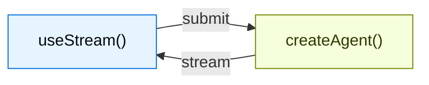

为使用 `createAgent` 创建的代理构建丰富的交互式前端。这些模式涵盖了从基本消息渲染到高级工作流（如人在环审批和时间旅行调试）的一切。

## 架构

每个模式遵循相同的架构：`createAgent` 后端通过 `useStream` 钩子将状态流式传输到前端。



在后端，`createAgent` 生成一个公开流式 API 的编译 LangGraph 图。在前端，`useStream` 钩子连接到该 API 并提供反应式状态——消息、工具调用、中断、历史记录等——您可以使用任何框架渲染它们。

<CodeGroup>

:::python
```python agent.py
from langchain import create_agent
from langgraph.checkpoint.memory import MemorySaver

agent = create_agent(
    model="openai:gpt-5.4",
    tools=[get_weather, search_web],
    checkpointer=MemorySaver(),
)
```

```ts types.ts
export interface GraphState {
  messages: BaseMessage[];
}
```

```tsx Chat.tsx
import { useStream } from "@langchain/react";
import type { GraphState } from "./types";

function Chat() {
  const stream = useStream<GraphState>({
    apiUrl: "http://localhost:2024",
    assistantId: "agent",
  });

  return (
    <div>
      {stream.messages.map((msg) => (
        <Message key={msg.id} message={msg} />
      ))}
    </div>
  );
}
```

:::

:::js
```ts agent.ts
import { createAgent } from "langchain";
import { MemorySaver } from "@langchain/langgraph";

const agent = createAgent({
  model: "openai:gpt-5.4",
  tools: [getWeather, searchWeb],
  checkpointer: new MemorySaver(),
});
```

```tsx Chat.tsx
import { useStream } from "@langchain/react";
import type { agent } from "./agent";

function Chat() {
  const stream = useStream<typeof agent>({
    apiUrl: "http://localhost:2024",
    assistantId: "agent",
  });

  return (
    <div>
      {stream.messages.map((msg) => (
        <Message key={msg.id} message={msg} />
      ))}
    </div>
  );
}
```
:::

</CodeGroup>

`useStream` 可用于 React、Vue、Svelte 和 Angular：

```ts
import { useStream } from "@langchain/react";   // React
import { useStream } from "@langchain/vue";      // Vue
import { useStream } from "@langchain/svelte";   // Svelte
import { useStream } from "@langchain/angular";  // Angular
```

## 模式

### 渲染消息和输出

<CardGroup cols={3}>
  <Card title="Markdown 消息" icon="markdown" href="/oss/langchain/frontend/markdown-messages">
    使用正确的格式化和代码高亮解析和渲染流式传输的 markdown。
  </Card>
  <Card title="结构化输出" icon="layout-grid" href="/oss/langchain/frontend/structured-output">
    将类型化代理响应渲染为自定义 UI 组件，而不是纯文本。
  </Card>
  <Card title="推理 Token" icon="brain" href="/oss/langchain/frontend/reasoning-tokens">
    在可折叠块中显示模型思考过程。
  </Card>
  <Card title="生成式 UI" icon="wand" href="/oss/langchain/frontend/generative-ui">
    使用 json-render 从自然语言提示词渲染 AI 生成的用户界面。
  </Card>
</CardGroup>

### 显示代理操作

<CardGroup cols={3}>
  <Card title="工具调用" icon="tool" href="/oss/langchain/frontend/tool-calling">
    使用加载和错误状态将工具调用显示为丰富的类型安全 UI 卡片。
  </Card>
  <Card title="人在环" icon="user-check" href="/oss/langchain/frontend/human-in-the-loop">
    暂停代理以进行带有批准、拒绝和编辑工作流的人工审查。
  </Card>
</CardGroup>

### 管理对话

<CardGroup cols={3}>
  <Card title="分支聊天" icon="git-branch" href="/oss/langchain/frontend/branching-chat">
    编辑消息、重新生成响应并导航对话分支。
  </Card>
  <Card title="消息队列" icon="list-check" href="/oss/langchain/frontend/message-queues">
    在代理按顺序处理时排队多条消息。
  </Card>
</CardGroup>

### 高级流式传输

<CardGroup cols={3}>
  <Card title="加入和重新加入流" icon="plug-connected" href="/oss/langchain/frontend/join-rejoin">
    断开连接并重新连接到正在运行的代理流而不丢失进度。
  </Card>
  <Card title="时间旅行" icon="clock" href="/oss/langchain/frontend/time-travel">
    检查、导航并从对话历史中的任何检查点恢复。
  </Card>
</CardGroup>

## 集成

`useStream` 是 UI 无关的。使用它来连接任何组件库或生成式 UI 框架。

<CardGroup cols={3}>
  <Card title="AI Elements" icon="package" href="/oss/langchain/frontend/integrations/ai-elements">
    用于 AI 聊天的可组合 shadcn/ui 组件：`Conversation`、`Message`、`Tool`、`Reasoning`。
  </Card>
  <Card title="assistant-ui" icon="package" href="/oss/langchain/frontend/integrations/assistant-ui">
    带有内置线程管理、分支和附件支持的无头 React 框架。
  </Card>
  <Card title="OpenUI" icon="package" href="/oss/langchain/frontend/integrations/openui">
    生成式 UI 库，使用 openui-lang 组件 DSL 生成数据丰富的报告和仪表板。
  </Card>
</CardGroup>
