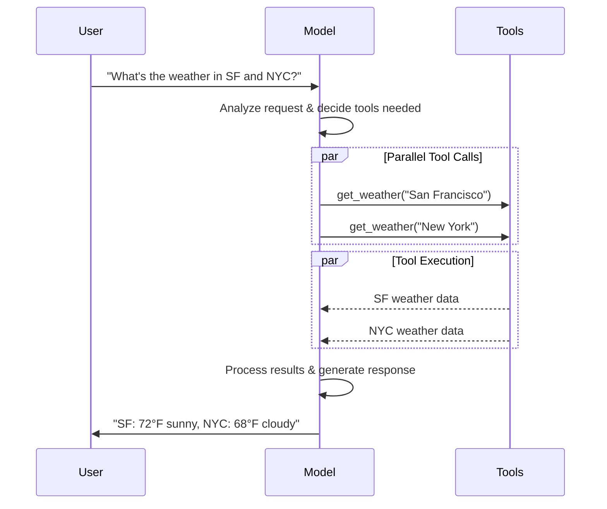
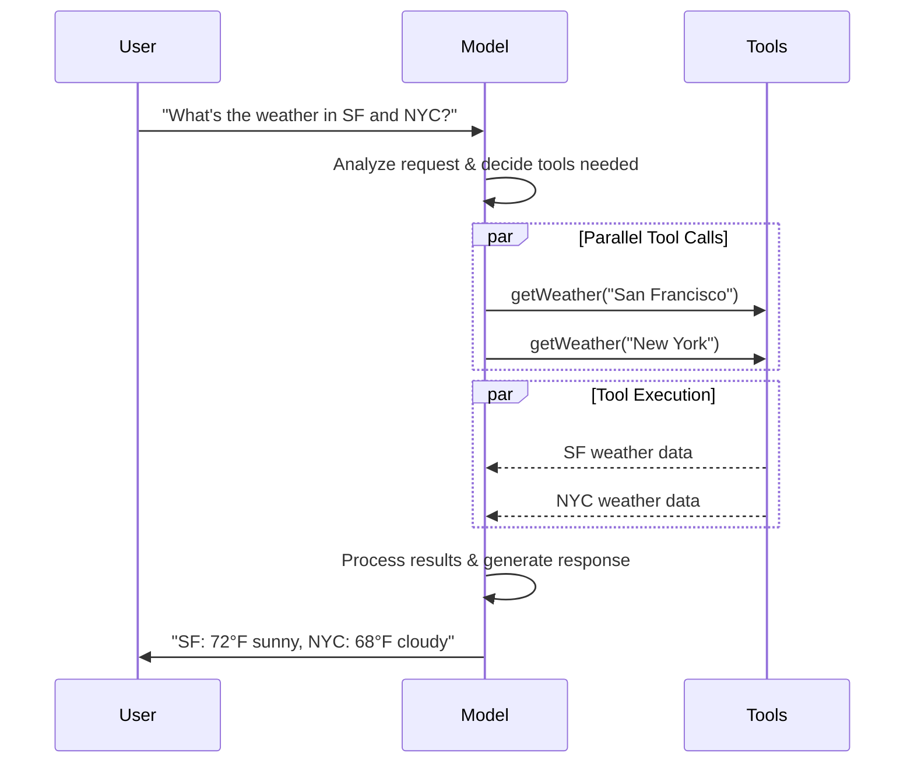

import ChatModelTabsPy from '/snippets/chat-model-tabs.mdx';
import ChatModelTabsJS from '/snippets/chat-model-tabs-js.mdx';

[大型语言模型 (LLMs)](https://en.wikipedia.org/wiki/Large_language_model) 是强大的 AI 工具，可以像人类一样解释和生成文本。它们用途广泛，可以编写内容、翻译语言、总结和回答问题，无需为每个任务进行专门训练。

除了文本生成外，许多模型还支持：

* <Icon icon="hammer" size={16} /> [工具调用](#tool-calling) - 调用外部工具（如数据库查询或 API 调用）并在响应中使用结果。
* <Icon icon="layout-grid" size={16} /> [结构化输出](#structured-output) - 模型的响应被约束为遵循定义的格式。
* <Icon icon="photo" size={16} /> [多模态](#multimodal) - 处理和返回文本以外的数据，如图像、音频和视频。
* <Icon icon="brain" size={16} /> [推理](#reasoning) - 模型执行多步推理以得出结论。

模型是[代理](/oss/langchain/agents)的推理引擎。它们驱动代理的决策过程，决定调用哪些工具、如何解释结果以及何时提供最终答案。

你选择的模型的质量和能力直接影响代理的基线可靠性和性能。不同的模型擅长不同的任务——有些更擅长遵循复杂指令，有些更擅长结构化推理，有些支持更大的上下文窗口以处理更多信息。

LangChain 的标准模型接口让你可以访问许多不同的提供商集成，这使得实验和切换模型以找到最适合你用例的模型变得容易。

<Info>
    有关提供商特定的集成信息和能力，请参阅提供商的[聊天模型页面](/oss/integrations/chat)。
</Info>

## 基本用法

模型可以通过两种方式使用：

1. **与代理一起使用** - 模型可以在创建[代理](/oss/langchain/agents#model)时动态指定。
2. **独立使用** - 模型可以直接调用（不在代理循环中），用于文本生成、分类或提取等任务，无需代理框架。

相同的模型接口在两种上下文中都能工作，这让你可以从简单开始，根据需要扩展到更复杂的基于代理的工作流程。

### 初始化模型

:::python
在 LangChain 中开始使用独立模型的最简单方法是使用 @[`init_chat_model`] 从你选择的聊天模型提供商初始化一个模型（示例如下）：

<ChatModelTabsPy />
```python
response = model.invoke("Why do parrots talk?")
```

有关详细信息和如何传递模型[参数](#parameters)，请参见 @[`init_chat_model`][init_chat_model]。
:::
:::js
在 LangChain 中开始使用独立模型的最简单方法是使用 `initChatModel` 从[聊天模型提供商](/oss/integrations/chat)中初始化一个模型（示例如下）：

<ChatModelTabsJS />
```typescript
const response = await model.invoke("Why do parrots talk?");
```
有关详细信息和如何传递模型[参数](#parameters)，请参见 @[`initChatModel`][initChatModel]。
:::

### 支持的提供商和模型

LangChain 通过专用集成包支持所有主要模型提供商。每个提供商包实现相同的标准接口，因此你可以交换提供商而无需重写应用程序逻辑。新模型名称立即生效——无需更新 LangChain——因为提供商包将模型名称直接传递给提供商的 API。

浏览[支持的提供商完整列表](/oss/integrations/providers/overview)，或参阅[提供商和模型](/oss/concepts/providers-and-models)以获取概念概述，了解提供商、包和模型名称如何在 LangChain 中协同工作。

### 关键方法

<Card title="调用" href="#invoke" icon="send" arrow="true" horizontal>
    模型将消息作为输入并在生成完整响应后输出消息。
</Card>
<Card title="流式传输" href="#stream" icon="broadcast" arrow="true" horizontal>
    调用模型，但实时流式传输生成的输出。
</Card>
<Card title="批量处理" href="#batch" icon="grip-vertical" arrow="true" horizontal>
    在批量中向模型发送多个请求，以提高处理效率。
</Card>

<Info>
    除了聊天模型外，LangChain 还支持其他相关技术，例如嵌入模型和向量存储。详情请参阅[集成页面](/oss/integrations/providers/overview)。
</Info>

## 参数

聊天模型采用可用于配置其行为的参数。支持参数的完整集合因模型和提供商而异，但标准参数包括：

<ParamField body="model" type="string" required>
   你要使用的特定模型的名称或标识符（带有提供商）。你也可以使用 '{model_provider}:{model}' 格式在单个参数中同时指定模型及其提供商，例如 'openai:o1'。
</ParamField>

:::python
<ParamField body="api_key" type="string">
    与模型提供商进行身份验证所需的密钥。这通常是在你注册访问权限时颁发的。通常通过<Tooltip tip="其值在程序外部设置的值，通过操作系统或微服务的内置功能设置。">环境变量</Tooltip>来访问。
</ParamField>
:::
:::js
<ParamField body="apiKey" type="string">
    与模型提供商进行身份验证所需的密钥。这通常是在你注册访问权限时颁发的。通常通过<Tooltip tip="其值在程序外部设置的值，通过操作系统或微服务的内置功能设置。">环境变量</Tooltip>来访问。
</ParamField>
:::

<ParamField body="temperature" type="number">
    控制模型输出的随机性。较高的数字使响应更有创意；较低的数字使响应更确定性。
</ParamField>

:::python
<ParamField body="max_tokens" type="number">
    限制响应中<Tooltip tip="模型读取和生成的基本单位。提供商可能对它们有不同的定义，但通常它们可以表示单词的整体或部分。">token</Tooltip>的总数，有效控制输出的长度。
</ParamField>
:::
:::js
<ParamField body="maxTokens" type="number">
    限制响应中<Tooltip tip="模型读取和生成的基本单位。提供商可能对它们有不同的定义，但通常它们可以表示单词的整体或部分。">token</Tooltip>的总数，有效控制输出的长度。
</ParamField>
:::

<ParamField body="timeout" type="number">
    等待模型响应然后取消请求的最大时间（秒）。
</ParamField>

:::python
<ParamField body="max_retries" type="number" default="6">
    如果请求因网络超时或速率限制等问题失败，系统重新发送请求的最大尝试次数。重试使用指数退避和抖动。网络错误、速率限制（429）和服务器错误（5xx）会自动重试。客户端错误（如 401（未授权）或 404 不会重试。对于在不可靠网络上长时间运行的[代理](/oss/deepagents/overview)任务，考虑将其增加到 10-15。
</ParamField>
:::
:::js
<ParamField body="maxRetries" type="number" default="6">
    如果请求因网络超时或速率限制等问题失败，系统重新发送请求的最大尝试次数。重试使用指数退避和抖动。网络错误、速率限制（429）和服务器错误（5xx）会自动重试。客户端错误（如 401（未授权）或 404 不会重试。对于在不可靠网络上长时间运行的[代理](/oss/deepagents/overview)任务，考虑将其增加到 10-15。
</ParamField>
:::

:::python
使用 @[`init_chat_model`] 时，将这些参数作为内联 <Tooltip tip="任意关键字参数" cta="了解更多" href="https://www.w3schools.com/python/python_args_kwargs.asp">`**kwargs`</Tooltip> 传递：

```python Initialize using model parameters
model = init_chat_model(
    "claude-sonnet-4-6",
    # Kwargs passed to the model:
    temperature=0.7,
    timeout=30,
    max_tokens=1000,
    max_retries=6,  # Default; increase for unreliable networks
)
```
:::
:::js
使用 `initChatModel` 时，将这些参数作为内联参数传递：

```typescript Initialize using model parameters
const model = await initChatModel(
    "claude-sonnet-4-6",
    { temperature: 0.7, timeout: 30, maxTokens: 1000, maxRetries: 6 }
)
```
:::

<Info>
    每个聊天模型集成可能有用于控制提供商特定功能的附加参数。

    例如，@[`ChatOpenAI`] 有 `use_responses_api` 来决定是使用 OpenAI Responses 还是 Completions 接口。

    要查找给定聊天模型支持的所有参数，请前往[聊天模型集成](/oss/integrations/chat)页面。
</Info>

---

## 调用

必须调用聊天模型才能生成输出。有三种主要的调用方法，每种适合不同的用例。

### 调用

调用模型最直接的方法是使用 @[`invoke()`][BaseChatModel.invoke] 配合单个消息或消息列表。

:::python
```python Single message
response = model.invoke("Why do parrots have colorful feathers?")
print(response)
```
:::

:::js
```typescript Single message
const response = await model.invoke("Why do parrots have colorful feathers?");
console.log(response);
```
:::

可以向聊天模型提供消息列表来表示对话历史。每个消息都有一个角色，模型用它来指示谁在对话中发送了该消息。

有关角色、类型和内容的更多详细信息，请参阅[消息](/oss/langchain/messages)指南。

:::python
```python Dictionary format
conversation = [
    {"role": "system", "content": "You are a helpful assistant that translates English to French."},
    {"role": "user", "content": "Translate: I love programming."},
    {"role": "assistant", "content": "J'adore la programmation."},
    {"role": "user", "content": "Translate: I love building applications."}
]

response = model.invoke(conversation)
print(response)  # AIMessage("J'adore créer des applications.")
```
```python Message objects
from langchain.messages import HumanMessage, AIMessage, SystemMessage

conversation = [
    SystemMessage("You are a helpful assistant that translates English to French."),
    HumanMessage("Translate: I love programming."),
    AIMessage("J'adore la programmation."),
    HumanMessage("Translate: I love building applications.")
]

response = model.invoke(conversation)
print(response)  # AIMessage("J'adore créer des applications.")
```
:::

:::js
```typescript Object format
const conversation = [
  { role: "system", content: "You are a helpful assistant that translates English to French." },
  { role: "user", content: "Translate: I love programming." },
  { role: "assistant", content: "J'adore la programmation." },
  { role: "user", content: "Translate: I love building applications." },
];

const response = await model.invoke(conversation);
console.log(response);  // AIMessage("J'adore créer des applications.")
```
```typescript Message objects
import { HumanMessage, AIMessage, SystemMessage } from "langchain";

const conversation = [
  new SystemMessage("You are a helpful assistant that translates English to French."),
  new HumanMessage("Translate: I love programming."),
  new AIMessage("J'adore la programmation."),
  new HumanMessage("Translate: I love building applications."),
];

const response = await model.invoke(conversation);
console.log(response);  // AIMessage("J'adore créer des applications.")
```
:::

<Info>
    如果你的调用返回类型是字符串，请确保你使用的是聊天模型而不是 LLM。传统的文本补全 LLM 直接返回字符串。LangChain 聊天模型以 "Chat" 为前缀，例如 @[`ChatOpenAI`](/oss/integrations/chat/openai)。
</Info>

### 流式传输

大多数模型可以在生成输出的同时流式传输其输出内容。通过渐进式显示输出，流式传输显著改善了用户体验，尤其是对于较长的响应。

调用 @[`stream()`][BaseChatModel.stream] 返回一个<Tooltip tip="一个对象，它渐进地按顺序提供对集合中每个项的访问。">迭代器</Tooltip>，在生成时产生输出块。你可以使用循环来实时处理每个块：

:::python
<CodeGroup>
    ```python Basic text streaming
    for chunk in model.stream("Why do parrots have colorful feathers?"):
        print(chunk.text, end="|", flush=True)
    ```

    ```python Stream tool calls, reasoning, and other content
    for chunk in model.stream("What color is the sky?"):
        for block in chunk.content_blocks:
            if block["type"] == "reasoning" and (reasoning := block.get("reasoning")):
                print(f"Reasoning: {reasoning}")
            elif block["type"] == "tool_call_chunk":
                print(f"Tool call chunk: {block}")
            elif block["type"] == "text":
                print(block["text"])
            else:
                ...
    ```
</CodeGroup>
:::
:::js
<CodeGroup>
    ```typescript Basic text streaming
    const stream = await model.stream("Why do parrots have colorful feathers?");
    for await (const chunk of stream) {
      console.log(chunk.text)
    }
    ```

    ```typescript Stream tool calls, reasoning, and other content
    const stream = await model.stream("What color is the sky?");
    for await (const chunk of stream) {
      for (const block of chunk.contentBlocks) {
        if (block.type === "reasoning") {
          console.log(`Reasoning: ${block.reasoning}`);
        } else if (block.type === "tool_call_chunk") {
          console.log(`Tool call chunk: ${block}`);
        } else if (block.type === "text") {
          console.log(block.text);
        } else {
          ...
        }
      }
    }
    ```
</CodeGroup>
:::

与 [`invoke()`](#invoke) 返回模型完成生成完整响应后的单个 @[`AIMessage`][AIMessage] 不同，`stream()` 返回多个 @[`AIMessageChunk`][AIMessageChunk] 对象，每个对象包含部分输出文本。重要的是，流中的每个块都设计为通过求和聚合到完整消息中：

:::python
```python Construct an AIMessage
full = None  # None | AIMessageChunk
for chunk in model.stream("What color is the sky?"):
    full = chunk if full is None else full + chunk
    print(full.text)

# The
# The sky
# The sky is
# The sky is typically
# The sky is typically blue
# ...

print(full.content_blocks)
# [{"type": "text", "text": "The sky is typically blue..."}]
```
:::

:::js
```typescript Construct AIMessage
let full: AIMessageChunk | null = null;
for await (const chunk of stream) {
  full = full ? full.concat(chunk) : chunk;
  console.log(full.text);
}

// The
// The sky
// The sky is
// The sky is typically
// The sky is typically blue
// ...

console.log(full.contentBlocks);
// [{"type": "text", "text": "The sky is typically blue..."}]
```
:::

生成的消息可以与使用 [`invoke()`](#invoke) 生成的消息一样处理——例如，可以将其聚合到消息历史中并作为对话上下文传递回模型。

<Warning>
    流式传输仅在程序中的所有步骤都知道如何处理块流时才有效。例如，如果应用程序需要先将整个输出存储在内存中然后才能处理，则该应用程序不支持流式传输。
</Warning>

<Accordion title="高级流式传输主题">
    <Accordion title="流式传输事件">
        :::python
        LangChain 聊天模型也可以使用 `astream_events()` 流式传输语义事件。

        这简化了基于事件类型和其他元数据的过滤，并会在后台聚合完整消息。请参阅下面的示例。

        ```python
        async for event in model.astream_events("Hello"):

            if event["event"] == "on_chat_model_start":
                print(f"Input: {event['data']['input']}")

            elif event["event"] == "on_chat_model_stream":
                print(f"Token: {event['data']['chunk'].text}")

            elif event["event"] == "on_chat_model_end":
                print(f"Full message: {event['data']['output'].text}")

            else:
                pass
        ```
        ```txt
        Input: Hello
        Token: Hi
        Token:  there
        Token: !
        Token:  How
        Token:  can
        Token:  I
        ...
        Full message: Hi there! How can I help today?
        ```

        <Tip>
            有关事件类型和其他详细信息，请参阅 @[`astream_events()`][BaseChatModel.astream_events] 参考文档。
        </Tip>
        :::

        :::js
        LangChain 聊天模型也可以使用
        [`streamEvents()`][BaseChatModel.streamEvents] 流式传输语义事件。

        这简化了基于事件类型和其他元数据的过滤，并会在后台聚合完整消息。请参阅下面的示例。

        ```typescript
        const stream = await model.streamEvents("Hello");
        for await (const event of stream) {
            if (event.event === "on_chat_model_start") {
                console.log(`Input: ${event.data.input}`);
            }
            if (event.event === "on_chat_model_stream") {
                console.log(`Token: ${event.data.chunk.text}`);
            }
            if (event.event === "on_chat_model_end") {
                console.log(`Full message: ${event.data.output.text}`);
            }
        }
        ```
        ```txt
        Input: Hello
        Token: Hi
        Token:  there
        Token: !
        Token:  How
        Token:  can
        Token:  I
        ...
        Full message: Hi there! How can I help today?
        ```

        有关事件类型和其他详细信息，请参阅 @[`streamEvents()`][BaseChatModel.streamEvents] 参考文档。
        :::
    </Accordion>
    <Accordion title='"自动流式传输"聊天模型'>
        LangChain 通过在某些情况下自动启用流式传输模式来简化聊天模型的流式传输，即使你没有显式调用流式传输方法。当你不使用流式传输调用方法但仍想流式传输整个应用程序（包括聊天模型的中间结果）时，这尤其有用。

        例如，在 [LangGraph 代理](/oss/langchain/agents) 中，你可以在节点内调用 `model.invoke()`，但如果以流式传输模式运行，LangChain 会自动委托给流式传输。调用所涉及代码的结果是相同的；但是，在聊天模型流式传输时，LangChain 会负责调用 LangChain 回调系统中的 @[`on_llm_new_token`] 事件。

        :::python
        回调事件允许 LangGraph `stream()` 和 `astream_events()` 实时显示聊天模型的输出。
        :::
        :::js
        回调事件允许 LangGraph `stream()` 和 `streamEvents()` 实时显示聊天模型的输出。
        :::
    </Accordion>
</Accordion>

### 批量处理

将一组独立请求批量发送到模型可以显著提高性能并降低成本，因为处理可以并行完成：

:::python
```python Batch
responses = model.batch([
    "Why do parrots have colorful feathers?",
    "How do airplanes fly?",
    "What is quantum computing?"
])
for response in responses:
    print(response)
```

<Note>
    本节介绍聊天模型方法 @[`batch()`][BaseChatModel.batch]，它在客户端并行化模型调用。

    它**不同于**推理提供商支持的批量 API，例如 [OpenAI](https://platform.openai.com/docs/guides/batch) 或 [Anthropic](https://platform.claude.com/docs/en/build-with-claude/batch-processing#message-batches-api)。
</Note>

默认情况下，@[`batch()`][BaseChatModel.batch] 只返回整个批次的最终输出。如果你想在每个输入完成生成时接收其输出，可以使用 @[`batch_as_completed()`][BaseChatModel.batch_as_completed] 流式传输结果：

```python Yield batch responses upon completion
for response in model.batch_as_completed([
    "Why do parrots have colorful feathers?",
    "How do airplanes fly?",
    "What is quantum computing?"
]):
    print(response)
```
<Note>
    使用 @[`batch_as_completed()`][BaseChatModel.batch_as_completed] 时，结果可能不按顺序返回。每个结果都包含输入索引，以便根据需要重建原始顺序。
</Note>

<Tip>
    使用 @[`batch()`][BaseChatModel.batch] 或 @[`batch_as_completed()`][BaseChatModel.batch_as_completed] 处理大量输入时，你可能希望控制最大并行调用数。这可以通过在 @[`RunnableConfig`] 字典中设置 @[`max_concurrency`][RunnableConfig(max_concurrency)] 属性来实现。

    ```python Batch with max concurrency
    model.batch(
        list_of_inputs,
        config={
            'max_concurrency': 5,  # Limit to 5 parallel calls
        }
    )
    ```

    有关支持的属性完整列表，请参阅 @[`RunnableConfig`] 参考文档。
</Tip>

有关批量处理的更多详细信息，请参阅 @[参考文档][BaseChatModel.batch]。
:::

:::js
```typescript Batch
const responses = await model.batch([
  "Why do parrots have colorful feathers?",
  "How do airplanes fly?",
  "What is quantum computing?",
  "Why do parrots have colorful feathers?",
  "How do airplanes fly?",
  "What is quantum computing?",
]);
for (const response of responses) {
  console.log(response);
}
```

<Tip>
    使用 `batch()` 处理大量输入时，你可能希望控制最大并行调用数。这可以通过在 @[`RunnableConfig`] 字典中设置 `maxConcurrency` 属性来实现。

    ```typescript Batch with max concurrency
    model.batch(
      listOfInputs,
      {
        maxConcurrency: 5,  // Limit to 5 parallel calls
      }
    )
    ```

    有关支持的属性完整列表，请参阅 @[`RunnableConfig`] 参考文档。
</Tip>

有关批量处理的更多详细信息，请参阅 @[参考文档][BaseChatModel.batch]。
:::

---

## 工具调用

模型可以请求调用执行任务的工具，例如从数据库获取数据、搜索网络或运行代码。工具是以下配对：

1. 一个 schema，包括工具名称、描述和/或参数定义（通常是 JSON schema）
2. 要执行的函数或<Tooltip tip="可以暂停执行并在稍后恢复的方法。">协程</Tooltip>

<Note>
    你可能听过"函数调用"这个术语。我们将其与"工具调用"互换使用。
</Note>

以下是用户和模型之间基本工具调用流程：

:::python

:::

:::js

:::

:::python
要使你定义的工具可供模型使用，必须使用 @[`bind_tools`][BaseChatModel.bind_tools] 绑定它们。在后续调用中，模型可以选择根据需要调用任何绑定工具。
:::

:::js
要使你定义的工具可供模型使用，必须使用 @[`bindTools`][BaseChatModel.bindTools] 绑定它们。在后续调用中，模型可以选择根据需要调用任何绑定工具。
:::

一些模型提供商提供<Tooltip tip="在服务器端执行的工具，例如网络搜索和代码解释器。">内置工具</Tooltip>，可以通过模型或调用参数启用（例如 [`ChatOpenAI`](/oss/integrations/chat/openai)、[`ChatAnthropic`](/oss/integrations/chat/anthropic)）。请查看相应的[提供商参考文档](/oss/integrations/providers/overview)了解详细信息。

<Tip>
    有关创建工具的详细信息和其他选项，请参阅[工具指南](/oss/langchain/tools)。
</Tip>

:::python
```python Binding user tools
from langchain.tools import tool

@tool
def get_weather(location: str) -> str:
    """Get the weather at a location."""
    return f"It's sunny in {location}."


model_with_tools = model.bind_tools([get_weather])  # [!code highlight]

response = model_with_tools.invoke("What's the weather like in Boston?")
for tool_call in response.tool_calls:
    # View tool calls made by the model
    print(f"Tool: {tool_call['name']}")
    print(f"Args: {tool_call['args']}")
```
:::

:::js
```typescript Binding user tools
import { tool } from "langchain";
import * as z from "zod";
import { ChatOpenAI } from "@langchain/openai";

const getWeather = tool(
  (input) => `It's sunny in ${input.location}.`,
  {
    name: "get_weather",
    description: "Get the weather at a location.",
    schema: z.object({
      location: z.string().describe("The location to get the weather for"),
    }),
  },
);

const model = new ChatOpenAI({ model: "gpt-5.4" });
const modelWithTools = model.bindTools([getWeather]);  // [!code highlight]

const response = await modelWithTools.invoke("What's the weather like in Boston?");
const toolCalls = response.tool_calls || [];
for (const tool_call of toolCalls) {
  // View tool calls made by the model
  console.log(`Tool: ${tool_call.name}`);
  console.log(`Args: ${tool_call.args}`);
}
```
:::

绑定用户定义的工具时，模型的响应包括**请求**执行工具。当单独使用模型而不是[代理](/oss/langchain/agents)时，你需要执行请求的工具并将结果返回给模型以用于后续推理。当使用[代理](/oss/langchain/agents)时，代理循环会为你处理工具执行循环。

下面我们展示一些使用工具调用的常用方法。

<AccordionGroup>
    <Accordion title="工具执行循环" icon="refresh">
        当模型返回工具调用时，你需要执行工具并将结果传递回模型。这会创建一个对话循环，模型可以使用工具结果生成最终响应。LangChain 包含[代理](/oss/langchain/agents)抽象来处理这种编排。

        以下是如何执行此操作的简单示例：

        :::python

        ```python Tool execution loop
        # Bind (potentially multiple) tools to the model
        model_with_tools = model.bind_tools([get_weather])

        # Step 1: Model generates tool calls
        messages = [{"role": "user", "content": "What's the weather in Boston?"}]
        ai_msg = model_with_tools.invoke(messages)
        messages.append(ai_msg)

        # Step 2: Execute tools and collect results
        for tool_call in ai_msg.tool_calls:
            # Execute the tool with the generated arguments
            tool_result = get_weather.invoke(tool_call)
            messages.append(tool_result)

        # Step 3: Pass results back to model for final response
        final_response = model_with_tools.invoke(messages)
        print(final_response.text)
        # "The current weather in Boston is 72°F and sunny."
        ```

        :::
        :::js

        ```typescript Tool execution loop
        // Bind (potentially multiple) tools to the model
        const modelWithTools = model.bindTools([get_weather])

        // Step 1: Model generates tool calls
        const messages = [{"role": "user", "content": "What's the weather in Boston?"}]
        const ai_msg = await modelWithTools.invoke(messages)
        messages.push(ai_msg)

        // Step 2: Execute tools and collect results
        for (const tool_call of ai_msg.tool_calls) {
            // Execute the tool with the generated arguments
            const tool_result = await get_weather.invoke(tool_call)
            messages.push(tool_result)
        }

        // Step 3: Pass results back to model for final response
        const final_response = await modelWithTools.invoke(messages)
        console.log(final_response.text)
        // "The current weather in Boston is 72°F and sunny."
        ```

        :::

        工具返回的每个 @[`ToolMessage`] 都包含一个 `tool_call_id`，它与原始工具调用匹配，帮助模型将结果与请求关联起来。
    </Accordion>
    <Accordion title="强制工具调用" icon="asterisk">
        默认情况下，模型可以自由选择根据用户输入使用哪个绑定工具。但是，你可能希望强制选择某个工具，确保模型使用特定工具或给定列表中的**任何**工具：

        :::python

        <CodeGroup>
            ```python Force use of any tool
            model_with_tools = model.bind_tools([tool_1], tool_choice="any")
            ```
            ```python Force use of specific tools
            model_with_tools = model.bind_tools([tool_1], tool_choice="tool_1")
            ```
        </CodeGroup>

        :::
        :::js

        <CodeGroup>
            ```typescript Force use of any tool
            const modelWithTools = model.bindTools([tool_1], { toolChoice: "any" })
            ```
            ```typescript Force use of specific tools
            const modelWithTools = model.bindTools([tool_1], { toolChoice: "tool_1" })
            ```
        </CodeGroup>
        :::
    </Accordion>
    <Accordion title="并行工具调用" icon="stack-2">
        许多模型支持在适当时并行调用多个工具。这允许模型同时从不同来源收集信息。

        :::python

        ```python Parallel tool calls
        model_with_tools = model.bind_tools([get_weather])

        response = model_with_tools.invoke(
            "What's the weather in Boston and Tokyo?"
        )


        # The model may generate multiple tool calls
        print(response.tool_calls)
        # [
        #   {'name': 'get_weather', 'args': {'location': 'Boston'}, 'id': 'call_1'},
        #   {'name': 'get_weather', 'args': {'location': 'Tokyo'}, 'id': 'call_2'},
        # ]


        # Execute all tools (can be done in parallel with async)
        results = []
        for tool_call in response.tool_calls:
            if tool_call['name'] == 'get_weather':
                result = get_weather.invoke(tool_call)
            ...
            results.append(result)
        ```

        :::

        :::js

        ```typescript Parallel tool calls
        const modelWithTools = model.bind_tools([get_weather])

        const response = await modelWithTools.invoke(
            "What's the weather in Boston and Tokyo?"
        )


        // The model may generate multiple tool calls
        console.log(response.tool_calls)
        // [
        //   { name: 'get_weather', args: { location: 'Boston' }, id: 'call_1' },
        //   { name: 'get_time', args: { location: 'Tokyo' }, id: 'call_2' }
        // ]


        // Execute all tools (can be done in parallel with async)
        const results = []
        for (const tool_call of response.tool_calls || []) {
            if (tool_call.name === 'get_weather') {
                const result = await get_weather.invoke(tool_call)
                results.push(result)
            }
        }
        ```

        :::

        模型会根据请求操作的独立性智能地决定何时适合并行执行。

        <Tip>
        大多数支持工具调用的模型默认启用并行工具调用。有些（包括 [OpenAI](/oss/integrations/chat/openai) 和 [Anthropic](/oss/integrations/chat/anthropic)）允许你禁用此功能。要做到这一点，请设置 `parallel_tool_calls=False`：
        ```python
        model.bind_tools([get_weather], parallel_tool_calls=False)
        ```
        </Tip>
    </Accordion>
    <Accordion title="流式传输工具调用" icon="rss">
        在流式传输响应时，工具调用通过 @[`ToolCallChunk`] 渐进式构建。这允许你查看工具调用的生成过程，而无需等待完整响应。

        :::python

        ```python Streaming tool calls
        for chunk in model_with_tools.stream(
            "What's the weather in Boston and Tokyo?"
        ):
            # Tool call chunks arrive progressively
            for tool_chunk in chunk.tool_call_chunks:
                if name := tool_chunk.get("name"):
                    print(f"Tool: {name}")
                if id_ := tool_chunk.get("id"):
                    print(f"ID: {id_}")
                if args := tool_chunk.get("args"):
                    print(f"Args: {args}")

        # Output:
        # Tool: get_weather
        # ID: call_SvMlU1TVIZugrFLckFE2ceRE
        # Args: {"lo
        # Args: catio
        # Args: n": "B
        # Args: osto
        # Args: n"}
        # Tool: get_weather
        # ID: call_QMZdy6qInx13oWKE7KhuhOLR
        # Args: {"lo
        # Args: catio
        # Args: n": "T
        # Args: okyo
        # Args: "}
        ```

        你可以累积块来构建完整的工具调用：

        ```python Accumulate tool calls
        gathered = None
        for chunk in model_with_tools.stream("What's the weather in Boston?"):
            gathered = chunk if gathered is None else gathered + chunk
            print(gathered.tool_calls)
        ```

        :::
        :::js

        ```typescript Streaming tool calls
        const stream = await modelWithTools.stream(
            "What's the weather in Boston and Tokyo?"
        )
        for await (const chunk of stream) {
            // Tool call chunks arrive progressively
            if (chunk.tool_call_chunks) {
                for (const tool_chunk of chunk.tool_call_chunks) {
                console.log(`Tool: ${tool_chunk.get('name', '')}`)
                console.log(`Args: ${tool_chunk.get('args', '')}`)
                }
            }
        }

        // Output:
        // Tool: get_weather
        // Args:
        // Tool:
        // Args: {"loc
        // Tool:
        // Args: ation": "BOS"}
        // Tool: get_time
        // Args:
        // Tool:
        // Args: {"timezone": "Tokyo"}
        ```

        你可以累积块来构建完整的工具调用：

        ```typescript Accumulate tool calls
        let full: AIMessageChunk | null = null
        const stream = await modelWithTools.stream("What's the weather in Boston?")
        for await (const chunk of stream) {
            full = full ? full.concat(chunk) : chunk
            console.log(full.contentBlocks)
        }
        ```

        :::
    </Accordion>
</AccordionGroup>

---

## 结构化输出

可以请求模型以匹配给定 schema 的格式提供响应。这对于确保输出可以轻松解析并用于后续处理很有用。LangChain 支持多种 schema 类型和强制结构化输出的方法。

<Tip>
    要了解结构化输出，请参阅[结构化输出](/oss/langchain/structured-output)。
</Tip>

:::python
<Tabs>
    <Tab title="Pydantic">
        [Pydantic 模型](https://docs.pydantic.dev/latest/concepts/models/#basic-model-usage) 提供最丰富的功能集，包括字段验证、描述和嵌套结构。

        ```python
        from pydantic import BaseModel, Field

        class Movie(BaseModel):
            """A movie with details."""
            title: str = Field(description="The title of the movie")
            year: int = Field(description="The year the movie was released")
            director: str = Field(description="The director of the movie")
            rating: float = Field(description="The movie's rating out of 10")

        model_with_structure = model.with_structured_output(Movie)
        response = model_with_structure.invoke("Provide details about the movie Inception")
        print(response)  # Movie(title="Inception", year=2010, director="Christopher Nolan", rating=8.8)
        ```
    </Tab>
    <Tab title="TypedDict">
        Python 的 `TypedDict` 提供了 Pydantic 模型的更简单替代方案，非常适合不需要运行时验证的场景。

        ```python
        from typing_extensions import TypedDict, Annotated

        class MovieDict(TypedDict):
            """A movie with details."""
            title: Annotated[str, ..., "The title of the movie"]
            year: Annotated[int, ..., "The year the movie was released"]
            director: Annotated[str, ..., "The director of the movie"]
            rating: Annotated[float, ..., "The movie's rating out of 10"]

        model_with_structure = model.with_structured_output(MovieDict)
        response = model_with_structure.invoke("Provide details about the movie Inception")
        print(response)  # {'title': 'Inception', 'year': 2010, 'director': 'Christopher Nolan', 'rating': 8.8}
        ```
    </Tab>
    <Tab title="JSON Schema">
        提供 [JSON Schema](https://json-schema.org/understanding-json-schema/about) 以获得最大控制和互操作性。

        ```python
        import json

        json_schema = {
            "title": "Movie",
            "description": "A movie with details",
            "type": "object",
            "properties": {
                "title": {
                    "type": "string",
                    "description": "The title of the movie"
                },
                "year": {
                    "type": "integer",
                    "description": "The year the movie was released"
                },
                "director": {
                    "type": "string",
                    "description": "The director of the movie"
                },
                "rating": {
                    "type": "number",
                    "description": "The movie's rating out of 10"
                }
            },
            "required": ["title", "year", "director", "rating"]
        }

        model_with_structure = model.with_structured_output(
            json_schema,
            method="json_schema",
        )
        response = model_with_structure.invoke("Provide details about the movie Inception")
        print(response)  # {'title': 'Inception', 'year': 2010, ...}
        ```
    </Tab>
</Tabs>
:::

:::js
<Tabs>
    <Tab title="Zod">
        [zod schema](https://zod.dev/) 是定义输出 schema 的首选方法。请注意，当提供 zod schema 时，模型输出也将使用 zod 的解析方法进行验证。

        ```typescript
        import * as z from "zod";

        const Movie = z.object({
          title: z.string().describe("The title of the movie"),
          year: z.number().describe("The year the movie was released"),
          director: z.string().describe("The director of the movie"),
          rating: z.number().describe("The movie's rating out of 10"),
        });

        const modelWithStructure = model.withStructuredOutput(Movie);

        const response = await modelWithStructure.invoke("Provide details about the movie Inception");
        console.log(response);
        // {
        //   title: "Inception",
        //   year: 2010,
        //   director: "Christopher Nolan",
        //   rating: 8.8,
        // }
        ```
    </Tab>
    <Tab title="JSON Schema">
        为了获得最大控制或互操作性，你可以提供原始 JSON Schema。

        ```typescript
        const jsonSchema = {
          "title": "Movie",
          "description": "A movie with details",
          "type": "object",
          "properties": {
            "title": {
              "type": "string",
              "description": "The title of the movie",
            },
            "year": {
              "type": "integer",
              "description": "The year the movie was released",
            },
            "director": {
              "type": "string",
              "description": "The director of the movie",
            },
            "rating": {
              "type": "number",
              "description": "The movie's rating out of 10",
            },
          },
          "required": ["title", "year", "director", "rating"],
        }

        const modelWithStructure = model.withStructuredOutput(
          jsonSchema,
          { method: "jsonSchema" },
        )

        const response = await modelWithStructure.invoke("Provide details about the movie Inception")
        console.log(response)  // {'title': 'Inception', 'year': 2010, ...}
        ```
    </Tab>
    <Tab title="Standard Schema">
        还支持任何实现 [Standard Schema](https://standardschema.dev/) 规范的 schema。Standard Schema 对象在运行时通过 schema 的 `~standard.validate()` 方法进行验证。

        ```typescript
        import * as v from "valibot";
        import { toStandardJsonSchema } from "@valibot/to-json-schema";

        const Movie = toStandardJsonSchema(
          v.object({
            title: v.pipe(v.string(), v.description("The title of the movie")),
            year: v.pipe(v.number(), v.description("The year the movie was released")),
            director: v.pipe(v.string(), v.description("The director of the movie")),
            rating: v.pipe(v.number(), v.description("The movie's rating out of 10")),
          })
        );

        const modelWithStructure = model.withStructuredOutput(Movie);

        const response = await modelWithStructure.invoke("Provide details about the movie Inception");
        console.log(response);
        // {
        //   title: "Inception",
        //   year: 2010,
        //   director: "Christopher Nolan",
        //   rating: 8.8,
        // }
        ```
    </Tab>
</Tabs>
:::

:::python
<Note>
    **结构化输出的关键注意事项**

    - **方法参数**：某些提供商支持不同的结构化输出方法：
        - `'json_schema'`：使用提供商提供的专用结构化输出功能。
        - `'function_calling'`：通过强制遵循给定 schema 的[工具调用](#tool-calling)来派生结构化输出。
        - `'json_mode'`：某些提供商提供的 `'json_schema'` 的前身。生成有效 JSON，但必须在提示词中描述 schema。
    - **包含原始内容**：设置 `include_raw=True` 以获取解析后的输出和原始 AI 消息。
    - **验证**：Pydantic 模型提供自动验证。`TypedDict` 和 JSON Schema 需要手动验证。

    有关支持的方法和配置选项，请参阅你的[提供商集成页面](/oss/integrations/providers/overview)。
</Note>
:::

:::js
<Note>
    **结构化输出的关键注意事项：**

    - **方法参数**：某些提供商支持不同的方法（`'jsonSchema'`、`'functionCalling'`、`'jsonMode'`）
    - **包含原始内容**：使用 @[`includeRaw: true`][BaseChatModel.with_structured_output(include_raw)] 获取解析后的输出和原始 @[`AIMessage`]
    - **验证**：Zod 和 Standard Schema 对象提供自动验证，而 JSON Schema 需要手动验证
    - **Standard Schema**：任何实现 [Standard Schema](https://standardschema.dev/) 规范的 schema 库都支持并在运行时验证

    有关支持的方法和配置选项，请参阅你的[提供商集成页面](/oss/integrations/providers/overview)。
</Note>
:::

<Accordion title="示例：消息输出以及解析后的结构">
    同时返回原始 @[`AIMessage`] 对象和解析后的表示可能很有用，以便访问响应元数据（如 [token 计数](#token-usage)）。为此，在调用 @[`with_structured_output`][BaseChatModel.with_structured_output] 时设置 @[`include_raw=True`][BaseChatModel.with_structured_output(include_raw)]：

    :::python
    ```python
    from pydantic import BaseModel, Field

    class Movie(BaseModel):
        """A movie with details."""
        title: str = Field(description="The title of the movie")
        year: int = Field(description="The year the movie was released")
        director: str = Field(description="The director of the movie")
        rating: float = Field(description="The movie's rating out of 10")

    model_with_structure = model.with_structured_output(Movie, include_raw=True)  # [!code highlight]
    response = model_with_structure.invoke("Provide details about the movie Inception")
    response
    # {
    #     "raw": AIMessage(...),
    #     "parsed": Movie(title=..., year=..., ...),
    #     "parsing_error": None,
    # }
    ```
    :::

    :::js
    ```typescript
    import * as z from "zod";

    const Movie = z.object({
      title: z.string().describe("The title of the movie"),
      year: z.number().describe("The year the movie was released"),
      director: z.string().describe("The director of the movie"),
      rating: z.number().describe("The movie's rating out of 10"),
      title: z.string().describe("The title of the movie"),
      year: z.number().describe("The year the movie was released"),
      director: z.string().describe("The director of the movie"),  // [!code highlight]
      rating: z.number().describe("The movie's rating out of 10"),
    });

    const modelWithStructure = model.withStructuredOutput(Movie, { includeRaw: true });

    const response = await modelWithStructure.invoke("Provide details about the movie Inception");
    console.log(response);
    // {
    //   raw: AIMessage { ... },
    //   parsed: { title: "Inception", ... }
    // }
    ```
    :::
</Accordion>
<Accordion title="示例：嵌套结构">
    Schema 可以嵌套：
    :::python
    <CodeGroup>
        ```python Pydantic BaseModel
        from pydantic import BaseModel, Field

        class Actor(BaseModel):
            name: str
            role: str

        class MovieDetails(BaseModel):
            title: str
            year: int
            cast: list[Actor]
            genres: list[str]
            budget: float | None = Field(None, description="Budget in millions USD")

        model_with_structure = model.with_structured_output(MovieDetails)
        ```

        ```python TypedDict
        from typing_extensions import Annotated, TypedDict

        class Actor(TypedDict):
            name: str
            role: str

        class MovieDetails(TypedDict):
            title: str
            year: int
            cast: list[Actor]
            genres: list[str]
            budget: Annotated[float | None, ..., "Budget in millions USD"]

        model_with_structure = model.with_structured_output(MovieDetails)
        ```
    </CodeGroup>
    :::

    :::js
    ```typescript
    import * as z from "zod";

    const Actor = z.object({
      name: str
      role: z.string(),
    });

    const MovieDetails = z.object({
      title: z.string(),
      year: z.number(),
      cast: z.array(Actor),
      genres: z.array(z.string()),
      budget: z.number().nullable().describe("Budget in millions USD"),
    });

    const modelWithStructure = model.withStructuredOutput(MovieDetails);
    ```
    :::
</Accordion>

---

## 高级主题

### 模型配置

<Info>
    模型配置需要 `langchain>=1.1`。
</Info>

:::python
LangChain 聊天模型可以通过 `profile` 属性公开支持的功能和能力的字典：

```python
model.profile
# {
#   "max_input_tokens": 400000,
#   "image_inputs": True,
#   "reasoning_output": True,
#   "tool_calling": True,
#   ...
# }
```

请在 [API 参考文档](https://reference.langchain.com/python/langchain-core/language_models/model_profile/ModelProfile) 中查看完整字段集。

大多数模型配置数据由 [models.dev](https://github.com/sst/models.dev) 项目提供支持，这是一个提供模型能力数据的开源计划。这些数据与 LangChain 使用的附加字段一起增强。这些增强与上游项目保持同步。

模型配置数据允许应用程序动态处理模型能力。例如：

1. [汇总中间件](/oss/langchain/middleware/built-in#summarization) 可以根据模型的上下文窗口大小触发汇总。
2. `create_agent` 中的[结构化输出](/oss/langchain/structured-output)策略可以自动推断（例如，通过检查对原生结构化输出功能的支持）。
3. 可以根据支持的[模态](#multimodal)和最大输入 token 对模型输入进行门控。
4. [Deep Agents CLI](/oss/deepagents/cli) 过滤[交互式模型切换器](/oss/deepagents/cli/providers#which-models-appear-in-the-switcher)以显示报告 `tool_calling` 支持和文本 I/O 的模型，并在选择器详细视图中显示上下文窗口大小和能力标志。

<Accordion title="更新或覆盖配置数据">
    如果配置数据缺失、过时或不正确，可以更改。

    **选项 1（快速修复）**

    你可以使用任何有效的配置实例化聊天模型：

    ```python
    custom_profile = {
        "max_input_tokens": 100_000,
        "tool_calling": True,
        "structured_output": True,
        # ...
    }
    model = init_chat_model("...", profile=custom_profile)
    ```

    `profile` 也是一个常规 `dict`，可以就地更新。如果模型实例是共享的，考虑使用 `model_copy` 以避免更改共享状态。

    ```python
    new_profile = model.profile | {"key": "value"}
    model.model_copy(update={"profile": new_profile})
    ```

    **选项 2（上游修复数据）**

    数据的主要来源是 [models.dev](https://models.dev/) 项目。这些数据与 LangChain [集成包](/oss/integrations/providers/overview)中的附加字段和覆盖合并并随这些包一起发布。

    模型配置数据可以通过以下过程更新：

    1. （如需要）在 [models.dev](https://models.dev/) 通过其 [GitHub 仓库](https://github.com/sst/models.dev) 的拉取请求更新源数据。
    2. （如需要）在 `langchain_<package>/data/profile_augmentations.toml` 中更新附加字段和覆盖，通过拉取请求到 LangChain [集成包](/oss/integrations/providers/overview)`。
    3. 使用 [`langchain-model-profiles`](https://pypi.org/project/langchain-model-profiles/) CLI 工具从 [models.dev](https://models.dev/) 拉取最新数据，合并增强数据并更新配置数据：

    ```bash
    pip install langchain-model-profiles
    ```

    ```bash
    langchain-profiles refresh --provider <provider> --data-dir <data_dir>
    ```

    此命令：
    - 从 models.dev 下载 `<provider>` 的最新数据
    - 合并 `<data_dir>` 中 `profile_augmentations.toml` 的增强数据
    - 将合并的配置写入 `profiles.py`

    例如：从 [LangChain monorepo](https://github.com/langchain-ai/langchain) 中的 [`libs/partners/anthropic`](https://github.com/langchain-ai/langchain/tree/master/libs/partners/anthropic)：

    ```bash
    uv run --with langchain-model-profiles --provider anthropic --data-dir langchain_anthropic/data
    ```
</Accordion>

:::
:::js
LangChain 聊天模型可以通过 `profile` 属性公开支持的功能和能力的字典：

```typescript
model.profile;
// {
//   maxInputTokens: 400000,
//   imageInputs: true,
//   reasoningOutput: true,
//   toolCalling: true,
//   ...
// }
```

请在 [API 参考文档](https://reference.langchain.com/javascript/langchain-core/language_models/profile/ModelProfile) 中查看完整字段集。

大多数模型配置数据由 [models.dev](https://github.com/sst/models.dev) 项目提供支持，这是一个开源计划，提供模型能力数据。这些数据与 LangChain 使用的附加字段一起增强。这些增强与上游项目保持同步。

模型配置数据允许应用程序动态处理模型能力。例如：

1. [汇总中间件](/oss/langchain/middleware/built-in#summarization) 可以根据模型的上下文窗口大小触发汇总。
2. `createAgent` 中的[结构化输出](/oss/langchain/structured-output)策略可以自动推断（例如，通过检查对原生结构化输出功能的支持）。
3. 可以根据支持的[模态](#multimodal)和最大输入 token 对模型输入进行门控。
4. [Deep Agents CLI](/oss/deepagents/cli) 过滤[交互式模型切换器](/oss/deepagents/cli/providers#which-models-appear-in-the-switcher)以显示报告 `tool_calling` 支持和文本 I/O 的模型，并在选择器详细视图中显示上下文窗口大小和能力标志。

<Accordion title="修改配置数据">
    如果配置数据缺失、过时或不正确，可以更改。

    **选项 1（快速修复）**

    你可以使用任何有效的配置实例化聊天模型：

    ```typescript
    const customProfile = {
    maxInputTokens: 100_000,
    toolCalling: true,
    structuredOutput: true,
    // ...
    };
    const model = initChatModel("...", { profile: customProfile });
    ```

    **选项 2（上游修复数据）**

    数据的主要来源是 [models.dev](https://models.dev/) 项目。这些数据与 LangChain [集成包](/oss/integrations/providers/overview)中的附加字段和覆盖合并并随这些包一起发布。

    模型配置数据可以通过以下过程更新：

    1. （如需要）在 [models.dev](https://models.dev/) 通过其 [GitHub 仓库](https://github.com/sst/models.dev) 的拉取请求更新源数据。
    2. （如需要）在 `langchain-<package>/profiles.toml` 中更新附加字段和覆盖，通过拉取请求到 LangChain [集成包](/oss/integrations/providers/overview)。
</Accordion>

:::
<Warning>
    模型配置是一个 beta 功能。配置的格式可能会发生变化。
</Warning>

### 多模态

某些模型可以处理和返回非文本数据，如图像、音频和视频。你可以通过提供[内容块](/oss/langchain/messages#message-content)将非文本数据传递给模型。

<Tip>
    所有具有底层多模态功能的 LangChain 聊天模型都支持：

    1. 跨提供商标准格式的数据（参见[我们的消息指南](/oss/langchain/messages)）
    2. OpenAI [聊天补全](https://platform.openai.com/docs/api-reference/chat)格式
    3. 该特定提供商的原生格式（例如，Anthropic 模型接受 Anthropic 原生格式）
</Tip>

有关详细信息，请参阅消息指南的[多模态部分](/oss/langchain/messages#multimodal)。

<Tooltip tip="并非所有大型语言模型都一样！" cta="参见参考文档" href="https://models.dev/">某些模型</Tooltip>可以返回多模态数据作为其响应的一部分。如果被调用，生成的 @[`AIMessage`] 将具有多模态类型的内容块。

:::python
```python Multimodal output
response = model.invoke("Create a picture of a cat")
print(response.content_blocks)
# [
#     {"type": "text", "text": "Here's a picture of a cat"},
#     {"type": "image", "base64": "...", "mime_type": "image/jpeg"},
# ]
```
:::

:::js
```typescript Multimodal output
const response = await model.invoke("Create a picture of a cat");
console.log(response.contentBlocks);
// [
//   { type: "text", text: "Here's a picture of a cat" },
//   { type: "image", data: "...", mimeType: "image/jpeg" },
// ]
```
:::

有关特定提供商的详细信息，请参阅[集成页面](/oss/integrations/providers/overview)。

### 推理

许多模型能够执行多步推理以得出结论。这涉及将复杂问题分解为更小、更易于管理的步骤。

**如果底层模型支持，**你可以将此推理过程呈现出来，以更好地理解模型如何得出最终答案。

:::python
<CodeGroup>
    ```python Stream reasoning output
    for chunk in model.stream("Why do parrots have colorful feathers?"):
        reasoning_steps = [r for r in chunk.content_blocks if r["type"] == "reasoning"]
        print(reasoning_steps if reasoning_steps else chunk.text)
    ```

    ```python Complete reasoning output
    response = model.invoke("Why do parrots have colorful feathers?")
    reasoning_steps = [b for b in response.content_blocks if b["type"] == "reasoning"]
    print(" ".join(step["reasoning"] for step in reasoning_steps))
    ```
</CodeGroup>
:::

:::js
<CodeGroup>
    ```typescript Stream reasoning output
    const stream = model.stream("Why do parrots have colorful feathers?");
    for await (const chunk of stream) {
        const reasoningSteps = chunk.contentBlocks.filter(b => b.type === "reasoning");
        console.log(reasoningSteps.length > 0 ? reasoningSteps : chunk.text);
    }
    ```

    ```typescript Complete reasoning output
    const response = await model.invoke("Why do parrots have colorful feathers?");
    const reasoningSteps = response.contentBlocks.filter(b => b.type === "reasoning");
    console.log(reasoningSteps.map(step => step.reasoning).join(" "));
    ```
</CodeGroup>
:::

根据模型的不同，你有时可以指定模型应该投入多少推理工作。同样，你可以要求模型完全关闭推理。如果你需要，这可能采用分类"层级"（例如 `'low'` 或 `'high'`）或整数 token 预算的形式。

有关详细信息，请参阅你的相应聊天模型的[集成页面](/oss/integrations/providers/overview)或[参考文档](https://reference.langchain.com/python/integrations/)。

### 本地模型

LangChain 支持在你自己的硬件上本地运行模型。这对于数据隐私至关重要、你想要调用自定义模型或想避免使用云模型产生成本的场景很有用。

[Ollama](/oss/integrations/chat/ollama) 是在本地运行聊天和嵌入模型的最简单方法之一。

{/* TODO: whenever we have a better integrations directory, x-ref to that page with a local query filter */}

### 提示词缓存

许多提供商提供提示词缓存功能，以降低重复处理相同 token 的延迟和成本。这些功能可以是**隐式**或**显式**的：

- **隐式提示词缓存：** 提供商将在请求命中缓存时自动传递成本节省。例如：[OpenAI](/oss/integrations/chat/openai) 和 [Gemini](/oss/integrations/chat/google_generative_ai)。
- **显式缓存：** 提供商允许你手动指示缓存点，以获得更大控制或保证成本节省。例如：
    - @[`ChatOpenAI`]（通过 `prompt_cache_key`）
    - Anthropic 的 [`AnthropicPromptCachingMiddleware`](/oss/integrations/chat/anthropic#prompt-caching)
    - [Gemini](https://reference.langchain.com/python/integrations/langchain_google_genai/)。
    - [AWS Bedrock](/oss/integrations/chat/bedrock)

<Warning>
    提示词缓存通常仅在超过最小输入 token 阈值时才会启动。请参阅[提供商页面](/oss/integrations/chat)了解详细信息。
</Warning>

缓存使用情况将反映在模型响应的[使用元数据](/oss/langchain/messages#token-usage)中。

### 服务器端工具使用

某些提供商支持服务器端[工具调用](#tool-calling)循环：模型可以与网络搜索、代码解释器和其他工具交互，并在单个对话回合中分析结果。

如果模型在服务器端调用工具，响应消息的内容将包括表示工具调用及其结果的内容。访问响应的[内容块](/oss/langchain/messages#standard-content-blocks)将以提供商无关的格式返回服务器端工具调用和结果：

:::python
```python Invoke with server-side tool use
from langchain.chat_models import init_chat_model

model = init_chat_model("gpt-5.4-mini")

tool = {"type": "web_search"}
model_with_tools = model.bind_tools([tool])

response = model_with_tools.invoke("What was a positive news story from today?")
print(response.content_blocks)
```
```python Result expandable
[
    {
        "type": "server_tool_call",
        "name": "web_search",
        "args": {
            "query": "positive news stories today",
            "type": "search"
        },
        "id": "ws_abc123"
    },
    {
        "type": "server_tool_result",
        "tool_call_id": "ws_abc123",
        "status": "success"
    },
    {
        "type": "text",
        "text": "Here are some positive news stories from today...",
        "annotations": [
            {
                "end_index": 410,
                "start_index": 337,
                "title": "article title",
                "type": "citation",
                "url": "..."
            }
        ]
    }
]
```
:::
:::js
```typescript
import { initChatModel } from "langchain";

const model = await initChatModel("gpt-5.4-mini");
const modelWithTools = model.bindTools([{ type: "web_search" }])

const message = await modelWithTools.invoke("What was a positive news story from today?");
console.log(message.contentBlocks);
```
:::
这代表单个对话回合；没有需要传入的关联[工具消息](/oss/langchain/messages#tool-message)对象，如客户端[工具调用](#tool-calling)。

有关给定提供商的可用工具和使用详情，请参阅[集成页面](/oss/integrations/chat)。

:::python
### 速率限制

许多聊天模型提供商对在给定时间段内可以进行的调用次数施加限制。如果你达到速率限制，你通常会从提供商那里收到速率限制错误响应，需要等待后才能发出更多请求。

为了帮助管理速率限制，聊天模型集成在初始化时接受一个 `rate_limiter` 参数，用于控制发出请求的速率。

<Accordion title="初始化和使用速率限制器" icon="gauge">
    LangChain 附带一个（可选的）内置 @[`InMemoryRateLimiter`]。此限制器是线程安全的，可由同一进程中多个线程共享。

    ```python Define a rate limiter
    from langchain_core.rate_limiters import InMemoryRateLimiter

    rate_limiter = InMemoryRateLimiter(
        requests_per_second=0.1,  # 1 request every 10s
        check_every_n_seconds=0.1,  # Check every 100ms whether allowed to make a request
        max_bucket_size=10,  # Controls the maximum burst size.
    )

    model = init_chat_model(
        model="gpt-5.4",
        model_provider="openai",
        rate_limiter=rate_limiter  # [!code highlight]
    )
    ```

    <Warning>
        提供的速率限制器只能限制每单位时间的请求数量。如果你还需要根据请求大小进行限制，它不会提供帮助。
    </Warning>
</Accordion>
:::

### 基础 URL 和代理设置

你可以为实现 OpenAI 聊天补全 API 的提供商配置自定义基础 URL。

<Warning>
    `model_provider="openai"`（或直接使用 `ChatOpenAI`）针对官方 OpenAI API 规范。路由器和代理的提供商特定字段可能无法提取或保留。

    对于 OpenRouter 和 LiteLLM，请优先使用专用集成：
    - [OpenRouter via `ChatOpenRouter`](/oss/integrations/chat/openrouter) (`langchain-openrouter`)
    - [LiteLLM via `ChatLiteLLM` / `ChatLiteLLMRouter`](/oss/integrations/chat) (`langchain-litellm`)
</Warning>

<Accordion title="自定义基础 URL" icon="link">
    :::python
    许多模型提供商提供 OpenAI 兼容的 API（例如 [Together AI](https://www.together.ai/)、[vLLM](https://github.com/vllm-project/vllm)）。你可以通过指定适当的 `base_url` 参数使用 @[`init_chat_model`] 与这些提供商：

    ```python
    model = init_chat_model(
        model="MODEL_NAME",
        model_provider="openai",
        base_url="BASE_URL",
        api_key="YOUR_API_KEY",
    )
    ```
    :::

    :::js
    许多模型提供商提供 OpenAI 兼容的 API（例如 [Together AI](https://www.together.ai/)、[vLLM](https://github.com/vllm-project/vllm)）。你可以通过指定适当的 `base_url` 参数使用 `initChatModel` 与这些提供商：

    ```python
    model = initChatModel(
        "MODEL_NAME",
        {
            modelProvider: "openai",
            baseUrl: "BASE_URL",
            apiKey: "YOUR_API_KEY",
        }
    )
    ```
    :::

    <Note>
        使用直接聊天模型类实例化时，参数名称可能因提供商而异。请查看相应的[参考文档](/oss/integrations/providers/overview)了解详细信息。
    </Note>
</Accordion>

:::python
<Accordion title="HTTP 代理配置" icon="shield">
    对于需要 HTTP 代理的部署，某些模型集成支持代理配置：

    ```python
    from langchain_openai import ChatOpenAI

    model = ChatOpenAI(
        model="gpt-5.4",
        openai_proxy="http://proxy.example.com:8080"
    )
    ```

<Note>
    代理支持因集成而异。有关代理配置选项，请查看特定模型提供商的[参考文档](/oss/integrations/providers/overview)。
</Note>

</Accordion>
:::


### 对数概率

某些模型可以配置为通过在初始化模型时设置 `logprobs` 参数来返回表示给定 token 可能性的 token 级对数概率：

:::python
```python
model = init_chat_model(
    model="gpt-5.4",
    model_provider="openai"
).bind(logprobs=True)

response = model.invoke("Why do parrots talk?")
print(response.response_metadata["logprobs"])
```
:::

:::js
```typescript
const model = new ChatOpenAI({
    model: "gpt-5.4",
    logprobs: true,
});

const responseMessage = await model.invoke("Why do parrots talk?");

responseMessage.response_metadata.logprobs.content.slice(0, 5);
```
:::

### Token 使用量

许多模型提供商在调用响应中返回 token 使用信息。可用时，此信息将包含在相应模型生成的 @[`AIMessage`] 对象上。有关更多详细信息，请参阅[消息](/oss/langchain/messages)指南。

:::python
<Note>
    某些提供商的 API，特别是 OpenAI 和 Azure OpenAI 聊天补全，需要用户选择接收流式传输上下文中的 token 使用数据。请参阅集成指南的[流式传输使用元数据](/oss/integrations/chat/openai#streaming-usage-metadata)部分了解详细信息。
</Note>
:::

:::python
你可以使用回调或上下文管理器跟踪应用程序中模型的聚合 token 计数，如下所示：

<Tabs>
    <Tab title="回调处理器">
        ```python
        from langchain.chat_models import init_chat_model
        from langchain_core.callbacks import UsageMetadataCallbackHandler

        model_1 = init_chat_model(model="gpt-5.4-mini")
        model_2 = init_chat_model(model="claude-haiku-4-5-20251001")

        callback = UsageMetadataCallbackHandler()
        result_1 = model_1.invoke("Hello", config={"callbacks": [callback]})
        result_2 = model_2.invoke("Hello", config={"callbacks": [callback]})
        print(callback.usage_metadata)
        ```
        ```python
        {
            'gpt-5.4-mini': {
                'input_tokens': 8,
                'output_tokens': 10,
                'total_tokens': 18,
                'input_token_details': {'audio': 0, 'cache_read': 0},
                'output_token_details': {'audio': 0, 'reasoning': 0}
            },
            'claude-haiku-4-5-20251001': {
                'input_tokens': 8,
                'output_tokens': 21,
                'total_tokens': 29,
                'input_token_details': {'cache_read': 0, 'cache_creation': 0}
            }
        }
        ```
    </Tab>
    <Tab title="上下文管理器">
        ```python
        from langchain.chat_models import init_chat_model
        from langchain_core.callbacks import get_usage_metadata_callback

        model_1 = init_chat_model(model="gpt-5.4-mini")
        model_2 = init_chat_model(model="claude-haiku-4-5-20251001")

        with get_usage_metadata_callback() as cb:
            model_1.invoke("Hello")
            model_2.invoke("Hello")
            print(cb.usage_metadata)
        ```
        ```python
        {
            'gpt-5.4-mini': {
                'input_tokens': 8,
                'output_tokens': 10,
                'total_tokens': 18,
                'input_token_details': {'audio': 0, 'cache_read': 0},
                'output_token_details': {'audio': 0, 'reasoning': 0}
            },
            'claude-haiku-4-5-20251001': {
                'input_tokens': 8,
                'output_tokens': 21,
                'total_tokens': 29,
                'input_token_details': {'cache_read': 0, 'cache_creation': 0}
            }
        }
        ```
    </Tab>
</Tabs>
:::

### 调用配置

:::python
调用模型时，你可以使用 `config` 参数通过 @[`RunnableConfig`] 字典传递额外配置。这提供了对执行行为、回调和元数据跟踪的运行时控制。
:::

:::js
调用模型时，你可以使用 `config` 参数通过 @[`RunnableConfig`] 对象传递额外配置。这提供了对执行行为、回调和元数据跟踪的运行时控制。
:::

常见配置选项包括：

:::python
```python Invocation with config
response = model.invoke(
    "Tell me a joke",
    config={
        "run_name": "joke_generation",      # Custom name for this run
        "tags": ["humor", "demo"],          # Tags for categorization
        "metadata": {"user_id": "123"},     # Custom metadata
        "callbacks": [my_callback_handler], # Callback handlers
    }
)
```
:::

:::js
```typescript Invocation with config
const response = await model.invoke(
    "Tell me a joke",
    {
        runName: "joke_generation",      // Custom name for this run
        tags: ["humor", "demo"],          // Tags for categorization
        metadata: {"user_id": "123"},     // Custom metadata
        callbacks: [my_callback_handler], // Callback handlers
    }
)
```
:::

这些配置值在以下情况下特别有用：
- 使用 [LangSmith](/langsmith/home) 跟踪进行调试
- 实现自定义日志记录或监控
- 控制生产中的资源使用
- 跨复杂管道跟踪调用

:::python
<Accordion title="关键配置属性">
    <ParamField body="run_name" type="string">
        在日志和跟踪中标识此特定调用。不会被子调用继承。
    </ParamField>

    <ParamField body="tags" type="string[]">
        在调试工具中过滤和组织继承的标签。
    </ParamField>

    <ParamField body="metadata" type="object">
        用于跟踪附加上下文的自定义键值对，由所有子调用继承。
    </ParamField>

    <ParamField body="max_concurrency" type="number">
        使用 @[`batch()`][BaseChatModel.batch] 或 @[`batch_as_completed()`][BaseChatModel.batch_as_completed] 时控制最大并行调用数。
    </ParamField>

    <ParamField body="callbacks" type="array">
        执行期间监控和响应事件的处理器。
    </ParamField>

    <ParamField body="recursion_limit" type="number">
        链的最大递归深度，防止复杂管道中的无限循环。
    </ParamField>
</Accordion>
:::

:::js
<Accordion title="关键配置属性">
    <ParamField body="runName" type="string">
        在日志和跟踪中标识此特定调用。不会被子调用继承。
    </ParamField>

    <ParamField body="tags" type="string[]">
        在调试工具中过滤和组织继承的标签。
    </ParamField>

    <ParamField body="metadata" type="object">
        用于跟踪附加上下文的自定义键值对，由所有子调用继承。
    </ParamField>

    <ParamField body="maxConcurrency" type="number">
        使用 `batch()` 时控制最大并行调用数。
    </ParamField>

    <ParamField body="callbacks" type="CallbackHandler[]">
        执行期间监控和响应事件的处理器。
    </ParamField>

    <ParamField body="recursion_limit" type="number">
        链的最大递归深度，防止复杂管道中的无限循环。
    </ParamField>
</Accordion>
:::

<Tip>
    有关所有支持的属性，请参阅完整的 @[`RunnableConfig`] 参考文档。
</Tip>

:::python
### 可配置模型

你还可以通过指定 @[`configurable_fields`][BaseChatModel.configurable_fields] 创建一个运行时可配置的模型。如果你没有指定模型值，则 `'model'` 和 `'model_provider'` 将默认可配置。

```python
from langchain.chat_models import init_chat_model

configurable_model = init_chat_model(temperature=0)

configurable_model.invoke(
    "what's your name",
    config={"configurable": {"model": "gpt-5-nano"}},  # Run with GPT-5-Nano
)
configurable_model.invoke(
    "what's your name",
    config={"configurable": {"model": "claude-sonnet-4-6"}},  # Run with Claude
)
```

<Accordion title="带默认值的可配置模型">
    我们可以创建一个带有默认模型值的可配置模型，指定哪些参数可配置，并为可配置参数添加前缀：

    ```python
    first_model = init_chat_model(
            model="gpt-5.4-mini",
            temperature=0,
            configurable_fields=("model", "model_provider", "temperature", "max_tokens"),
            config_prefix="first",  # Useful when you have a chain with multiple models
    )

    first_model.invoke("what's your name")
    ```

    ```python
    first_model.invoke(
        "what's your name",
        config={
            "configurable": {
                "first_model": "claude-sonnet-4-6",
                "first_temperature": 0.5,
                "first_max_tokens": 100,
            }
        },
    )
    ```

    有关 `configurable_fields` 和 `config_prefix` 的更多详细信息，请参阅 @[`init_chat_model`] 参考文档。
</Accordion>

<Accordion title="以声明方式使用可配置模型">
    我们可以像调用常规实例化的聊天模型对象一样在可配置模型上调用 `bind_tools`、`with_structured_output`、`with_configurable` 等声明式操作，并链接可配置模型。

    ```python
    from pydantic import BaseModel, Field


    class GetWeather(BaseModel):
        """Get the current weather in a given location"""

            location: str = Field(description="The city and state, e.g. San Francisco, CA")


    class GetPopulation(BaseModel):
        """Get the current population in a given location"""

            location: str = Field(description="The city and state, e.g. San Francisco, CA")


    model = init_chat_model(temperature=0)
    model_with_tools = model.bind_tools([GetWeather, GetPopulation])

    model_with_tools.invoke(
        "what's bigger in 2024 LA or NYC", config={"configurable": {"model": "gpt-5.4-mini"}}
    ).tool_calls
    ```
    ```
    [
        {
            'name': 'GetPopulation',
            'args': {'location': 'Los Angeles, CA'},
            'id': 'call_Ga9m8FAArIyEjItHmztPYA22',
            'type': 'tool_call'
        },
        {
            'name': 'GetPopulation',
            'args': {'location': 'New York, NY'},
            'id': 'call_jh2dEvBaAHRaw5JUDthOs7rt',
            'type': 'tool_call'
        }
    ]
    ```
    ```python
    model_with_tools.invoke(
        "what's bigger in 2024 LA or NYC",
        config={"configurable": {"model": "claude-sonnet-4-6"}},
    ).tool_calls
    ```
    ```
    [
        {
            'name': 'GetPopulation',
            'args': {'location': 'Los Angeles, CA'},
            'id': 'toolu_01JMufPf4F4t2zLj7miFeqXp',
            'type': 'tool_call'
        },
        {
            'name': 'GetPopulation',
            'args': {'location': 'New York City, NY'},
            'id': 'toolu_01RQBHcE8kEEbYTuuS8WqY1u',
            'type': 'tool_call'
        }
    ]
    ```
</Accordion>
:::