import ChatModelTabsPy from '/snippets/chat-model-tabs.mdx';
import ChatModelTabsJs from '/snippets/chat-model-tabs-js.mdx';

[状态机模式](/oss/langchain/multi-agent/handoffs)描述了代理在任务的不同状态间移动时行为发生变化的工作流程。本教程展示如何通过工具调用动态更改单个代理的配置来实现状态机——根据当前状态更新其可用工具和指令。状态可从多个来源确定：代理的过往操作（工具调用）、外部状态（如API调用结果），甚至初始用户输入（例如，运行分类器来确定用户意图）。

在本教程中，你将构建一个客户支持代理，该代理能够：

- 在继续之前收集保修信息。
- 将问题分类为硬件或软件。
- 提供解决方案或升级至人工支持。
- 在多个回合中维护对话状态。

与[子代理模式](/oss/langchain/multi-agent/subagents-personal-assistant)（子代理作为工具被调用）不同，**状态机模式**使用单个代理，其配置根据工作流程进度而变化。每个"步骤"只是同一底层代理的不同配置（系统提示词+工具），根据状态动态选择。

这是我们将构建的工作流程：

```mermaid
%%{init: {'theme':'base', 'themeVariables': {'primaryColor':'#E5F4FF','primaryTextColor':'#030710','primaryBorderColor':'#006DDD','lineColor':'#40668D','secondaryColor':'#F6FFDB','tertiaryColor':'#FDF3FF'}}}%%
flowchart TD
    %% Start
    Start([💬 客户报告<br>问题]) --> Warranty{设备是否<br>在保修期?}

    %% Warranty check
    Warranty -->|✅ 是| IssueType{问题类型<br>是什么?}
    Warranty -->|❌ 否| OutOfWarranty{问题类型<br>是什么?}

    %% In-Warranty branch
    IssueType -->|🔩 硬件| Repair[提供保修<br>维修说明]
    IssueType -->|💻 软件| Troubleshoot[提供故障排除<br>步骤]

    %% Out-of-Warranty branch
    OutOfWarranty -->|🔩 硬件| Escalate[升级至人工<br>付费维修选项]
    OutOfWarranty -->|💻 软件| Troubleshoot

    %% Troubleshooting follow-up
    Troubleshoot --> Close([✅ 问题已解决])
    Repair --> Close
    Escalate --> Close

    %% === Styling ===
    classDef startEnd fill:#F6FFDB,stroke:#6E8900,stroke-width:2px,color:#2E3900
    classDef decisionNode fill:#E5F4FF,stroke:#006DDD,stroke-width:2px,color:#030710
    classDef actionNode fill:#FDF3FF,stroke:#7E65AE,stroke-width:2px,color:#504B5F
    classDef escalateNode fill:#F8E8E6,stroke:#B27D75,stroke-width:2px,color:#634643

    class Start,Close startEnd
    class Warranty,IssueType,OutOfWarranty decisionNode
    class Repair,Troubleshoot actionNode
    class Escalate escalateNode
```



## 设置

### 安装

本教程需要 `langchain` 包：

:::python
<CodeGroup>
```bash pip
pip install langchain
```
```bash uv
uv add langchain
```
```bash conda
conda install langchain -c conda-forge
```
</CodeGroup>
:::

:::js
<CodeGroup>
```bash npm
npm install langchain
```
```bash yarn
yarn add langchain
```
```bash pnpm
pnpm add langchain
```
</CodeGroup>
:::

更多详情，请参阅我们的[安装指南](/oss/langchain/install)。

### LangSmith

设置 [LangSmith](https://smith.langchain.com) 以检查代理内部发生的情况。然后设置以下环境变量：

:::python
<CodeGroup>
```bash bash
export LANGSMITH_TRACING="true"
export LANGSMITH_API_KEY="..."
```
```python python
import getpass
import os

os.environ["LANGSMITH_TRACING"] = "true"
os.environ["LANGSMITH_API_KEY"] = getpass.getpass()
```
</CodeGroup>
:::

:::js
<CodeGroup>
```bash bash
export LANGSMITH_TRACING="true"
export LANGSMITH_API_KEY="..."
```
```typescript typescript
process.env.LANGSMITH_TRACING = "true";
process.env.LANGSMITH_API_KEY = "...";
```
</CodeGroup>
:::

### 选择大型语言模型

从 LangChain 的集成套件中选择一个聊天模型：

:::python
<ChatModelTabsPy />
:::

:::js
<ChatModelTabsJs />
:::

## 1. 定义自定义状态

首先，定义一个跟踪当前活动步骤的自定义状态模式：

:::python
```python
from langchain.agents import AgentState
from typing_extensions import NotRequired
from typing import Literal

# 定义可能的工作流程步骤
SupportStep = Literal["warranty_collector", "issue_classifier", "resolution_specialist"]  # [!code highlight]

class SupportState(AgentState):  # [!code highlight]
    """客户支持工作流程的状态。"""
    current_step: NotRequired[SupportStep]  # [!code highlight]
    warranty_status: NotRequired[Literal["in_warranty", "out_of_warranty"]]
    issue_type: NotRequired[Literal["hardware", "software"]]
```
:::

:::js
```typescript
import { StateSchema } from "@langchain/langgraph";
import { z } from "zod";

// 定义可能的工作流程步骤
const SupportStepSchema = z.enum(["warranty_collector", "issue_classifier", "resolution_specialist"]);  // [!code highlight]
const WarrantyStatusSchema = z.enum(["in_warranty", "out_of_warranty"]);
const IssueTypeSchema = z.enum(["hardware", "software"]);

// 客户支持工作流程的状态
const SupportState = new StateSchema({  // [!code highlight]
  currentStep: SupportStepSchema.optional(),  // [!code highlight]
  warrantyStatus: WarrantyStatusSchema.optional(),
  issueType: IssueTypeSchema.optional(),
});
```
:::

`current_step` 字段是状态机模式的核心——它决定每轮交互加载哪个配置（提示词+工具）。

## 2. 创建管理工作流程状态的工具

创建更新工作流程状态的工具。这些工具允许代理记录信息并过渡到下一步。

关键在于使用 `Command` 更新状态，包括 `current_step` 字段：

:::python
```python
from langchain.tools import tool, ToolRuntime
from langchain.messages import ToolMessage
from langgraph.types import Command

@tool
def record_warranty_status(
    status: Literal["in_warranty", "out_of_warranty"],
    runtime: ToolRuntime[None, SupportState],
) -> Command:  # [!code highlight]
    """记录客户的保修状态并过渡到问题分类。"""
    return Command(  # [!code highlight]
        update={  # [!code highlight]
            "messages": [
                ToolMessage(
                    content=f"保修状态已记录为: {status}",
                    tool_call_id=runtime.tool_call_id,
                )
            ],
            "warranty_status": status,
            "current_step": "issue_classifier",  # [!code highlight]
        }
    )


@tool
def record_issue_type(
    issue_type: Literal["hardware", "software"],
    runtime: ToolRuntime[None, SupportState],
) -> Command:  # [!code highlight]
    """记录问题类型并过渡到解决方案专家。"""
    return Command(  # [!code highlight]
        update={  # [!code highlight]
            "messages": [
                ToolMessage(
                    content=f"问题类型已记录为: {issue_type}",
                    tool_call_id=runtime.tool_call_id,
                )
            ],
            "issue_type": issue_type,
            "current_step": "resolution_specialist",  # [!code highlight]
        }
    )


@tool
def escalate_to_human(reason: str) -> str:
    """将案例升级至人工支持专员。"""
    # 在实际系统中，这会创建工单、通知员工等。
    return f"升级至人工支持。原因: {reason}"


@tool
def provide_solution(solution: str) -> str:
    """为客户的问题提供解决方案。"""
    return f"提供的解决方案: {solution}"
```
:::

:::js
```typescript
import { z } from "zod";
import { tool, ToolMessage, type ToolRuntime } from "langchain";
import { Command } from "@langchain/langgraph";

const recordWarrantyStatus = tool(
  async (input, config: ToolRuntime<typeof SupportState.State>) => {
    return new Command({ // [!code highlight]
      update: { // [!code highlight]
        messages: [
          new ToolMessage({
            content: `保修状态已记录为: ${input.status}`,
            tool_call_id: config.toolCallId,
          }),
        ],
        warrantyStatus: input.status,
        currentStep: "issue_classifier", // [!code highlight]
      },
    });
  },
  {
    name: "record_warranty_status",
    description:
      "记录客户的保修状态并过渡到问题分类。",
    schema: z.object({
      status: WarrantyStatusSchema,
    }),
  }
);

const recordIssueType = tool(
  async (input, config: ToolRuntime<typeof SupportState.State>) => {
    return new Command({ // [!code highlight]
      update: { // [!code highlight]
        messages: [
          new ToolMessage({
            content: `问题类型已记录为: ${input.issueType}`,
            tool_call_id: config.toolCallId,
          }),
        ],
        issueType: input.issueType,
        currentStep: "resolution_specialist", // [!code highlight]
      },
    });
  },
  {
    name: "record_issue_type",
    description:
      "记录问题类型并过渡到解决方案专家。",
    schema: z.object({
      issueType: IssueTypeSchema,
    }),
  }
);

const escalateToHuman = tool(
  async (input) => {
    // 在实际系统中，这会创建工单、通知员工等。
    return `升级至人工支持。原因: ${input.reason}`;
  },
  {
    name: "escalate_to_human",
    description: "将案例升级至人工支持专员。",
    schema: z.object({
      reason: z.string(),
    }),
  }
);

const provideSolution = tool(
  async (input) => {
    return `提供的解决方案: ${input.solution}`;
  },
  {
    name: "provide_solution",
    description: "为客户的问题提供解决方案。",
    schema: z.object({
      solution: z.string(),
    }),
  }
);
```
:::

注意 `record_warranty_status` 和 `record_issue_type` 如何返回 `Command` 对象来同时更新数据（`warranty_status`、`issue_type`）和 `current_step`。这就是状态机的工作方式——工具控制工作流程进度。

## 3. 定义步骤配置

为每个步骤定义提示词和工具。首先，定义每个步骤的提示词：

<Accordion title="查看完整的提示词定义">

:::python
```python
# 将提示词定义为常量以便参考
WARRANTY_COLLECTOR_PROMPT = """你是一个帮助处理设备问题的客户支持代理。

当前阶段：保修验证

在此步骤中，你需要：
1. 热情地问候客户
2. 询问他们的设备是否在保修期内
3. 使用 record_warranty_status 记录他们的回答并移动到下一步

保持对话友好。不要一次问多个问题。"""

ISSUE_CLASSIFIER_PROMPT = """你是一个帮助处理设备问题的客户支持代理。

当前阶段：问题分类
客户信息：保修状态为 {warranty_status}

在此步骤中，你需要：
1. 请客户描述他们的问题
2. 确定它是硬件问题（物理损坏、零件破损）还是软件问题（应用崩溃、性能）
3. 使用 record_issue_type 记录分类并移动到下一步

如果不明确，在分类前询问澄清性问题。"""

RESOLUTION_SPECIALIST_PROMPT = """你是一个帮助处理设备问题的客户支持代理。

当前阶段：解决方案
客户信息：保修状态为 {warranty_status}，问题类型为 {issue_type}

在此步骤中，你需要：
1. 对于软件问题：使用 provide_solution 提供故障排除步骤
2. 对于硬件问题：
   - 如果在保修期内：使用 provide_solution 解释保修维修流程
   - 如果不在保修期内：使用 escalate_to_human 升级以获取付费维修选项

在你的解决方案中要具体且有帮助。"""
```
:::

:::js
```typescript
// 将提示词定义为常量以便参考
const WARRANTY_COLLECTOR_PROMPT = `你是一个帮助处理设备问题的客户支持代理。

当前阶段：保修验证

在此步骤中，你需要：
1. 热情地问候客户
2. 询问他们的设备是否在保修期内
3. 使用 record_warranty_status 记录他们的回答并移动到下一步

保持对话友好。不要一次问多个问题。`;

const ISSUE_CLASSIFIER_PROMPT = `你是一个帮助处理设备问题的客户支持代理。

当前阶段：问题分类
客户信息：保修状态为 {warranty_status}

在此步骤中，你需要：
1. 请客户描述他们的问题
2. 确定它是硬件问题（物理损坏、零件破损）还是软件问题（应用崩溃、性能）
3. 使用 record_issue_type 记录分类并移动到下一步

如果不明确，在分类前询问澄清性问题。`;

const RESOLUTION_SPECIALIST_PROMPT = `你是一个帮助处理设备问题的客户支持代理。

当前阶段：解决方案
客户信息：保修状态为 {warranty_status}，问题类型为 {issue_type}

在此步骤中，你需要：
1. 对于软件问题：使用 provide_solution 提供故障排除步骤
2. 对于硬件问题：
   - 如果在保修期内：使用 provide_solution 解释保修维修流程
   - 如果不在保修期内：使用 escalate_to_human 升级以获取付费维修选项

在你的解决方案中要具体且有帮助。`;
```
:::

</Accordion>

然后使用字典将步骤名称映射到其配置：

:::python
```python
# 步骤配置：将步骤名称映射到（提示词、工具、必需状态）
STEP_CONFIG = {
    "warranty_collector": {
        "prompt": WARRANTY_COLLECTOR_PROMPT,
        "tools": [record_warranty_status],
        "requires": [],
    },
    "issue_classifier": {
        "prompt": ISSUE_CLASSIFIER_PROMPT,
        "tools": [record_issue_type],
        "requires": ["warranty_status"],
    },
    "resolution_specialist": {
        "prompt": RESOLUTION_SPECIALIST_PROMPT,
        "tools": [provide_solution, escalate_to_human],
        "requires": ["warranty_status", "issue_type"],
    },
}
```
:::

:::js
```typescript
// 步骤配置：将步骤名称映射到（提示词、工具、必需状态）
const STEP_CONFIG = {
  warranty_collector: {
    prompt: WARRANTY_COLLECTOR_PROMPT,
    tools: [recordWarrantyStatus],
    requires: [],
  },
  issue_classifier: {
    prompt: ISSUE_CLASSIFIER_PROMPT,
    tools: [recordIssueType],
    requires: ["warrantyStatus"],
  },
  resolution_specialist: {
    prompt: RESOLUTION_SPECIALIST_PROMPT,
    tools: [provideSolution, escalateToHuman],
    requires: ["warrantyStatus", "issueType"],
  },
} as const;
```
:::

这种基于字典的配置使得以下操作变得简单：
- 一目了然地查看所有步骤
- 添加新步骤（只需添加另一个条目）
- 理解工作流程依赖（`requires` 字段）
- 使用状态变量进行提示词模板化（例如 `{warranty_status}`）

## 4. 创建基于步骤的中间件

创建从状态中读取 `current_step` 并应用适当配置的中间件。我们将使用 `@wrap_model_call` 装饰器来实现简洁的实现：

:::python
```python
from langchain.agents.middleware import wrap_model_call, ModelRequest, ModelResponse
from typing import Callable


@wrap_model_call  # [!code highlight]
def apply_step_config(
    request: ModelRequest,
    handler: Callable[[ModelRequest], ModelResponse],
) -> ModelResponse:
    """根据当前步骤配置代理行为。"""
    # 获取当前步骤（首次交互默认为 warranty_collector）
    current_step = request.state.get("current_step", "warranty_collector")  # [!code highlight]

    # 查找步骤配置
    stage_config = STEP_CONFIG[current_step]  # [!code highlight]

    # 验证必需状态存在
    for key in stage_config["requires"]:
        if request.state.get(key) is None:
            raise ValueError(f"{key} 必须在到达 {current_step} 之前设置")

    # 使用状态值格式化提示词（支持 {warranty_status}、{issue_type} 等）
    system_prompt = stage_config["prompt"].format(**request.state)

    # 注入系统提示词和特定步骤的工具
    request = request.override(  # [!code highlight]
        system_prompt=system_prompt,  # [!code highlight]
        tools=stage_config["tools"],  # [!code highlight]
    )

    return handler(request)
```
:::

:::js
```typescript
import { createMiddleware } from "langchain";

const applyStepMiddleware = createMiddleware({
  name: "applyStep",
  stateSchema: SupportState,
  wrapModelCall: async (request, handler) => {
    // 获取当前步骤（首次交互默认为 warranty_collector）
    const currentStep = request.state.currentStep ?? "warranty_collector"; // [!code highlight]

    // 查找步骤配置
    const stepConfig = STEP_CONFIG[currentStep]; // [!code highlight]

    // 验证必需状态存在
    for (const key of stepConfig.requires) {
      if (request.state[key] === undefined) {
        throw new Error(`${key} 必须在到达 ${currentStep} 之前设置`);
      }
    }

    // 使用状态值格式化提示词（支持 {warrantyStatus}、{issueType} 等）
    let systemPrompt: string = stepConfig.prompt;
    for (const [key, value] of Object.entries(request.state)) {
      systemPrompt = systemPrompt.replace(`{${key}}`, String(value ?? ""));
    }

    // 注入系统提示词和特定步骤的工具
    return handler({
      ...request, // [!code highlight]
      systemPrompt, // [!code highlight]
      tools: [...stepConfig.tools], // [!code highlight]
    });
  },
});
```
:::

此中间件：

1. **读取当前步骤**：从状态中获取 `current_step`（默认为 "warranty_collector"）。
2. **查找配置**：在 `STEP_CONFIG` 中找到匹配的条目。
3. **验证依赖**：确保必需的状态字段存在。
4. **格式化提示词**：将状态值注入提示词模板。
5. **应用配置**：覆盖系统提示词和可用工具。

`request.override()` 方法是关键——它允许我们根据状态动态更改代理行为，而无需创建单独的代理实例。

## 5. 创建代理

现在使用基于步骤的中间件和检查点器创建代理以保持状态持久性：

:::python
```python
from langchain.agents import create_agent
from langgraph.checkpoint.memory import InMemorySaver

# 从所有步骤配置中收集所有工具
all_tools = [
    record_warranty_status,
    record_issue_type,
    provide_solution,
    escalate_to_human,
]

# 使用基于步骤的配置创建代理
agent = create_agent(
    model,
    tools=all_tools,
    state_schema=SupportState,  # [!code highlight]
    middleware=[apply_step_config],  # [!code highlight]
    checkpointer=InMemorySaver(),  # [!code highlight]
)
```
:::

:::js
```typescript
import { createAgent } from "langchain";
import { MemorySaver } from "@langchain/langgraph";
import { ChatOpenAI } from "@langchain/openai";

// 从所有步骤配置中收集所有工具
const allTools = [
  recordWarrantyStatus,
  recordIssueType,
  provideSolution,
  escalateToHuman,
];

// 初始化模型
const model = new ChatOpenAI({
  model: "gpt-5.4-mini",
  temperature: 0.7,
});

// 使用基于步骤的配置创建代理
const agent = createAgent({
  model,
  tools: allTools,
  stateSchema: SupportState,  // [!code highlight]
  middleware: [applyStepMiddleware],  // [!code highlight]
  checkpointer: new MemorySaver(),  // [!code highlight]
});
```
:::

<Note>
**为什么要使用检查点器？** 检查点器在对话回合之间保持状态。没有它，`current_step` 状态将在用户消息之间丢失，从而破坏工作流程。
</Note>

## 6. 测试工作流程

测试完整的工作流程：

:::python
```python
from langchain.messages import HumanMessage
from langchain_core.utils.uuid import uuid7

# 此对话线程的配置
thread_id = str(uuid7())
config = {"configurable": {"thread_id": thread_id}}

# 回合 1：初始消息 - 从 warranty_collector 步骤开始
print("=== 回合 1：保修收集 ===")
result = agent.invoke(
    {"messages": [HumanMessage("你好，我的手机屏幕碎了")]},
    config
)
for msg in result['messages']:
    msg.pretty_print()

# 回合 2：用户回复保修情况
print("\n=== 回合 2：保修回复 ===")
result = agent.invoke(
    {"messages": [HumanMessage("是的，它仍在保修期内")]},
    config
)
for msg in result['messages']:
    msg.pretty_print()
print(f"当前步骤: {result.get('current_step')}")

# 回合 3：用户描述问题
print("\n=== 回合 3：问题描述 ===")
result = agent.invoke(
    {"messages": [HumanMessage("屏幕从摔落开始就物理裂开了")]},
    config
)
for msg in result['messages']:
    msg.pretty_print()
print(f"当前步骤: {result.get('current_step')}")

# 回合 4：解决方案
print("\n=== 回合 4：解决方案 ===")
result = agent.invoke(
    {"messages": [HumanMessage("我该怎么办？")]},
    config
)
for msg in result['messages']:
    msg.pretty_print()
```
:::

:::js
```typescript
import { HumanMessage } from "@langchain/core/messages";
import { v7 as uuid7 } from "uuid";

// 此对话线程的配置
const threadId = uuid7();
const config = { configurable: { thread_id: threadId } };

// 回合 1：初始消息 - 从 warranty_collector 步骤开始
console.log("=== 回合 1：保修收集 ===");
let result = await agent.invoke(
  { messages: [new HumanMessage("你好，我的手机屏幕碎了")] },
  config
);
for (const msg of result.messages) {
  console.log(msg.content);
}

// 回合 2：用户回复保修情况
console.log("\n=== 回合 2：保修回复 ===");
result = await agent.invoke(
  { messages: [new HumanMessage("是的，它仍在保修期内")] },
  config
);
for (const msg of result.messages) {
  console.log(msg.content);
}
console.log(`当前步骤: ${result.currentStep}`);

// 回合 3：用户描述问题
console.log("\n=== 回合 3：问题描述 ===");
result = await agent.invoke(
  { messages: [new HumanMessage("屏幕从摔落开始就物理裂开了")] },
  config
);
for (const msg of result.messages) {
  console.log(msg.content);
}
console.log(`当前步骤: ${result.currentStep}`);

// 回合 4：解决方案
console.log("\n=== 回合 4：解决方案 ===");
result = await agent.invoke(
  { messages: [new HumanMessage("我该怎么办？")] },
  config
);
for (const msg of result.messages) {
  console.log(msg.content);
}
```
:::

预期流程：
1. **保修验证步骤**：询问保修状态
2. **问题分类步骤**：询问问题，确定是硬件问题
3. **解决方案步骤**：提供保修维修说明

## 7. 理解状态转换

让我们追踪每轮发生的情况：

### 回合 1：初始消息

:::python
```python
{
    "messages": [HumanMessage("你好，我的手机屏幕碎了")],
    "current_step": "warranty_collector"  # 默认值
}
```
:::

:::js
```typescript
{
  messages: [new HumanMessage("你好，我的手机屏幕碎了")],
  currentStep: "warranty_collector"  // 默认值
}
```
:::

中间件应用：
- 系统提示词：`WARRANTY_COLLECTOR_PROMPT`
- 工具：`[record_warranty_status]`

### 回合 2：记录保修后

:::python
Tool call: `record_warranty_status("in_warranty")` 返回:
```python
Command(update={
    "warranty_status": "in_warranty",
    "current_step": "issue_classifier"  # 状态转换!
})
```
:::

:::js
Tool call: `recordWarrantyStatus("in_warranty")` 返回:
```typescript
new Command({
  update: {
    warrantyStatus: "in_warranty",
    currentStep: "issue_classifier"  // 状态转换!
  }
})
```
:::

下一轮，中间件应用：
- 系统提示词：`ISSUE_CLASSIFIER_PROMPT`（使用 `warranty_status="in_warranty"` 格式化）
- 工具：`[record_issue_type]`

### 回合 3：问题分类后

:::python
Tool call: `record_issue_type("hardware")` 返回:
```python
Command(update={
    "issue_type": "hardware",
    "current_step": "resolution_specialist"  # 状态转换!
})
```
:::

:::js
Tool call: `recordIssueType("hardware")` 返回:
```typescript
new Command({
  update: {
    issueType: "hardware",
    currentStep: "resolution_specialist"  // 状态转换!
  }
})
```
:::

下一轮，中间件应用：
- 系统提示词：`RESOLUTION_SPECIALIST_PROMPT`（使用 `warranty_status` 和 `issue_type` 格式化）
- 工具：`[provide_solution, escalate_to_human]`

关键洞察：**工具通过更新 `current_step` 驱动工作流程**，而**中间件通过在下一轮应用适当的配置**来响应。

## 8. 管理消息历史

随着代理进度推进，消息历史会增长。使用[摘要中间件](/oss/langchain/short-term-memory#summarize-messages)来压缩早期消息同时保留对话上下文：

:::python
```python
from langchain.agents import create_agent
from langchain.agents.middleware import SummarizationMiddleware  # [!code highlight]
from langgraph.checkpoint.memory import InMemorySaver

agent = create_agent(
    model,
    tools=all_tools,
    state_schema=SupportState,
    middleware=[
        apply_step_config,
        SummarizationMiddleware(  # [!code highlight]
            model="gpt-5.4-mini",
            trigger=("tokens", 4000),
            keep=("messages", 10)
        )
    ],
    checkpointer=InMemorySaver(),
)
```
:::

:::js
```typescript
import { createAgent, SummarizationMiddleware } from "langchain";  // [!code highlight]
import { MemorySaver } from "@langchain/langgraph";

const agent = createAgent({
  model,
  tools: allTools,
  stateSchema: SupportState,
  middleware: [
    applyStepMiddleware,
    new SummarizationMiddleware({  // [!code highlight]
      model: "gpt-5.4-mini",
      trigger: { tokens: 4000 },
      keep: { messages: 10 },
    }),
  ],
  checkpointer: new MemorySaver(),
});
```
:::

请参阅[短期记忆指南](/oss/langchain/short-term-memory)了解其他内存管理技术。

## 9. 添加灵活性：返回

某些工作流程需要允许用户返回上一步来更正信息（例如，更改保修状态或问题分类）。但是，并非所有转换都有意义——例如，一旦退款已处理，你通常无法返回。对于此支持工作流程，我们将添加工具以返回保修验证和问题分类步骤。

<Tip>
如果您的工作流程需要在大多数步骤之间进行任意转换，请考虑是否真的需要一个结构化的工作流程。当步骤遵循清晰的顺序进程且偶尔有用于更正的向后转换时，此模式效果最佳。
</Tip>

向解决方案步骤添加"返回"工具：

:::python
```python
@tool
def go_back_to_warranty() -> Command:  # [!code highlight]
    """返回保修验证步骤。"""
    return Command(update={"current_step": "warranty_collector"})  # [!code highlight]


@tool
def go_back_to_classification() -> Command:  # [!code highlight]
    """返回问题分类步骤。"""
    return Command(update={"current_step": "issue_classifier"})  # [!code highlight]


# 更新 resolution_specialist 配置以包含这些工具
STEP_CONFIG["resolution_specialist"]["tools"].extend([
    go_back_to_warranty,
    go_back_to_classification
])
```
:::

:::js
```typescript
import { tool } from "langchain";
import { Command } from "@langchain/langgraph";
import { z } from "zod";

const goBackToWarranty = tool(  // [!code highlight]
  async () => {
    return new Command({ update: { currentStep: "warranty_collector" } });  // [!code highlight]
  },
  {
    name: "go_back_to_warranty",
    description: "返回保修验证步骤。",
    schema: z.object({}),
  }
);

const goBackToClassification = tool(  # [!code highlight]
  async () => {
    return new Command({ update: { currentStep: "issue_classifier" } });  // [!code highlight]
  },
  {
    name: "go_back_to_classification",
    description: "返回问题分类步骤。",
    schema: z.object({}),
  }
);

// 更新 resolution_specialist 配置以包含这些工具
STEP_CONFIG.resolution_specialist.tools.push(
  goBackToWarranty,
  goBackToClassification
);
```
:::

更新解决方案专员的提示词以提及这些工具：

:::python
```python
RESOLUTION_SPECIALIST_PROMPT = """你是一个帮助处理设备问题的客户支持代理。

当前阶段：解决方案
客户信息：保修状态为 {warranty_status}，问题类型为 {issue_type}

在此步骤中，你需要：
1. 对于软件问题：使用 provide_solution 提供故障排除步骤
2. 对于硬件问题：
   - 如果在保修期内：使用 provide_solution 解释保修维修流程
   - 如果不在保修期内：使用 escalate_to_human 升级以获取付费维修选项

如果客户指示任何信息有误，请使用：
- go_back_to_warranty 更正保修状态
- go_back_to_classification 更正问题类型

在你的解决方案中要具体且有帮助。"""
```
:::

:::js
```typescript
const RESOLUTION_SPECIALIST_PROMPT = `你是一个帮助处理设备问题的客户支持代理。

当前阶段：解决方案
客户信息：保修状态为 {warrantyStatus}，问题类型为 {issueType}

在此步骤中，你需要：
1. 对于软件问题：使用 provide_solution 提供故障排除步骤
2. 对于硬件问题：
   - 如果在保修期内：使用 provide_solution 解释保修维修流程
   - 如果不在保修期内：使用 escalate_to_human 升级以获取付费维修选项

如果客户指示任何信息有误，请使用：
- go_back_to_warranty 更正保修状态
- go_back_to_classification 更正问题类型

在你的解决方案中要具体且有帮助。`;
```
:::

现在代理可以处理更正：

:::python
```python
result = agent.invoke(
    {"messages": [HumanMessage("实际上，我犯了个错误——我的设备不在保修期内")]},
    config
)
# 代理将调用 go_back_to_warranty 并重新开始保修验证步骤
```
:::

:::js
```typescript
const result = await agent.invoke(
  { messages: [new HumanMessage("实际上，我犯了个错误——我的设备不在保修期内")] },
  config
);
// 代理将调用 go_back_to_warranty 并重新开始保修验证步骤
```
:::

## 完整示例

以下是可运行脚本中的完整代码：

<Expandable title="完整代码" defaultOpen={false}>
:::python
```python
"""
客户支持状态机示例

此示例演示了状态机模式。
单个代理根据 current_step 状态动态更改其行为，
为顺序信息收集创建一个状态机。
"""

from langchain_core.utils.uuid import uuid7

from langgraph.checkpoint.memory import InMemorySaver
from langgraph.types import Command
from typing import Callable, Literal
from typing_extensions import NotRequired

from langchain.agents import AgentState, create_agent
from langchain.agents.middleware import wrap_model_call, ModelRequest, ModelResponse, SummarizationMiddleware
from langchain.chat_models import init_chat_model
from langchain.messages import HumanMessage, ToolMessage
from langchain.tools import tool, ToolRuntime

model = init_chat_model("google_genai:gemini-3.1-pro-preview")


# 定义可能的工作流程步骤
SupportStep = Literal["warranty_collector", "issue_classifier", "resolution_specialist"]


class SupportState(AgentState):
    """客户支持工作流程的状态。"""

    current_step: NotRequired[SupportStep]
    warranty_status: NotRequired[Literal["in_warranty", "out_of_warranty"]]
    issue_type: NotRequired[Literal["hardware", "software"]]


@tool
def record_warranty_status(
    status: Literal["in_warranty", "out_of_warranty"],
    runtime: ToolRuntime[None, SupportState],
) -> Command:
    """记录客户的保修状态并过渡到问题分类。"""
    return Command(
        update={
            "messages": [
                ToolMessage(
                    content=f"保修状态已记录为: {status}",
                    tool_call_id=runtime.tool_call_id,
                )
            ],
            "warranty_status": status,
            "current_step": "issue_classifier",
        }
    )


@tool
def record_issue_type(
    issue_type: Literal["hardware", "software"],
    runtime: ToolRuntime[None, SupportState],
) -> Command:
    """记录问题类型并过渡到解决方案专家。"""
    return Command(
        update={
            "messages": [
                ToolMessage(
                    content=f"问题类型已记录为: {issue_type}",
                    tool_call_id=runtime.tool_call_id,
                )
            ],
            "issue_type": issue_type,
            "current_step": "resolution_specialist",
        }
    )


@tool
def escalate_to_human(reason: str) -> str:
    """将案例升级至人工支持专员。"""
    # 在实际系统中，这会创建工单、通知员工等。
    return f"升级至人工支持。原因: {reason}"


@tool
def provide_solution(solution: str) -> str:
    """为客户的问题提供解决方案。"""
    return f"提供的解决方案: {solution}"


# 将提示词定义为常量
WARRANTY_COLLECTOR_PROMPT = """你是一个帮助处理设备问题的客户支持代理。

当前步骤：保修验证

在此步骤中，你需要：
1. 热情地问候客户
2. 询问他们的设备是否在保修期内
3. 使用 record_warranty_status 记录他们的回答并移动到下一步

保持对话友好。不要一次问多个问题。"""

ISSUE_CLASSIFIER_PROMPT = """你是一个帮助处理设备问题的客户支持代理。

当前步骤：问题分类
客户信息：保修状态为 {warranty_status}

在此步骤中，你需要：
1. 请客户描述他们的问题
2. 确定它是硬件问题（物理损坏、零件破损）还是软件问题（应用崩溃、性能）
3. 使用 record_issue_type 记录分类并移动到下一步

如果不明确，在分类前询问澄清性问题。"""

RESOLUTION_SPECIALIST_PROMPT = """你是一个帮助处理设备问题的客户支持代理。

当前步骤：解决方案
客户信息：保修状态为 {warranty_status}，问题类型为 {issue_type}

在此步骤中，你需要：
1. 对于软件问题：使用 provide_solution 提供故障排除步骤
2. 对于硬件问题：
   - 如果在保修期内：使用 provide_solution 解释保修维修流程
   - 如果不在保修期内：使用 escalate_to_human 升级以获取付费维修选项

在你的解决方案中要具体且有帮助。"""


# 步骤配置：将步骤名称映射到（提示词、工具、必需状态）
STEP_CONFIG = {
    "warranty_collector": {
        "prompt": WARRANTY_COLLECTOR_PROMPT,
        "tools": [record_warranty_status],
        "requires": [],
    },
    "issue_classifier": {
        "prompt": ISSUE_CLASSIFIER_PROMPT,
        "tools": [record_issue_type],
        "requires": ["warranty_status"],
    },
    "resolution_specialist": {
        "prompt": RESOLUTION_SPECIALIST_PROMPT,
        "tools": [provide_solution, escalate_to_human],
        "requires": ["warranty_status", "issue_type"],
    },
}


@wrap_model_call
def apply_step_config(
    request: ModelRequest,
    handler: Callable[[ModelRequest], ModelResponse],
) -> ModelResponse:
    """根据当前步骤配置代理行为。"""
    # 获取当前步骤（首次交互默认为 warranty_collector）
    current_step = request.state.get("current_step", "warranty_collector")

    # 查找步骤配置
    step_config = STEP_CONFIG[current_step]

    # 验证必需状态存在
    for key in step_config["requires"]:
        if request.state.get(key) is None:
            raise ValueError(f"{key} 必须在到达 {current_step} 之前设置")

    # 使用状态值格式化提示词
    system_prompt = step_config["prompt"].format(**request.state)

    # 注入系统提示词和特定步骤的工具
    request = request.override(
        system_prompt=system_prompt,
        tools=step_config["tools"],
    )

    return handler(request)


# 从所有步骤配置中收集所有工具
all_tools = [
    record_warranty_status,
    record_issue_type,
    provide_solution,
    escalate_to_human,
]

# 使用基于步骤的配置和摘要创建代理
agent = create_agent(
    model,
    tools=all_tools,
    state_schema=SupportState,
    middleware=[
        apply_step_config,
        SummarizationMiddleware(
            model="gpt-5.4-mini",
            trigger=("tokens", 4000),
            keep=("messages", 10)
        )
    ],
    checkpointer=InMemorySaver(),
)


# ============================================================================
# 测试工作流程
# ============================================================================

if __name__ == "__main__":
    thread_id = str(uuid7())
    config = {"configurable": {"thread_id": thread_id}}

    result = agent.invoke(
        {"messages": [HumanMessage("你好，我的手机屏幕碎了")]},
        config
    )

    result = agent.invoke(
        {"messages": [HumanMessage("是的，它仍在保修期内")]},
        config
    )

    result = agent.invoke(
        {"messages": [HumanMessage("屏幕从摔落开始就物理裂开了")]},
        config
    )

    result = agent.invoke(
        {"messages": [HumanMessage("我该怎么办？")]},
        config
    )
    for msg in result['messages']:
        msg.pretty_print()
```
:::

:::js
```typescript
import { createMiddleware, createAgent } from "langchain";

import { z } from "zod";
import { v4 as uuidv4 } from "uuid";
import { tool, ToolMessage, type ToolRuntime, HumanMessage } from "langchain";
import { Command, MemorySaver, StateSchema } from "@langchain/langgraph";
import { ChatOpenAI } from "@langchain/openai";

// 定义可能的工作流程步骤
const SupportStepSchema = z.enum([
  "warranty_collector",
  "issue_classifier",
  "resolution_specialist",
]);
const WarrantyStatusSchema = z.enum(["in_warranty", "out_of_warranty"]);
const IssueTypeSchema = z.enum(["hardware", "software"]);

// 客户支持工作流程的状态
const SupportState = new StateSchema({
  currentStep: SupportStepSchema.optional(),
  warrantyStatus: WarrantyStatusSchema.optional(),
  issueType: IssueTypeSchema.optional(),
});

const recordWarrantyStatus = tool(
  async (input, config: ToolRuntime<typeof SupportState.State>) => {
    return new Command({

      update: {

        messages: [
          new ToolMessage({
            content: `保修状态已记录为: ${input.status}`,
            tool_call_id: config.toolCallId,
          }),
        ],
        warrantyStatus: input.status,
        currentStep: "issue_classifier",
      },
    });
  },
  {
    name: "record_warranty_status",
    description:
      "记录客户的保修状态并过渡到问题分类。",
    schema: z.object({
      status: WarrantyStatusSchema,
    }),
  }
);

const recordIssueType = tool(
  async (input, config: ToolRuntime<typeof SupportState.State>) => {
    return new Command({

      update: {

        messages: [
          new ToolMessage({
            content: `问题类型已记录为: ${input.issueType}`,
            tool_call_id: config.toolCallId,
          }),
        ],
        issueType: input.issueType,
        currentStep: "resolution_specialist",
      },
    });
  },
  {
    name: "record_issue_type",
    description:
      "记录问题类型并过渡到解决方案专家。",
    schema: z.object({
      issueType: IssueTypeSchema,
    }),
  }
);

const escalateToHuman = tool(
  async (input) => {
    // 在实际系统中，这会创建工单、通知员工等。
    return `升级至人工支持。原因: ${input.reason}`;
  },
  {
    name: "escalate_to_human",
    description: "将案例升级至人工支持专员。",
    schema: z.object({
      reason: z.string(),
    }),
  }
);

const provideSolution = tool(
  async (input) => {
    return `提供的解决方案: ${input.solution}`;
  },
  {
    name: "provide_solution",
    description: "为客户的问题提供解决方案。",
    schema: z.object({
      solution: z.string(),
    }),
  }
);

// 将提示词定义为常量以便参考
const WARRANTY_COLLECTOR_PROMPT = `你是一个帮助处理设备问题的客户支持代理。

当前阶段：保修验证

在此步骤中，你需要：
1. 热情地问候客户
2. 询问他们的设备是否在保修期内
3. 使用 record_warranty_status 记录他们的回答并移动到下一步

保持对话友好。不要一次问多个问题。`;

const ISSUE_CLASSIFIER_PROMPT = `你是一个帮助处理设备问题的客户支持代理。

当前阶段：问题分类
客户信息：保修状态为 {warranty_status}

在此步骤中，你需要：
1. 请客户描述他们的问题
2. 确定它是硬件问题（物理损坏、零件破损）还是软件问题（应用崩溃、性能）
3. 使用 record_issue_type 记录分类并移动到下一步

如果不明确，在分类前询问澄清性问题。`;

const RESOLUTION_SPECIALIST_PROMPT = `你是一个帮助处理设备问题的客户支持代理。

当前阶段：解决方案
客户信息：保修状态为 {warranty_status}，问题类型为 {issue_type}

在此步骤中，你需要：
1. 对于软件问题：使用 provide_solution 提供故障排除步骤
2. 对于硬件问题：
   - 如果在保修期内：使用 provide_solution 解释保修维修流程
   - 如果不在保修期内：使用 escalate_to_human 升级以获取付费维修选项

在你的解决方案中要具体且有帮助。`;

// 步骤配置：将步骤名称映射到（提示词、工具、必需状态）
const STEP_CONFIG = {
  warranty_collector: {
    prompt: WARRANTY_COLLECTOR_PROMPT,
    tools: [recordWarrantyStatus],
    requires: [],
  },
  issue_classifier: {
    prompt: ISSUE_CLASSIFIER_PROMPT,
    tools: [recordIssueType],
    requires: ["warrantyStatus"],
  },
  resolution_specialist: {
    prompt: RESOLUTION_SPECIALIST_PROMPT,
    tools: [provideSolution, escalateToHuman],
    requires: ["warrantyStatus", "issueType"],
  },
} as const;

const applyStepMiddleware = createMiddleware({
  name: "applyStep",
  stateSchema: SupportState,
  wrapModelCall: async (request, handler) => {
    // 获取当前步骤（首次交互默认为 warranty_collector）
    const currentStep = request.state.currentStep ?? "warranty_collector";

    // 查找步骤配置
    const stepConfig = STEP_CONFIG[currentStep];

    // 验证必需状态存在
    for (const key of stepConfig.requires) {
      if (request.state[key] === undefined) {
        throw new Error(`${key} 必须在到达 ${currentStep} 之前设置`);
      }
    }

    // 使用状态值格式化提示词（支持 {warrantyStatus}、{issueType} 等）
    let systemPrompt: string = stepConfig.prompt;
    for (const [key, value] of Object.entries(request.state)) {
      systemPrompt = systemPrompt.replace(`{${key}}`, String(value ?? ""));
    }

    // 注入系统提示词和特定步骤的工具
    return handler({
      ...request,
      systemPrompt,
      tools: [...stepConfig.tools],
    });
  },
});

// 从所有步骤配置中收集所有工具
const allTools = [
  recordWarrantyStatus,
  recordIssueType,
  provideSolution,
  escalateToHuman,
];

const model = new ChatOpenAI({
  model: "gpt-5.4-mini",
});

// 使用基于步骤的配置创建代理
const agent = createAgent({
  model,
  tools: allTools,
  middleware: [applyStepMiddleware],
  checkpointer: new MemorySaver(),
});

// 此对话线程的配置
const threadId = uuidv4();
const config = { configurable: { thread_id: threadId } };

// 回合 1：初始消息 - 从 warranty_collector 步骤开始
console.log("=== 回合 1：保修收集 ===");
let result = await agent.invoke(
  { messages: [new HumanMessage("你好，我的手机屏幕碎了")] },
  config
);
for (const msg of result.messages) {
  console.log(msg.content);
}

// 回合 2：用户回复保修情况
console.log("\n=== 回合 2：保修回复 ===");
result = await agent.invoke(
  { messages: [new HumanMessage("是的，它仍在保修期内")] },
  config
);
for (const msg of result.messages) {
  console.log(msg.content);
}
console.log(`当前步骤: ${result.currentStep}`);

// 回合 3：用户描述问题
console.log("\n=== 回合 3：问题描述 ===");
result = await agent.invoke(
  {
    messages: [
      new HumanMessage("屏幕从摔落开始就物理裂开了"),
    ],
  },
  config
);
for (const msg of result.messages) {
  console.log(msg.content);
}
console.log(`当前步骤: ${result.currentStep}`);

// 回合 4：解决方案
console.log("\n=== 回合 4：解决方案 ===");
result = await agent.invoke(
  { messages: [new HumanMessage("我该怎么办？")] },
  config
);
for (const msg of result.messages) {
  console.log(msg.content);
}
```
:::
</Expandable>

## 下一步

- 了解[子代理模式](/oss/langchain/multi-agent/subagents-personal-assistant)以进行集中编排
- 探索[中间件](/oss/langchain/middleware)以获取更多动态行为
- 阅读[多代理概述](/oss/langchain/multi-agent)以比较不同模式
- 使用 [LangSmith](https://smith.langchain.com) 来调试和监控你的多代理系统