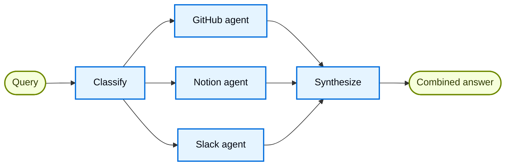

import ChatModelTabsPy from '/snippets/chat-model-tabs.mdx';
import ChatModelTabsJs from '/snippets/chat-model-tabs-js.mdx';

## 概述

**路由模式**是一种[多代理](/oss/langchain/multi-agent)架构，其中路由步骤对输入进行分类并将其定向到专门的代理，结果被合成为组合响应。当你的组织知识分布在不同的**垂直领域**（每个都需要自己的代理以及专用工具和提示词的独立知识领域）时，这种模式表现出色。

在本教程中，你将构建一个多源知识库路由器，通过一个真实的企业场景展示这些好处。该系统将协调三个专家：

- 一个 **GitHub 代理**，用于搜索代码、issues 和 pull requests。
- 一个 **Notion 代理**，用于搜索内部文档和 wikis。
- 一个 **Slack 代理**，用于搜索相关的讨论和对话。

当用户问"如何对 API 请求进行身份验证？"时，路由器将查询分解为针对源的子问题，并行路由到相关代理，并将结果合成为一个连贯的答案。



### 为什么要使用路由模式？

路由模式提供了几个优势：

- **并行执行**：同时查询多个来源，减少相对于顺序方法的延迟。
- **专家代理**：每个垂直领域都有针对其领域优化的专用工具和提示词。
- **选择性路由**：并非每个查询都需要每个来源——路由器智能地选择相关的垂直领域。
- **针对性子问题**：每个代理接收针对其领域量身定制的问题，提高结果质量。
- **清晰的合成**：将多个来源的结果组合成单一、连贯的响应。

### 概念

我们将涵盖以下概念：

- [多代理系统](/oss/langchain/multi-agent)
- [StateGraph](/oss/langgraph/graph-api) 用于工作流程编排
- [Send API](/oss/langgraph/graph-api#send) 用于并行执行

<Tip>
**路由器 vs. 子代理**：[子代理模式](/oss/langchain/multi-agent/subagents)也可以路由到多个代理。当你需要专门的预处理、自定义路由逻辑或想要对并行执行进行显式控制时，使用路由模式。当你想让大型语言模型动态决定调用哪些代理时，使用子代理模式。
</Tip>

## 设置

### 安装

本教程需要 `langchain` 和 `langgraph` 包：

:::python
<CodeGroup>
```bash pip
pip install langchain langgraph
```
```bash uv
uv add langchain langgraph
```
```bash conda
conda install langchain langgraph -c conda-forge
```
</CodeGroup>
:::

:::js
<CodeGroup>
```bash npm
npm install langchain @langchain/langgraph
```
```bash yarn
yarn add langchain @langchain/langgraph
```
```bash pnpm
pnpm add langchain @langchain/langgraph
```
</CodeGroup>
:::

更多详情，请参阅我们的[安装指南](/oss/langchain/install)。

### LangSmith

设置 [LangSmith](https://smith.langchain.com) 以检查代理内部发生的情况。然后设置以下环境变量：

:::python
<CodeGroup>
```bash bash
export LANGSMITH_TRACING="true"
export LANGSMITH_API_KEY="..."
```
```python python
import getpass
import os

os.environ["LANGSMITH_TRACING"] = "true"
os.environ["LANGSMITH_API_KEY"] = getpass.getpass()
```
</CodeGroup>
:::

:::js
<CodeGroup>
```bash bash
export LANGSMITH_TRACING="true"
export LANGSMITH_API_KEY="..."
```
```typescript typescript
process.env.LANGSMITH_TRACING = "true";
process.env.LANGSMITH_API_KEY = "...";
```
</CodeGroup>
:::

### 选择大型语言模型

从 LangChain 的集成套件中选择一个聊天模型：

:::python
<ChatModelTabsPy />
:::

:::js
<ChatModelTabsJs />
:::

## 1. 定义状态

首先，定义状态模式。我们使用三种类型：

- **`AgentInput`**：传递给每个子代理的简单状态（只是一个查询）
- **`AgentOutput`**：每个子代理返回的结果（来源名称 + 结果）
- **`RouterState`**：主要工作流程状态，跟踪查询、分类、结果和最终答案

:::python
```python
from typing import Annotated, Literal, TypedDict
import operator


class AgentInput(TypedDict):
    """每个子代理的简单输入状态。"""
    query: str


class AgentOutput(TypedDict):
    """每个子代理的输出。"""
    source: str
    result: str


class Classification(TypedDict):
    """单个路由决策：调用哪个代理以及使用什么查询。"""
    source: Literal["github", "notion", "slack"]
    query: str


class RouterState(TypedDict):
    query: str
    classifications: list[Classification]
    results: Annotated[list[AgentOutput], operator.add]  # Reducer 收集并行结果
    final_answer: str
```
:::

:::js
```typescript
import { StateSchema, ReducedValue } from "@langchain/langgraph";
import { z } from "zod/v4";

const AgentOutput = z.object({
  source: z.string(),
  result: z.string(),
});

const RouterState = new StateSchema({
  query: z.string(),
  classifications: z.array(
    z.object({
      source: z.enum(["github", "notion", "slack"]),
      query: z.string(),
    })
  ),
  results: new ReducedValue(
    z.array(AgentOutput).default(() => []),
    { reducer: (current, update) => current.concat(update) }
  ),
  finalAnswer: z.string(),
});
```
:::

`results` 字段使用一个 **reducer**（Python 中是 `operator.add`，JS 中是 concat 函数）将并行代理执行的结果收集到单个列表中。

## 2. 为每个垂直领域定义工具

为每个知识领域创建工具。在生产系统中，这些会调用实际的 API。对于本教程，我们使用返回模拟数据的 stub 实现。我们定义了跨 3 个垂直领域的 7 个工具：GitHub（搜索代码、issues、PRs）、Notion（搜索文档、获取页面）和 Slack（搜索消息、获取对话）。

:::python
```python expandable
from langchain.tools import tool


@tool
def search_code(query: str, repo: str = "main") -> str:
    """在 GitHub 仓库中搜索代码。"""
    return f"在 {repo} 中找到匹配 '{query}' 的代码：src/auth.py 中的身份验证中间件"


@tool
def search_issues(query: str) -> str:
    """搜索 GitHub issues 和 pull requests。"""
    return f"找到 3 个匹配 '{query}' 的 issues：#142（API 身份验证文档）、#89（OAuth 流程）、#203（token 刷新）"


@tool
def search_prs(query: str) -> str:
    """搜索 pull requests 以获取实现细节。"""
    return f"PR #156 添加了 JWT 身份验证，PR #178 更新了 OAuth 范围"


@tool
def search_notion(query: str) -> str:
    """在 Notion 工作空间中搜索文档。"""
    return f"找到文档：'API 身份验证指南' - 涵盖 OAuth2 流程、API 密钥和 JWT tokens"


@tool
def get_page(page_id: str) -> str:
    """按 ID 获取特定的 Notion 页面。"""
    return f"页面内容：逐步身份验证设置说明"


@tool
def search_slack(query: str) -> str:
    """搜索 Slack 消息和讨论。"""
    return f"在 #engineering 中找到讨论：'对 API 身份验证使用 Bearer tokens，请参阅文档了解刷新流程'"


@tool
def get_thread(thread_id: str) -> str:
    """获取特定的 Slack 对话。"""
    return f"对话讨论了 API 密钥轮换的最佳实践"
```
:::

:::js
```typescript expandable
import { tool } from "langchain";
import { z } from "zod";

const searchCode = tool(
  async ({ query, repo }) => {
    return `在 ${repo || "main"} 中找到匹配 '${query}' 的代码：src/auth.py 中的身份验证中间件`;
  },
  {
    name: "search_code",
    description: "在 GitHub 仓库中搜索代码。",
    schema: z.object({
      query: z.string(),
      repo: z.string().optional().default("main"),
    }),
  }
);

const searchIssues = tool(
  async ({ query }) => {
    return `找到 3 个匹配 '${query}' 的 issues：#142（API 身份验证文档）、#89（OAuth 流程）、#203（token 刷新）`;
  },
  {
    name: "search_issues",
    description: "搜索 GitHub issues 和 pull requests。",
    schema: z.object({
      query: z.string(),
    }),
  }
);

const searchPrs = tool(
  async ({ query }) => {
    return `PR #156 添加了 JWT 身份验证，PR #178 更新了 OAuth 范围`;
  },
  {
    name: "search_prs",
    description: "搜索 pull requests 以获取实现细节。",
    schema: z.object({
      query: z.string(),
    }),
  }
);

const searchNotion = tool(
  async ({ query }) => {
    return `找到文档：'API 身份验证指南' - 涵盖 OAuth2 流程、API 密钥和 JWT tokens`;
  },
  {
    name: "search_notion",
    description: "在 Notion 工作空间中搜索文档。",
    schema: z.object({
      query: z.string(),
    }),
  }
);

const getPage = tool(
  async ({ pageId }) => {
    return `页面内容：逐步身份验证设置说明`;
  },
  {
    name: "get_page",
    description: "按 ID 获取特定的 Notion 页面。",
    schema: z.object({
      pageId: z.string(),
    }),
  }
);

const searchSlack = tool(
  async ({ query }) => {
    return `在 #engineering 中找到讨论：'对 API 身份验证使用 Bearer tokens，请参阅文档了解刷新流程'`;
  },
  {
    name: "search_slack",
    description: "搜索 Slack 消息和讨论。",
    schema: z.object({
      query: z.string(),
    }),
  }
);

const getThread = tool(
  async ({ threadId }) => {
    return `对话讨论了 API 密钥轮换的最佳实践`;
  },
  {
    name: "get_thread",
    description: "获取特定的 Slack 对话。",
    schema: z.object({
      threadId: z.string(),
    }),
  }
);
```
:::

## 3. 创建专家代理

为每个垂直领域创建一个代理。每个代理都有针对其知识源的领域专用工具和优化提示词。所有三个都遵循相同的模式——只有工具和系统提示词不同。

:::python
```python expandable
from langchain.agents import create_agent
from langchain.chat_models import init_chat_model

model = init_chat_model("openai:gpt-5.4")

github_agent = create_agent(
    model,
    tools=[search_code, search_issues, search_prs],
    system_prompt=(
        "你是一个 GitHub 专家。通过搜索仓库、issues 和 pull requests "
        "回答关于代码、API 引用和实现细节的问题。"
    ),
)

notion_agent = create_agent(
    model,
    tools=[search_notion, get_page],
    system_prompt=(
        "你是一个 Notion 专家。通过搜索组织的 Notion 工作空间 "
        "回答关于内部流程、政策和团队文档的问题。"
    ),
)

slack_agent = create_agent(
    model,
    tools=[search_slack, get_thread],
    system_prompt=(
        "你是一个 Slack 专家。通过搜索团队成员分享知识和解决方案的相关讨论和对话来回答问题。"
    ),
)
```
:::

:::js
```typescript expandable
import { createAgent } from "langchain";
import { ChatOpenAI } from "@langchain/openai";

const llm = new ChatOpenAI({ model: "gpt-5.4" });

const githubAgent = createAgent({
  model: llm,
  tools: [searchCode, searchIssues, searchPrs],
  systemPrompt: `
你是一个 GitHub 专家。回答关于代码、
API 引用和实现细节的问题，方法是搜索
仓库、issues 和 pull requests。
  `.trim(),
});

const notionAgent = createAgent({
  model: llm,
  tools: [searchNotion, getPage],
  systemPrompt: `
你是一个 Notion 专家。回答关于内部
流程、政策和团队文档的问题，方法是搜索
组织的 Notion 工作空间。
  `.trim(),
});

const slackAgent = createAgent({
  model: llm,
  tools: [searchSlack, getThread],
  systemPrompt: `
你是一个 Slack 专家。通过搜索
团队成员分享知识和解决方案的相关讨论和对话来回答问题。
  `.trim(),
});
```
:::

## 4. 构建路由器工作流程

现在使用 StateGraph 构建路由器工作流程。工作流程有四个主要步骤：

1. **分类**：分析查询并确定调用哪些代理以及使用什么子问题
2. **路由**：使用 `Send` 并行扇出到选定的代理
3. **查询代理**：每个代理接收一个简单的 `AgentInput` 并返回一个 `AgentOutput`
4. **合成**：将收集的结果组合成连贯的响应

:::python
```python
from pydantic import BaseModel, Field
from langgraph.graph import StateGraph, START, END
from langgraph.types import Send

router_llm = init_chat_model("openai:gpt-5.4-mini")


# 为分类器定义结构化输出模式
class ClassificationResult(BaseModel):  # [!code highlight]
    """将用户查询分类为针对代理的子问题的结果。"""
    classifications: list[Classification] = Field(
        description="要调用的代理列表及其针对性子问题"
    )


def classify_query(state: RouterState) -> dict:
    """分类查询并确定调用哪些代理。"""
    structured_llm = router_llm.with_structured_output(ClassificationResult)  # [!code highlight]

    result = structured_llm.invoke([
        {
            "role": "system",
            "content": """分析此查询并确定要咨询哪些知识库。
对于每个相关来源，生成针对该来源优化的针对性子问题。

可用来源：
- github：代码、API 引用、实现细节、issues、pull requests
- notion：内部文档、流程、政策、团队 wikis
- slack：团队讨论、非正式知识共享、最近的对话

只返回与查询相关的来源。每个来源都应该有一个针对特定知识领域的针对性子问题。

例如对于"如何对 API 请求进行身份验证？"：
- github: "存在哪些身份验证代码？搜索 auth 中间件、JWT 处理"
- notion: "存在哪些身份验证文档？查找 API 身份验证指南"
（slack 被省略，因为这与此技术问题无关）"""
        },
        {"role": "user", "content": state["query"]}
    ])

    return {"classifications": result.classifications}


def route_to_agents(state: RouterState) -> list[Send]:
    """根据分类将请求扇出到代理。"""
    return [
        Send(c["source"], {"query": c["query"]})  # [!code highlight]
        for c in state["classifications"]
    ]


def query_github(state: AgentInput) -> dict:
    """查询 GitHub 代理。"""
    result = github_agent.invoke({
        "messages": [{"role": "user", "content": state["query"]}]  # [!code highlight]
    })
    return {"results": [{"source": "github", "result": result["messages"][-1].content}]}


def query_notion(state: AgentInput) -> dict:
    """查询 Notion 代理。"""
    result = notion_agent.invoke({
        "messages": [{"role": "user", "content": state["query"]}]  # [!code highlight]
    })
    return {"results": [{"source": "notion", "result": result["messages"][-1].content}]}


def query_slack(state: AgentInput) -> dict:
    """查询 Slack 代理。"""
    result = slack_agent.invoke({
        "messages": [{"role": "user", "content": state["query"]}]  # [!code highlight]
    })
    return {"results": [{"source": "slack", "result": result["messages"][-1].content}]}


def synthesize_results(state: RouterState) -> dict:
    """将所有代理的结果组合成连贯的答案。"""
    if not state["results"]:
        return {"final_answer": "任何知识来源都没有找到结果。"}

    # 格式化结果以进行合成
    formatted = [
        f"**来自 {r['source'].title()}：**\n{r['result']}"
        for r in state["results"]
    ]

    synthesis_response = router_llm.invoke([
        {
            "role": "system",
            "content": f"""综合这些搜索结果以回答原始问题："{state['query']}"

- 合并多个来源的信息，无冗余
- 突出最相关和最可操作的信息
- 注意来源之间的任何差异
- 保持响应简洁且组织良好"""
        },
        {"role": "user", "content": "\n\n".join(formatted)}
    ])

    return {"final_answer": synthesis_response.content}
```
:::

:::js
```typescript
import { StateGraph, START, END, Send } from "@langchain/langgraph";
import { z } from "zod";

const routerLlm = new ChatOpenAI({ model: "gpt-5.4-mini" });


// 为分类器定义结构化输出模式
const ClassificationResultSchema = z.object({  // [!code highlight]
  classifications: z.array(z.object({
    source: z.enum(["github", "notion", "slack"]),
    query: z.string(),
  })).describe("要调用的代理列表及其针对性子问题"),
});


async function classifyQuery(state: typeof RouterState.State) {
  const structuredLlm = routerLlm.withStructuredOutput(ClassificationResultSchema);  // [!code highlight]

  const result = await structuredLlm.invoke([
    {
      role: "system",
      content: `分析此查询并确定要咨询哪些知识库。
对于每个相关来源，生成针对该来源优化的针对性子问题。

可用来源：
- github：代码、API 引用、实现细节、issues、pull requests
- notion：内部文档、流程、政策、团队 wikis
- slack：团队讨论、非正式知识共享、最近的对话

只返回与查询相关的来源。每个来源都应该有一个针对特定知识领域的针对性子问题。

例如对于"如何对 API 请求进行身份验证？"：
- github: "存在哪些身份验证代码？搜索 auth 中间件、JWT 处理"
- notion: "存在哪些身份验证文档？查找 API 身份验证指南"
（slack 被省略，因为这与此技术问题无关）`
    },
    { role: "user", content: state.query }
  ]);

  return { classifications: result.classifications };
}


function routeToAgents(state: typeof RouterState.State): Send[] {
  return state.classifications.map(
    (c) => new Send(c.source, { query: c.query })  // [!code highlight]
  );
}


async function queryGithub(state: AgentInput) {
  const result = await githubAgent.invoke({
    messages: [{ role: "user", content: state.query }]  // [!code highlight]
  });
  return { results: [{ source: "github", result: result.messages.at(-1)?.content }] };
}


async function queryNotion(state: AgentInput) {
  const result = await notionAgent.invoke({
    messages: [{ role: "user", content: state.query }]  // [!code highlight]
  });
  return { results: [{ source: "notion", result: result.messages.at(-1)?.content }] };
}


async function querySlack(state: AgentInput) {
  const result = await slackAgent.invoke({
    messages: [{ role: "user", content: state.query }]  // [!code highlight]
  });
  return { results: [{ source: "slack", result: result.messages.at(-1)?.content }] };
}


async function synthesizeResults(state: typeof RouterState.State) {
  if (state.results.length === 0) {
    return { finalAnswer: "任何知识来源都没有找到结果。" };
  }

  // 格式化结果以进行合成
  const formatted = state.results.map(
    (r) => `**来自 ${r.source.charAt(0).toUpperCase() + r.source.slice(1)}：**\n${r.result}`
  );

  const synthesisResponse = await routerLlm.invoke([
    {
      role: "system",
      content: `综合这些搜索结果以回答原始问题："${state.query}"

- 合并多个来源的信息，无冗余
- 突出最相关和最可操作的信息
- 注意来源之间的任何差异
- 保持响应简洁且组织良好`
    },
    { role: "user", content: formatted.join("\n\n") }
  ]);

  return { finalAnswer: synthesisResponse.content };
}
```
:::

## 5. 编译工作流程

现在通过连接节点与边来组装工作流程。关键是使用 `add_conditional_edges` 与路由函数以启用并行执行：

:::python
```python
workflow = (
    StateGraph(RouterState)
    .add_node("classify", classify_query)
    .add_node("github", query_github)
    .add_node("notion", query_notion)
    .add_node("slack", query_slack)
    .add_node("synthesize", synthesize_results)
    .add_edge(START, "classify")
    .add_conditional_edges("classify", route_to_agents, ["github", "notion", "slack"])
    .add_edge("github", "synthesize")
    .add_edge("notion", "synthesize")
    .add_edge("slack", "synthesize")
    .add_edge("synthesize", END)
    .compile()
)
```
:::

:::js
```typescript
const workflow = new StateGraph(RouterState)
  .addNode("classify", classifyQuery)
  .addNode("github", queryGithub)
  .addNode("notion", queryNotion)
  .addNode("slack", querySlack)
  .addNode("synthesize", synthesizeResults)
  .addEdge(START, "classify")
  .addConditionalEdges("classify", routeToAgents, ["github", "notion", "slack"])
  .addEdge("github", "synthesize")
  .addEdge("notion", "synthesize")
  .addEdge("slack", "synthesize")
  .addEdge("synthesize", END)
  .compile();
```
:::

`add_conditional_edges` 调用通过 `route_to_agents` 函数将 classify 节点连接到代理节点。当 `route_to_agents` 返回多个 `Send` 对象时，这些节点并行执行。

## 6. 使用路由器

使用跨多个知识领域的查询测试你的路由器：

:::python
```python
result = workflow.invoke({
    "query": "如何对 API 请求进行身份验证？"
})

print("原始查询:", result["query"])
print("\n分类:")
for c in result["classifications"]:
    print(f"  {c['source']}: {c['query']}")
print("\n" + "=" * 60 + "\n")
print("最终答案:")
print(result["final_answer"])
```
:::

:::js
```typescript
const result = await workflow.invoke({
  query: "如何对 API 请求进行身份验证？"
});

console.log("原始查询:", result.query);
console.log("\n分类:");
for (const c of result.classifications) {
  console.log(`  ${c.source}: ${c.query}`);
}
console.log("\n" + "=".repeat(60) + "\n");
console.log("最终答案:");
console.log(result.finalAnswer);
```
:::

预期输出：
```
原始查询: 如何对 API 请求进行身份验证？

分类:
  github: 存在哪些身份验证代码？搜索 auth 中间件、JWT 处理
  notion: 存在哪些身份验证文档？查找 API 身份验证指南

============================================================

最终答案:
要对 API 请求进行身份验证，你有几个选项：

1. **JWT Tokens**：对于大多数用例推荐的方案。
   实现细节在 `src/auth.py`（PR #156）中。

2. **OAuth2 Flow**：对于第三方集成，按照 Notion 的"API 身份验证指南"中记录的 OAuth2
   流程进行。

3. **API Keys**：对于服务器对服务器通信，在 Authorization 头中使用 Bearer tokens。

有关 token 刷新处理，请参阅 issue #203 和 PR #178 获取最新的
OAuth 范围更新。
```

路由器分析了查询，将其分类以确定调用哪些代理（GitHub 和 Notion，但此技术问题不需要 Slack），并行查询了两个代理，并将结果合成为一个连贯的答案。

## 7. 理解架构

路由器工作流程遵循一个清晰的模式：

### 分类阶段

`classify_query` 函数使用**结构化输出**来分析用户的查询并确定调用哪些代理。这就是路由智能所在：

- 使用 Pydantic 模型（Python）或 Zod 模式（JS）来确保有效输出
- 返回一个 `Classification` 对象列表，每个对象都有一个 `source` 和针对性 `query`
- 只包含相关来源——只需省略无关的来源

这种结构化方法比自由形式的 JSON 解析更可靠，并使路由逻辑明确。

### 使用 Send 进行并行执行

`route_to_agents` 函数将分类映射到 `Send` 对象。每个 `Send` 指定目标节点和要传递的状态：

:::python
```python
# 分类：[{"source": "github", "query": "..."}, {"source": "notion", "query": "..."}]
# 变为:
[Send("github", {"query": "..."}), Send("notion", {"query": "..."})]
# 两个代理同时执行，每个只收到它需要的查询
```
:::

:::js
```typescript
// 分类：[{ source: "github", query: "..." }, { source: "notion", query: "..." }]
// 变为:
[new Send("github", { query: "..." }), new Send("notion", { query: "..." })]
// 两个代理同时执行，每个只收到它需要的查询
```
:::

每个代理节点接收一个只有 `query` 字段的简单 `AgentInput`——而不是完整的路由器状态。这保持接口清晰且明确。

### 使用 Reducer 收集结果

代理结果通过 **reducer** 流回主状态。每个代理返回：

:::python
```python
{"results": [{"source": "github", "result": "..."}]}
```
:::

:::js
```typescript
{ results: [{ source: "github", result: "..." }] }
```
:::

reducer（Python 中的 `operator.add`）连接这些列表，将所有并行结果收集到 `state["results"]` 中。

### 合成阶段

所有代理完成后，`synthesize_results` 函数遍历收集的结果：

- 等待所有并行分支完成（LangGraph 自动处理）
- 引用原始查询以确保答案解决用户所问的内容
- 合并来自所有来源的信息，无冗余

<Note>
**部分结果**：在本教程中，所有选定的代理必须先完成才能进行合成。
</Note>

## 8. 完整的工作示例

以下是可运行脚本中的完整代码：

<Expandable title="查看完整代码" defaultOpen={false}>

:::python
```python
"""
多源知识路由器示例

此示例演示了多代理系统的路由模式。
路由器对查询进行分类，并行将查询路由到专门的代理，
并将结果合成为组合响应。
"""

import operator
from typing import Annotated, Literal, TypedDict

from langchain.agents import create_agent
from langchain.chat_models import init_chat_model
from langchain.tools import tool
from langgraph.graph import StateGraph, START, END
from langgraph.types import Send
from pydantic import BaseModel, Field


# 状态定义
class AgentInput(TypedDict):
    """每个子代理的简单输入状态。"""
    query: str


class AgentOutput(TypedDict):
    """每个子代理的输出。"""
    source: str
    result: str


class Classification(TypedDict):
    """单个路由决策：调用哪个代理以及使用什么查询。"""
    source: Literal["github", "notion", "slack"]
    query: str


class RouterState(TypedDict):
    query: str
    classifications: list[Classification]
    results: Annotated[list[AgentOutput], operator.add]
    final_answer: str


# 分类器的结构化输出模式
class ClassificationResult(BaseModel):
    """将用户查询分类为针对代理的子问题的结果。"""
    classifications: list[Classification] = Field(
        description="要调用的代理列表及其针对性子问题"
    )


# 工具
@tool
def search_code(query: str, repo: str = "main") -> str:
    """在 GitHub 仓库中搜索代码。"""
    return f"在 {repo} 中找到匹配 '{query}' 的代码：src/auth.py 中的身份验证中间件"


@tool
def search_issues(query: str) -> str:
    """搜索 GitHub issues 和 pull requests。"""
    return f"找到 3 个匹配 '{query}' 的 issues：#142（API 身份验证文档）、#89（OAuth 流程）、#203（token 刷新）"


@tool
def search_prs(query: str) -> str:
    """搜索 pull requests 以获取实现细节。"""
    return f"PR #156 添加了 JWT 身份验证，PR #178 更新了 OAuth 范围"


@tool
def search_notion(query: str) -> str:
    """在 Notion 工作空间中搜索文档。"""
    return f"找到文档：'API 身份验证指南' - 涵盖 OAuth2 流程、API 密钥和 JWT tokens"


@tool
def get_page(page_id: str) -> str:
    """按 ID 获取特定的 Notion 页面。"""
    return f"页面内容：逐步身份验证设置说明"


@tool
def search_slack(query: str) -> str:
    """搜索 Slack 消息和讨论。"""
    return f"在 #engineering 中找到讨论：'对 API 身份验证使用 Bearer tokens，请参阅文档了解刷新流程'"


@tool
def get_thread(thread_id: str) -> str:
    """获取特定的 Slack 对话。"""
    return f"对话讨论了 API 密钥轮换的最佳实践"


# 模型和代理
model = init_chat_model("openai:gpt-5.4")
router_llm = init_chat_model("openai:gpt-5.4-mini")

github_agent = create_agent(
    model,
    tools=[search_code, search_issues, search_prs],
    system_prompt=(
        "你是一个 GitHub 专家。回答关于代码、 "
        "API 引用和实现细节的问题，方法是搜索 "
        "仓库、issues 和 pull requests。"
    ),
)

notion_agent = create_agent(
    model,
    tools=[search_notion, get_page],
    system_prompt=(
        "你是一个 Notion 专家。回答关于内部 "
        "流程、政策和团队文档的问题，方法是搜索 "
        "组织的 Notion 工作空间。"
    ),
)

slack_agent = create_agent(
    model,
    tools=[search_slack, get_thread],
    system_prompt=(
        "你是一个 Slack 专家。通过搜索团队成员分享知识和解决方案的相关讨论和对话来回答问题。"
    ),
)


# 工作流程节点
def classify_query(state: RouterState) -> dict:
    """分类查询并确定调用哪些代理。"""
    structured_llm = router_llm.with_structured_output(ClassificationResult)

    result = structured_llm.invoke([
        {
            "role": "system",
            "content": """分析此查询并确定要咨询哪些知识库。
对于每个相关来源，生成针对该来源优化的针对性子问题。

可用来源：
- github：代码、API 引用、实现细节、issues、pull requests
- notion：内部文档、流程、政策、团队 wikis
- slack：团队讨论、非正式知识共享、最近的对话

只返回与查询相关的来源。"""
        },
        {"role": "user", "content": state["query"]}
    ])

    return {"classifications": result.classifications}


def route_to_agents(state: RouterState) -> list[Send]:
    """根据分类将请求扇出到代理。"""
    return [
        Send(c["source"], {"query": c["query"]})
        for c in state["classifications"]
    ]


def query_github(state: AgentInput) -> dict:
    """查询 GitHub 代理。"""
    result = github_agent.invoke({
        "messages": [{"role": "user", "content": state["query"]}]
    })
    return {"results": [{"source": "github", "result": result["messages"][-1].content}]}


def query_notion(state: AgentInput) -> dict:
    """查询 Notion 代理。"""
    result = notion_agent.invoke({
        "messages": [{"role": "user", "content": state["query"]}]
    })
    return {"results": [{"source": "notion", "result": result["messages"][-1].content}]}


def query_slack(state: AgentInput) -> dict:
    """查询 Slack 代理。"""
    result = slack_agent.invoke({
        "messages": [{"role": "user", "content": state["query"]}]
    })
    return {"results": [{"source": "slack", "result": result["messages"][-1].content}]}


def synthesize_results(state: RouterState) -> dict:
    """将所有代理的结果组合成连贯的答案。"""
    if not state["results"]:
        return {"final_answer": "任何知识来源都没有找到结果。"}

    formatted = [
        f"**来自 {r['source'].title()}：**\n{r['result']}"
        for r in state["results"]
    ]

    synthesis_response = router_llm.invoke([
        {
            "role": "system",
            "content": f"""综合这些搜索结果以回答原始问题："{state['query']}"

- 合并多个来源的信息，无冗余
- 突出最相关和最可操作的信息
- 注意来源之间的任何差异
- 保持响应简洁且组织良好"""
        },
        {"role": "user", "content": "\n\n".join(formatted)}
    ])

    return {"final_answer": synthesis_response.content}


# 构建工作流程
workflow = (
    StateGraph(RouterState)
    .add_node("classify", classify_query)
    .add_node("github", query_github)
    .add_node("notion", query_notion)
    .add_node("slack", query_slack)
    .add_node("synthesize", synthesize_results)
    .add_edge(START, "classify")
    .add_conditional_edges("classify", route_to_agents, ["github", "notion", "slack"])
    .add_edge("github", "synthesize")
    .add_edge("notion", "synthesize")
    .add_edge("slack", "synthesize")
    .add_edge("synthesize", END)
    .compile()
)


if __name__ == "__main__":
    result = workflow.invoke({
        "query": "如何对 API 请求进行身份验证？"
    })

    print("原始查询:", result["query"])
    print("\n分类:")
    for c in result["classifications"]:
        print(f"  {c['source']}: {c['query']}")
    print("\n" + "=" * 60 + "\n")
    print("最终答案:")
    print(result["final_answer"])
```
:::

:::js
```typescript
/**
 * 多源知识路由器示例
 *
 * 此示例演示了多代理系统的路由模式。
 * 路由器对查询进行分类，将查询并行路由到专门的代理，
 * 并将结果合成为组合响应。
 */
import { z } from "zod/v4";
import { tool } from "langchain";
import { StateGraph, START, END, Send, StateSchema, ReducedValue } from "@langchain/langgraph";

const AgentOutput = z.object({
  source: z.string(),
  result: z.string(),
});

const RouterState = new StateSchema({
  query: z.string(),
  classifications: z.array(
    z.object({
      source: z.enum(["github", "notion", "slack"]),
      query: z.string(),
    })
  ),
  results: new ReducedValue(
    z.array(AgentOutput).default(() => []),
    { reducer: (current, update) => current.concat(update) }
  ),
  finalAnswer: z.string(),
});

const searchCode = tool(
  async ({ query, repo }) => {
    return `在 ${repo || "main"} 中找到匹配 '${query}' 的代码：src/auth.py 中的身份验证中间件`;
  },
  {
    name: "search_code",
    description: "在 GitHub 仓库中搜索代码。",
    schema: z.object({
      query: z.string(),
      repo: z.string().optional().default("main"),
    }),
  }
);

const searchIssues = tool(
  async ({ query }) => {
    return `找到 3 个匹配 '${query}' 的 issues：#142（API 身份验证文档）、#89（OAuth 流程）、#203（token 刷新）`;
  },
  {
    name: "search_issues",
    description: "搜索 GitHub issues 和 pull requests。",
    schema: z.object({
      query: z.string(),
    }),
  }
);

const searchPrs = tool(
  async ({ query }) => {
    return `PR #156 添加了 JWT 身份验证，PR #178 更新了 OAuth 范围`;
  },
  {
    name: "search_prs",
    description: "搜索 pull requests 以获取实现细节。",
    schema: z.object({
      query: z.string(),
    }),
  }
);

const searchNotion = tool(
  async ({ query }) => {
    return `找到文档：'API 身份验证指南' - 涵盖 OAuth2 流程、API 密钥和 JWT tokens`;
  },
  {
    name: "search_notion",
    description: "在 Notion 工作空间中搜索文档。",
    schema: z.object({
      query: z.string(),
    }),
  }
);

const getPage = tool(
  async ({ pageId }) => {
    return `页面内容：逐步身份验证设置说明`;
  },
  {
    name: "get_page",
    description: "按 ID 获取特定的 Notion 页面。",
    schema: z.object({
      pageId: z.string(),
    }),
  }
);

const searchSlack = tool(
  async ({ query }) => {
    return `在 #engineering 中找到讨论：'对 API 身份验证使用 Bearer tokens，请参阅文档了解刷新流程'`;
  },
  {
    name: "search_slack",
    description: "搜索 Slack 消息和讨论。",
    schema: z.object({
      query: z.string(),
    }),
  }
);

const getThread = tool(
  async ({ threadId }) => {
    return `对话讨论了 API 密钥轮换的最佳实践`;
  },
  {
    name: "get_thread",
    description: "获取特定的 Slack 对话。",
    schema: z.object({
      threadId: z.string(),
    }),
  }
);

import { createAgent } from "langchain";
import { ChatOpenAI } from "@langchain/openai";

const llm = new ChatOpenAI({ model: "gpt-5.4" });

const githubAgent = createAgent({
  model: llm,
  tools: [searchCode, searchIssues, searchPrs],
  systemPrompt: `
你是一个 GitHub 专家。回答关于代码、
API 引用和实现细节的问题，方法是搜索
仓库、issues 和 pull requests。
  `.trim(),
});

const notionAgent = createAgent({
  model: llm,
  tools: [searchNotion, getPage],
  systemPrompt: `
你是一个 Notion 专家。回答关于内部
流程、政策和团队文档的问题，方法是搜索
组织的 Notion 工作空间。
  `.trim(),
});

const slackAgent = createAgent({
  model: llm,
  tools: [searchSlack, getThread],
  systemPrompt: `
你是一个 Slack 专家。通过搜索
团队成员分享知识和解决方案的相关讨论和对话来回答问题。
  `.trim(),
});

const routerLlm = new ChatOpenAI({ model: "gpt-5.4-mini" });

// 为分类器定义结构化输出模式
const ClassificationResultSchema = z.object({
  // [!code highlight]
  classifications: z
    .array(
      z.object({
        source: z.enum(["github", "notion", "slack"]),
        query: z.string(),
      })
    )
    .describe("要调用的代理列表及其针对性子问题"),
});

async function classifyQuery(state: typeof RouterState.State) {
  const structuredLlm = routerLlm.withStructuredOutput(
    ClassificationResultSchema
  ); // [!code highlight]

  const result = await structuredLlm.invoke([
    {
      role: "system",
      content: `分析此查询并确定要咨询哪些知识库。
对于每个相关来源，生成针对该来源优化的针对性子问题。

可用来源：
- github：代码、API 引用、实现细节、issues、pull requests
- notion：内部文档、流程、政策、团队 wikis
- slack：团队讨论、非正式知识共享、最近的对话

只返回与查询相关的来源。每个来源都应该有一个针对特定知识领域的针对性子问题。

例如对于"如何对 API 请求进行身份验证？"：
- github: "存在哪些身份验证代码？搜索 auth 中间件、JWT 处理"
- notion: "存在哪些身份验证文档？查找 API 身份验证指南"
（slack 被省略，因为这与此技术问题无关）`,
    },
    { role: "user", content: state.query },
  ]);

  return { classifications: result.classifications };
}

function routeToAgents(state: typeof RouterState.State): Send[] {
  return state.classifications.map(
    (c) => new Send(c.source, { query: c.query }) // [!code highlight]
  );
}

async function queryGithub(state: typeof RouterState.State) {
  const result = await githubAgent.invoke({
    messages: [{ role: "user", content: state.query }], // [!code highlight]
  });
  return {
    results: [{ source: "github", result: result.messages.at(-1)?.content }],
  };
}

async function queryNotion(state: typeof RouterState.State) {
  const result = await notionAgent.invoke({
    messages: [{ role: "user", content: state.query }], // [!code highlight]
  });
  return {
    results: [{ source: "notion", result: result.messages.at(-1)?.content }],
  };
}

async function querySlack(state: typeof RouterState.State) {
  const result = await slackAgent.invoke({
    messages: [{ role: "user", content: state.query }], // [!code highlight]
  });
  return {
    results: [{ source: "slack", result: result.messages.at(-1)?.content }],
  };
}

async function synthesizeResults(state: typeof RouterState.State) {
  if (state.results.length === 0) {
    return { finalAnswer: "任何知识来源都没有找到结果。" };
  }

  // 格式化结果以进行合成
  const formatted = state.results.map(
    (r) =>
      `**来自 ${r.source.charAt(0).toUpperCase() + r.source.slice(1)}：**\n${r.result}`
  );

  const synthesisResponse = await routerLlm.invoke([
    {
      role: "system",
      content: `综合这些搜索结果以回答原始问题："${state.query}"

- 合并多个来源的信息，无冗余
- 突出最相关和最可操作的信息
- 注意来源之间的任何差异
- 保持响应简洁且组织良好`,
    },
    { role: "user", content: formatted.join("\n\n") },
  ]);

  return { finalAnswer: synthesisResponse.content };
}

const workflow = new StateGraph(RouterState)
  .addNode("classify", classifyQuery)
  .addNode("github", queryGithub)
  .addNode("notion", queryNotion)
  .addNode("slack", querySlack)
  .addNode("synthesize", synthesizeResults)
  .addEdge(START, "classify")
  .addConditionalEdges("classify", routeToAgents, ["github", "notion", "slack"])
  .addEdge("github", "synthesize")
  .addEdge("notion", "synthesize")
  .addEdge("slack", "synthesize")
  .addEdge("synthesize", END)
  .compile();

const result = await workflow.invoke({
  query: "如何对 API 请求进行身份验证？",
});

console.log("原始查询:", result.query);
console.log("\n分类:");
for (const c of result.classifications) {
  console.log(`  ${c.source}: ${c.query}`);
}
console.log(`\n${"=".repeat(60)}\n`);
console.log("最终答案:");
console.log(result.finalAnswer);
```
:::

</Expandable>

## 9. 高级：有状态路由器

到目前为止我们构建的路由器是**无状态的**（每个请求独立处理，调用之间没有记忆）。对于多轮对话，你需要**有状态**的方法。

### 工具包装器方法

添加对话记忆的最简单方法是将无状态路由器包装为对话代理可以调用的工具：

:::python
```python
from langgraph.checkpoint.memory import InMemorySaver


@tool
def search_knowledge_base(query: str) -> str:
    """跨多个知识来源搜索（GitHub、Notion、Slack）。

    使用此工具来查找关于代码、文档或团队讨论的信息。
    """
    result = workflow.invoke({"query": query})
    return result["final_answer"]


conversational_agent = create_agent(
    model,
    tools=[search_knowledge_base],
    system_prompt=(
        "你是一个有帮助的助手，回答关于我们组织的问题。 "
        "使用 search_knowledge_base 工具来查找关于我们代码、 "
        "文档和团队讨论的信息。"
    ),
    checkpointer=InMemorySaver(),
)
```
:::

:::js
```typescript
import { MemorySaver } from "@langchain/langgraph";

const searchKnowledgeBase = tool(
  async ({ query }) => {
    const result = await workflow.invoke({ query });
    return result.finalAnswer;
  },
  {
    name: "search_knowledge_base",
    description: `跨多个知识来源搜索（GitHub、Notion、Slack）。
使用此工具来查找关于代码、文档或团队讨论的信息。`,
    schema: z.object({
      query: z.string().describe("搜索查询"),
    }),
  }
);

const conversationalAgent = createAgent({
  model: llm,
  tools: [searchKnowledgeBase],
  systemPrompt: `
你是一个有帮助的助手，回答关于我们组织的问题。
使用 search_knowledge_base 工具来查找关于我们代码、
文档和团队讨论的信息。
  `.trim(),
  checkpointer: new MemorySaver(),
});
```
:::

这种方法保持路由器无状态，同时对话代理处理记忆和上下文。用户可以进行多轮对话，代理将根据需要调用路由器工具。

:::python
```python
config = {"configurable": {"thread_id": "user-123"}}

result = conversational_agent.invoke(
    {"messages": [{"role": "user", "content": "如何对 API 请求进行身份验证？"}]},
    config
)
print(result["messages"][-1].content)

result = conversational_agent.invoke(
    {"messages": [{"role": "user", "content": "这些端点的速率限制呢？"}]},
    config
)
print(result["messages"][-1].content)
```
:::

:::js
```typescript
const config = { configurable: { thread_id: "user-123" } };
let conversationalAgentResult = await conversationalAgent.invoke(
  {
    messages: [
      { role: "user", content: "如何对 API 请求进行身份验证？" },
    ],
  },
  config
);
console.log(conversationalAgentResult.messages.at(-1)?.content);

conversationalAgentResult = await conversationalAgent.invoke(
  {
    messages: [
      {
        role: "user",
        content: "这些端点的速率限制呢？",
      },
    ],
  },
  config
);
console.log(conversationalAgentResult.messages.at(-1)?.content);
```
:::

<Tip>
对于大多数用例，推荐使用工具包装器方法。它提供了清晰的分离：路由器处理多源查询，而对话代理处理上下文和记忆。
</Tip>

### 完全持久化方法

如果你需要路由器本身维护状态——例如，在路由决策中使用以前的搜索结果——使用[持久化](/oss/langchain/short-term-memory)来在路由器级别存储消息历史。

<Warning>
**有状态路由器增加了复杂性。** 当跨轮次切换到不同代理时，对话可能感觉不一致，因为代理具有不同的语气或提示词。考虑使用[交接模式](/oss/langchain/multi-agent/handoffs)或[子代理模式](/oss/langchain/multi-agent/subagents)——两者都为与不同代理的多轮对话提供了更清晰的语义。
</Warning>

## 10. 关键要点

当你有以下情况时，路由模式表现出色：

- **明确的垂直领域**：独立的知识领域，每个都需要专门的工具和提示词
- **并行查询需求**：从同时查询多个来源中受益的问题
- **合成需求**：需要将多个来源的结果组合成连贯响应

该模式有三个阶段：**分解**（分析查询并生成针对性子问题）、**路由**（并行执行查询）和**合成**（组合结果）。

<Tip>
**何时使用路由模式**

当你有多个独立知识来源、需要低延迟并行查询以及希望对路由逻辑进行显式控制时，使用路由模式。

对于具有动态工具选择的更简单用例，请考虑[子代理模式](/oss/langchain/multi-agent/subagents)。对于代理需要与用户顺序对话的工作流程，请考虑[交接](/oss/langchain/multi-agent/handoffs)。
</Tip>

## 下一步

- 了解[交接](/oss/langchain/multi-agent/handoffs)以进行代理对代理对话
- 探索[子代理模式](/oss/langchain/multi-agent/subagents-personal-assistant)以进行集中编排
- 阅读[多代理概述](/oss/langchain/multi-agent)以比较不同模式
- 使用 [LangSmith](https://smith.langchain.com) 来调试和监控你的路由器