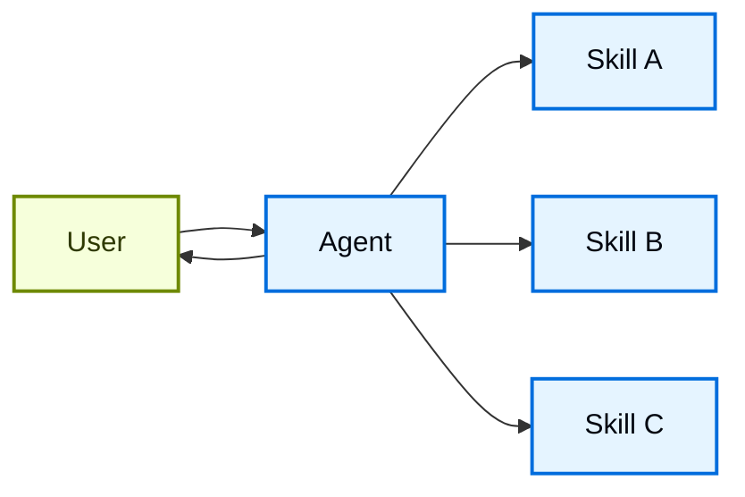

在**技能**架构中，专门能力被打包为可调用的"技能"，增强代理的[](/oss/langchain/agents)行为。技能主要是提示词驱动的专业化，代理可以按需调用。
有关内置技能支持，请参阅 [Deep Agents](/oss/deepagents/skills)。

<Tip>
此模式在概念上与 [Agent Skills](https://agentskills.io/) 和 [llms.txt](https://llmstxt.dev/)（由 Jeremy Howard 引入）相同，后者使用工具调用进行文档的渐进披露。技能模式将渐进披露应用于专业提示词和领域知识，而不仅仅是文档页面。

有关可立即使用的技能以提高代理在 LangChain 生态系统任务上的性能，请参阅 [LangChain Skills](https://github.com/langchain-ai/langchain-skills) 仓库。
</Tip>



## 关键特征

* 提示词驱动的专业化：技能主要由专业提示词定义
* 渐进披露：技能基于上下文或用户需求变得可用
* 团队分发：不同团队可以独立开发和维护技能
* 轻量级组合：技能比完整子代理更简单
* 引用感知：技能可以引用脚本、模板和其他资源

## 何时使用

当你想要一个具有多种可能专业化的单个[代理](/oss/langchain/agents)时使用技能模式，你不需要在技能之间强制执行特定约束，或者不同团队需要独立开发能力。常见示例包括编码助手（不同语言或任务的技能）、知识库（不同领域的技能）和创意助手（不同格式的技能）。

## 基本实现

:::python
```python
from langchain.tools import tool
from langchain.agents import create_agent

@tool
def load_skill(skill_name: str) -> str:
    """Load a specialized skill prompt.

    Available skills:
    - write_sql: SQL query writing expert
    - review_legal_doc: Legal document reviewer

    Returns the skill's prompt and context.
    """
    # Load skill content from file/database
    ...

agent = create_agent(
    model="gpt-5.4",
    tools=[load_skill],
    system_prompt=(
        "You are a helpful assistant. "
        "You have access to two skills: "
        "write_sql and review_legal_doc. "
        "Use load_skill to access them."
    ),
)
```
:::
:::js
```typescript
import { tool, createAgent } from "langchain";
import * as z from "zod";

const loadSkill = tool(
  async ({ skillName }) => {
    // Load skill content from file/database
    return "";
  },
  {
    name: "load_skill",
    description: `Load a specialized skill.

Available skills:
- write_sql: SQL query writing expert
- review_legal_doc: Legal document reviewer

Returns the skill's prompt and context.`,
    schema: z.object({
      skillName: z
        .string()
        .describe("Name of skill to load")
    })
  }
);

const agent = createAgent({
  model: "gpt-5.4",
  tools: [loadSkill],
  systemPrompt: (
    "You are a helpful assistant. " +
    "You have access to two skills: " +
    "write_sql and review_legal_doc. " +
    "Use load_skill to access them."
  ),
});
```
:::

有关完整实现，请参阅下面的教程。

<Card
    title="教程：使用按需技能构建 SQL 助手"
    icon="wand"
    href="/oss/langchain/multi-agent/skills-sql-assistant"
    arrow cta="了解更多"
>
    了解如何实现具有渐进披露的技能，其中代理按需加载专业提示词和 schema，而不是 upfront。
</Card>

## 扩展模式

在编写自定义实现时，你可以通过多种方式扩展基本技能模式：

- **动态工具注册**：将渐进披露与状态管理相结合，在技能加载时注册新[工具](/oss/langchain/tools)。例如，加载"database_admin"技能可以同时添加专门上下文和注册数据库特定工具（备份、恢复、迁移）。这使用跨多代理模式相同的工具和状态机制——工具更新状态以动态更改代理能力。

- **分层技能**：技能可以在树结构中定义其他技能，创建嵌套专业化。例如，加载"data_science"技能可能使"pandas_expert"、"visualization"和"statistical_analysis"等子技能可用。每个子技能可以独立加载，允许对领域知识进行细粒度的渐进披露。这种分层方法有助于通过将能力组织成可以按需发现和加载的逻辑分组来管理大型知识库。

- **引用感知**：虽然每个技能只有一个提示词，但此提示词可以引用其他资产的位置，并提供有关代理何时应使用这些资产的信息。当这些资产变得相关时，代理将知道这些文件存在并根据需要将它们读入内存以完成任务。这也遵循渐进披露模式，并限制上下文窗口中的信息。