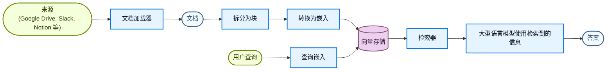
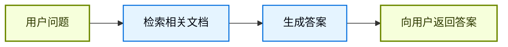
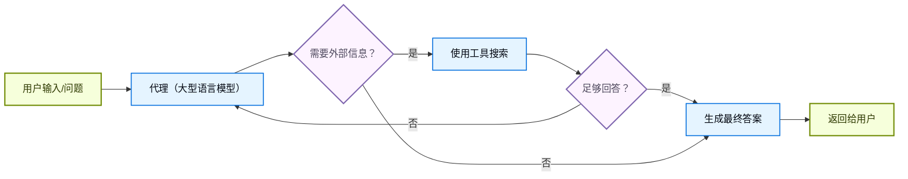
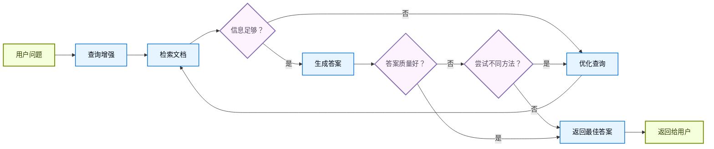

大型语言模型（LLM）很强大，但它们有两个关键限制：

* **有限的上下文**——它们无法一次摄取整个语料库。
* **静态知识**——它们的训练数据在某个时间点被冻结。

检索通过在查询时获取相关的外部知识来解决这些问题。这是**检索增强生成（RAG）**的基础：使用特定上下文信息增强大型语言模型的答案。

## 构建知识库

**知识库**是在检索期间使用的文档或结构化数据的存储库。

如果你需要自定义知识库，可以使用 LangChain 的文档加载器和向量存储从你自己的数据构建一个。

<Note>
    如果你已经有知识库（例如，SQL 数据库、CRM 或内部文档系统），你**不需要**重建它。你可以：
    - 将其作为**工具**连接到代理中的代理（Agentic RAG）。
    - 查询它并将检索到的内容作为上下文提供给大型语言模型[（2-Step RAG）](#2-step-rag)。
</Note>

请参阅以下教程来构建可搜索的知识库和最小 RAG 工作流程：

<Card
    title="教程：语义搜索"
    icon="database"
    href="/oss/langchain/knowledge-base"
    arrow cta="了解更多"
>
    了解如何使用 LangChain 的文档加载器、嵌入和向量存储从你自己的数据创建可搜索的知识库。
    在本教程中，你将构建一个基于 PDF 的搜索引擎，能够检索与查询相关的段落。你还将在此引擎之上实现一个最小 RAG 工作流程，以查看外部知识如何集成到大型语言模型推理中。
</Card>

### 从检索到 RAG

检索允许大型语言模型在运行时访问相关上下文。但大多数实际应用更进了一步：它们**将检索与生成结合**以产生有依据的、上下文感知的答案。

这就是**检索增强生成（RAG）**的核心思想。检索管道成为更广泛系统的基础，该系统将搜索与生成相结合。

### 检索管道

典型检索工作流程如下：



每个组件都是模块化的：你可以交换加载器、拆分器、嵌入或向量存储，而无需重写应用的逻辑。

### 构建块

<Columns cols={2}>
    <Card
        title="文档加载器"
        icon="file-import"
        href="/oss/integrations/document_loaders"
        arrow cta="了解更多"
    >
        从外部来源（Google Drive、Slack、Notion 等）获取数据，返回标准化的 @[`Document`] 对象。
    </Card>

    :::python
    <Card
        title="文本拆分器"
        icon="scissors"
        href="/oss/integrations/splitters"
        arrow
        cta="了解更多"
    >
        将大文档拆分为较小的块，这些块可以单独检索并适合模型的上下文窗口。
    </Card>
    :::
    <Card
        title="嵌入模型"
        icon="sitemap"
        href="/oss/integrations/embeddings"
        arrow
        cta="了解更多"
    >
        嵌入模型将文本转换为数字向量，以便在向量空间中含义相似的文本靠得很近。
    </Card>

    <Card
        title="向量存储"
        icon="database"
        href="/oss/integrations/vectorstores/"
        arrow
        cta="了解更多"
    >
        用于存储和搜索嵌入的专门数据库。
    </Card>

    <Card
        title="检索器"
        icon="binoculars"
        href="/oss/integrations/retrievers/"
        arrow
        cta="了解更多"
    >
        检索器是一个接口，在给定非结构化查询时返回文档。
    </Card>
</Columns>

## RAG 架构

RAG 可以通过多种方式实现，具体取决于你系统的需求。我们在下面的部分中概述每种类型。

| 架构 | 描述 | 控制 | 灵活性 | 延迟 | 示例用例 |
|-------------------------|----------------------------------------------------------------------------|-----------|-------------|----------------|----------------------------------------------------|
| **2-Step RAG** | 检索总是在生成之前发生。简单且可预测 | ✅ 高 | ❌ 低 | ⚡ 快 | 常见问题解答、文档机器人 |
| **Agentic RAG** | 大型语言模型驱动的代理在推理过程中决定*何时*和*如何*检索 | ❌ 低 | ✅ 高 | ⏳ 可变 | 可访问多个工具的研究助手 |
| **混合** | 结合两种方法的特征并带有验证步骤 | ⚖️ 中等 | ⚖️ 中等 | ⏳ 可变 | 带质量验证的领域特定问答 |

<Info>
**延迟**：延迟在 **2-Step RAG** 中通常更**可预测**，因为最大大型语言模型调用次数是已知且有上限的。这种可预测性假设大型语言模型推理时间是主要因素。然而，实际延迟也可能受到检索步骤性能的影响——如 API 响应时间、网络延迟或数据库查询——这些可能因使用的工具和基础设施而异。
</Info>

### 2-Step RAG

在 **2-Step RAG** 中，检索步骤总是在生成步骤之前执行。这种架构简单且可预测，适用于检索相关文档是生成答案的明确先决条件的许多应用。



<Card
    title="教程：检索增强生成（RAG）"
    icon="robot"
    href="/oss/langchain/rag#rag-chains"
    arrow cta="了解更多"
>
    了解如何构建一个可以使用检索增强生成回答基于你的数据的问题的问答聊天机器人。
    本教程详细介绍了两种方法：
    * 一个**RAG 代理**，使用灵活的工具运行搜索——适合通用用途。
    * 一个**2-step RAG 链**，每个查询只需要一次大型语言模型调用——对于更简单的任务快速且高效。
</Card>

### Agentic RAG

**Agentic 检索增强生成（RAG）** 将检索增强生成的优势与基于代理的推理相结合。代理（由大型语言模型驱动）不是先检索文档再回答，而是一步一步推理，并决定在交互过程中**何时**和**如何**检索信息。

<Tip>
代理只需要访问一个或多个可以获取外部知识的**工具**（如文档加载器、Web API 或数据库查询）即可启用 RAG 行为。
</Tip>



:::python
```python
import requests
from langchain.tools import tool
from langchain.chat_models import init_chat_model
from langchain.agents import create_agent


@tool
def fetch_url(url: str) -> str:
    """从 URL 获取文本内容"""
    response = requests.get(url, timeout=10.0)
    response.raise_for_status()
    return response.text

system_prompt = """\
在需要从网页获取信息时使用 fetch_url；引用相关片段。
"""

agent = create_agent(
    model="claude-sonnet-4-6",
    tools=[fetch_url], # 用于检索的工具 [!code highlight]
    system_prompt=system_prompt,
)
```
:::

:::js
```typescript
import { tool, createAgent } from "langchain";

const fetchUrl = tool(
    (url: string) => {
        return `从 ${url} 获取的内容`;
    },
    { name: "fetch_url", description: "从 URL 获取文本内容" }
);

const agent = createAgent({
    model: "claude-sonnet-4-0",
    tools: [fetchUrl],
    systemPrompt,
});
```
:::

<Expandable title="扩展示例：用于 LangGraph llms.txt 的 Agentic RAG">

此示例实现了一个**Agentic RAG 系统**来帮助用户查询 LangGraph 文档。代理首先加载 [llms.txt](https://llmstxt.dev/)，其中列出了可用的文档 URL，然后可以根据用户的问题动态使用 `fetch_documentation` 工具来检索和处理相关内容。

:::python
```python
import requests
from langchain.agents import create_agent
from langchain.messages import HumanMessage
from langchain.tools import tool
from markdownify import markdownify


ALLOWED_DOMAINS = ["https://langchain-ai.github.io/"]
LLMS_TXT = 'https://langchain-ai.github.io/langgraph/llms.txt'


@tool
def fetch_documentation(url: str) -> str:  # [!code highlight]
    """获取并转换文档从 URL"""
    if not any(url.startswith(domain) for domain in ALLOWED_DOMAINS):
        return (
            "错误：URL 不允许。 "
            f"必须以以下之一开头：{', '.join(ALLOWED_DOMAINS)}"
        )
    response = requests.get(url, timeout=10.0)
    response.raise_for_status()
    return markdownify(response.text)


# 我们将获取 llms.txt 的内容，因此这可以
# 在不需要大型语言模型请求的情况下提前完成。
llms_txt_content = requests.get(LLMS_TXT).text

# 代理的系统提示词
system_prompt = f"""
你是一个专家 Python 开发者和技术助手。
你的主要角色是帮助用户解答关于 LangGraph 和相关工具的问题。

说明：

1. 如果用户问你不确定的问题——或者可能涉及 API 用法、
   行为或配置的问题——你必须使用 `fetch_documentation` 工具来查阅相关文档。
2. 引用文档时，清晰总结并包含内容的相关上下文。
3. 不要使用允许域之外的任何 URL。
4. 如果文档获取失败，告诉用户并以你最好的专家理解继续。

你可以从以下批准来源访问官方文档：

{llms_txt_content}

在回答关于 LangGraph 的用户问题之前，你必须查阅文档以获取最新文档。

你的答案应该清晰、简洁且技术准确。
"""

tools = [fetch_documentation]

model = init_chat_model("claude-sonnet-4-0", max_tokens=32_000)

agent = create_agent(
    model=model,
    tools=tools,  # [!code highlight]
    system_prompt=system_prompt,  # [!code highlight]
    name="Agentic RAG",
)

response = agent.invoke({
    'messages': [
        HumanMessage(content=(
            "写一个使用预构建 create react agent 的 langgraph agent 的简短示例。
            该代理应该能够查找股票价格信息。"
        ))
    ]
})

print(response['messages'][-1].content)
```
:::
:::js
```typescript
import { tool, createAgent, HumanMessage } from "langchain";
import * as z from "zod";

const ALLOWED_DOMAINS = ["https://langchain-ai.github.io/"];
const LLMS_TXT = "https://langchain-ai.github.io/langgraph/llms.txt";

const fetchDocumentation = tool(
  async (input) => {  // [!code highlight]
    if (!ALLOWED_DOMAINS.some((domain) => input.url.startsWith(domain))) {
      return `错误：URL 不允许。必须以以下之一开头：${ALLOWED_DOMAINS.join(", ")}`;
    }
    const response = await fetch(input.url);
    if (!response.ok) {
      throw new Error(`HTTP error! status: ${response.status}`);
    }
    return response.text();
  },
  {
    name: "fetch_documentation",
    description: "从 URL 获取并转换文档",
    schema: z.object({
      url: z.string().describe("要获取的文档的 URL"),
    }),
  }
);

const llmsTxtResponse = await fetch(LLMS_TXT);
const llmsTxtContent = await llmsTxtResponse.text();

const systemPrompt = `
你是一个专家 TypeScript 开发者和技术助手。
你的主要角色是帮助用户解答关于 LangGraph 和相关工具的问题。

说明：

1. 如果用户问你不确定的问题——或者可能涉及 API 用法、
   行为或配置的问题——你必须使用 \`fetch_documentation\` 工具来查阅相关文档。
2. 引用文档时，清晰总结并包含内容的相关上下文。
3. 不要使用允许域之外的任何 URL。
4. 如果文档获取失败，告诉用户并以你最好的专家理解继续。

你可以从以下批准来源访问官方文档：

${llmsTxtContent}

在回答关于 LangGraph 的用户问题之前，你必须查阅文档以获取最新文档。

你的答案应该清晰、简洁且技术准确。
`;

const tools = [fetchDocumentation];

const agent = createAgent({
  model: "claude-sonnet-4-0"
  tools,  // [!code highlight]
  systemPrompt,  // [!code highlight]
  name: "Agentic RAG",
});

const response = await agent.invoke({
  messages: [
    new HumanMessage(
      "写一个使用预构建 create react agent 的 langgraph agent 的简短示例。
      该代理应该能够查找股票价格信息。"
    ),
  ],
});

console.log(response.messages.at(-1)?.content);
```
:::
</Expandable>

<Card
    title="教程：检索增强生成（RAG）"
    icon="robot"
    href="/oss/langchain/rag"
    arrow cta="了解更多"
>
    了解如何构建一个可以使用检索增强生成回答基于你的数据的问题的问答聊天机器人。
    本教程详细介绍了两种方法：
    * 一个**RAG 代理**，使用灵活的工具运行搜索——适合通用用途。
    * 一个**2-step RAG 链**，每个查询只需要一次大型语言模型调用——对于更简单的任务快速且高效。
</Card>

### 混合 RAG

混合 RAG 结合了 2-Step 和 Agentic RAG 的特征。它引入了中间步骤，如查询预处理、检索验证和后生成检查。这些系统比固定管道提供更多灵活性，同时保持对执行的一些控制。

典型组件包括：

* **查询增强**：修改输入问题以提高检索质量。这可能涉及重写不明确的查询、生成多个变体或用额外上下文扩展查询。
* **检索验证**：评估检索到的文档是否相关和充分。如果不是，系统可能会优化查询并重新检索。
* **答案验证**：检查生成的答案的准确性、完整性和与源内容的一致性。如有需要，系统可以重新生成或修改答案。

该架构通常支持这些步骤之间的多次迭代：



此架构适用于：

* 歧义或未指定查询的应用
* 需要验证或质量控制步骤的系统
* 涉及多个来源或迭代优化的 workflows

<Card
    title="教程：带自我纠正的 Agentic RAG"
    icon="robot"
    href="/oss/langgraph/agentic-rag"
    arrow cta="了解更多"
>
    **混合 RAG** 的一个示例，将代理推理与检索和自我纠正相结合。
</Card>