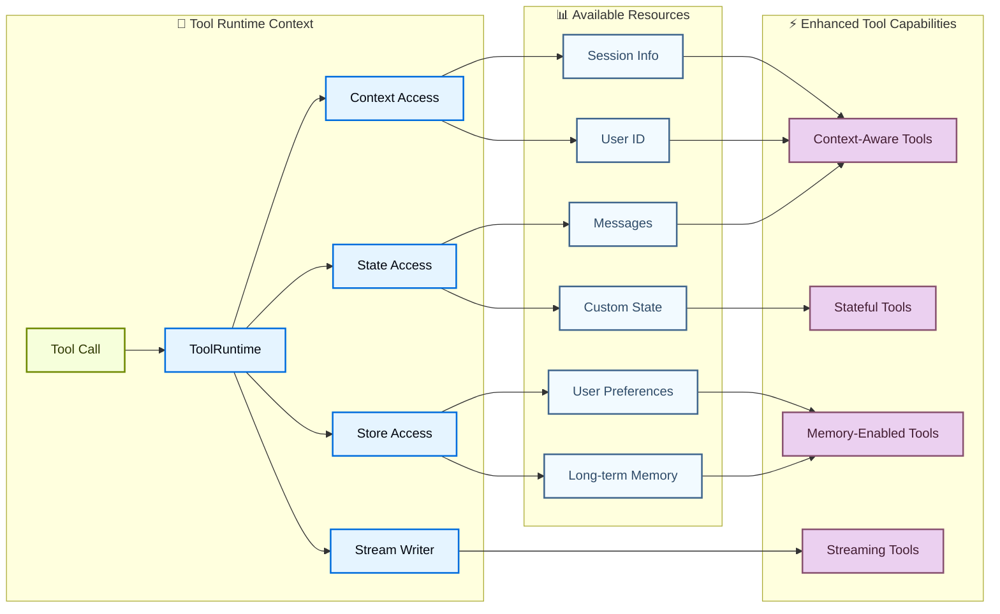

import ToolReturnValuesPy from '/snippets/code-samples/tool-return-values-py.mdx';
import ToolReturnValuesJs from '/snippets/code-samples/tool-return-values-js.mdx';
import ToolReturnObjectPy from '/snippets/code-samples/tool-return-object-py.mdx';
import ToolReturnObjectJs from '/snippets/code-samples/tool-return-object-js.mdx';
import ToolReturnCommandPy from '/snippets/code-samples/tool-return-command-py.mdx';
import ToolReturnCommandJs from '/snippets/code-samples/tool-return-command-js.mdx';
import ToolUpdateStatePy from '/snippets/code-samples/tool-update-state-py.mdx';

工具扩展了[代理](/oss/langchain/agents)的能力——使它们能够获取实时数据、执行代码、查询外部数据库并在现实世界中执行操作。

从本质上讲，工具是具有明确定义输入和输出的可调用函数，这些函数被传递给[聊天模型](/oss/langchain/models)。模型根据对话上下文决定何时调用工具，以及提供什么输入参数。

<Tip>
    有关模型如何处理工具调用的详细信息，请参阅[工具调用](/oss/langchain/models#tool-calling)。
</Tip>

## 创建工具

### 基本工具定义

:::python
创建工具最简单的方法是使用 @[`@tool`] 装饰器。默认情况下，函数的文档字符串成为工具的描述，帮助模型理解何时使用它：

```python
from langchain.tools import tool

@tool
def search_database(query: str, limit: int = 10) -> str:
    """Search the customer database for records matching the query.

    Args:
        query: Search terms to look for
        limit: Maximum number of results to return
    """
    return f"Found {limit} results for '{query}'"
```

类型提示**是必需的**，因为它们定义了工具的输入模式。文档字符串应该是信息性的且简洁的，以帮助模型理解工具的用途。
:::

:::js
创建工具最简单的方法是从 `langchain` 包导入 `tool` 函数。您可以使用 [zod](https://zod.dev/) 来定义工具的输入模式：

```ts
import * as z from "zod"
import { tool } from "langchain"

const searchDatabase = tool(
  ({ query, limit }) => `Found ${limit} results for '${query}'`,
  {
    name: "search_database",
    description: "Search the customer database for records matching the query.",
    schema: z.object({
      query: z.string().describe("Search terms to look for"),
      limit: z.number().describe("Maximum number of results to return"),
    }),
  }
);
```

:::

<Note>
    **服务端工具使用：** 某些聊天模型具有内置工具（网络搜索、代码解释器），这些工具在提供商端执行。请参阅[服务端工具使用](#server-side-tool-use)了解更多详情。
</Note>

<Warning>
    工具名称首选 `snake_case`（例如，使用 `web_search` 而不是 `Web Search`）。某些模型提供商对包含空格或特殊字符的名称有问题或会拒绝使用。坚持使用字母数字字符、下划线和连字符有助于提高跨提供商的兼容性。
</Warning>

:::python

### 自定义工具属性

#### 自定义工具名称

默认情况下，工具名称来自函数名称。当需要更描述性的名称时覆盖它：

```python
@tool("web_search")  # 自定义名称
def search(query: str) -> str:
    """Search the web for information."""
    return f"Results for: {query}"

print(search.name)  # web_search
```

#### 自定义工具描述

覆盖自动生成的工具描述以获得更清晰的模型指导：

```python
@tool("calculator", description="Performs arithmetic calculations. Use this for any math problems.")
def calc(expression: str) -> str:
    """Evaluate mathematical expressions."""
    return str(eval(expression))
```

### 高级模式定义

使用 Pydantic 模型或 JSON schema 定义复杂输入：

<CodeGroup>
    ```python Pydantic 模型
    from pydantic import BaseModel, Field
    from typing import Literal

    class WeatherInput(BaseModel):
        """Input for weather queries."""
        location: str = Field(description="City name or coordinates")
        units: Literal["celsius", "fahrenheit"] = Field(
            default="celsius",
            description="Temperature unit preference"
        )
        include_forecast: bool = Field(
            default=False,
            description="Include 5-day forecast"
        )

    @tool(args_schema=WeatherInput)
    def get_weather(location: str, units: str = "celsius", include_forecast: bool = False) -> str:
        """Get current weather and optional forecast."""
        temp = 22 if units == "celsius" else 72
        result = f"Current weather in {location}: {temp} degrees {units[0].upper()}"
        if include_forecast:
            result += "\nNext 5 days: Sunny"
        return result
    ```

    ```python JSON Schema
    weather_schema = {
        "type": "object",
        "properties": {
            "location": {"type": "string"},
            "units": {"type": "string"},
            "include_forecast": {"type": "boolean"}
        },
        "required": ["location", "units", "include_forecast"]
    }

    @tool(args_schema=weather_schema)
    def get_weather(location: str, units: str = "celsius", include_forecast: bool = False) -> str:
        """Get current weather and optional forecast."""
        temp = 22 if units == "celsius" else 72
        result = f"Current weather in {location}: {temp} degrees {units[0].upper()}"
        if include_forecast:
            result += "\nNext 5 days: Sunny"
        return result
    ```
</CodeGroup>

### 保留参数名称

以下参数名称是保留的，不能用作工具参数。使用这些名称将导致运行时错误。

| 参数名称 | 用途 |
|----------------|---------|
| `config` | 保留用于在内部传递 `RunnableConfig` 给工具 |
| `runtime` | 保留用于 `ToolRuntime` 参数（访问状态、上下文、存储） |

要访问运行时信息，请使用 @[`ToolRuntime`] 参数，而不是将您自己的参数命名为 `config` 或 `runtime`。
:::

## 访问上下文

工具在能够访问运行时信息（如对话历史、用户数据和持久化内存）时最强大。本节介绍如何从工具内部访问和更新这些信息。

:::python
工具可以通过 @[`ToolRuntime`] 参数访问运行时信息，它提供：

| 组件 | 描述 | 用例 |
|-----------|-------------|----------|
| **State** | 短期记忆 - 存在于当前对话期间的可变数据（消息、计数器、自定义字段） | 访问对话历史、跟踪工具调用次数 |
| **Context** | 在调用时传递的不可变配置（用户 ID、会话信息） | 根据用户身份个性化响应 |
| **Store** | 长期记忆 - 跨对话持久化的数据 | 保存用户偏好、维护知识库 |
| **Stream Writer** | 在工具执行期间发出实时更新 | 显示长时间运行操作的进度 |
| **Execution Info** | 当前执行的标识和重试信息（线程 ID、运行 ID、重试次数） | 访问线程/运行 ID、根据重试状态调整行为 |
| **Server Info** | 在 LangGraph Server 上运行时服务器特定的元数据（助手 ID、图 ID、认证用户） | 访问助手 ID、图 ID 或认证用户信息 |
| **Config** | 执行的 @[`RunnableConfig`] | 访问回调、标签和元数据 |
| **Tool Call ID** | 当前工具调用的唯一标识符 | 关联日志和模型调用的工具调用 |



### 短期记忆（状态）

状态表示存在于对话持续时间内的短期记忆。它包括消息历史和您在[图状态](/oss/langgraph/graph-api#state)中定义的任何自定义字段。

<Info>
    在您的工具签名中添加 `runtime: ToolRuntime` 以访问状态。此参数自动注入并对大型语言模型隐藏——它不会出现在工具的模式中。
</Info>

#### 访问状态

工具可以使用 `runtime.state` 访问当前对话状态：

```python
from langchain.tools import tool, ToolRuntime
from langchain.messages import HumanMessage

@tool
def get_last_user_message(runtime: ToolRuntime) -> str:
    """Get the most recent message from the user."""
    messages = runtime.state["messages"]

    # Find the last human message
    for message in reversed(messages):
        if isinstance(message, HumanMessage):
            return message.content

    return "No user messages found"

# Access custom state fields
@tool
def get_user_preference(
    pref_name: str,
    runtime: ToolRuntime
) -> str:
    """Get a user preference value."""
    preferences = runtime.state.get("user_preferences", {})
    return preferences.get(pref_name, "Not set")
```

<Warning>
    `runtime` 参数对模型隐藏。在上面的示例中，模型只能在工具模式中看到 `pref_name`。
</Warning>

#### 更新状态

使用 @[`Command`] 更新代理的状态。这对于需要更新自定义状态字段的工具很有用。
在更新中包含一个 `ToolMessage`，以便模型可以看到工具调用的结果：

<ToolUpdateStatePy />

<Tip>
    当工具更新状态变量时，考虑为那些字段定义一个 [reducer](/oss/langgraph/graph-api#reducers)。由于大型语言模型可以并行调用多个工具，reducer 决定了当同一个状态字段被并发工具调用更新时如何解决冲突。
</Tip>
:::

### 上下文

上下文提供在调用时传递的不可变配置数据。将其用于用户 ID、会话详情或不应在对话期间更改的应用程序特定设置。

:::python
通过 `runtime.context` 访问上下文：

```python
from dataclasses import dataclass
from langchain_openai import ChatOpenAI
from langchain.agents import create_agent
from langchain.tools import tool, ToolRuntime


USER_DATABASE = {
    "user123": {
        "name": "Alice Johnson",
        "account_type": "Premium",
        "balance": 5000,
        "email": "alice@example.com"
    },
    "user456": {
        "name": "Bob Smith",
        "account_type": "Standard",
        "balance": 1200,
        "email": "bob@example.com"
    }
}

@dataclass
class UserContext:
    user_id: str

@tool
def get_account_info(runtime: ToolRuntime[UserContext]) -> str:
    """Get the current user's account information."""
    user_id = runtime.context.user_id

    if user_id in USER_DATABASE:
        user = USER_DATABASE[user_id]
        return f"Account holder: {user['name']}\nType: {user['account_type']}\nBalance: ${user['balance']}"
    return "User not found"

model = ChatOpenAI(model="gpt-5.4")
agent = create_agent(
    model,
    tools=[get_account_info],
    context_schema=UserContext,
    system_prompt="You are a financial assistant."
)

result = agent.invoke(
    {"messages": [{"role": "user", "content": "What's my current balance?"}]},
    context=UserContext(user_id="user123")
)
```

:::

:::js
工具可以通过 `config` 参数访问代理的运行时上下文：

```ts
import * as z from "zod"
import { ChatOpenAI } from "@langchain/openai"
import { createAgent } from "langchain"

const getUserName = tool(
  (_, config) => {
    return config.context.user_name
  },
  {
    name: "get_user_name",
    description: "Get the user's name.",
    schema: z.object({}),
  }
);

const contextSchema = z.object({
  user_name: z.string(),
});

const agent = createAgent({
  model: new ChatOpenAI({ model: "gpt-5.4" }),
  tools: [getUserName],
  contextSchema,
});

const result = await agent.invoke(
  {
    messages: [{ role: "user", content: "What is my name?" }]
  },
  {
    context: { user_name: "John Smith" }
  }
);
```

:::

### 长期记忆（存储）

@[`BaseStore`] 提供跨对话持久化的存储。与状态（短期记忆）不同，保存到存储的数据在未来的会话中仍然可用。

:::python
通过 `runtime.store` 访问存储。存储使用命名空间/键模式来组织数据：

<Tip>
    对于生产部署，请使用持久化存储实现（如 @[`PostgresStore`]）而不是 `InMemoryStore`。请参阅[内存文档](/oss/langgraph/add-memory)了解设置详情。
</Tip>

```python expandable
from typing import Any
from langgraph.store.memory import InMemoryStore
from langchain.agents import create_agent
from langchain.tools import tool, ToolRuntime
from langchain_openai import ChatOpenAI

# Access memory
@tool
def get_user_info(user_id: str, runtime: ToolRuntime) -> str:
    """Look up user info."""
    store = runtime.store
    user_info = store.get(("users",), user_id)
    return str(user_info.value) if user_info else "Unknown user"

# Update memory
@tool
def save_user_info(user_id: str, user_info: dict[str, Any], runtime: ToolRuntime) -> str:
    """Save user info."""
    store = runtime.store
    store.put(("users",), user_id, user_info)
    return "Successfully saved user info."

model = ChatOpenAI(model="gpt-5.4")

store = InMemoryStore()
agent = create_agent(
    model,
    tools=[get_user_info, save_user_info],
    store=store
)

# First session: save user info
agent.invoke({
    "messages": [{"role": "user", "content": "Save the following user: userid: abc123, name: Foo, age: 25, email: foo@langchain.dev"}]
})

# Second session: get user info
agent.invoke({
    "messages": [{"role": "user", "content": "Get user info for user with id 'abc123'"}]
})
# Here is the user info for user with ID "abc123":
# - Name: Foo
# - Age: 25
# - Email: foo@langchain.dev
```

:::

:::js
通过 `config.store` 访问存储。存储使用命名空间/键模式来组织数据：

```ts expandable
import * as z from "zod";
import { createAgent, tool } from "langchain";
import { InMemoryStore } from "@langchain/langgraph";
import { ChatOpenAI } from "@langchain/openai";

const store = new InMemoryStore();

// Access memory
const getUserInfo = tool(
  async ({ user_id }) => {
    const value = await store.get(["users"], user_id);
    console.log("get_user_info", user_id, value);
    return value;
  },
  {
    name: "get_user_info",
    description: "Look up user info.",
    schema: z.object({
      user_id: z.string(),
    }),
  }
);

// Update memory
const saveUserInfo = tool(
  async ({ user_id, name, age, email }) => {
    console.log("save_user_info", user_id, name, age, email);
    await store.put(["users"], user_id, { name, age, email });
    return "Successfully saved user info.";
  },
  {
    name: "save_user_info",
    description: "Save user info.",
    schema: z.object({
      user_id: z.string(),
      name: z.string(),
      age: z.number(),
      email: z.string(),
    }),
  }
);

const agent = createAgent({
  model: new ChatOpenAI({ model: "gpt-5.4" }),
  tools: [getUserInfo, saveUserInfo],
  store,
});

// First session: save user info
await agent.invoke({
  messages: [
    {
      role: "user",
      content: "Save the following user: userid: abc123, name: Foo, age: 25, email: foo@langchain.dev",
    },
  ],
});

// Second session: get user info
const result = await agent.invoke({
  messages: [
    { role: "user", content: "Get user info for user with id 'abc123'" },
  ],
});

console.log(result);
// Here is the user info for user with ID "abc123":
// - Name: Foo
// - Age: 25
// - Email: foo@langchain.dev
```

:::

### 流写入器

在执行期间从工具流式传输实时更新。这对于在长时间运行的操作期间向用户提供进度反馈很有用。

:::python
使用 `runtime.stream_writer` 发出自定义更新：

```python
from langchain.tools import tool, ToolRuntime

@tool
def get_weather(city: str, runtime: ToolRuntime) -> str:
    """Get weather for a given city."""
    writer = runtime.stream_writer

    # Stream custom updates as the tool executes
    writer(f"Looking up data for city: {city}")
    writer(f"Acquired data for city: {city}")

    return f"It's always sunny in {city}!"
```

<Note>
如果您在工具内使用 `runtime.stream_writer`，则该工具必须在 LangGraph 执行上下文中调用。请参阅[流式处理](/oss/langchain/streaming)了解更多详情。
</Note>
:::

:::js
使用 `config.writer` 发出自定义更新：

```ts
import * as z from "zod";
import { tool, ToolRuntime } from "langchain";

const getWeather = tool(
  ({ city }, config: ToolRuntime) => {
    const writer = config.writer;

    // Stream custom updates as the tool executes
    if (writer) {
      writer(`Looking up data for city: ${city}`);
      writer(`Acquired data for city: ${city}`);
    }

    return `It's always sunny in ${city}!`;
  },
  {
    name: "get_weather",
    description: "Get weather for a given city.",
    schema: z.object({
      city: z.string(),
    }),
  }
);
```

:::

### 执行信息

通过 `runtime.execution_info` 从工具内部访问线程 ID、运行 ID 和重试状态：

:::python
```python
from langchain.tools import tool, ToolRuntime

@tool
def log_execution_context(runtime: ToolRuntime) -> str:
    """Log execution identity information."""
    info = runtime.execution_info
    print(f"Thread: {info.thread_id}, Run: {info.run_id}")  # [!code highlight]
    print(f"Attempt: {info.node_attempt}")
    return "done"
```
:::

:::js
```ts
import { tool } from "langchain";
import * as z from "zod";

const logExecutionContext = tool(
  async (_input, runtime) => {
    const info = runtime.executionInfo;
    console.log(`Thread: ${info.threadId}, Run: ${info.runId}`);  // [!code highlight]
    console.log(`Attempt: ${info.nodeAttempt}`);
    return "done";
  },
  {
    name: "log_execution_context",
    description: "Log execution identity information.",
    schema: z.object({}),
  }
);
```
:::

:::python
<Note>
需要 `deepagents>=0.5.0`（或 `langgraph>=1.1.5`）。
</Note>
:::

:::js
<Note>
需要 `deepagents>=1.9.0`（或 `@langchain/langgraph>=1.2.8`）。
</Note>
:::

### 服务器信息

当您的工具在 LangGraph Server 上运行时，通过 `runtime.server_info` 访问助手 ID、图 ID 和认证用户：

:::python
```python
from langchain.tools import tool, ToolRuntime

@tool
def get_assistant_scoped_data(runtime: ToolRuntime) -> str:
    """Fetch data scoped to the current assistant."""
    server = runtime.server_info
    if server is not None:
        print(f"Assistant: {server.assistant_id}, Graph: {server.graph_id}")  # [!code highlight]
        if server.user is not None:
            print(f"User: {server.user.identity}")  # [!code highlight]
    return "done"
```

当工具不在 LangGraph Server 上运行时（例如在本地开发或测试期间），`server_info` 为 `None`。
:::

:::js
```ts
import { tool } from "langchain";
import * as z from "zod";

const getAssistantScopedData = tool(
  async (_input, runtime) => {
    const server = runtime.serverInfo;
    if (server != null) {
      console.log(`Assistant: ${server.assistantId}, Graph: ${server.graphId}`);  // [!code highlight]
      if (server.user != null) {
        console.log(`User: ${server.user.identity}`);  // [!code highlight]
      }
    }
    return "done";
  },
  {
    name: "get_assistant_scoped_data",
    description: "Fetch data scoped to the current assistant.",
    schema: z.object({}),
  }
);
```

当工具不在 LangGraph Server 上运行时，`serverInfo` 为 `null`。
:::

:::python
<Note>
需要 `deepagents>=0.5.0`（或 `langgraph>=1.1.5`）。
</Note>
:::

:::js
<Note>
需要 `deepagents>=1.9.0`（或 `@langchain/langgraph>=1.2.8`）。
</Note>
:::

## ToolNode

@[`ToolNode`] 是一个预构建的节点，用于在 LangGraph 工作流中执行工具。它自动处理并行工具执行、错误处理和状态注入。

<Info>
    对于需要细粒度控制工具执行模式的自定义工作流，请使用 @[`ToolNode`] 而不是 @[`create_agent`]。它是驱动代理工具执行的构建块。
</Info>

### 基本用法

:::python

```python
from langchain.tools import tool
from langgraph.prebuilt import ToolNode
from langgraph.graph import StateGraph, MessagesState, START, END

@tool
def search(query: str) -> str:
    """Search for information."""
    return f"Results for: {query}"

@tool
def calculator(expression: str) -> str:
    """Evaluate a math expression."""
    return str(eval(expression))

# Create the ToolNode with your tools
tool_node = ToolNode([search, calculator])

# Use in a graph
builder = StateGraph(MessagesState)
builder.add_node("tools", tool_node)
# ... add other nodes and edges
```

:::

:::js

```typescript
import { ToolNode } from "@langchain/langgraph/prebuilt";
import { tool } from "@langchain/core/tools";
import * as z from "zod";

const search = tool(
  ({ query }) => `Results for: ${query}`,
  {
    name: "search",
    description: "Search for information.",
    schema: z.object({ query: z.string() }),
  }
);

const calculator = tool(
  ({ expression }) => String(eval(expression)),
  {
    name: "calculator",
    description: "Evaluate a math expression.",
    schema: z.object({ expression: z.string() }),
  }
);

// Create the ToolNode with your tools
const toolNode = new ToolNode([search, calculator]);
```

:::

### 工具返回值

您可以为您的工具选择不同的返回值：

- 返回一个 `string` 用于人类可读的模型结果。
- 返回一个 `object` 用于模型应该解析的结构化结果。
- 当需要写入状态时，返回一个带可选消息的 `Command`。

#### 返回字符串

当工具应该提供纯文本供模型阅读并在下一个响应中使用时返回字符串。

:::python

<ToolReturnValuesPy />

:::

:::js

<ToolReturnValuesJs />

:::

行为：

- 返回值被转换为 `ToolMessage`。
- 模型看到该文本并决定下一步做什么。
- 除非模型或另一个工具稍后这样做，否则不会更改代理状态字段。

当结果本质上是人类可读的文本时使用此方法。

#### 返回对象

当您的工具产生模型应该检查的结构化数据时返回对象（例如 `dict`）。

:::python

<ToolReturnObjectPy />

:::

:::js

<ToolReturnObjectJs />

:::

行为：

- 对象被序列化并作为工具输出发送回。
- 模型可以读取特定字段并对其进行推理。
- 与字符串返回一样，这不会直接更新图状态。

当下游推理受益于显式字段而不是自由形式文本时使用此方法。

#### 返回 Command

当工具需要更新图状态（例如设置用户偏好或应用状态）时返回 @[`Command`]。您可以带或不带 `ToolMessage` 返回 `Command`。如果模型需要看到工具成功（例如确认偏好更改），请在更新中包含一个 `ToolMessage`，使用 `runtime.tool_call_id` 作为 `tool_call_id` 参数。

:::python

<ToolReturnCommandPy />

:::

:::js

<ToolReturnCommandJs />

:::

行为：

- 该命令使用 `update` 更新状态。
- 更新后的状态在同一运行的后续步骤中可用。
- 对可能由并行工具调用更新的字段使用 reducer。

当工具不只是返回数据，而且还改变代理状态时使用此方法。

### 错误处理

配置工具错误的处理方式。请参阅 @[`ToolNode`] API 参考了解所有选项。

:::python

```python
from langgraph.prebuilt import ToolNode

# Default: catch invocation errors, re-raise execution errors
tool_node = ToolNode(tools)

# Catch all errors and return error message to LLM
tool_node = ToolNode(tools, handle_tool_errors=True)

# Custom error message
tool_node = ToolNode(tools, handle_tool_errors="Something went wrong, please try again.")

# Custom error handler
def handle_error(e: ValueError) -> str:
    return f"Invalid input: {e}"

tool_node = ToolNode(tools, handle_tool_errors=handle_error)

# Only catch specific exception types
tool_node = ToolNode(tools, handle_tool_errors=(ValueError, TypeError))
```

:::

:::js

```typescript
import { ToolNode } from "@langchain/langgraph/prebuilt";

// Default behavior
const toolNode = new ToolNode(tools);

// Catch all errors
const toolNode = new ToolNode(tools, { handleToolErrors: true });

// Custom error message
const toolNode = new ToolNode(tools, {
  handleToolErrors: "Something went wrong, please try again."
});
```

:::

### 使用 tools_condition 路由

使用 @[`tools_condition`] 进行基于大型语言模型是否进行工具调用的条件路由：

:::python

```python
from langgraph.prebuilt import ToolNode, tools_condition
from langgraph.graph import StateGraph, MessagesState, START, END

builder = StateGraph(MessagesState)
builder.add_node("llm", call_llm)
builder.add_node("tools", ToolNode(tools))

builder.add_edge(START, "llm")
builder.add_conditional_edges("llm", tools_condition)  # Routes to "tools" or END
builder.add_edge("tools", "llm")

graph = builder.compile()
```

:::

:::js

```typescript
import { ToolNode, toolsCondition } from "@langchain/langgraph/prebuilt";
import { StateGraph, MessagesAnnotation } from "@langchain/langgraph";

const builder = new StateGraph(MessagesAnnotation)
  .addNode("llm", callLlm)
  .addNode("tools", new ToolNode(tools))
  .addEdge("__start__", "llm")
  .addConditionalEdges("llm", toolsCondition)  // Routes to "tools" or "__end__"
  .addEdge("tools", "llm");

const graph = builder.compile();
```

:::

### 状态注入

工具可以通过 @[`ToolRuntime`] 访问当前图状态：

:::python

```python
from langchain.tools import tool, ToolRuntime
from langgraph.prebuilt import ToolNode

@tool
def get_message_count(runtime: ToolRuntime) -> str:
    """Get the number of messages in the conversation."""
    messages = runtime.state["messages"]
    return f"There are {len(messages)} messages."

tool_node = ToolNode([get_message_count])
```

:::

有关从工具访问状态、上下文和长期记忆的更多详细信息，请参阅[访问上下文](#access-context)。

## 预构建工具

LangChain 为常见任务（如网络搜索、代码解释、数据库访问等）提供了大量预构建工具和工具包。这些现成的工具可以直接集成到您的代理中，无需编写自定义代码。

请参阅[工具和工具包](/oss/integrations/tools)集成页面获取按类别组织的可用工具完整列表。

## 服务端工具使用

某些聊天模型具有内置工具，在模型提供商端执行。这些包括网络搜索和代码解释器等功能，无需您定义或托管工具逻辑。

有关启用和使用这些内置工具的详细信息，请参阅各个[聊天模型集成页面](/oss/integrations/providers)和[工具调用文档](/oss/langchain/models#server-side-tool-use)。