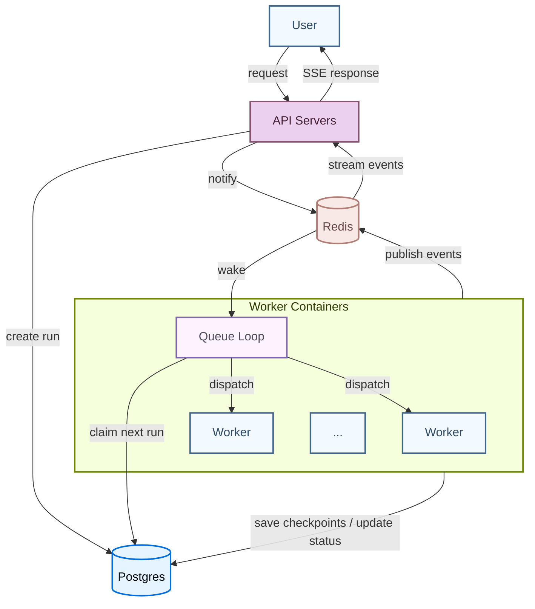

LangSmith 部署的 **Agent Server** 提供了一个用于创建和管理基于代理的应用程序的 API。它基于[助手](/langsmith/assistants)的概念构建，助手是为特定任务配置的代理，包括内置的[持久化](/oss/python/langgraph/persistence#memory-store)和[**任务队列**](#task-queue)。这个多功能 API 支持广泛的代理应用程序用例，从后台处理到实时交互。

使用 Agent Server 创建和管理：

<CardGroup cols={4}>
  <Card title="Assistants" icon="robot" href="/langsmith/assistants" />
  <Card title="Threads" icon="messages" href="/langsmith/use-threads" />
  <Card title="Runs" icon="player-play" href="/langsmith/runs" />
  <Card title="Cron jobs" icon="clock" href="/langsmith/cron-jobs" />
</CardGroup>

<Tip>
**API 参考**  
有关 API 端点和数据模型的详细信息，请参阅 [Agent Server API 参考](/langsmith/server-api-ref)。
</Tip>

## 应用程序结构

要部署 Agent Server 应用程序，您需要指定要部署的图，以及任何相关的配置设置，例如依赖项和环境变量。

阅读[应用程序结构](/langsmith/application-structure)指南，了解如何构建您的 LangGraph 应用程序以进行部署。

<Note>
[LangSmith 云](/langsmith/cloud) 为您管理数据库。如果您要部署在[自己的基础设施](/langsmith/self-hosted)上，您需要自己设置。
</Note>

## 部署的组成部分

当您部署 Agent Server 时，您部署的是一个或多个[图](#graphs)、用于[持久化](/oss/python/langgraph/persistence)的数据库，以及一个[任务队列](#task-queue)。

### 图

当您使用 Agent Server 部署图时，您正在部署一个[助手](/langsmith/assistants)的"蓝图"。

图最常实现[代理](/oss/python/langgraph/workflows-agents)，但并非必须如此。例如，图可以实现一个简单的聊天机器人，仅支持来回对话，而无法影响任何应用程序控制流。实际上，随着应用程序变得复杂，图通常会实现更复杂的流程，可能使用[多个代理](/oss/python/langchain/multi-agent)协同工作。

图不必使用 LangGraph 编写。您也可以使用 LangGraph 函数式 API 部署使用其他框架构建的代理，例如 Strands 或 Google ADK。有关详细信息，请参阅[部署其他框架](/langsmith/deploy-other-frameworks)。

#### 图加载和编译

您的图如何以及何时编译取决于您如何在[应用程序结构](/langsmith/application-structure)中注册它：

1. **编译图**（推荐）：导出一个已经编译的 `CompiledGraph` 实例。服务器在容器启动时加载一次，并重用于每次运行——每个请求没有编译开销。
2. **工厂函数**：导出一个代理工厂函数，服务器在需要图时调用它。仅在需要每次运行的图自定义时使用（例如，根据助手配置选择不同的模型或工具）。保持工厂函数轻量级，因为它们在每次调用时都会运行。

<Tip>
除非您特别需要每次运行的定制，否则使用编译图。工厂函数在每次调用时都会增加开销；编译图不会。
</Tip>

在这两种情况下，服务器都会在运行时自动注入为该部署配置的状态持久化和内存存储。**不要在您的图代码中配置这些**，因为服务器需要为其他操作管理它们。

### 持久化

Agent Server 持久化三种类型的数据，默认都使用 [PostgreSQL](https://www.postgresql.org/) 作为后端：

- **核心资源数据**：助手、线程、运行和 cron 作业。始终存储在 PostgreSQL 中。
- **检查点（短期记忆）**：每一步写入的图执行状态快照。它们使运行持久化：如果工作线程被中断，运行可以从最后一个检查点恢复，而不是从头开始。持久化模式控制检查点频率——`async`（默认）在每一步之后写入；`exit` 仅存储最终状态。LangSmith 默认将其存储在 PostgreSQL 中；但您可以切换到 [MongoDB](https://www.mongodb.com/) 或自定义实现。有关详细信息，请参阅[配置检查点后端](/langsmith/configure-checkpointer)。
- **存储（长期记忆）**：跨线程持久化的记忆，使代理能够保留独立对话之间的信息。默认存储在 PostgreSQL 中，但可以替换为自定义实现。有关详细信息，请参阅[添加自定义存储](/langsmith/custom-store)。

### 任务队列

当客户端创建运行时，API 服务器将其加入队列，队列工作线程拾取它执行。工作线程也可以被信号取消正在进行的运行，并发布输出事件，实时地将 `/stream` 连接转发给客户端。

[Redis](https://redis.io/) 处理 API 服务器和队列工作线程之间的信号、取消和流式发布/订阅。Redis 仅存储临时数据——没有用户或运行数据持久化在 Redis 中。运行数据本身始终从 PostgreSQL 读取和写入。

有关如何设置和管理这些组件的更多信息，请查看[托管选项](/langsmith/platform-setup)指南。

## 运行时架构

### 部署模式

Agent Server 支持三种运行时配置：

- **单主机**：API 服务器直接管理任务队列，没有单独的队列工作线程。这是自托管部署的默认模式，适合开发和低流量用例。
- **分离 API 和队列**：专用队列工作线程在与 API 服务器独立的主机上处理运行执行。对于自托管部署，通过在配置中设置 `queue.enabled: true` 来启用此模式。每个层级独立扩展——API 服务器根据请求量扩展，队列工作线程根据待处理运行数扩展。
- **分布式运行时**：API 和队列进程再次独立运行，但分布式运行时不是使用单个队列进程处理图的编排和执行，而是使用一个进程进行编排，一个进程进行执行。对于具有高并发需求的大规模部署，请使用此模式。

下面描述的容器架构和运行生命周期适用于单主机和分离 API 和队列配置。

### 容器架构

典型的部署由两种长期运行的容器组成，都从同一个 Docker 镜像构建（一个安装了项目代码的基础镜像）：

- **API 服务器**处理客户端请求（创建运行、读取线程状态、流式传输结果），但不自己执行代理代码。
- **队列工作线程**是执行引擎。它们监听持久化任务队列，执行您的图代码，并写入检查点。

容器是**无状态的**但持久的。至少必须有 1 个队列工作线程随时监听任务队列，以确保不会丢失任何运行。容器可以在其生命周期内提供许多运行。

API 服务器和队列工作线程是单独的容器池，可以[独立扩展](/langsmith/data-plane#autoscaling)。

### 运行执行生命周期

当您调用运行时，请求流经几个组件：

1. 客户端向 API 服务器发送请求，API 服务器在持久化任务队列中创建一个待处理的运行。
2. 队列工作线程拾取运行，获取其租约，加载适当的图，并开始执行。队列强制在任何给定时刻最多只能执行一个给定线程的运行。
3. 当图执行时，工作线程将检查点写入持久化层（频率取决于[持久化模式](/oss/python/langgraph/durable-execution#durability-modes)），并通过配置的发布/订阅提供者广播流式事件。
4. 如果客户端打开了 `/stream` 连接，API 服务器订阅发布/订阅通道并通过服务器发送的事件实时将事件转发给客户端。
5. 当执行完成时，工作线程更新运行状态并释放其槽位以供下一个运行使用。

每个工作线程同时处理最多 [`N_JOBS_PER_WORKER`](/langsmith/env-var#n_jobs_per_worker) 个运行（默认：10），因此单个工作线程容器可以并行提供许多运行。请参阅[为扩展配置 Agent Server](/langsmith/agent-server-scale) 获取调优指导。

## 了解更多

- [应用程序结构](/langsmith/application-structure)指南说明了如何构建您的应用程序以进行部署。
- [API 参考](https://docs.langchain.com/langsmith/server-api-ref) 提供了有关 API 端点和数据模型的详细信息。

---

<Callout icon="terminal-2">
    [Connect these docs](/use-these-docs) to Claude, VSCode, and more via MCP for real-time answers.
</Callout>
<Callout icon="edit">
    [Edit this page on GitHub](https://github.com/langchain-ai/docs/edit/main/src/langsmith\agent-server.mdx) or [file an issue](https://github.com/langchain-ai/docs/issues/new/choose).
</Callout>

