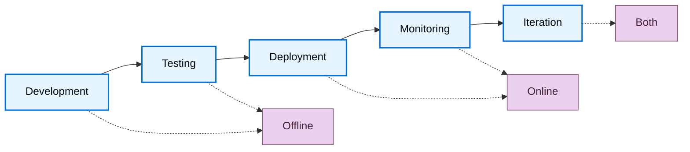

LLM 输出是非确定性的，这使得响应质量难以评估。评估（evals）是一种分解什么是"好"并对其进行衡量的方法。LangSmith 评估提供了一个在整个应用程序生命周期中衡量质量的框架，从部署前测试到生产监控。

## 评估什么

在构建评估之前，识别对您的应用程序重要的内容。将您的系统分解为其关键组件——LLM 调用、检索步骤、工具调用、输出格式——并为每个组件确定质量标准。

**从手动策划的示例开始。** 为每个关键组件创建 5-10 个"好"的示例。这些示例作为您的地面真实值，并告知使用哪些评估方法。例如：
- **RAG 系统**：良好检索（相关文档）和良好答案（准确、完整）的示例。
- **代理**：正确工具选择和适当参数格式或代理采取的轨迹的示例。
- **聊天机器人**：有帮助的、符合品牌调性的响应示例，这些响应解决了用户意图。

一旦您通过示例定义了"好"，您就可以衡量您的系统多久产生一次类似质量的输出。

## 离线评估和在线评估

LangSmith 支持两种类型的评估，它们在您的工作流程中服务不同目的：

### 离线评估

<Icon icon="flask" iconType="solid" /> 使用离线评估进行 **部署前测试**：
- **基准测试**：比较多个版本以找到最佳性能。
- **回归测试**：确保新版本不会降低质量。
- **单元测试**：验证各个组件的正确性。
- **回测**：根据历史数据测试新版本。

离线评估针对来自[_数据集_](#datasets)的[_示例_](#examples)：带有定义"好"的参考输出的策划测试用例。

### 在线评估

<Icon icon="radar" iconType="solid" /> 使用在线评估进行 **生产监控**：
- **实时监控**：在实时流量上持续跟踪质量。
- **异常检测**：标记异常模式或边缘情况。
- **生产反馈**：识别要添加到离线数据集的问题。

在线评估针对来自[追踪](/langsmith/observability-quickstart)的[_运行_](#runs)和[_线程_](#threads)：没有参考输出的真实生产追踪。

目标的这种差异决定了您可以评估什么：离线评估可以对照预期答案检查正确性，而在线评估则专注于质量模式、安全性和真实世界行为。

## 评估生命周期

随着您开发和[部署您的应用程序](/langsmith/deployment)，您的评估策略从部署前测试发展到生产监控。在开发和测试期间，离线评估根据策划数据集验证功能。部署后，在线评估监控实时流量上的生产行为。随着应用程序的成熟，两种评估类型在迭代反馈循环中协同工作，以持续提高质量。

### 1. 使用离线评估进行开发

在生产部署之前，使用离线评估来验证功能、基准测试不同方法并建立信心。

按照[快速入门](/langsmith/evaluation-quickstart)运行您的第一个离线评估。

### 2. 使用在线评估进行初始部署

部署后，使用在线评估来监控生产质量、检测意外问题并收集真实世界数据。

了解如何[配置在线评估](/langsmith/online-evaluations-llm-as-judge)以进行生产监控。

### 3. 持续改进

在迭代反馈循环中结合使用两种评估类型。在线评估暴露的问题成为离线测试用例，离线评估验证修复，在线评估确认生产改进。

## 核心评估目标

评估在不同的目标上运行，取决于是离线还是在线。

### 离线评估的目标

离线评估在数据集和示例上运行。参考输出的存在使得预期结果和实际结果之间的比较成为可能。

#### 数据集

数据集是用于评估应用程序的_示例集合_。示例是测试输入、参考输出对。

#### 示例

每个示例包含：

- **输入**：要传递给应用程序的输入变量字典。
- **参考输出**（可选）：参考输出的字典。这些不会传递给应用程序，它们仅在评估器中使用。
- **元数据**（可选）：可用于创建数据集过滤视图的其他信息的字典。

了解有关[管理数据集](/langsmith/manage-datasets)的更多信息。

#### 实验

_实验_ 代表在数据集上评估特定应用程序版本的结果。每个实验捕获数据集中每个示例的输出、评估器分数和执行追踪。

多个实验通常在给定数据集上运行，以测试不同的应用程序配置（例如，不同的提示词或 LLM）。LangSmith 显示与数据集关联的所有实验，并支持[并排比较多个实验](/langsmith/compare-experiment-results)。

了解[如何分析实验结果](/langsmith/analyze-an-experiment)。

### 在线评估的目标

在线评估在来自生产流量的运行和线程上运行。没有参考输出，评估器必须专注于实时检测问题、异常和质量下降。

#### 运行

_运行_ 是来自您[部署的应用程序](/langsmith/deployment)的单个执行追踪。每个运行包含：
- **输入**：您的应用程序收到的实际用户输入。
- **输出**：您的应用程序实际返回的内容。
- **中间步骤**：所有子运行（工具调用、LLM 调用等）。
- **元数据**：标签、用户反馈、延迟指标等。

与数据集中的示例不同，运行不包括参考输出。在线评估器必须在不知道"正确"答案应该是什么的情况下评估质量，而是依赖于质量启发式、安全检查和免参考评估技术。

了解有关[追踪中的运行和追踪的更多信息](/langsmith/observability-concepts#runs)。

#### 线程

_线程_ 是相关运行的集合，代表多轮对话。在线评估器可以在线程级别运行，以评估整个对话而不是单个回合。这使得能够评估对话级别的属性，如跨回合的一致性、主题维持和整个交互过程中的用户满意度。

## 评估器

_评估器_ 是对应用程序性能进行评分的 workspace 级资源。它们为离线评估和在线评估提供测量层，并根据可用数据调整其输入。因为评估器被限定在 workspace 范围内，您可以将单个评估器附加到多个追踪项目和数据集，而无需每次重新创建。

使用以下任一方式运行评估器：

- [评估器](/langsmith/evaluators)页面，将其附加到追踪项目或数据集
- [Playground](/langsmith/prompt-engineering-concepts#playground)
- LangSmith SDK（[Python](https://docs.smith.langchain.com/reference/python/reference) 和 [TypeScript](https://docs.smith.langchain.com/reference/js)）
- [规则](/langsmith/rules)，在追踪项目或数据集上自动运行它们

### 评估器输入

评估器输入因评估类型而异：

**离线评估器**接收：
- [示例](#examples)：来自您[数据集](#datasets)的示例，包含输入、参考输出和元数据。
- [运行](/langsmith/observability-concepts#runs)：在示例输入上运行应用程序产生的实际输出和中间步骤。

**在线评估器**接收：
- [运行](/langsmith/observability-concepts#runs)：包含输入、输出和中间步骤的生产追踪（没有参考输出）。

### 评估器输出

评估器返回**反馈**，即评估的分数。反馈是一个字典或字典列表。每个字典包含：

- `key`：指标名称。
- `score` | `value`：指标值（数值指标使用 `score`，分类指标使用 `value`）。
- `comment`（可选）：分数的附加推理或解释。

### 评估技术

LangSmith 支持多种评估方法：

- [人工](#human)
- [代码](#code)
- [LLM-as-judge](#llm-as-judge)
- [成对](#pairwise)

#### 人工

_人工评估_ 涉及手动审查应用程序输出和执行追踪。这种方法[通常是评估的有效起点](https://hamel.dev/blog/posts/evals/#looking-at-your-traces)。LangSmith 提供了审查应用程序输出和追踪（所有中间步骤）的工具。

**标注队列**

[标注队列](/langsmith/annotation-queues)简化了对运行的人工反馈的结构化收集。它们通过规定的评分标准、团队协作功能和进度跟踪来补充[内联标注](/langsmith/annotate-traces-inline)。

LangSmith 支持两种队列类型：

- **单运行队列**：根据自定义评分标准一次审查一个运行。用于分类问题或从生产追踪构建数据集。
- **成对队列**：并排比较两个运行来判断哪个更好。专为快速的 A/B 实验比较而设计。

主要功能包括为每个运行配置多个审阅者、启用预留以防止冲突，以及将标注的运行直接导出到数据集以供未来评估使用。

#### 代码

_代码评估器_ 是确定性的、基于规则的函数。它们适用于检查聊天机器人的响应结构不为空、生成的代码可以编译，或分类完全匹配等检查。

#### LLM-as-judge

_LLM-as-judge 评估器_ 使用 LLM 对应用程序输出进行评分。评分规则和标准通常在 LLM 提示词中编码。这些评估器可以是：

- **免参考**：检查输出是否包含冒犯性内容或符合特定标准。
- **基于参考**：与参考进行比较（例如，根据参考检查事实准确性）。

LLM-as-judge 评估器需要仔细审查分数和提示词调整。少样本评估器（在评分器提示词中包含输入、输出和预期等级的示例）通常可以提高性能。

了解有关[如何定义 LLM-as-a-judge 评估器](/langsmith/llm-as-judge)的更多信息。

#### 成对

_成对评估器_ 使用启发式（例如，哪个响应更长）、LLM（带有成对提示词）或人工审阅者比较两个应用程序版本的输出。

当直接评分输出困难但比较两个输出简单时，成对评估效果很好。例如，在摘要任务中，从两个摘要中选择信息量更大的一个通常比给单个摘要分配绝对分数更容易。

了解[如何运行成对评估](/langsmith/evaluate-pairwise)。

### 免参考评估器 vs 基于参考的评估器

理解评估器是否需要参考输出对于确定何时使用它至关重要。

**免参考评估器**在不与预期输出比较的情况下评估质量。这些适用于离线评估和在线评估：
- **安全检查**：毒性检测、PII 检测、内容策略违规
- **格式验证**：JSON 结构、必需字段、模式合规性
- **质量启发式**：响应长度、延迟、特定关键词
- **免参考 LLM-as-judge**：清晰度、一致性、有用性、语调

**基于参考的评估器**需要参考输出，仅适用于离线评估：
- **正确性**：与参考答案的语义相似性
- **事实准确性**：根据地面真实进行事实核查
- **精确匹配**：具有已知标签的分类任务
- **基于参考的 LLM-as-judge**：将输出质量与参考进行比较

在设计评估策略时，免参考评估器在离线测试和在线监控中提供一致性，而基于参考的评估器在开发期间实现更精确的正确性检查。

## 评估类型

LangSmith 支持用于开发和部署不同阶段的多种评估方法。了解何时使用每种类型有助于构建全面的评估策略。

离线评估和在线评估服务不同目的：
- **离线评估类型** 在带有参考输出的策划数据集上进行部署前测试
- **在线评估类型** 在没有参考输出的实时流量上监控生产行为

了解有关[评估类型及何时使用每种](/langsmith/evaluation-types)的更多信息。

## 最佳实践

### 构建数据集

构建数据集有多种策略：

**手动策划的示例**

这是推荐的起点。创建 10-20 个涵盖常见场景和边缘情况的高质量示例。这些示例定义了应用程序的"好"。

**历史追踪**

一旦投入生产，将真实追踪转换为示例。对于高流量应用程序：
- **用户反馈**：添加收到负面反馈的运行以进行测试。
- **启发式**：识别有趣的运行（例如，长延迟、错误）。
- **LLM 反馈**：使用 LLM 检测值得注意的对话。

**合成数据**

从现有示例生成其他示例。在从几个高质量、手工制作的示例作为模板开始时效果最好。

### 数据集组织

**分割**

分割是命名的数据子集，用于将示例分组。常见模式包括：

- **ML 风格分割**：将示例分成训练、验证和测试集以避免过拟合，其中模型在训练数据上表现良好但在未见数据上表现不佳。
- **基于类别的分割**：当数据集跨越多个任务类别时，分别评估不同的输入类型。
- **分阶段推出**：将探索性示例保持隔离，直到您准备好将它们包含在主要评估集中。

分割与元数据不同：使用分割进行高级组织分组以进行评估，元数据用于每个示例的信息，如标签和来源。

在机器学习中，最佳实践是每个示例属于恰好一个分割。LangSmith 允许示例属于多个分割，这在示例适合多个评估类别时很有用。

了解如何[创建和管理数据集分割](/langsmith/manage-datasets-in-application#create-and-manage-dataset-splits)。

**版本**

当示例更改时，LangSmith 会自动创建数据集[版本](/langsmith/manage-datasets#version-a-dataset)。[标记版本](/langsmith/manage-datasets#tag-a-version)以标记重要里程碑。在 CI 管道中定位特定版本，以确保数据集更新不会破坏工作流程。

### 人工反馈收集

人工反馈通常提供最有价值的评估，特别是对于主观质量维度。

**标注队列**

[标注队列](/langsmith/annotation-queues)实现人工反馈的结构化收集。标记特定运行以供审阅，在流线型界面中收集标注，并将标注的运行传输到数据集以供未来评估。

标注队列通过分组运行、指定标准和配置审阅者权限来补充[内联标注](/langsmith/annotate-traces-inline)。

### 评估与测试

测试和评估是相似但不同的概念。

**评估根据指标衡量性能**。指标可以是模糊的或主观的，在相对方面更有用。它们通常比较系统与彼此。

**测试断言正确性**。只有通过所有测试，系统才能部署。

评估指标可以转换为测试。例如，回归测试可以断言新版本必须在相关指标上优于基线版本。在系统运行昂贵时，一起运行测试和评估以提高效率。

评估可以使用标准测试工具编写，如 [pytest](/langsmith/pytest) 或 [Vitest/Jest](/langsmith/vitest-jest)。

## 快速参考：离线评估 vs 在线评估

下表总结了离线评估和在线评估之间的关键差异：

| | **离线评估** | **在线评估** |
|---|---|---|
| **运行于** | 数据集（示例） | 追踪项目（运行/线程） |
| **数据访问** | 输入、输出、参考输出 | 仅输入、输出 |
| **何时使用** | 部署前，开发期间 | 生产，部署后 |
| **主要用例** | 基准测试、单元测试、回归测试、回测 | 实时监控、生产反馈、异常检测 |
| **评估时机** | 在策划测试集上的批量处理 | 实时或接近实时的实时流量 |
| **设置位置** | 评估选项卡（SDK、UI、Playground） | [可观测性选项卡](/langsmith/online-evaluations-llm-as-judge)（自动化规则） |
| **数据要求** | 需要数据集策划 | 不需要数据集，评估实时追踪 |

---

<Callout icon="terminal-2">
    [Connect these docs](/use-these-docs) to Claude, VSCode, and more via MCP for real-time answers.
</Callout>
<Callout icon="edit">
    [Edit this page on GitHub](https://github.com/langchain-ai/docs/edit/main/src/langsmith\evaluation-concepts.mdx) or [file an issue](https://github.com/langchain-ai/docs/issues/new/choose).
</Callout>

