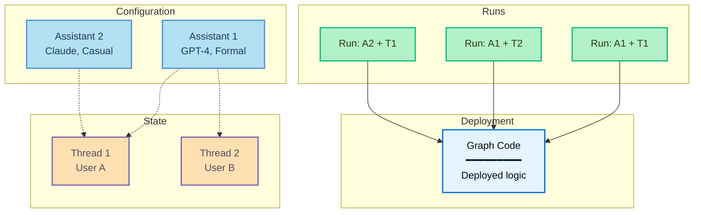

运行是[助手](/langsmith/assistants)的调用。当您执行运行时，您需要指定使用哪个助手——对于默认助手可以按图形 ID，或对于特定配置按助手 ID。

此图显示了**运行**如何将助手与线程结合来执行图：

- **Graph**（蓝色）：包含代理逻辑的已部署代码
- **Assistants**（浅蓝色）：配置选项（模型、提示词、工具）
- **Threads**（橙色）：对话历史的状态容器
- **Runs**（绿色）：配对助手 + 线程的执行

**示例组合：**
- **Run: A1 + T1**：将助手 1 配置应用于用户 A 的对话
- **Run: A1 + T2**：同一助手为用户 B 服务（不同对话）
- **Run: A2 + T1**：将不同助手应用于用户 A 的对话（配置切换）

执行运行时：

- 每个运行可能有自己的输入、配置覆盖和元数据。
- 运行可以是无状态的（无线程）或状态化的（在[线程](/langsmith/use-threads)上执行以进行对话持久化）。
- 多个运行可以使用相同的助手配置。
- 助手的配置影响底层图的执行方式。

Agent Server API 提供了多个用于创建和管理运行的端点。有关更多详细信息，请参阅 [API 参考](/langsmith/server-api-ref)。

## 本节内容

<CardGroup cols={2}>
  <Card title="启动后台运行" icon="player-play" href="/langsmith/background-run">
    异步运行您的代理并轮询结果。
  </Card>
  <Card title="在同一线程上运行多个代理" icon="messages" href="/langsmith/same-thread">
    在共享线程上使用多个助手来组合代理能力。
  </Card>
  <Card title="无状态运行" icon="player-skip-forward" href="/langsmith/stateless-runs">
    在不需要对话历史时执行运行而不持久化状态。
  </Card>
  <Card title="取消运行" icon="player-stop" href="/langsmith/cancel-run">
    通过 API 取消单个运行或多个运行。
  </Card>
</CardGroup>

---

<Callout icon="terminal-2">
    [Connect these docs](/use-these-docs) to Claude, VSCode, and more via MCP for real-time answers.
</Callout>
<Callout icon="edit">
    [Edit this page on GitHub](https://github.com/langchain-ai/docs/edit/main/src/langsmith\sample-traces.mdx) or [file an issue](https://github.com/langchain-ai/docs/issues/new/choose).
</Callout>

