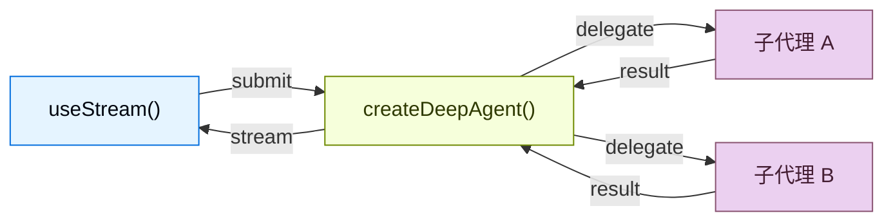

构建实时可视化深度代理工作流的界面。这些模式展示了如何渲染子代理进度、任务规划、流式内容和来自使用 `createDeepAgent` 创建的代理的类 IDE 沙箱体验。

## 架构

深度代理使用协调器-工作器架构。主代理计划任务并委托给专门的子代理，每个子代理独立运行。在前端，`useStream` 显示协调器的消息和每个子代理的流式状态。




```ts
import { createDeepAgent } from "deepagents";

const agent = createDeepAgent({
  tools: [getWeather],
  system: "You are a helpful assistant",
  subagents: [
    {
      name: "researcher",
      description: "Research assistant",
    },
  ],
});
```


在前端，使用 `useStream` 连接的方式与使用 `createAgent` 相同。深度代理模式使用额外的 `useStream` 功能，如 `stream.subagents`、`stream.values.todos` 和 `filterSubagentMessages` 来渲染子代理特定的 UI。

```ts
import { useStream } from "@langchain/react";

function App() {
  const stream = useStream<typeof agent>({
    apiUrl: "http://localhost:2024",
    assistantId: "agent",
  });

  // 深度代理状态超出消息
  const todos = stream.values?.todos;
  const subagents = stream.subagents;
}
```

## 模式

<CardGroup cols={3}>
  <Card title="子代理流式传输" icon="arrows-split" href="/oss/javascript/deepagents/frontend/subagent-streaming">
    使用流式内容、进度跟踪和可折叠卡片显示专家子代理。
  </Card>
  <Card title="待办列表" icon="list-check" href="/oss/javascript/deepagents/frontend/todo-list">
    使用从代理状态同步的实时待办列表跟踪代理进度。
  </Card>
  <Card title="沙箱" icon="code" href="/oss/javascript/deepagents/frontend/sandbox">
    使用文件浏览器、代码查看器和由沙箱支持的 diff 面板构建类 IDE UI。
  </Card>
</CardGroup>

## 相关模式

[LangChain 前端模式](/oss/javascript/langchain/frontend/overview)，包括 markdown 消息、工具调用和人在回路中，都可以与深度代理配合使用。深度代理建立在相同的 LangGraph 运行时上，因此 `useStream` 提供相同的核心 API。

---

<div className="source-links">
<Callout icon="terminal-2">
    [Connect these docs](/use-these-docs) to Claude, VSCode, and more via MCP for real-time answers.
</Callout>
<Callout icon="edit">
    [Edit this page on GitHub](https://github.com/langchain-ai/docs/edit/main/src/oss\deepagents\frontend\overview.mdx) or [file an issue](https://github.com/langchain-ai/docs/issues/new/choose).
</Callout>
</div>
