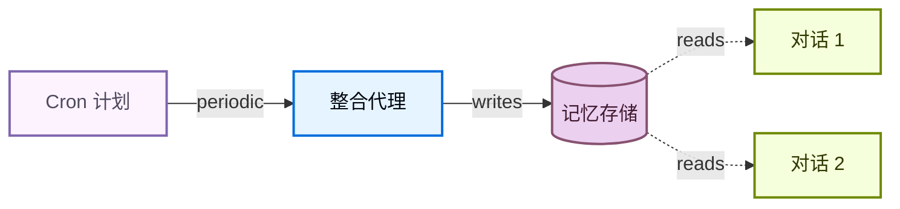

记忆让您的代理跨对话学习和改进。深度代理使记忆成为一等公民，具有文件系统支持的记忆：代理将记忆作为文件读取和写入，您使用[后端](/oss/javascript/deepagents/backends)控制这些文件的存储位置。

<Note>
本页面涵盖**长期记忆**：跨对话持久化的记忆。对于短期记忆（单个会话中的对话历史和草稿文件），请参阅[上下文工程](/oss/javascript/deepagents/context-engineering)指南。短期记忆作为代理[状态](/oss/javascript/langgraph/graph-api#state)的一部分自动管理。


</Note>

## 记忆如何工作

1. **将代理指向记忆文件。** 创建代理时将文件路径传递给 `memory=`。您还可以通过 `skills=` 传递[技能](/oss/javascript/deepagents/skills)以获取程序记忆（可重用的指令，告诉代理*如何*执行任务）。[后端](/oss/javascript/deepagents/backends)控制文件的存储位置和访问权限。
2. **代理读取记忆。** 代理可以在启动时将记忆文件加载到系统提示词中，或在对话期间按需读取。例如，[技能](/oss/javascript/deepagents/skills)使用按需加载：代理在启动时只读取技能描述，然后在匹配任务时才读取完整的技能文件。这在需要能力之前保持上下文精简。
3. **代理更新记忆（可选）。** 当代理学习新信息时，它可以使用内置的 `edit_file` 工具更新记忆文件。更新可以在对话期间进行（默认），也可以通过[后台整合](#background-consolidation)在对话之间后台进行。更改被持久化并在下次对话中可用。并非所有记忆都是可写的：开发者定义的[技能](/oss/javascript/deepagents/skills)和[组织策略](#organization-level-memory)通常是只读的。请参阅[只读与可写记忆](#read-only-vs-writable-memory)以了解详细信息。

两种最常见的模式是[代理范围的记忆](#agent-scoped-memory)（在所有用户之间共享）和[用户范围的记忆](#user-scoped-memory)（每个用户隔离）。

## 范围记忆

代理记忆可以是有范围的，这样相同的记忆文件可供使用代理的每个人访问，或者记忆文件可以是每个用户单独的。

### 代理范围的记忆

为代理提供自己的随时间演变的持久身份。代理范围的记忆在所有用户之间共享，因此代理通过每次对话建立自己的角色、积累知识和学习的偏好。当它与用户交互时，它会发展专业知识、改进方法并记住有效的做法。当它有写访问权时，它还可以学习和更新[技能](/oss/javascript/deepagents/skills)。

关键是后端命名空间：将其设置为 `(assistant_id,)` 意味着此代理的每次对话读取和写入相同的记忆文件。


<Note>
访问 `rt.serverInfo` 需要 `deepagents>=1.9.0`。在旧版本上，从 `getConfig().metadata.assistantId` 读取助手 ID。
</Note>


```typescript
import { createDeepAgent, CompositeBackend, StateBackend, StoreBackend } from "deepagents";

const agent = createDeepAgent({
  memory: ["/memories/AGENTS.md"],
  skills: ["/skills/"],
  backend: new CompositeBackend(
    new StateBackend(),
    {
      "/memories/": new StoreBackend({
        namespace: (rt) => [rt.serverInfo.assistantId],  // [!code highlight]
      }),
      "/skills/": new StoreBackend({
        namespace: (rt) => [rt.serverInfo.assistantId],  // [!code highlight]
      }),
    },
  ),
});
```


<Accordion title="完整示例：种子记忆并调用">

用初始记忆填充存储，然后在两个线程中调用代理，以查看它记住并更新它学到的内容。


```typescript
import { v4 as uuidv4 } from "uuid";
import { createDeepAgent, CompositeBackend, StateBackend, StoreBackend, createFileData } from "deepagents";
import { InMemoryStore } from "@langchain/langgraph";

const store = new InMemoryStore();  // 部署到 LangSmith 时使用平台存储

// 种子记忆文件
await store.put(
  ["my-agent"],
  "/memories/AGENTS.md",
  createFileData(`## Response style
- Keep responses concise
- Use code examples where possible
`),
);

// 种子技能
await store.put(
  ["my-agent"],
  "/skills/langgraph-docs/SKILL.md",
  createFileData(`---
name: langgraph-docs
description: Fetch relevant LangGraph documentation to provide accurate guidance.
---

# langgraph-docs

Use the fetch_url tool to read https://docs.langchain.com/llms.txt, then fetch relevant pages.
`),
);

const agent = createDeepAgent({
  memory: ["/memories/AGENTS.md"],
  skills: ["/skills/"],
  backend: (rt) => new CompositeBackend(
    new StateBackend(rt),
    {
      "/memories/": new StoreBackend(rt, {
        namespace: (rt) => ["my-agent"],
      }),
      "/skills/": new StoreBackend(rt, {
        namespace: (rt) => ["my-agent"],
      }),
    },
  ),
  store,
});

// 线程 1：代理学习新的偏好并将其保存到记忆
const config1 = { configurable: { thread_id: uuidv4() } };
await agent.invoke({
  messages: [{ role: "user", content: "I prefer detailed explanations. Remember that." }],
}, config1);

// 线程 2：代理读取记忆并应用偏好
const config2 = { configurable: { thread_id: uuidv4() } };
await agent.invoke({
  messages: [{ role: "user", content: "Explain how transformers work." }],
}, config2);
```


</Accordion>

### 用户范围的记忆

为每个用户提供自己的记忆文件。代理记住每个用户的偏好、上下文和历史，而核心代理指令保持不变。如果存储在用户范围的后端中，用户也可以拥有每个用户的[技能](/oss/javascript/deepagents/skills)。

命名空间使用 `(user_id,)`，因此每个用户获得记忆文件的隔离副本。用户 A 的偏好永远不会泄漏到用户 B 的对话中。


```typescript
import { createDeepAgent, CompositeBackend, StateBackend, StoreBackend } from "deepagents";

const agent = createDeepAgent({
  memory: ["/memories/preferences.md"],
  skills: ["/skills/"],
  backend: new CompositeBackend(
    new StateBackend(),
    {
      "/memories/": new StoreBackend({
        namespace: (rt) => [rt.serverInfo.user.identity],
      }),
      "/skills/": new StoreBackend({
        namespace: (rt) => [rt.serverInfo.user.identity],
      }),
    },
  ),
});
```


<Accordion title="完整示例：跨用户隔离记忆">

为每个用户种子记忆并作为两个不同的用户调用代理。每个用户只看到自己的偏好。


```typescript
import { v4 as uuidv4 } from "uuid";
import { createDeepAgent, CompositeBackend, StateBackend, StoreBackend, createFileData } from "deepagents";
import { InMemoryStore } from "@langchain/langgraph";

const store = new InMemoryStore();  // 部署到 LangSmith 时使用平台存储

// 为两个用户种子偏好
await store.put(
  ["user-alice"],
  "/memories/preferences.md",
  createFileData(`## Preferences
- Likes concise bullet points
- Prefers Python examples
`),
);
await store.put(
  ["user-bob"],
  "/memories/preferences.md",
  createFileData(`## Preferences
- Likes detailed explanations
- Prefers TypeScript examples
`),
);

// 为 Alice 种子技能
await store.put(
  ["user-alice"],
  "/skills/langgraph-docs/SKILL.md",
  createFileData(`---
name: langgraph-docs
description: Fetch relevant LangGraph documentation to provide accurate guidance.
---

# langgraph-docs

Use the fetch_url tool to read https://docs.langchain.com/llms.txt, then fetch relevant pages.
`),
);

const agent = createDeepAgent({
  memory: ["/memories/preferences.md"],
  skills: ["/skills/"],
  backend: (rt) => new CompositeBackend(
    new StateBackend(rt),
    {
      "/memories/": new StoreBackend(rt, {
        namespace: (rt) => [rt.serverInfo.user.identity],
      }),
      "/skills/": new StoreBackend(rt, {
        namespace: (rt) => [rt.serverInfo.user.identity],
      }),
    },
  ),
  store,
});

// 部署后，每个经过身份验证的请求解析
// `rt.serverInfo.user.identity` 为调用用户，因此 Alice 和 Bob
// 自动只看到自己的偏好。
await agent.invoke(
  { messages: [{ role: "user", content: "How do I read a CSV file?" }] },
  { configurable: { thread_id: uuidv4() } },
);
```


</Accordion>

## 高级用法

除了记忆路径和范围的基本配置选项外，您还可以配置更高级的记忆参数：

| 维度 | 它回答的问题 | 选项 |
|---|---|---|
| **持续时间** | 它持续多久？ | [短期](/oss/javascript/deepagents/context-engineering)（单个对话）或 [长期](#scoped-memory)（跨对话） |
| **信息类型** | 它是什么类型的信息？ | [情景记忆](#episodic-memory)（过去的经历）、[程序记忆](/oss/javascript/deepagents/skills)（指令和技能）或 [语义记忆](/oss/javascript/concepts/memory#semantic-memory)（事实） |
| **范围** | 谁可以查看和修改它？ | [用户](#user-scoped-memory)、[代理](#agent-scoped-memory)或 [组织](#organization-level-memory) |
| **更新策略** | 何时写入记忆？ | 在对话期间（默认）或[对话之间](#background-consolidation) |
| **检索** | 如何读取记忆？ | 加载到提示词（默认）或按需（例如[技能](/oss/javascript/deepagents/skills)） |
| **代理权限** | 代理可以写入记忆吗？ | [读写](#read-only-vs-writable-memory)（默认）或 [只读](#read-only-vs-writable-memory)（用于共享策略） |

### 情景记忆

情景记忆存储过去经历的记录：发生了什么、按什么顺序、结果是什么。与语义记忆（存储在 `AGENTS.md` 等文件中的事实和偏好）不同，情景记忆保留完整的对话上下文，以便代理可以回忆问题是如何解决的，而不仅仅是从中*学到了什么*。

深度代理已经使用[检查点器](/oss/javascript/langgraph/persistence#checkpoints)，这是支持情景记忆的机制：每次对话都作为检查点的线程持久化。

要使过去的对话可搜索，请在工具中包装线程搜索。`user_id` 从运行时上下文而不是作为参数传递：


```typescript
import { Client } from "@langchain/langgraph-sdk";
import { tool } from "@langchain/core/tools";

const client = new Client({ apiUrl: "<DEPLOYMENT_URL>" });

const searchPastConversations = tool(
  async ({ query }, runtime) => {
    const userId = runtime.serverInfo.user.identity;  // [!code highlight]
    const threads = await client.threads.search({
      metadata: { userId },
      limit: 5,
    });
    const results = [];
    for (const thread of threads) {
      const history = await client.threads.getHistory(thread.threadId);
      results.push(history);
    }
    return JSON.stringify(results);
  },
  {
    name: "search_past_conversations",
    description: "Search past conversations for relevant context.",
  }
);
```


您可以通过调整元数据过滤器按用户或组织限定线程搜索：


```typescript
// Search conversations for a specific user
const userThreads = await client.threads.search({
  metadata: { userId },
  limit: 5,
});

// Search conversations across an organization
const orgThreads = await client.threads.search({
  metadata: { orgId },
  limit: 5,
});
```


这对于执行复杂多步骤任务的代理很有用。例如，编码代理可以回顾过去的调试会话，直接跳到可能的根本原因。

### 组织级记忆

组织级记忆遵循与用户范围记忆相同的模式，但使用组织范围的命名空间而不是每个用户一个。使用它来存储应该应用于组织中所有用户和代理的策略或知识。

组织记忆通常对代理是**只读的**以防止通过共享状态进行提示注入。请参阅[只读与可写记忆](#read-only-vs-writable-memory)以了解详细信息。


```typescript
import { createDeepAgent, CompositeBackend, StateBackend, StoreBackend } from "deepagents";

const agent = createDeepAgent({
  memory: [
    "/memories/preferences.md",
    "/policies/compliance.md",
  ],
  backend: new CompositeBackend(
    new StateBackend(),
    {
      "/memories/": new StoreBackend({
        namespace: (rt) => [rt.serverInfo.user.identity],
      }),
      "/policies/": new StoreBackend({
        namespace: (rt) => [rt.context.orgId],
      }),
    },
  ),
});
```


从您的应用程序代码填充组织记忆：


```typescript
import { Client } from "@langchain/langgraph-sdk";
import { createFileData } from "deepagents";

const client = new Client({ apiUrl: "<DEPLOYMENT_URL>" });

await client.store.putItem(
  [orgId],
  "/compliance.md",
  createFileData(`## Compliance policies
- Never disclose internal pricing
- Always include disclaimers on financial advice
`),
);
```


使用[权限](/oss/javascript/deepagents/permissions)强制组织级记忆为只读，或使用[策略钩子](/oss/javascript/deepagents/backends#add-policy-hooks)进行自定义验证逻辑。

### 后台整合

默认情况下，代理在对话期间写入记忆（热路径）。另一种是在对话**之间**作为后台任务处理记忆，有时称为**睡眠时间计算**。一个单独的深度代理审查最近的对话，提取关键事实，并将它们与现有记忆合并。

| 方法 | 优点 | 缺点 |
|---|---|---|
| **热路径**（对话期间） | 记忆立即可用，对用户透明 | 增加延迟，代理必须多任务处理 |
| **后台**（对话之间） | 没有面向用户的延迟，可以跨多个对话综合 | 记忆在下次对话之前不可用，需要第二个代理 |

对于大多数应用程序，热路径就足够了。当您需要减少延迟或跨多个对话提高记忆质量时，添加后台整合。

推荐模式是 alongside 您的 main agent 部署一个**整合代理**——一个读取最近对话历史、提取关键事实并将其合并到记忆存储中的深度代理——并按 [cron 计划](#cron)触发它。选择反映用户实际与代理交互频率的节奏：具有稳定日常流量的聊天产品可能每几小时整合一次，而每周只使用几次的工具只需要在夜间或每周运行。比用户对话更频繁地整合只是在上游运行上消耗 Token。

#### 整合代理

整合代理读取最近的对话历史并将关键事实合并到记忆存储中。将其 alongside 您的主要代理注册在 `langgraph.json` 中：


```typescript src/consolidation-agent.ts
import { createDeepAgent } from "deepagents";
import { Client } from "@langchain/langgraph-sdk";
import { tool } from "@langchain/core/tools";

const sdkClient = new Client({ apiUrl: "<DEPLOYMENT_URL>" });

const searchRecentConversations = tool(
  async ({ query }, runtime) => {
    const userId = runtime.serverInfo.user.identity;  // [!code highlight]

    const since = new Date(Date.now() - 6 * 60 * 60 * 1000).toISOString();
    const threads = await sdkClient.threads.search({
      metadata: { userId },
      updatedAfter: since,
      limit: 20,
    });
    const conversations = [];
    for (const thread of threads) {
      const history = await sdkClient.threads.getHistory(thread.threadId);
      conversations.push(history.values.messages);
    }
    return JSON.stringify(conversations);
  },
  {
    name: "search_recent_conversations",
    description: "Search this user's conversations updated in the last 6 hours.",
  }
);

const agent = createDeepAgent({
  model: "google_genai:gemini-3.1-pro-preview",
  systemPrompt: `Review recent conversations and update the user's memory file.
Merge new facts, remove outdated information, and keep it concise.`,
  tools: [searchRecentConversations],
});

export { agent };
```


```json langgraph.json
{
  "dependencies": ["."],
  "graphs": {
    "agent": "./src/agent.ts:agent",
    "consolidation_agent": "./src/consolidation-agent.ts:agent"
  },
  "env": ".env"
}
```


#### Cron

[cron 作业](/langsmith/cron-jobs)按固定计划运行整合代理。代理搜索最近的对话并将其综合到记忆中。将计划与您的使用模式匹配，以便整合运行大致跟踪真实活动。



使用 cron 作业调度整合代理：


```typescript
import { Client } from "@langchain/langgraph-sdk";

const client = new Client({ apiUrl: "<DEPLOYMENT_URL>" });

const cronJob = await client.crons.create(
  "consolidation_agent",
  {
    schedule: "0 */6 * * *",
    input: { messages: [{ role: "user", content: "Consolidate recent memories." }] },
  },
);
```


<Note>
所有 cron 计划都在**UTC**中解释。请参阅 [cron 作业](/langsmith/cron-jobs) 了解管理和删除 cron 作业的详细信息。
</Note>

<Warning>
cron 间隔必须与整合代理内的回看窗口匹配。上面的示例每 6 小时运行一次（`0 */6 * * *`），代理的 `search_recent_conversations` 工具回看 `timedelta(hours=6)` —— 保持这些同步。如果 cron 运行比回看更频繁，您将重新处理相同的对话；如果运行更不频繁，您将丢失超出窗口的记忆。
</Warning>

有关使用后台进程部署代理的更多信息，请参阅[投入生产](/oss/javascript/deepagents/going-to-production)。

### 只读与可写记忆

默认情况下，代理可以读取和写入记忆文件。对于共享状态（如组织策略或合规规则），您可能希望将记忆设为**只读**，以便代理可以引用它但不能修改它。这可以防止通过共享记忆进行提示注入，并确保只有您的应用程序代码控制文件中的内容。

| 权限 | 用例 | 如何工作 |
|---|---|---|
| **读写**（默认） | 用户偏好、代理自我改进、学习的[技能](/oss/javascript/deepagents/skills) | 代理通过 `edit_file` 工具更新文件 |
| **只读** | 组织策略、合规规则、共享知识库、开发者定义的[技能](/oss/javascript/deepagents/skills) | 通过应用程序代码或 [Store 接口](/langsmith/custom-store)填充。使用[权限](/oss/javascript/deepagents/permissions)拒绝写入特定路径，或使用[策略钩子](/oss/javascript/deepagents/backends#add-policy-hooks)进行自定义验证逻辑。 |

**安全注意事项：**如果一个用户可以写入另一个用户读取的记忆，恶意用户可以向共享状态注入指令。要缓解此问题：

- **默认使用用户范围** `(user_id)`，除非您有特定原因要共享
- 对共享策略使用**只读记忆**（通过应用程序代码填充，而不是代理）
- 在代理写入共享记忆之前添加**人工介入**验证。使用[中断](/oss/javascript/langgraph/interrupts)来要求对敏感路径的写入进行人工批准。

要强制只读记忆，请使用[权限](/oss/javascript/deepagents/permissions)声明性拒绝写入特定路径。对于自定义验证逻辑（速率限制、审计日志、内容检查），请使用[后端策略钩子](/oss/javascript/deepagents/backends#add-policy-hooks)。

### 并发写入

多个线程可以并行写入记忆，但对**同一文件**的并发写入可能导致最后写入优先冲突。对于用户范围的记忆，这很少见，因为用户通常一次只有一个活动对话。对于代理范围或组织范围的记忆，请考虑使用[后台整合](#background-consolidation)来序列化写入，或将记忆构建为每个主题的单独文件以减少争用。

在实践中，如果写入因冲突而失败，大型语言模型通常足够聪明以重试或正常恢复，因此一次丢失的写入不是灾难性的。

### 同一部署中的多个代理

要在共享部署中为每个代理提供自己的记忆，请将 `assistant_id` 添加到命名空间：


```typescript
new StoreBackend({
  namespace: (rt) => [
    rt.serverInfo.assistantId,  // [!code highlight]
    rt.serverInfo.user.identity,
  ],
})
```


如果只需要每个代理隔离而不需要每个用户范围，请单独使用 `assistant_id`。

<Tip>
使用 [LangSmith 追踪](/langsmith/trace-with-langgraph) 来审计您的代理写入记忆的内容。每个文件写入都显示为追踪中的工具调用。
</Tip>

---

<div className="source-links">
<Callout icon="terminal-2">
    [Connect these docs](/use-these-docs) to Claude, VSCode, and more via MCP for real-time answers.
</Callout>
<Callout icon="edit">
    [Edit this page on GitHub](https://github.com/langchain-ai/docs/edit/main/src/oss\deepagents\memory.mdx) or [file an issue](https://github.com/langchain-ai/docs/issues/new/choose).
</Callout>
</div>
