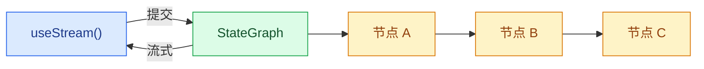

构建可实时可视化 LangGraph 流水线和执行过程的前端。这些模式展示了如何使用每节点状态和来自自定义 `StateGraph` 工作流的流式内容来渲染多步骤图执行。

## 架构

LangGraph 图由通过边连接的有名称节点组成。每个节点执行一个步骤（分类、研究、分析、综合）并将输出写入特定的状态键。在前端，`useStream` 提供对节点输出、流式 Token 和图元数据的响应式访问，这样您可以将每个节点映射到 UI 卡片。




```ts
import { StateGraph, StateSchema, MessagesValue, START, END } from "@langchain/langgraph";
import * as z from "zod";

const State = new StateSchema({
  messages: MessagesValue,
  classification: z.string(),
  research: z.string(),
  analysis: z.string(),
});

const graph = new StateGraph(State)
  .addNode("classify", classifyNode)
  .addNode("research", researchNode)
  .addNode("analyze", analyzeNode)
  .addEdge(START, "classify")
  .addEdge("classify", "research")
  .addEdge("research", "analyze")
  .addEdge("analyze", END)
  .compile();
```


在前端，`useStream` 通过 `stream.values` 暴露已完成的节点输出，通过 `getMessagesMetadata` 识别每个流式 Token 由哪个节点生成。

```ts
import { useStream } from "@langchain/react";

function Pipeline() {
  const stream = useStream<typeof graph>({
    apiUrl: "http://localhost:2024",
    assistantId: "pipeline",
  });

  const classification = stream.values?.classification;
  const research = stream.values?.research;
  const analysis = stream.values?.analysis;
}
```

## 模式

<CardGroup cols={2}>
  <Card title="图执行" icon="chart-dots" href="/oss/javascript/langgraph/frontend/graph-execution">
    使用每节点状态和流式内容可视化多步骤图流水线。
  </Card>
</CardGroup>

## 相关模式

[LangChain 前端模式](/oss/javascript/langchain/frontend/overview)——markdown 消息、工具调用、乐观更新等——可与任何 LangGraph 图一起工作。无论您使用 `createAgent`、`createDeepAgent` 还是自定义 `StateGraph`，`useStream` 钩子都提供相同的核心 API。

---

<div className="source-links">
<Callout icon="terminal-2">
    [Connect these docs](/use-these-docs) to Claude, VSCode, and more via MCP for real-time answers.
</Callout>
<Callout icon="edit">
    [Edit this page on GitHub](https://github.com/langchain-ai/docs/edit/main/src/oss\langgraph\frontend\overview.mdx) or [file an issue](https://github.com/langchain-ai/docs/issues/new/choose).
</Callout>
</div>
