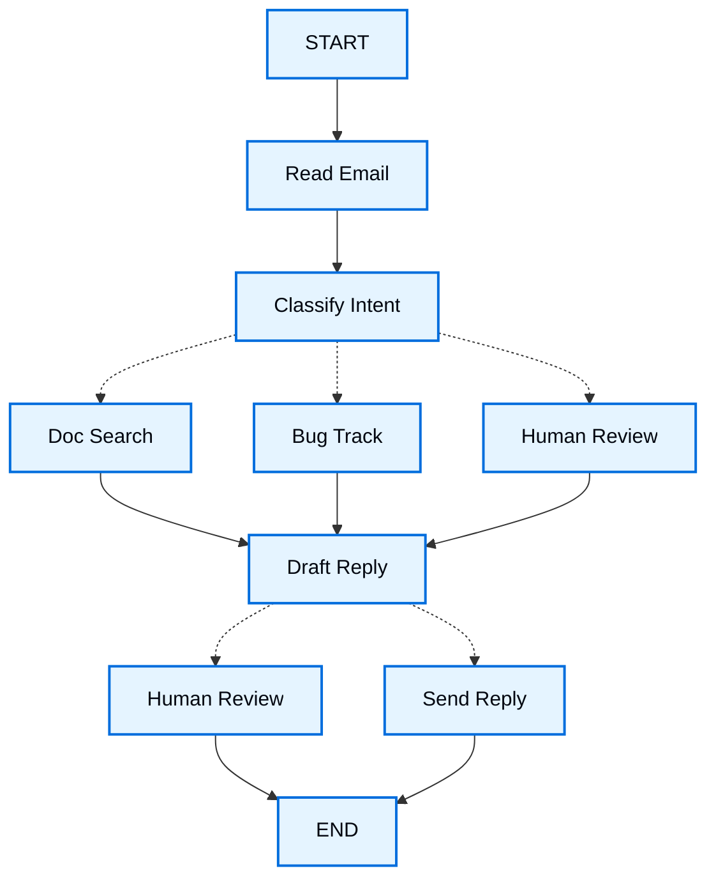

当您使用 LangGraph 构建代理时，首先需要将其分解为离散的步骤，称为**节点**。然后，您描述从每个节点做出的不同决策和转换。最后，通过**状态**将节点连接在一起，每个节点都可以从中读取和写入。

在本指南中，我们将引导您完成使用 LangGraph 构建客户支持邮件代理的思维过程。

## 从您想要自动化的流程开始

假设您需要构建一个处理客户支持邮件的 AI 代理您的产品团队向您提出了以下要求：

```txt
代理应该：

- 阅读收到的客户邮件
- 按紧急程度和主题进行分类
- 搜索相关文档来回答问题
- 起草适当的回复
- 将复杂问题上报给人工代理
- 在需要时安排后续跟进

需要处理的示例场景：

1. 简单产品问题："如何重置密码？"
2. Bug 报告："当我选择 PDF 格式时，导出功能会崩溃"
3. 紧急计费问题："我的订阅被收费了两次！"
4. 功能请求："您能为移动应用添加深色模式吗？"
5. 复杂技术问题："我们的 API 集成间歇性出现 504 错误"
```

要在 LangGraph 中实现代理，您通常会遵循相同的五个步骤。

## 步骤 1：将您的工作流程映射为离散步骤

首先识别流程中的不同步骤。每个步骤将成为一个**节点**（一个做一件特定事情的函数）。然后勾勒出这些步骤如何相互连接。



此图中的箭头显示了可能的路径，但实际选择哪条路径的决策发生在每个节点内部。

现在我们已经确定了工作流程中的组件，让我们了解每个节点需要做什么：

- `Read Email`：提取并解析邮件内容
- `Classify Intent`：使用大型语言模型对紧急程度和主题进行分类，然后路由到适当的操作
- `Doc Search`：查询您的知识库以获取相关信息
- `Bug Track`：在跟踪系统中创建或更新问题
- `Draft Reply`：生成适当的回复
- `Human Review`：上报给人工代理进行审批或处理
- `Send Reply`：发送邮件回复

<Tip>
请注意，某些节点决定下一步去哪里（`Classify Intent`、`Draft Reply`、`Human Review`），而其他节点总是进行到相同的下一步（`Read Email` 总是到 `Classify Intent`，`Doc Search` 总是到 `Draft Reply`）。
</Tip>

## 步骤 2：识别每个步骤需要做什么

对于图中的每个节点，确定它代表什么类型的操作以及它需要什么上下文才能正常工作。

<CardGroup cols={2}>
    <Card title="大型语言模型步骤" icon="brain" href="#llm-steps">
        当您需要理解、分析、生成文本或进行推理决策时使用
    </Card>
    <Card title="数据步骤" icon="database" href="#data-steps">
        当您需要从外部源检索信息时使用
    </Card>
    <Card title="操作步骤" icon="bolt" href="#action-steps">
        当您需要执行外部操作时使用
    </Card>
    <Card title="用户输入步骤" icon="user" href="#user-input-steps">
        当您需要人工干预时使用
    </Card>
</CardGroup>

### 大型语言模型步骤

当某个步骤需要理解、分析、生成文本或进行推理决策时：

<AccordionGroup>
    <Accordion title="分类意图">
        - 静态上下文（提示词）：分类类别、紧急程度定义、响应格式
        - 动态上下文（来自状态）：邮件内容、发件人信息
        - 期望结果：决定路由的结构化分类
    </Accordion>

    <Accordion title="起草回复">
        - 静态上下文（提示词）：语调指南、公司政策、回复模板
        - 动态上下文（来自状态）：分类结果、搜索结果、客户历史
        - 期望结果：可供审核的专业邮件回复
    </Accordion>
</AccordionGroup>

### 数据步骤

当某个步骤需要从外部源检索信息时：

<AccordionGroup>
    <Accordion title="文档搜索">
        - 参数：从意图和主题构建的查询
        - 重试策略：是的，对暂时性故障使用指数退避
        - 缓存：可以缓存常见查询以减少 API 调用
    </Accordion>

    <Accordion title="客户历史查询">
        - 参数：来自状态的客户邮件或 ID
        - 重试策略：是的，但如果不可用则回退到基本信息
        - 缓存：是的，使用生存时间来平衡新鲜度和性能
    </Accordion>
</AccordionGroup>

### 操作步骤

当某个步骤需要执行外部操作时：

<AccordionGroup>
    <Accordion title="发送回复">
        - 何时执行节点：批准后（人工或自动）
        - 重试策略：是的，对网络问题使用指数退避
        - 不应缓存：每次发送都是一个唯一操作
    </Accordion>

    <Accordion title="Bug 跟踪">
        - 何时执行节点：当意图是"bug"时始终执行
        - 重试策略：是的，不能丢失 bug 报告
        - 返回：要包含在回复中的工单 ID
    </Accordion>
</AccordionGroup>

### 用户输入步骤

当某个步骤需要人工干预时：

<AccordionGroup>
    <Accordion title="人工审核节点">
        - 决策上下文：原始邮件、回复草稿、紧急程度、分类
        - 期望输入格式：批准布尔值加可选的编辑回复
        - 触发时机：高紧急程度、复杂问题或质量问题
    </Accordion>
</AccordionGroup>

## 步骤 3：设计您的状态

状态是代理中所有节点可访问的共享[内存](/oss/javascript/concepts/memory)。将其视为代理用来跟踪其在处理流程中学习和决定的所有内容的笔记本。

### 什么应该放在状态中？

问问自己关于每个数据片段的这些问题：

<CardGroup cols={2}>
    <Card title="包含在状态中" icon="check">
        它需要跨步骤持久化吗？如果是，则放入状态。
    </Card>

    <Card title="不要存储" icon="code">
        您能从其他数据中推导出来吗？如果是，请在需要时计算，而不是存储在状态中。
    </Card>
</CardGroup>

对于我们的邮件代理，我们需要跟踪：

- 原始邮件和发件人信息（之后无法重建这些）
- 分类结果（需要被多个后续/下游节点使用）
- 搜索结果和客户数据（重新获取代价昂贵）
- 回复草稿（需要在审核过程中持久化）
- 执行元数据（用于调试和恢复）

### 保持状态为原始数据，按需格式化提示词

<Tip>
一个关键原则：您的状态应该存储原始数据，而不是格式化的文本。在节点需要时在节点内部格式化提示词。
</Tip>

这种分离意味着：

- 不同的节点可以根据其需要以不同方式格式化相同的数据
- 您可以在不修改状态模式的情况下更改提示词模板
- 调试更清晰——您可以准确看到每个节点接收到了什么数据
- 您的代理可以演进而不会破坏现有状态

让我们定义我们的状态：


```typescript
import { StateSchema } from "@langchain/langgraph";
import * as z from "zod";

// Define the structure for email classification
const EmailClassificationSchema = z.object({
  intent: z.enum(["question", "bug", "billing", "feature", "complex"]),
  urgency: z.enum(["low", "medium", "high", "critical"]),
  topic: z.string(),
  summary: z.string(),
});

const EmailAgentState = new StateSchema({
  // Raw email data
  emailContent: z.string(),
  senderEmail: z.string(),
  emailId: z.string(),

  // Classification result
  classification: EmailClassificationSchema.optional(),

  // Raw search/API results
  searchResults: z.array(z.string()).optional(),  // List of raw document chunks
  customerHistory: z.record(z.string(), z.any()).optional(),  // Raw customer data from CRM

  // Generated content
  responseText: z.string().optional(),
});

type EmailClassificationType = z.infer<typeof EmailClassificationSchema>;
```


请注意，状态只包含原始数据——没有提示词模板、没有格式化的字符串、没有指令。分类输出作为来自大型语言模型的单个字典存储。

## 步骤 4：构建您的节点


现在我们将每个步骤实现为一个函数。LangGraph 中的节点只是一个 JavaScript 函数，它接收当前状态并返回对它的更新。


### 适当处理错误

不同的错误需要不同的处理策略：

| 错误类型 | 谁来修复 | 策略 | 何时使用 |
|------------|--------------|----------|-------------|
| 暂时性错误（网络问题、速率限制） | 系统（自动） | 重试策略 | 通常在重试时会解决的临时故障 |
| 大型语言模型可恢复的错误（工具失败、解析问题） | 大型语言模型 | 将错误存储在状态中并循环回去 | 大型语言模型可以看到错误并调整其方法 |
| 用户可修复的错误（信息缺失、指令不清晰） | 人工 | 使用 `interrupt()` 暂停 | 需要用户输入才能继续 |
| 意外错误 | 开发者 | 让它们冒泡上去 | 需要调试的未知问题 |

<Tabs>
    <Tab title="暂时性错误" icon="rotate">
        添加重试策略以自动重试网络问题和速率限制：


    ```typescript
    import type { RetryPolicy } from "@langchain/langgraph";

    workflow.addNode(
      "searchDocumentation",
      searchDocumentation,
      {
        retryPolicy: { maxAttempts: 3, initialInterval: 1.0 },
      },
    );
    ```


    </Tab>

    <Tab title="大型语言模型可恢复" icon="brain">
        将错误存储在状态中并循环回去，以便大型语言模型可以看到出了什么问题并重试：


    ```typescript
    import { Command, GraphNode } from "@langchain/langgraph";

    const executeTool: GraphNode<typeof State> = async (state, config) => {
      try {
        const result = await runTool(state.toolCall);
        return new Command({
          update: { toolResult: result },
          goto: "agent",
        });
      } catch (error) {
        // Let the LLM see what went wrong and try again
        return new Command({
          update: { toolResult: `Tool error: ${error}` },
          goto: "agent"
        });
      }
    }
    ```


    </Tab>

    <Tab title="用户可修复" icon="user">
        在需要时暂停并从用户那里收集信息（如账户 ID、订单号或澄清）：


    ```typescript
    import { Command, GraphNode, interrupt } from "@langchain/langgraph";

    const lookupCustomerHistory: GraphNode<typeof State> = async (state, config) => {
      if (!state.customerId) {
        const userInput = interrupt({
          message: "Customer ID needed",
          request: "Please provide the customer's account ID to look up their subscription history",
        });
        return new Command({
          update: { customerId: userInput.customerId },
          goto: "lookupCustomerHistory",
        });
      }
      // Now proceed with the lookup
      const customerData = await fetchCustomerHistory(state.customerId);
      return new Command({
        update: { customerHistory: customerData },
        goto: "draftResponse",
      });
    }
    ```


    </Tab>

    <Tab title="意外" icon="alert-triangle">
        让它们冒泡上去进行调试。不要捕获您无法处理的错误：


    ```typescript
    import { Command, GraphNode } from "@langchain/langgraph";

    const sendReply: GraphNode<typeof EmailAgentState> = async (state, config) => {
      try {
        await emailService.send(state.responseText);
      } catch (error) {
        throw error;  // Surface unexpected errors
      }
    }
    ```


    </Tab>
</Tabs>


### 实现我们的邮件代理节点

我们将每个节点实现为一个简单的函数。请记住：节点获取状态、执行工作并返回更新。

<AccordionGroup>
    <Accordion title="读取和分类节点" icon="brain">


    ```typescript
    import { StateGraph, START, END, GraphNode, Command } from "@langchain/langgraph";
    import { HumanMessage } from "@langchain/core/messages";
    import { ChatAnthropic } from "@langchain/anthropic";

    const llm = new ChatAnthropic({ model: "claude-sonnet-4-6" });

    const readEmail: GraphNode<typeof EmailAgentState> = async (state, config) => {
      // Extract and parse email content
      // In production, this would connect to your email service
      console.log(`Processing email: ${state.emailContent}`);
      return {};
    }

    const classifyIntent: GraphNode<typeof EmailAgentState> = async (state, config) => {
      // Use LLM to classify email intent and urgency, then route accordingly

      // Create structured LLM that returns EmailClassification object
      const structuredLlm = llm.withStructuredOutput(EmailClassificationSchema);

      // Format the prompt on-demand, not stored in state
      const classificationPrompt = `
      Analyze this customer email and classify it:

      Email: ${state.emailContent}
      From: ${state.senderEmail}

      Provide classification including intent, urgency, topic, and summary.
      `;

      // Get structured response directly as object
      const classification = await structuredLlm.invoke(classificationPrompt);

      // Determine next node based on classification
      let nextNode: "searchDocumentation" | "humanReview" | "draftResponse" | "bugTracking";

      if (classification.intent === "billing" || classification.urgency === "critical") {
        nextNode = "humanReview";
      } else if (classification.intent === "question" || classification.intent === "feature") {
        nextNode = "searchDocumentation";
      } else if (classification.intent === "bug") {
        nextNode = "bugTracking";
      } else {
        nextNode = "draftResponse";
      }

      // Store classification as a single object in state
      return new Command({
        update: { classification },
        goto: nextNode,
      });
    }
    ```


    </Accordion>

    <Accordion title="搜索和跟踪节点" icon="database">


    ```typescript
    import { Command, GraphNode } from "@langchain/langgraph";

    const searchDocumentation: GraphNode<typeof EmailAgentState> = async (state, config) => {
      // Search knowledge base for relevant information

      // Build search query from classification
      const classification = state.classification!;
      const query = `${classification.intent} ${classification.topic}`;

      let searchResults: string[];

      try {
        // Implement your search logic here
        // Store raw search results, not formatted text
        searchResults = [
          "Reset password via Settings > Security > Change Password",
          "Password must be at least 12 characters",
          "Include uppercase, lowercase, numbers, and symbols",
        ];
      } catch (error) {
        // For recoverable search errors, store error and continue
        searchResults = [`Search temporarily unavailable: ${error}`];
      }

      return new Command({
        update: { searchResults },  // Store raw results or error
        goto: "draftResponse",
      });
    }

    const bugTracking: GraphNode<typeof EmailAgentState> = async (state, config) => {
      // Create or update bug tracking ticket

      // Create ticket in your bug tracking system
      const ticketId = "BUG-12345";  // Would be created via API

      return new Command({
        update: { searchResults: [`Bug ticket ${ticketId} created`] },
        goto: "draftResponse",
      });
    }
    ```

    </Accordion>

    <Accordion title="回复节点" icon="edit">


    ```typescript
    import { Command, interrupt } from "@langchain/langgraph";

    const draftResponse: GraphNode<typeof EmailAgentState> = async (state, config) => {
      // Generate response using context and route based on quality

      const classification = state.classification!;

      // Format context from raw state data on-demand
      const contextSections: string[] = [];

      if (state.searchResults) {
        // Format search results for the prompt
        const formattedDocs = state.searchResults.map(doc => `- ${doc}`).join("\n");
        contextSections.push(`Relevant documentation:\n${formattedDocs}`);
      }

      if (state.customerHistory) {
        // Format customer data for the prompt
        contextSections.push(`Customer tier: ${state.customerHistory.tier ?? "standard"}`);
      }

      // Build the prompt with formatted context
      const draftPrompt = `
      Draft a response to this customer email:
      ${state.emailContent}

      Email intent: ${classification.intent}
      Urgency level: ${classification.urgency}

      ${contextSections.join("\n\n")}

      Guidelines:
      - Be professional and helpful
      - Address their specific concern
      - Use the provided documentation when relevant
      `;

      const response = await llm.invoke([new HumanMessage(draftPrompt)]);

      // Determine if human review needed based on urgency and intent
      const needsReview = (
        classification.urgency === "high" ||
        classification.urgency === "critical" ||
        classification.intent === "complex"
      );

      // Route to appropriate next node
      const nextNode = needsReview ? "humanReview" : "sendReply";

      return new Command({
        update: { responseText: response.content.toString() },  // Store only the raw response
        goto: nextNode,
      });
    }

    const humanReview: GraphNode<typeof EmailAgentState> = async (state, config) => {
      // Pause for human review using interrupt and route based on decision
      const classification = state.classification!;

      // interrupt() must come first - any code before it will re-run on resume
      const humanDecision = interrupt({
        emailId: state.emailId,
        originalEmail: state.emailContent,
        draftResponse: state.responseText,
        urgency: classification.urgency,
        intent: classification.intent,
        action: "Please review and approve/edit this response",
      });

      // Now process the human's decision
      if (humanDecision.approved) {
        return new Command({
          update: { responseText: humanDecision.editedResponse || state.responseText },
          goto: "sendReply",
        });
      } else {
        // Rejection means human will handle directly
        return new Command({ update: {}, goto: END });
      }
    }

    const sendReply: GraphNode<typeof EmailAgentState> = async (state, config) => {
      // Send the email response
      // Integrate with email service
      console.log(`Sending reply: ${state.responseText!.substring(0, 100)}...`);
      return {};
    }
    ```


    </Accordion>
</AccordionGroup>

## 步骤 5：将其连接在一起

现在我们将节点连接成一个可工作的图。由于我们的节点处理自己的路由决策，我们只需要几个关键的边。

要使用 `interrupt()` 启用[人工介入](/oss/javascript/langgraph/interrupts)，我们需要使用[检查点](/oss/javascript/langgraph/persistence)编译图，以在运行之间保存状态：

<Accordion title="图编译代码" icon="sitemap" defaultOpen={true}>


```typescript
import { MemorySaver, RetryPolicy } from "@langchain/langgraph";

// Create the graph
const workflow = new StateGraph(EmailAgentState)
  // Add nodes with appropriate error handling
  .addNode("readEmail", readEmail)
  .addNode("classifyIntent", classifyIntent)
  // Add retry policy for nodes that might have transient failures
  .addNode(
    "searchDocumentation",
    searchDocumentation,
    { retryPolicy: { maxAttempts: 3 } },
  )
  .addNode("bugTracking", bugTracking)
  .addNode("draftResponse", draftResponse)
  .addNode("humanReview", humanReview)
  .addNode("sendReply", sendReply)
  // Add only the essential edges
  .addEdge(START, "readEmail")
  .addEdge("readEmail", "classifyIntent")
  .addEdge("sendReply", END);

// Compile with checkpointer for persistence
const memory = new MemorySaver();
const app = workflow.compile({ checkpointer: memory });
```


</Accordion>


图结构是最小的，因为路由通过 `Command` 对象发生在节点内部。每个节点声明它可以去哪里，使流程变得明确和可追踪。


### 试用您的代理

让我们用一个需要人工审核的紧急计费问题来运行我们的代理：

<Accordion title="测试代理" icon="flask">


```typescript
// Test with an urgent billing issue
const initialState: EmailAgentStateType = {
  emailContent: "I was charged twice for my subscription! This is urgent!",
  senderEmail: "customer@example.com",
  emailId: "email_123"
};

// Run with a thread_id for persistence
const config = { configurable: { thread_id: "customer_123" } };
const result = await app.invoke(initialState, config);
// The graph will pause at human_review
console.log(`Draft ready for review: ${result.responseText?.substring(0, 100)}...`);
```
```typescript
import { Command } from "@langchain/langgraph";

// When ready, provide human input to resume
const humanResponse = new Command({
  resume: {
    approved: true,
    editedResponse: "We sincerely apologize for the double charge. I've initiated an immediate refund...",
  }
});

// Resume execution
const finalResult = await app.invoke(humanResponse, config);
console.log("Email sent successfully!");
```


</Accordion>

当图执行到 `interrupt()` 时，它会暂停，保存一切到检查点，然后等待。它可以在几天后恢复，从上次停止的地方精确地继续。`thread_id` 确保这个对话的所有状态都被保留在一起。

## 总结和后续步骤

### 关键见解

构建这个邮件代理向我们展示了 LangGraph 的思维方式：

<CardGroup cols={2}>
    <Card title="分解为离散步骤" icon="sitemap" href="#step-1-map-out-your-workflow-as-discrete-steps">
        每个节点做好一件事。这种分解能够实现流式进度更新、能够暂停和恢复的持久执行，以及清晰的调试，因为您可以在步骤之间检查状态。
    </Card>

    <Card title="状态是共享内存" icon="database" href="#step-3-design-your-state">
        存储原始数据，而不是格式化的文本。这让不同的节点可以不同方式使用相同的信息。
    </Card>

    <Card title="节点是函数" icon="code" href="#step-4-build-your-nodes">
        它们获取状态、执行工作并返回更新。当它们需要做出路由决策时，它们同时指定状态更新和下一个目的地。
    </Card>

    <Card title="错误是流程的一部分" icon="alert-triangle" href="#handle-errors-appropriately">
        暂时性失败会重试，大型语言模型可恢复的错误会在有上下文的情况下循环回去，用户可修复的问题会暂停等待输入，意外错误会冒泡上去进行调试。
    </Card>

    <Card title="人工输入是第一等的" icon="user" href="/oss/javascript/langgraph/interrupts">
        `interrupt()` 函数无限期地暂停执行，保存所有状态，并在您提供输入时从上次停止的地方精确恢复。当与节点中的其他操作结合时，它必须首先出现。
    </Card>

    <Card title="图结构自然浮现" icon="sitemap" href="#step-5-wire-it-together">
        您定义必要的连接，您的节点处理自己的路由逻辑。这使控制流变得明确和可追踪——您总是可以通过查看当前节点来理解您的代理下一步会做什么。
    </Card>
</CardGroup>

### 高级考虑

<Accordion title="节点粒度权衡" icon="adjustments">
<Info>
本节探讨节点粒度设计中的权衡。大多数应用程序可以跳过此部分并使用上面显示的模式。
</Info>

您可能想知道：为什么不将 `Read Email` 和 `Classify Intent` 合并到一个节点中？

或者为什么将 Doc Search 与 Draft Reply 分开？

答案涉及弹性和可观测性之间的权衡。

**弹性考虑：** LangGraph 的[持久执行](/oss/javascript/langgraph/durable-execution)在节点边界创建检查点。当工作流在中断或失败后恢复时，它从执行停止的节点的开头开始。较小的节点意味着更频繁的检查点，这意味着如果出现问题，要重复的工作更少。如果您将多个操作组合成一个大型节点，接近末尾的失败意味着从该节点的开头重新执行所有内容。

为什么我们为邮件代理选择这种分解：

- **外部服务的隔离：** Doc Search 和 Bug Track 是单独的节点，因为它们调用外部 API。如果搜索服务缓慢或失败，我们希望将其与大型语言模型调用隔离开来。我们可以向这些特定节点添加重试策略，而不影响其他节点。

- **中间可见性：** 将 `Classify Intent` 作为自己的节点可以让我们在采取行动之前检查大型语言模型决定了什么。这对于调试和监控非常宝贵——您可以准确看到代理何时以及为何路由到人工审核。

- **不同的失败模式：** 大型语言模型调用、数据库查询和邮件发送有不同的重试策略。单独的节点让您可以独立配置这些。

- **可重用性和测试：** 较小的节点更容易单独测试和在其他工作流中重用。

另一种有效的方法：您可以将 `Read Email` 和 `Classify Intent` 合并到一个节点中。您会失去在分类前检查原始邮件的能力，并且会在该节点中的任何失败时重复两个操作。对于大多数应用程序，分离节点的可观测性和调试优势值得权衡。

应用程序级问题：步骤 2 中关于缓存的讨论（是否缓存搜索结果）是一个应用程序级决策，不是 LangGraph 框架功能。您根据您的特定要求在节点函数中实现缓存——LangGraph 不规定这一点。

性能考虑：更多节点并不意味着更慢的执行。LangGraph 默认在后台写入检查点（[异步持久化模式](/oss/javascript/langgraph/durable-execution#durability-modes)），因此您的图继续运行而无需等待检查点完成。这意味着您可以获得频繁的检查点，同时对性能的影响最小。如果需要，您可以调整此行为——使用 `"exit"` 模式仅在完成时创建检查点，或使用 `"sync"` 模式阻止执行直到每个检查点写入完成。
</Accordion>

### 从这里去哪里

这是关于用 LangGraph 思维构建代理的介绍。您可以以此为基础进行扩展：

<CardGroup cols={2}>
    <Card title="人工介入模式" icon="user-check" href="/oss/javascript/langgraph/interrupts">
        了解如何在执行前添加工具批准、批量批准和其他模式
    </Card>

    <Card title="子图" icon="hierarchy" href="/oss/javascript/langgraph/use-subgraphs">
        为复杂的多步操作创建子图
    </Card>

    <Card title="流式处理" icon="broadcast" href="/oss/javascript/langgraph/streaming">
        添加流式处理以向用户显示实时进度
    </Card>

    <Card title="可观测性" icon="chart-line" href="/oss/javascript/langgraph/observability">
        使用 LangSmith 添加可观测性以进行调试和监控
    </Card>

    <Card title="工具集成" icon="tool" href="/oss/javascript/langchain/tools">
        集成更多工具用于网络搜索、数据库查询和 API 调用
    </Card>

    <Card title="重试逻辑" icon="rotate" href="/oss/javascript/langgraph/use-graph-api#add-retry-policies">
        使用指数退避实现失败操作的重试逻辑
    </Card>
</CardGroup>

---

<div className="source-links">
<Callout icon="terminal-2">
    [Connect these docs](/use-these-docs) to Claude, VSCode, and more via MCP for real-time answers.
</Callout>
<Callout icon="edit">
    [Edit this page on GitHub](https://github.com/langchain-ai/docs/edit/main/src/oss\langgraph\thinking-in-langgraph.mdx) or [file an issue](https://github.com/langchain-ai/docs/issues/new/choose).
</Callout>
</div>
