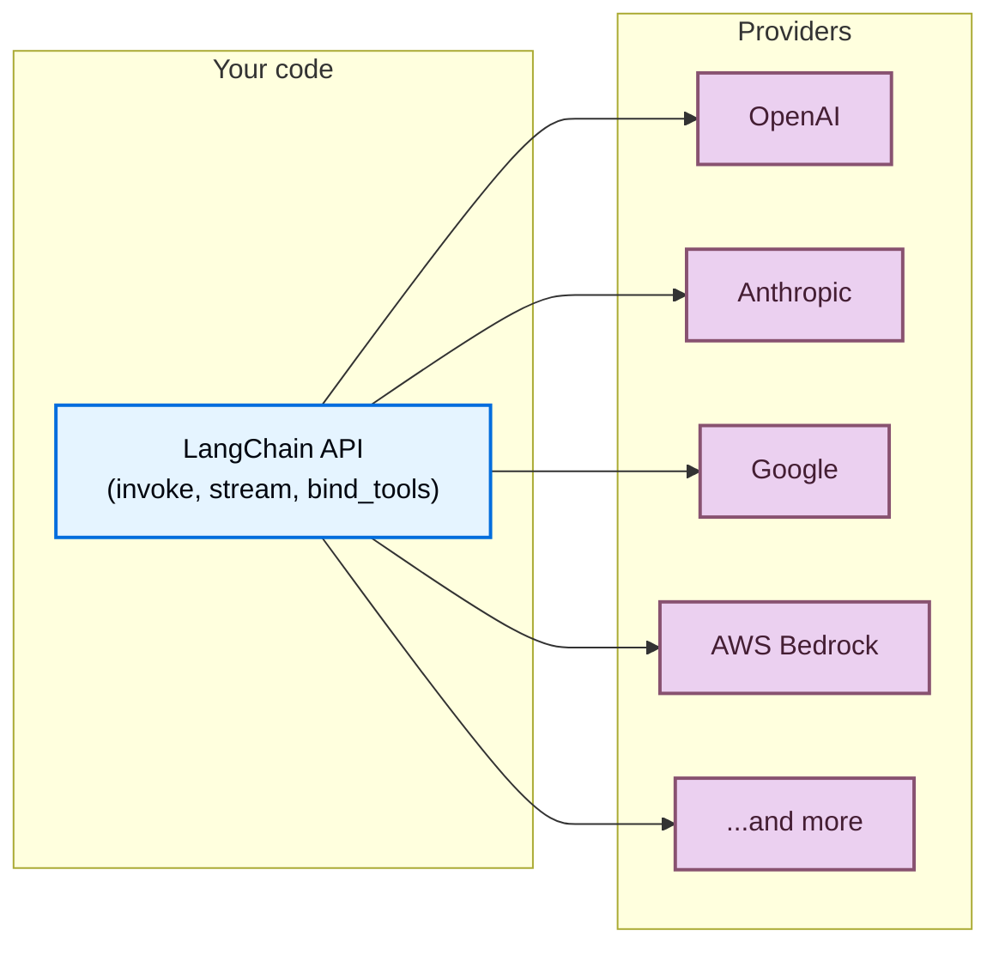

LangChain 为你提供单一的统一 API 来使用来自任何提供商的模型。安装一个提供商包，选择一个模型名称，然后开始构建——无论你使用 OpenAI、Anthropic、Google 还是任何其他支持的提供商，同样的代码都能工作。



## 一个 API 用于任何模型

每个 LangChain 聊天模型，无论提供商是谁，都实现相同的接口。这意味着你可以：

- **切换提供商**而无需重写应用逻辑
- **并排比较模型**使用相同的代码
- **使用高级功能**如[工具调用](/oss/python/langchain/tools)、[结构化输出](/oss/python/langchain/structured-output)和[流式处理](/oss/python/langchain/streaming)，跨所有提供商

```python
from langchain.chat_models import init_chat_model

openai_model = init_chat_model("openai:gpt-5.4")
anthropic_model = init_chat_model("anthropic:claude-opus-4-6")
google_model = init_chat_model("google-genai:gemini-3.1-pro-preview")

for model in [openai_model, anthropic_model, google_model]:
    response = model.invoke("Explain quantum computing in one sentence.")
    print(response.text)
```


## 什么是提供商？

**提供商**是托管 AI 模型并通过 API 公开它们的的公司或平台。示例包括 OpenAI、Anthropic、Google 和 AWS Bedrock。

在 LangChain 中，每个提供商都有一个专门的**集成包**（例如 `langchain-openai`、`langchain-anthropic`），实现该提供商模型的 LangChain 标准接口。这意味着：

- 每个提供商都有专用包，具有适当的版本控制和依赖管理
- **特定提供商的功能**在你需要时可用（例如，OpenAI 的 Responses API、Anthropic 的扩展思考）
- **通过环境变量自动处理 API 密钥**

```shell
uv add langchain-openai       # For OpenAI models
uv add langchain-anthropic    # For Anthropic models
uv add langchain-google-genai # For Google models
```


有关提供商包的完整列表，请参阅[集成页面](/oss/python/integrations/providers/overview)。

## 查找模型名称

每个提供商支持特定的模型名称，你在初始化聊天模型时传递这些名称。有两种指定模型的方法：

<CodeGroup>
    ```python Provider prefix format
    from langchain.chat_models import init_chat_model

    model = init_chat_model("openai:gpt-5.4")
    ```

    ```python Direct class instantiation
    from langchain_openai import ChatOpenAI

    model = ChatOpenAI(model="gpt-5.4")
    ```
</CodeGroup>


当使用 [`init_chat_model`](https://reference.langchain.com/python/langchain/chat_models/base/init_chat_model) 和 `provider:model` 格式时，LangChain 自动解析提供商并加载正确的集成包。如果模型名称明确（例如 `"gpt-5.4"` 解析为 OpenAI），你也可以省略提供商前缀。

要查找提供商的可用模型名称，请参阅该提供商的文档。以下是一些流行的提供商：

| 提供商 | 在哪里找到模型名称 |
| :--- | :--- |
| [OpenAI](/oss/python/integrations/providers/openai) | [OpenAI 模型页面](https://platform.openai.com/docs/models) |
| [Anthropic](/oss/python/integrations/providers/anthropic) | [Anthropic 模型页面](https://docs.anthropic.com/en/docs/about-claude/models) |
| [Google](/oss/python/integrations/providers/google) | [Google AI 模型页面](https://ai.google.dev/gemini-api/docs/models) |
| [AWS Bedrock](/oss/python/integrations/providers/aws) | [Bedrock 支持的模型](https://docs.aws.amazon.com/bedrock/latest/userguide/models-supported.html) |
| [Ollama](/oss/python/integrations/providers/ollama) | [Ollama 模型库](https://ollama.com/library) |
| [Groq](/oss/python/integrations/providers/groq) | [Groq 支持的模型](https://console.groq.com/docs/models) |


## 立即使用新模型

因为 LangChain 提供商包将模型名称直接传递给提供商的 API，所以你可以在提供商发布新模型的那一刻使用它们（无需 LangChain 更新）。只需传递新的模型名称：

```python
model = init_chat_model("google_genai:gemini-mythos")
```


只要你的提供商包版本支持模型所需的 API 版本，新模型名称就能立即工作。在大多数情况下，模型版本是向后兼容的，不需要包更新。

## 模型能力

不同的提供商和模型支持不同的功能。
有关聊天模型集成及其功能的列表，请参阅[聊天模型集成页面](/oss/python/integrations/chat)。

## 路由器和代理

**路由器**（也称为代理或网关）让你通过单一 API 和凭据访问来自多个提供商的模型。它们可以简化计费，让你无需更改集成即可在模型之间切换，并提供自动回退和负载平衡等功能。

| 提供商 | 集成 | 描述 |
| :------- | :---------- | :---------- |
| [OpenRouter](https://openrouter.ai/) | [`ChatOpenRouter`](/oss/python/integrations/chat/openrouter) | 统一访问来自 OpenAI、Anthropic、Google、Meta 等的模型 |
| [LiteLLM](https://www.litellm.ai/) | [`ChatLiteLLM`](/oss/python/integrations/chat/litellm) | 100+ 提供商的统一接口，具有路由、回退和支出跟踪功能 |


路由器在以下情况下很有用：

- **访问多个提供商**使用单一 API 密钥和计费账户
- **动态切换模型**而无需管理多个提供商凭据
- **使用回退模型**在主模型失败时自动使用不同模型重试

```python
from langchain.chat_models import init_chat_model

model = init_chat_model("openrouter:anthropic/claude-sonnet-4-6")
response = model.invoke("Hello!")
```


## OpenAI 兼容端点

许多提供商提供与 OpenAI 的[聊天补全 API](https://platform.openai.com/docs/api-reference/chat)兼容的端点。你可以使用自定义 `base_url` 通过 [`ChatOpenAI`](/oss/python/integrations/chat/openai) 连接这些：

```python
from langchain_openai import ChatOpenAI

model = ChatOpenAI(
    base_url="https://your-provider.com/v1",
    api_key="your-api-key",
    model="provider-model-name",
)
```


<Warning>
    `ChatOpenAI` 面向[官方 OpenAI API 规范](https://github.com/openai/openai-openapi)。不会提取或保留来自第三方提供商的非标准响应字段。当你需要访问非标准功能时，请使用专用提供商包或路由器。
</Warning>

## 下一步

<CardGroup cols={2}>
    <Card title="模型指南" icon="cpu" href="/oss/python/langchain/models">
        了解如何使用模型：调用、流式处理、批处理、工具调用等等。
    </Card>
    <Card title="聊天模型集成" icon="message" href="/oss/python/integrations/chat">
        浏览所有聊天模型集成及其功能。
    </Card>
    <Card title="所有提供商" icon="grid-dots" href="/oss/python/integrations/providers/overview">
        查看提供商包和集成的完整列表。
    </Card>
    <Card title="代理" icon="robot" href="/oss/python/langchain/agents">
        构建使用模型作为推理引擎的代理。
    </Card>
</CardGroup>

---

<div className="source-links">
<Callout icon="terminal-2">
    [Connect these docs](/use-these-docs) to Claude, VSCode, and more via MCP for real-time answers.
</Callout>
<Callout icon="edit">
    [Edit this page on GitHub](https://github.com/langchain-ai/docs/edit/main/src/oss\concepts\providers-and-models.mdx) or [file an issue](https://github.com/langchain-ai/docs/issues/new/choose).
</Callout>
</div>
