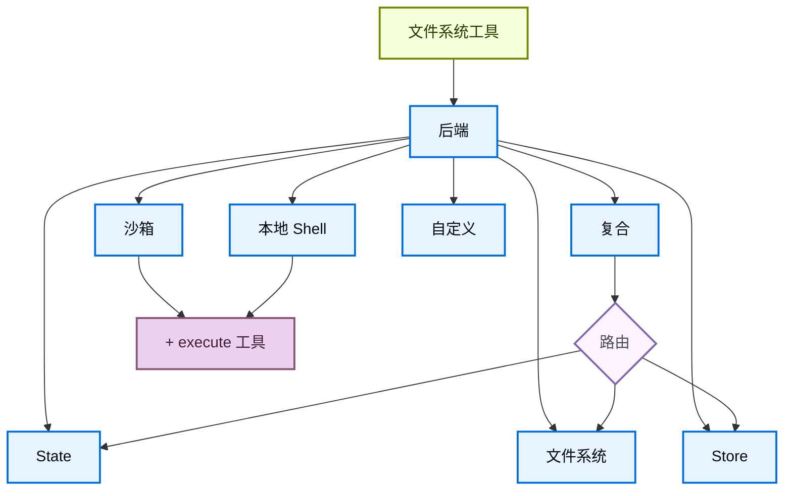

import BackendStatePy from '/snippets/backend-state-py.mdx';
import BackendStateJs from '/snippets/backend-state-js.mdx';
import BackendFilesystemPy from '/snippets/backend-filesystem-py.mdx';
import BackendFilesystemJs from '/snippets/backend-filesystem-js.mdx';
import BackendLocalShellPy from '/snippets/backend-local-shell-py.mdx';
import BackendLocalShellJs from '/snippets/backend-local-shell-js.mdx';
import BackendStorePy from '/snippets/backend-store-py.mdx';
import BackendStoreJs from '/snippets/backend-store-js.mdx';
import BackendCompositePy from '/snippets/backend-composite-py.mdx';
import BackendCompositeJs from '/snippets/backend-composite-js.mdx';

深度代理通过 `ls`、`read_file`、`write_file`、`edit_file`、`glob` 和 `grep` 等工具向代理公开文件系统表面。这些工具通过可插拔后端操作。`read_file` 工具在所有后端上原生支持图像文件（`.png`、`.jpg`、`.jpeg`、`.gif`、`.webp`），将它们作为多模态内容块返回。


沙箱和 [`LocalShellBackend`](https://reference.langchain.com/python/deepagents/backends/local_shell/LocalShellBackend) 也提供 `execute` 工具。
本页说明如何：

- [选择后端](#specify-a-backend)、
- [将不同路径路由到不同后端](#route-to-different-backends)、
- [实现您自己的虚拟文件系统](#use-a-virtual-filesystem)（例如 S3 或 Postgres）、
- 在文件系统访问上[设置权限](#permissions)、

- [遵守后端协议](#protocol-reference)、


## 快速开始

以下是一些可与您的深度代理快速使用的预构建文件系统后端：

| 内置后端 | 描述 |
|---|---|
| [默认](#statebackend-ephemeral) | `agent = create_deep_agent(model="google_genai:gemini-3.1-pro-preview")` <br></br>状态中临时。代理的默认文件系统后端存储在 `langgraph` 状态中。请注意，此文件系统仅在单个线程中持久化。 |
| [本地文件系统持久化](#filesystembackend-local-disk) | `agent = create_deep_agent(model="google_genai:gemini-3.1-pro-preview", backend=FilesystemBackend(root_dir="/Users/nh/Desktop/"))` <br></br>这为深度代理提供了对本地机器文件系统的访问。您可以指定代理有权访问的根目录。请注意，任何提供的 `root_dir` 必须是绝对路径。 |
| [持久化存储（LangGraph store）](#storebackend-langgraph-store) | `agent = create_deep_agent(model="google_genai:gemini-3.1-pro-preview", backend=StoreBackend())` <br></br>这为代理提供了跨线程持久化的长期存储。这非常适合存储适用于代理多次执行的长期记忆或指令。 |
| [沙箱](/oss/python/deepagents/sandboxes) | `agent = create_deep_agent(model="google_genai:gemini-3.1-pro-preview", backend=sandbox)` <br></br>在隔离环境中执行代码。沙箱提供文件系统工具以及用于运行 shell 命令的 `execute` 工具。从 Modal、Daytona、Deno 或本地 VFS 中选择。 |
| [本地 shell](#localshellbackend-local-shell) | `agent = create_deep_agent(model="google_genai:gemini-3.1-pro-preview", backend=LocalShellBackend(root_dir=".", env={"PATH": "/usr/bin:/bin"}))` <br></br>直接在主机上进行文件系统和 shell 执行。无隔离——仅在受控的开发环境中使用。请参阅下面的[安全注意事项](#localshellbackend-local-shell)。 |
| [复合](#compositebackend-router) | 默认临时，`/memories/` 持久化。复合后端是最大灵活的。您可以指定文件系统中的不同路由指向不同的后端。请参阅下面的复合路由以获取可粘贴的示例。 |




## 内置后端

### StateBackend（临时）

<BackendStatePy />


**工作原理：**
- 通过 [`StateBackend`](https://reference.langchain.com/python/deepagents/backends/state/StateBackend) 将文件存储在当前线程的 LangGraph 代理状态中。
- 通过检查点在同一线程上的多个代理轮次中持久化。

**最适合：**
- 代理写入中间结果的草稿纸。
- 自动驱逐大型工具输出，然后代理可以逐片读回。

请注意，此后端在主管代理和子代理之间共享，任何子代理写入的文件将保留在 LangGraph 代理状态中
即使在该子代理的执行完成后。这些文件将继续对主管代理和其他子代理可用。

### FilesystemBackend（本地磁盘）

[`FilesystemBackend`](https://reference.langchain.com/python/deepagents/backends/filesystem/FilesystemBackend) 在可配置的根目录下读取和写入真实文件。

<Warning>
此后端授予代理直接文件系统读/写访问权限。
谨慎使用，仅在适当的环境中。

**适当的使用案例：**
- 本地开发 CLI（编码助手、开发工具）
- CI/CD 流水线（请参阅下面的安全注意事项）

**不适当的使用案例：**
- Web 服务器或 HTTP API - 改用 `StateBackend`、`StoreBackend` 或[沙箱后端](/oss/python/deepagents/sandboxes)

**安全风险：**
- 代理可以读取任何可访问的文件，包括 secrets（API 密钥、凭证、`.env` 文件）
- 与网络工具结合，secrets 可能通过 SSRF 攻击被泄露
- 文件修改是永久的且不可逆的

**推荐的保护措施：**
1. 启用[人工介入（HITL）中间件](/oss/python/deepagents/human-in-the-loop)来审查敏感操作。
2. 从可访问的文件系统路径中排除 secrets（尤其是在 CI/CD 中）。
3. 对需要文件系统交互的生产环境使用[沙箱后端](/oss/python/deepagents/sandboxes)。
4. **始终**将 `virtual_mode=True` 与 `root_dir` 一起使用，以启用基于路径的访问限制（阻止 `..`、`~` 和根目录外的绝对路径）。
   请注意，默认值（`virtual_mode=False`）即使设置了 `root_dir` 也提供不了安全保障。
</Warning>

<BackendFilesystemPy />


**工作原理：**
- 在可配置的 `root_dir` 下读取/写入真实文件。
- 您可以选择设置 `virtual_mode=True` 来在 `root_dir` 下沙箱化和规范化路径。
- 使用安全路径解析，尽可能防止不安全的符号链接遍历，可以使用 ripgrep 进行快速 `grep`。

**最适合：**
- 您机器上的本地项目
- CI 沙箱
- 挂载的持久化卷

### LocalShellBackend（本地 shell）

<Warning>
此后端授予代理对您主机的直接文件系统读/写访问权限**并且**无限制的 shell 执行。
极端谨慎使用，仅在受控环境中。

**适当的使用案例：**
- 本地开发 CLI（编码助手、开发工具）
- 您信任代理代码的个人开发环境
- 具有适当 secret 管理的 CI/CD 流水线

**不适当的使用案例：**
- 生产环境（如 Web 服务器、API、多租户系统）
- 处理不受信任的用户输入或执行不受信任的代码

**安全风险：**
- 代理可以使用您的用户权限执行**任意 shell 命令**
- 代理可以读取任何可访问的文件，包括 secrets（API 密钥、凭证、`.env` 文件）
- Secrets 可能会被暴露
- 文件修改和命令执行是**永久的且不可逆的**
- 命令直接在您的主机系统上运行
- 命令可以消耗无限的 CPU、内存、磁盘

**推荐的保护措施：**
1. 启用[人工介入（HITL）中间件](/oss/python/deepagents/human-in-the-loop)在执行前审查和批准操作。这是**强烈推荐的**。
2. 仅在专用开发环境中运行。切勿在共享或生产系统上使用。
3. 对需要 shell 执行的生产环境使用[沙箱后端](/oss/python/deepagents/sandboxes)。

**注意：**`virtual_mode=True` 在启用 shell 访问时提供不了安全保障，因为命令可以访问系统上的任何路径。
</Warning>

<BackendLocalShellPy />


**工作原理：**
- 使用 `execute` 工具扩展 `FilesystemBackend`，用于在主机上运行 shell 命令。
- 命令使用 `subprocess.run(shell=True)` 直接在您的机器上运行，没有沙箱。
- 支持 `timeout`（默认 120s）、`max_output_bytes`（默认 100,000）、`env` 和 `inherit_env` 用于环境变量。
- Shell 命令使用 `root_dir` 作为工作目录，但可以访问系统上的任何路径。

**最适合：**
- 本地编码助手和开发工具
- 当您信任代理时快速迭代开发

### StoreBackend（LangGraph store）

<BackendStorePy />


<Tip>
    `namespace` 参数控制数据隔离。对于多用户部署，始终设置[命名空间工厂](/oss/python/deepagents/backends#namespace-factories)以隔离每个用户或租户的数据。
</Tip>

**工作原理：**
- [`StoreBackend`](https://reference.langchain.com/python/deepagents/backends/store/StoreBackend) 将文件存储在运行时提供的 LangGraph [`BaseStore`](https://reference.langchain.com/python/langchain-core/stores/BaseStore) 中，实现跨线程持久化存储。

**最适合：**
- 当您已经使用配置的 LangGraph store 运行（例如 Redis、Postgres 或 [`BaseStore`](https://reference.langchain.com/python/langchain-core/stores/BaseStore) 后面的云实现）。
- 当您通过 [LangSmith 部署](/langsmith/deployment) 部署代理时（自动为您的代理配置 store）。

#### 命名空间工厂

命名空间工厂控制 `StoreBackend` 读取和写入数据的位置。它接收 LangGraph [`Runtime`](https://reference.langchain.com/python/langgraph/runtime/Runtime) 并返回用作 store 命名空间的字符串元组。使用命名空间工厂来隔离用户、租户或助手之间的数据。

在构造 `StoreBackend` 时将命名空间工厂传递给 `namespace` 参数：

```python
NamespaceFactory = Callable[[Runtime], tuple[str, ...]]
```

`Runtime` 提供：
- `rt.context` — 通过 LangGraph 的[上下文模式](https://langchain-ai.github.io/langgraph/concepts/runtime/)传递的用户提供上下文（例如 `user_id`）
- `rt.server_info` — 在 LangGraph Server 上运行时的服务器特定元数据（助手 ID、图 ID、经过身份验证的用户）
- `rt.execution_info` — 执行身份信息（线程 ID、运行 ID、检查点 ID）


<Note>
`Runtime` 参数在 `deepagents>=0.5.2` 中可用。较早的 0.5.x 版本改为传递 `BackendContext`——请参阅下面的[从 BackendContext 迁移](#migrating-from-backendcontext)。`rt.server_info` 和 `rt.execution_info` 需要 `deepagents>=0.5.0`。
</Note>


**常见命名空间模式：**

```python
from deepagents.backends import StoreBackend

# Per-user: each user gets their own isolated storage
backend = StoreBackend(
    namespace=lambda rt: (rt.server_info.user.identity,),  # [!code highlight]
)

# Per-assistant: all users of the same assistant share storage
backend = StoreBackend(
    namespace=lambda rt: (
        rt.server_info.assistant_id,  # [!code highlight]
    ),
)

# Per-thread: storage scoped to a single conversation
backend = StoreBackend(
    namespace=lambda rt: (
        rt.execution_info.thread_id,  # [!code highlight]
    ),
)
```


您可以组合多个组件来创建更特定的范围——例如，`(user_id, thread_id)` 用于每个用户每个对话的隔离，或者在相同范围使用多个 store 命名空间时追加 `"filesystem"` 等后缀以消除歧义。

命名空间组件只能包含字母数字字符、连字符、下划线、点、`@`、`+`、冒号和波浪号。通配符（`*`、`?`）被拒绝以防止 glob 注入。

<Warning>
    `namespace` 参数在 v0.5.0 中将是**必需的**。始终为新代码显式设置它。
</Warning>


<Note>
    当没有提供命名空间工厂时，遗留默认值使用 LangGraph 配置元数据中的 `assistant_id`。这意味着相同[助手](/langsmith/assistants)的所有用户共享相同的存储。对于多用户[投入生产](/oss/python/deepagents/going-to-production)，始终提供命名空间工厂。
</Note>

### CompositeBackend（路由器）

<BackendCompositePy />


**工作原理：**
- [`CompositeBackend`](https://reference.langchain.com/python/deepagents/backends/composite/CompositeBackend) 根据路径前缀将文件操作路由到不同的后端。
- 在列表和搜索结果中保留原始路径前缀。

**最适合：**
- 当您希望为代理提供临时和跨线程存储时，`CompositeBackend` 允许您同时提供 `StateBackend` 和 `StoreBackend`
- 当您有多个信息来源希望作为单一文件系统提供给代理时。
    - 例如，您在一个 Store 中有存储在 `/memories/` 下的长期记忆，您还有一个自定义后端，可在 /docs/ 下访问文档。

## 指定后端

- 将后端实例传递给 `create_deep_agent(model=..., backend=...)`。文件系统中间件将其用于所有工具。
- 后端必须实现 `BackendProtocol`（例如 `StateBackend()`、`FilesystemBackend(root_dir=".")`、`StoreBackend()`）。
- 如果省略，默认是 `StateBackend()`。


## 路由到不同后端

将命名空间的部分路由到不同的后端。常用于持久化 `/memories/*` 并将其他所有内容保持为临时。

```python
from deepagents import create_deep_agent
from deepagents.backends import CompositeBackend, StateBackend, FilesystemBackend

agent = create_deep_agent(
    model="google_genai:gemini-3.1-pro-preview",
    backend=CompositeBackend(
        default=StateBackend(),
        routes={
            "/memories/": FilesystemBackend(root_dir="/deepagents/myagent", virtual_mode=True),
        },
    )
)
```


行为：
- `/workspace/plan.md` → `StateBackend`（临时）
- `/memories/agent.md` → `/deepagents/myagent` 下的 `FilesystemBackend`
- `ls`、`glob`、`grep` 聚合结果并显示原始路径前缀。

注意：
- 更长的前缀优先（例如，路由 `"/memories/projects/"` 可以覆盖 `"/memories/"`）。
- 对于 StoreBackend 路由，确保通过 `create_deep_agent(model=..., store=...)` 或由平台配置提供了 store。

## 使用虚拟文件系统

构建自定义后端以将远程或数据库文件系统（例如 S3 或 Postgres）投影到工具命名空间中。

设计指南：

- 路径是绝对的（`/x/y.txt`）。决定如何将它们映射到您的存储键/行。
- 高效实现 `ls` 和 `glob`（尽可能在服务器端过滤，否则本地过滤）。
- 对于外部持久化（S3、Postgres 等），在写/编辑结果中返回 `files_update=None`（Python）或省略 `filesUpdate`（JS）——只有内存状态后端需要返回 files 更新字典。

- 使用 `ls` 和 `glob` 作为方法名称。
- 返回带有 `error` 字段的结构化结果类型，用于缺少文件或无效模式（不要抛出）。


S3 风格大纲：

```python
from deepagents.backends.protocol import (
    BackendProtocol, WriteResult, EditResult, LsResult, ReadResult, GrepResult, GlobResult,
)

class S3Backend(BackendProtocol):
    def __init__(self, bucket: str, prefix: str = ""):
        self.bucket = bucket
        self.prefix = prefix.rstrip("/")

    def _key(self, path: str) -> str:
        return f"{self.prefix}{path}"

    def ls(self, path: str) -> LsResult:
        # List objects under _key(path); build FileInfo entries (path, size, modified_at)
        ...

    def read(self, file_path: str, offset: int = 0, limit: int = 2000) -> ReadResult:
        # Fetch object; return ReadResult(file_data=...) or ReadResult(error=...)
        ...

    def grep(self, pattern: str, path: str | None = None, glob: str | None = None) -> GrepResult:
        # Optionally filter server‑side; else list and scan content
        ...

    def glob(self, pattern: str, path: str = "/") -> GlobResult:
        # Apply glob relative to path across keys
        ...

    def write(self, file_path: str, content: str) -> WriteResult:
        # Enforce create‑only semantics; return WriteResult(path=file_path, files_update=None)
        ...

    def edit(self, file_path: str, old_string: str, new_string: str, replace_all: bool = False) -> EditResult:
        # Read → replace (respect uniqueness vs replace_all) → write → return occurrences
        ...
```


Postgres 风格大纲：

- Table `files(path text primary key, content text, created_at timestamptz, modified_at timestamptz)`
- Map tool operations onto SQL:
  - `ls` uses `WHERE path LIKE $1 || '%'`
  - `glob` filter in SQL or fetch then apply glob in Python
  - `grep` can fetch candidate rows by extension or last modified time, then scan lines


## 权限

使用[权限](/oss/python/deepagents/permissions)以声明方式控制代理可以读取或写入哪些文件和目录。权限在内置文件系统工具上应用，在后端被调用之前进行评估。

```python
from deepagents import create_deep_agent, FilesystemPermission

agent = create_deep_agent(
    model="google_genai:gemini-3.1-pro-preview",
    backend=CompositeBackend(
        default=StateBackend(),
        routes={
            "/memories/": StoreBackend(
                namespace=lambda rt: (rt.server_info.user.identity,),
            ),
            "/policies/": StoreBackend(
                namespace=lambda rt: (rt.context.org_id,),
            ),
        },
    ),
    permissions=[
        FilesystemPermission(
            operations=["write"],
            paths=["/policies/**"],
            mode="deny",
        ),
    ],
)
```


有关包括规则排序、子代理权限和复合后端交互的完整选项集，请参阅[权限指南](/oss/python/deepagents/permissions)。

## 添加策略钩子

对于超越基于路径的允许/拒绝规则的自定义验证逻辑（速率限制、审计日志、内容检查），通过子类化或包装后端来强制执行企业规则。

阻止选定前缀下的写入/编辑（子类）：

```python
from deepagents.backends.filesystem import FilesystemBackend
from deepagents.backends.protocol import WriteResult, EditResult

class GuardedBackend(FilesystemBackend):
    def __init__(self, *, deny_prefixes: list[str], **kwargs):
        super().__init__(**kwargs)
        self.deny_prefixes = [p if p.endswith("/") else p + "/" for p in deny_prefixes]

    def write(self, file_path: str, content: str) -> WriteResult:
        if any(file_path.startswith(p) for p in self.deny_prefixes):
            return WriteResult(error=f"Writes are not allowed under {file_path}")
        return super().write(file_path, content)

    def edit(self, file_path: str, old_string: str, new_string: str, replace_all: bool = False) -> EditResult:
        if any(file_path.startswith(p) for p in self.deny_prefixes):
            return EditResult(error=f"Edits are not allowed under {file_path}")
        return super().edit(file_path, old_string, new_string, replace_all)
```


通用包装器（适用于任何后端）：

```python
from deepagents.backends.protocol import (
    BackendProtocol, WriteResult, EditResult, LsResult, ReadResult, GrepResult, GlobResult,
)

class PolicyWrapper(BackendProtocol):
    def __init__(self, inner: BackendProtocol, deny_prefixes: list[str] | None = None):
        self.inner = inner
        self.deny_prefixes = [p if p.endswith("/") else p + "/" for p in (deny_prefixes or [])]

    def _deny(self, path: str) -> bool:
        return any(path.startswith(p) for p in self.deny_prefixes)

    def ls(self, path: str) -> LsResult:
        return self.inner.ls(path)

    def read(self, file_path: str, offset: int = 0, limit: int = 2000) -> ReadResult:
        return self.inner.read(file_path, offset=offset, limit=limit)
    def grep(self, pattern: str, path: str | None = None, glob: str | None = None) -> GrepResult:
        return self.inner.grep(pattern, path, glob)
    def glob(self, pattern: str, path: str = "/") -> GlobResult:
        return self.inner.glob(pattern, path)
    def write(self, file_path: str, content: str) -> WriteResult:
        if self._deny(file_path):
            return WriteResult(error=f"Writes are not allowed under {file_path}")
        return self.inner.write(file_path, content)
    def edit(self, file_path: str, old_string: str, new_string: str, replace_all: bool = False) -> EditResult:
        if self._deny(file_path):
            return EditResult(error=f"Edits are not allowed under {file_path}")
        return self.inner.edit(file_path, old_string, new_string, replace_all)
```


## 从后端工厂迁移

<Warning>
后端工厂模式在 `deepagents` 0.5.0 中**已弃用**。直接传递预构建的后端实例，而不是工厂函数。


</Warning>

以前，像 `StateBackend` 和 `StoreBackend` 这样的后端需要一个工厂函数来接收运行时对象，因为它们需要运行时上下文（state、store）来操作。后端现在通过 LangGraph 的 `get_config()`、`get_store()` 和 `get_runtime()` 帮助器在内部解析此上下文，因此您可以直接传递实例。

### 发生了什么变化

| 之前（已弃用） | 之后 |
|---|---|
| `backend=lambda rt: StateBackend(rt)` | `backend=StateBackend()` |
| `backend=lambda rt: StoreBackend(rt)` | `backend=StoreBackend()` |
| `backend=lambda rt: CompositeBackend(default=StateBackend(rt), ...)` | `backend=CompositeBackend(default=StateBackend(), ...)` |
| `backend: (config) => new StateBackend(config)` | `backend: new StateBackend()` |
| `backend: (config) => new StoreBackend(config)` | `backend: new StoreBackend()` |

### 已弃用的 API

| 已弃用 | 替换 |
|---|---|
| 传递可调用对象到 `create_deep_agent` 中的 `backend=` | 直接传递后端实例 |
| `StateBackend(runtime)` 构造函数上的 `runtime` 参数 | `StateBackend()`（不需要参数） |
| `StoreBackend(runtime)` 构造函数上的 `runtime` 参数 | `StoreBackend()` 或 `StoreBackend(namespace=..., store=...)` |
| `WriteResult` 和 `EditResult` 上的 `files_update` 字段 | 状态写入现在由后端内部处理 |
| 中间件写入/编辑工具中的 `Command` 包装 | 工具返回普通字符串；不需要 `Command(update=...)` |


<Note>
工厂模式在运行时仍然有效，但会发出弃用警告。在下一个主要版本之前更新您的代码以使用直接实例。
</Note>

### 迁移示例

```python
# 之前（已弃用）
from deepagents import create_deep_agent
from deepagents.backends import CompositeBackend, StateBackend, StoreBackend

agent = create_deep_agent(
    model="google_genai:gemini-3.1-pro-preview",
    backend=lambda rt: CompositeBackend(
        default=StateBackend(rt),
        routes={"/memories/": StoreBackend(rt, namespace=lambda rt: (rt.server_info.user.identity,))},
    ),
)

# 之后
agent = create_deep_agent(
    model="google_genai:gemini-3.1-pro-preview",
    backend=CompositeBackend(
        default=StateBackend(),
        routes={"/memories/": StoreBackend(namespace=lambda rt: (rt.server_info.user.identity,))},
    ),
)
```


### 从 `BackendContext` 迁移

在 `deepagents>=0.5.2`（Python）和 `deepagents>=1.9.1`（TypeScript）中，命名空间工厂直接接收 LangGraph [`Runtime`](https://reference.langchain.com/python/langgraph/runtime/Runtime)，而不是 `BackendContext` 包装器。旧的 `BackendContext` 形式仍然通过向后兼容的 `.runtime` 和 `.state` 访问器工作，但这些访问器会发出弃用警告，将在 `deepagents>=0.7` 中移除。

**发生了什么变化：**

- 工厂参数现在是 `Runtime`，而不是 `BackendContext`。
- 删除 `.runtime` 访问器——例如，`ctx.runtime.context.user_id` 变为 `rt.server_info.user.identity`。
- 没有直接替换 `ctx.state`。命名空间信息应该是只读的，并且在运行的生命周期内是稳定的，而 state 是可变的，逐步骤变化——从中导出命名空间可能导致数据出现在不一致的键下。如果您有需要读取代理状态的使用案例，请[打开一个问题](https://github.com/langchain-ai/deepagents/issues)。

```python
# 之前（已弃用，在 v0.7 中移除）
StoreBackend(
    namespace=lambda ctx: (ctx.runtime.context.user_id,),  # [!code --]
)

# 之后
StoreBackend(
    namespace=lambda rt: (rt.server_info.user.identity,),  # [!code ++]
)
```


## 协议参考

后端必须实现 [`BackendProtocol`](https://reference.langchain.com/python/deepagents/backends/protocol/BackendProtocol)。

必需的方法：
- `ls(path: str) -> LsResult`
  - 返回至少带有 `path` 的条目。在可用时包括 `is_dir`、`size`、`modified_at`。按 `path` 排序以获得确定性输出。
- `read(file_path: str, offset: int = 0, limit: int = 2000) -> ReadResult`
  - 成功时返回文件数据。文件缺失时，返回 `ReadResult(error="Error: File '/x' not found")`。
- `grep(pattern: str, path: Optional[str] = None, glob: Optional[str] = None) -> GrepResult`
  - 返回结构化匹配。出错时，返回 `GrepResult(error="...")`（不要抛出）。
- `glob(pattern: str, path: str = "/") -> GlobResult`
  - 返回匹配的文件作为 `FileInfo` 条目（如果没有则为空列表）。
- `write(file_path: str, content: str) -> WriteResult`
  - 仅创建。冲突时，返回 `WriteResult(error=...)`。成功时，设置 `path` 并对状态后端设置 `files_update={...}`；外部后端应使用 `files_update=None`。
- `edit(file_path: str, old_string: str, new_string: str, replace_all: bool = False) -> EditResult`
  - 强制 `old_string` 的唯一性，除非 `replace_all=True`。如果未找到，返回错误。成功时包括 `occurrences`。

支持类型：
- `LsResult(error, entries)` — 成功时 `entries` 是 `list[FileInfo]`，失败时为 `None`。
- `ReadResult(error, file_data)` — 成功时 `file_data` 是 `FileData` 字典，失败时为 `None`。
- `GrepResult(error, matches)` — 成功时 `matches` 是 `list[GrepMatch]`，失败时为 `None`。
- `GlobResult(error, matches)` — 成功时 `matches` 是 `list[FileInfo]`，失败时为 `None`。
- `WriteResult(error, path, files_update)`
- `EditResult(error, path, files_update, occurrences)`
- `FileInfo` 带有字段：`path`（必需），可选 `is_dir`、`size`、`modified_at`。
- `GrepMatch` 带有字段：`path`、`line`、`text`。
- `FileData` 带有字段：`content`（str）、`encoding`（`"utf-8"` 或 `"base64"`）、`created_at`、`modified_at`。
::

js
## 更新现有后端到 V2

<Accordion title="迁移指南">

### 方法重命名

| V1 方法 | V2 方法 | 返回类型更改 |
|-----------|-----------|-------------------|
| `lsInfo(path)` | `ls(path)` | `FileInfo[]` → `LsResult` |
| `read(filePath, offset, limit)` | `read(filePath, offset, limit)` | `string` → `ReadResult` |
| `readRaw(filePath)` | `readRaw(filePath)` | `FileData` → `ReadRawResult` |
| `grepRaw(pattern, path, glob)` | `grep(pattern, path, glob)` | `GrepMatch[] \| string` → `GrepResult` |
| `globInfo(pattern, path)` | `glob(pattern, path)` | `FileInfo[]` → `GlobResult` |
| `write(...)` | `write(...)` | 不变（`WriteResult`） |
| `edit(...)` | `edit(...)` | 不变（`EditResult`） |

### 类型重命名

| V1 类型 | V2 类型 |
|---------|---------|
| `BackendProtocol` | `BackendProtocolV2` |
| `SandboxBackendProtocol` | `SandboxBackendProtocolV2` |

### 适配工具

如果您有需要与 V2 代码一起使用的现有 V1 后端，请使用适配函数：

```typescript
import { adaptBackendProtocol, adaptSandboxProtocol } from "deepagents";

// 将 V1 后端适配到 V2
const v2Backend = adaptBackendProtocol(v1Backend);

// 将 V1 沙箱适配到 V2
const v2Sandbox = adaptSandboxProtocol(v1Sandbox);
```

<Note>
框架自动适配传递给 `createDeepAgent()` 的 V1 后端。仅在直接调用协议方法时才需要手动适配。
</Note>

</Accordion>
:::

---

<div className="source-links">
<Callout icon="terminal-2">
    [Connect these docs](/use-these-docs) to Claude, VSCode, and more via MCP for real-time answers.
</Callout>
<Callout icon="edit">
    [Edit this page on GitHub](https://github.com/langchain-ai/docs/edit/main/src/oss\deepagents\backends.mdx) or [file an issue](https://github.com/langchain-ai/docs/issues/new/choose).
</Callout>
</div>
