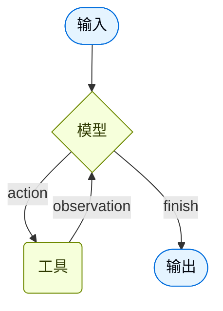

代理将语言模型与[工具](/oss/python/langchain/tools)结合，创建能够推理任务、决定使用哪些工具并迭代地朝着解决方案工作的系统。

[`create_agent`](https://reference.langchain.com/python/langchain/agents/factory/create_agent) 提供了一个可用于生产的代理实现。


[大型语言模型代理在循环中运行工具以实现目标](https://simonwillison.net/2025/Sep/18/agents/)。
代理运行直到满足停止条件——即当模型发出最终输出或达到迭代限制。



<Info>

[`create_agent`](https://reference.langchain.com/python/langchain/agents/factory/create_agent) 使用 [LangGraph](/oss/python/langgraph/overview) 构建基于**图**的代理运行时。图由节点（步骤）和边（连接）组成，定义您的代理如何处理信息。代理通过此图移动，执行节点如模型节点（调用模型）、工具节点（执行工具）或中间件。


详细了解[图 API](/oss/python/langgraph/graph-api)。

</Info>

## 核心组件

### 模型

[模型](/oss/python/langchain/models) 是您代理的推理引擎。它可以通过多种方式指定，支持静态和动态模型选择。

#### 静态模型

静态模型在创建代理时配置一次，在整个执行过程中保持不变。这是最常见和最直接的方法。

要从 <Tooltip tip="遵循 `provider:model` 格式的字符串（例如 openai:gpt-5）" cta="查看映射" href="https://reference.langchain.com/python/langchain/models/#langchain.chat_models.init_chat_model(model)">模型标识符字符串</Tooltip> 初始化静态模型：

```python wrap
from langchain.agents import create_agent

agent = create_agent("openai:gpt-5.4", tools=tools)
```


<Tip>
    模型标识符字符串支持自动推断（例如，"gpt-5.4" 将被推断为 "openai:gpt-5.4"）。请参阅 [参考](https://reference.langchain.com/python/langchain/chat_models/base/init_chat_model) 查看模型标识符字符串映射的完整列表。
</Tip>

要对模型配置进行更多控制，请直接使用 provider 包初始化模型实例。在本例中，我们使用 [`ChatOpenAI`](https://reference.langchain.com/python/langchain-openai/chat_models/base/ChatOpenAI)。请参阅[聊天模型](/oss/python/integrations/chat)查看其他可用的聊天模型类。

```python wrap
from langchain.agents import create_agent
from langchain_openai import ChatOpenAI

model = ChatOpenAI(
    model="gpt-5.4",
    temperature=0.1,
    max_tokens=1000,
    timeout=30
    # ... (other params)
)
agent = create_agent(model, tools=tools)
```

模型实例为您提供配置的完全控制。当您需要设置特定[参数](/oss/python/langchain/models#parameters)（如 `temperature`、`max_tokens`、`timeouts`、`base_url`）和其他 provider 特定设置时使用它们。请参阅[参考](/oss/python/integrations/providers/all_providers)查看模型上可用的参数和方法。


#### 动态模型

动态模型基于当前<Tooltip tip="流经代理执行的数据，包括消息、自定义字段以及在处理过程中需要跟踪和可能修改的任何信息（例如用户偏好或工具使用统计）。">状态</Tooltip>和上下文在<Tooltip tip="代理的执行环境，包含在代理执行过程中持久化的不可变配置和上下文数据（例如用户 ID、会话详情或应用程序特定配置）。">运行时</Tooltip>选择。这实现了复杂的路由逻辑和成本优化。

要使用动态模型，请使用 [`@wrap_model_call`](https://reference.langchain.com/python/langchain/agents/middleware/types/wrap_model_call) 装饰器创建中间件来修改请求中的模型：

```python
from langchain_openai import ChatOpenAI
from langchain.agents import create_agent
from langchain.agents.middleware import wrap_model_call, ModelRequest, ModelResponse


basic_model = ChatOpenAI(model="gpt-5.4-mini")
advanced_model = ChatOpenAI(model="gpt-5.4")

@wrap_model_call
def dynamic_model_selection(request: ModelRequest, handler) -> ModelResponse:
    """Choose model based on conversation complexity."""
    message_count = len(request.state["messages"])

    if message_count > 10:
        # Use an advanced model for longer conversations
        model = advanced_model
    else:
        model = basic_model

    return handler(request.override(model=model))

agent = create_agent(
    model=basic_model,  # Default model
    tools=tools,
    middleware=[dynamic_model_selection]
)
```

<Warning>
使用结构化输出时，不支持预绑定模型（已调用 [`bind_tools`](https://reference.langchain.com/python/langchain-core/language_models/chat_models/BaseChatModel/bind_tools) 的模型）。如果您需要带有结构化输出的动态模型选择，请确保传递给中间件的模型不是预绑定的。
</Warning>


<Tip>
有关模型配置详细信息，请参阅[模型](/oss/python/langchain/models)。有关动态模型选择模式，请参阅[中间件中的动态模型](/oss/python/langchain/middleware#dynamic-model)。
</Tip>

### 工具

工具使代理能够执行操作。代理超越简单的纯模型工具绑定，促进：

- 顺序调用多个工具（由单个提示词触发）
- 适当时候并行调用工具
- 基于先前结果的动态工具选择
- 工具重试逻辑和错误处理
- 跨工具调用的状态持久化

有关更多信息，请参阅[工具](/oss/python/langchain/tools)。

#### 静态工具

静态工具在创建代理时定义，在整个执行过程中保持不变。这是最常见和最直接的方法。

要使用静态工具定义代理，请将工具列表传递给代理。

<Tip>
工具可以指定为普通 Python 函数或<Tooltip tip="一种可以暂停执行并稍后恢复的方法">协程</Tooltip>。

[工具装饰器](/oss/python/langchain/tools#create-tools)可用于自定义工具名称、描述、参数模式和其他属性。
</Tip>

```python wrap
from langchain.tools import tool
from langchain.agents import create_agent


@tool
def search(query: str) -> str:
    """Search for information."""
    return f"Results for: {query}"

@tool
def get_weather(location: str) -> str:
    """Get weather information for a location."""
    return f"Weather in {location}: Sunny, 72°F"

agent = create_agent(model, tools=[search, get_weather])
```


如果提供空工具列表，代理将只包含一个没有工具调用能力的大型语言模型节点。

#### 动态工具

对于动态工具，可用于代理的工具集在运行时修改，而不是预先全部定义。并非每个工具都适合每个情况。太多工具可能会使模型过载（上下文过载）并增加错误；太少会限制能力。动态工具选择能够根据身份验证状态、用户权限、功能标志或对话阶段调整可用的工具集。

根据工具是否提前知道，有两种方法：

<Tabs>
  <Tab title="过滤预注册工具">

    当所有可能的工具都在代理创建时已知时，您可以预注册它们，并根据状态、权限或上下文动态过滤向模型暴露哪些工具。

    <Tabs>
      <Tab title="State">
        在某些对话里程碑之后启用高级工具：

        ```python
        from langchain.agents import create_agent
        from langchain.agents.middleware import wrap_model_call, ModelRequest, ModelResponse
        from typing import Callable

        @wrap_model_call
        def state_based_tools(
            request: ModelRequest,
            handler: Callable[[ModelRequest], ModelResponse]
        ) -> ModelResponse:
            """Filter tools based on conversation State."""
            # Read from State: check if user has authenticated
            state = request.state
            is_authenticated = state.get("authenticated", False)
            message_count = len(state["messages"])

            # Only enable sensitive tools after authentication
            if not is_authenticated:
                tools = [t for t in request.tools if t.name.startswith("public_")]
                request = request.override(tools=tools)
            elif message_count < 5:
                # Limit tools early in conversation
                tools = [t for t in request.tools if t.name != "advanced_search"]
                request = request.override(tools=tools)

            return handler(request)

        agent = create_agent(
            model="gpt-5.4",
            tools=[public_search, private_search, advanced_search],
            middleware=[state_based_tools]
        )
        ```


      </Tab>

      <Tab title="Store">
        根据 Store 中的用户偏好或功能标志过滤工具：

        ```python
        from dataclasses import dataclass
        from langchain.agents import create_agent
        from langchain.agents.middleware import wrap_model_call, ModelRequest, ModelResponse
        from typing import Callable
        from langgraph.store.memory import InMemoryStore

        @dataclass
        class Context:
            user_id: str

        @wrap_model_call
        def store_based_tools(
            request: ModelRequest,
            handler: Callable[[ModelRequest], ModelResponse]
        ) -> ModelResponse:
            """Filter tools based on Store preferences."""
            user_id = request.runtime.context.user_id

            # Read from Store: get user's enabled features
            store = request.runtime.store
            feature_flags = store.get(("features",), user_id)

            if feature_flags:
                enabled_features = feature_flags.value.get("enabled_tools", [])
                # Only include tools that are enabled for this user
                tools = [t for t in request.tools if t.name in enabled_features]
                request = request.override(tools=tools)

            return handler(request)

        agent = create_agent(
            model="gpt-5.4",
            tools=[search_tool, analysis_tool, export_tool],
            middleware=[store_based_tools],
            context_schema=Context,
            store=InMemoryStore()
        )
        ```


      </Tab>

      <Tab title="Runtime Context">
        根据 Runtime Context 中的用户权限过滤工具：

        ```python
        from dataclasses import dataclass
        from langchain.agents import create_agent
        from langchain.agents.middleware import wrap_model_call, ModelRequest, ModelResponse
        from typing import Callable

        @dataclass
        class Context:
            user_role: str

        @wrap_model_call
        def context_based_tools(
            request: ModelRequest,
            handler: Callable[[ModelRequest], ModelResponse]
        ) -> ModelResponse:
            """Filter tools based on Runtime Context permissions."""
            # Read from Runtime Context: get user role
            if request.runtime is None or request.runtime.context is None:
                # If no context provided, default to viewer (most restrictive)
                user_role = "viewer"
            else:
                user_role = request.runtime.context.user_role

            if user_role == "admin":
                # Admins get all tools
                pass
            elif user_role == "editor":
                # Editors can't delete
                tools = [t for t in request.tools if t.name != "delete_data"]
                request = request.override(tools=tools)
            else:
                # Viewers get read-only tools
                tools = [t for t in request.tools if t.name.startswith("read_")]
                request = request.override(tools=tools)

            return handler(request)

        agent = create_agent(
            model="gpt-5.4",
            tools=[read_data, write_data, delete_data],
            middleware=[context_based_tools],
            context_schema=Context
        )
        ```


      </Tab>
    </Tabs>

    这种方法最适合：
    - 所有可能的工具都在编译/启动时已知
    - 您想根据权限、功能标志或对话状态进行过滤
    - 工具是静态的，但它们的可用性是动态的

    有关更多示例，请参阅[动态选择工具](/oss/python/langchain/middleware/custom#dynamically-selecting-tools)。

  </Tab>

  <Tab title="运行时工具注册">

    当工具在运行时被发现或创建时（例如，从 MCP 服务器加载、根据用户数据生成或从远程注册表获取），您需要同时注册工具并动态处理它们的执行。

    这需要两个中间件钩子：
    1. `wrap_model_call` - 将动态工具添加到请求
    2. `wrap_tool_call` - 处理动态添加的工具的执行

    ```python
    from langchain.tools import tool
    from langchain.agents import create_agent
    from langchain.agents.middleware import AgentMiddleware, ModelRequest, ToolCallRequest

    # A tool that will be added dynamically at runtime
    @tool
    def calculate_tip(bill_amount: float, tip_percentage: float = 20.0) -> str:
        """Calculate the tip amount for a bill."""
        tip = bill_amount * (tip_percentage / 100)
        return f"Tip: ${tip:.2f}, Total: ${bill_amount + tip:.2f}"

    class DynamicToolMiddleware(AgentMiddleware):
        """Middleware that registers and handles dynamic tools."""

        def wrap_model_call(self, request: ModelRequest, handler):
            # Add dynamic tool to the request
            # This could be loaded from an MCP server, database, etc.
            updated = request.override(tools=[*request.tools, calculate_tip])
            return handler(updated)

        def wrap_tool_call(self, request: ToolCallRequest, handler):
            # Handle execution of the dynamic tool
            if request.tool_call["name"] == "calculate_tip":
                return handler(request.override(tool=calculate_tip))
            return handler(request)

    agent = create_agent(
        model="gpt-4o",
        tools=[get_weather],  # Only static tools registered here
        middleware=[DynamicToolMiddleware()],
    )

    # The agent can now use both get_weather AND calculate_tip
    result = agent.invoke({
        "messages": [{"role": "user", "content": "Calculate a 20% tip on $85"}]
    })
    ```


    这种方法最适合：
    - 工具在运行时被发现（例如，从 MCP 服务器）
    - 工具根据用户数据或配置动态生成
    - 您正在与外部工具注册表集成

    <Note>
    运行时注册的工具需要 `wrap_tool_call` 钩子，因为代理需要知道如何执行不在原始工具列表中的工具。没有它，代理将不知道如何调用动态添加的工具。
    </Note>

  </Tab>
</Tabs>

<Tip>
要了解更多关于工具的信息，请参阅[工具](/oss/python/langchain/tools)。
</Tip>

#### 工具错误处理

要自定义工具错误的处理方式，请使用 [`@wrap_tool_call`](https://reference.langchain.com/python/langchain/agents/middleware/types/wrap_tool_call) 装饰器创建中间件：

```python wrap
from langchain.agents import create_agent
from langchain.agents.middleware import wrap_tool_call
from langchain.messages import ToolMessage


@wrap_tool_call
def handle_tool_errors(request, handler):
    """Handle tool execution errors with custom messages."""
    try:
        return handler(request)
    except Exception as e:
        # Return a custom error message to the model
        return ToolMessage(
            content=f"Tool error: Please check your input and try again. ({str(e)})",
            tool_call_id=request.tool_call["id"]
        )

agent = create_agent(
    model="gpt-5.4",
    tools=[search, get_weather],
    middleware=[handle_tool_errors]
)
```

当工具失败时，代理将返回带有自定义错误消息的 [`ToolMessage`](https://reference.langchain.com/python/langchain-core/messages/tool/ToolMessage)：

```python
[
    ...
    ToolMessage(
        content="Tool error: Please check your input and try again. (division by zero)",
        tool_call_id="..."
    ),
    ...
]
```


#### 在 ReAct 循环中使用工具

代理遵循 ReAct（"推理 + 行动"）模式，在简短的推理步骤和针对性的工具调用之间交替，并将产生的观察结果反馈到后续决策中，直到它们能够提供最终答案。

<Accordion title="ReAct 循环示例">
**提示：** 识别当前最流行的无线耳机并验证库存情况。

```
================================ Human Message =================================

Find the most popular wireless headphones right now and check if they're in stock
```

* **推理**: "流行度是随时间变化的，我需要使用提供的搜索工具。"
* **行动**: 调用 `search_products("wireless headphones")`

```
================================== Ai Message ==================================
Tool Calls:
  search_products (call_abc123)
 Call ID: call_abc123
  Args:
    query: wireless headphones
```
```
================================= Tool Message =================================

Found 5 products matching "wireless headphones". Top 5 results: WH-1000XM5, ...
```

* **推理**: "我需要确认排名靠前商品的库存情况后再回答用户的问题。"
* **行动**: 调用 `check_inventory("WH-1000XM5")`

```
================================== Ai Message ==================================
Tool Calls:
  check_inventory (call_def456)
 Call ID: call_def456
  Args:
    product_id: WH-1000XM5
```
```
================================= Tool Message =================================

Product WH-1000XM5: 10 units in stock
```

* **推理**: "我已经获得了最流行的型号及其库存状态。现在可以回答用户的问题了。"
* **行动**: 生成最终答案

```
================================== Ai Message ==================================

I found wireless headphones (model WH-1000XM5) with 10 units in stock...
```
</Accordion>

### 系统提示词

您可以通过提供提示词来塑造代理处理任务的方式。[`system_prompt`](https://reference.langchain.com/python/langchain/agents/#langchain.agents.create_agent(system_prompt)) 参数可以作为字符串提供：


```python wrap
agent = create_agent(
    model,
    tools,
    system_prompt="You are a helpful assistant. Be concise and accurate."
)
```


当没有提供 [`system_prompt`](https://reference.langchain.com/python/langchain/agents/#langchain.agents.create_agent(system_prompt)) 时，代理将直接从消息中推断其任务。

[`system_prompt`](https://reference.langchain.com/python/langchain/agents/#langchain.agents.create_agent(system_prompt)) 参数接受 `str` 或 [`SystemMessage`](https://reference.langchain.com/python/langchain-core/messages/system/SystemMessage)。使用 `SystemMessage` 使您可以更好地控制提示词结构，这对于 provider 特定功能（如 [Anthropic 的提示词缓存](/oss/python/integrations/chat/anthropic#prompt-caching)）很有用：

```python wrap
from langchain.agents import create_agent
from langchain.messages import SystemMessage, HumanMessage

literary_agent = create_agent(
    model="google_genai:gemini-3.1-pro-preview",
    system_prompt=SystemMessage(
        content=[
            {
                "type": "text",
                "text": "You are an AI assistant tasked with analyzing literary works.",
            },
            {
                "type": "text",
                "text": "<the entire contents of 'Pride and Prejudice'>",
                "cache_control": {"type": "ephemeral"}
            }
        ]
    )
)

result = literary_agent.invoke(
    {"messages": [HumanMessage("Analyze the major themes in 'Pride and Prejudice'.")]}
)
```

`cache_control` 字段与 `{"type": "ephemeral"}` 告诉 Anthropic 缓存该内容块，减少使用相同系统提示词的重复请求的延迟和成本。


#### 动态系统提示词

对于需要根据运行时上下文或代理状态修改系统提示词的更高级用例，您可以使用[中间件](/oss/python/langchain/middleware)。

[`@dynamic_prompt`](https://reference.langchain.com/python/langchain/agents/middleware/types/dynamic_prompt) 装饰器创建根据模型请求生成系统提示词的中间件：

```python wrap
from typing import TypedDict

from langchain.agents import create_agent
from langchain.agents.middleware import dynamic_prompt, ModelRequest


class Context(TypedDict):
    user_role: str

@dynamic_prompt
def user_role_prompt(request: ModelRequest) -> str:
    """Generate system prompt based on user role."""
    user_role = request.runtime.context.get("user_role", "user")
    base_prompt = "You are a helpful assistant."

    if user_role == "expert":
        return f"{base_prompt} Provide detailed technical responses."
    elif user_role == "beginner":
        return f"{base_prompt} Explain concepts simply and avoid jargon."

    return base_prompt

agent = create_agent(
    model="gpt-5.4",
    tools=[web_search],
    middleware=[user_role_prompt],
    context_schema=Context
)

# The system prompt will be set dynamically based on context
result = agent.invoke(
    {"messages": [{"role": "user", "content": "Explain machine learning"}]},
    context={"user_role": "expert"}
)
```


<Tip>
有关消息类型和格式的更多详细信息，请参阅[消息](/oss/python/langchain/messages)。有关全面的中间件文档，请参阅[中间件](/oss/python/langchain/middleware)。
</Tip>

### 名称

为代理设置一个可选的 [`name`](https://reference.langchain.com/python/langchain/agents/factory/create_agent)。这在将代理作为子图添加到[多代理系统](/oss/python/langchain/multi-agent)时用作节点标识符：

```python
agent = create_agent(
    model,
    tools,
    name="research_assistant"
)
```


<Warning>
    代理名称首选 `snake_case`（例如，使用 `research_assistant` 而不是 `Research Assistant`）。某些模型提供商拒绝包含空格或特殊字符的名称并返回错误。仅使用字母数字字符、下划线和连字符可确保与所有提供商的兼容性。这同样适用于[工具名称](/oss/python/langchain/tools)。
</Warning>

## 调用

您可以通过传递对其 [`State`](/oss/python/langgraph/graph-api#state) 的更新来调用代理。所有代理都在其状态中包含[一系列消息](/oss/python/langgraph/use-graph-api#messagesstate)；要调用代理，请传递一条新消息：


```python
result = agent.invoke(
    {"messages": [{"role": "user", "content": "What's the weather in San Francisco?"}]}
)
```


有关从代理流式传输步骤和/或标记的信息，请参阅[流式处理](/oss/python/langchain/streaming)指南。

否则，代理遵循 LangGraph [图 API](/oss/python/langgraph/use-graph-api)并支持所有相关方法，如 `stream` 和 `invoke`。

<Tip>
使用 [LangSmith](/langsmith/home) 来追踪、调试和评估您的代理。
</Tip>

## 高级概念

### 结构化输出

在某些情况下，您可能希望代理以特定格式返回输出。LangChain 通过 [`response_format`](https://reference.langchain.com/python/langchain/agents/factory/create_agent) 参数提供结构化输出策略。

#### ToolStrategy

`ToolStrategy` 使用人工工具调用来生成结构化输出。这适用于任何支持工具调用的模型。当 provider 原生结构化输出（通过 [`ProviderStrategy`](#providerstrategy)）不可用或不可靠时，应使用 `ToolStrategy`。

```python wrap
from pydantic import BaseModel
from langchain.agents import create_agent
from langchain.agents.structured_output import ToolStrategy


class ContactInfo(BaseModel):
    name: str
    email: str
    phone: str

agent = create_agent(
    model="gpt-5.4-mini",
    tools=[search_tool],
    response_format=ToolStrategy(ContactInfo)
)

result = agent.invoke({
    "messages": [{"role": "user", "content": "Extract contact info from: John Doe, john@example.com, (555) 123-4567"}]
})

result["structured_response"]
# ContactInfo(name='John Doe', email='john@example.com', phone='(555) 123-4567')
```

#### ProviderStrategy

`ProviderStrategy` 使用模型提供商的原生结构化输出生成。这更可靠，但仅适用于支持原生结构化输出的提供商：

```python wrap
from langchain.agents.structured_output import ProviderStrategy

agent = create_agent(
    model="gpt-5.4",
    response_format=ProviderStrategy(ContactInfo)
)
```

<Note>
从 `langchain 1.0` 开始，只需传递模式（例如 `response_format=ContactInfo`）将默认为 `ProviderStrategy`（如果模型支持原生结构化输出）。否则它会回退到 `ToolStrategy`。
</Note>


<Tip>
    要了解结构化输出，请参阅[结构化输出](/oss/python/langchain/structured-output)。
</Tip>

### 内存

代理通过消息状态自动维护对话历史记录。您还可以配置代理使用自定义状态模式来记住对话期间的附加信息。

存储在状态中的信息可以被认为是代理的[短期记忆](/oss/python/langchain/short-term-memory)：

自定义状态模式必须扩展 [`AgentState`](https://reference.langchain.com/python/langchain/agents/middleware/types/AgentState) 作为 `TypedDict`。

定义自定义状态有两种方法：
1. 通过[中间件](/oss/python/langchain/middleware)（首选）
2. 通过 [`state_schema`](https://reference.langchain.com/python/langchain/middleware/#langchain.agents.middleware.AgentMiddleware.state_schema) 在 [`create_agent`](https://reference.langchain.com/python/langchain/agents/factory/create_agent) 上

#### 通过中间件定义状态

当您的自定义状态需要被附加到所述中间件的特定中间件钩子和工具访问时，使用中间件定义自定义状态。

```python
from langchain.agents import AgentState
from langchain.agents.middleware import AgentMiddleware
from typing import Any


class CustomState(AgentState):
    user_preferences: dict

class CustomMiddleware(AgentMiddleware):
    state_schema = CustomState
    tools = [tool1, tool2]

    def before_model(self, state: CustomState, runtime) -> dict[str, Any] | None:
        ...

agent = create_agent(
    model,
    tools=tools,
    middleware=[CustomMiddleware()]
)

# The agent can now track additional state beyond messages
result = agent.invoke({
    "messages": [{"role": "user", "content": "I prefer technical explanations"}],
    "user_preferences": {"style": "technical", "verbosity": "detailed"},
})
```

#### 通过 `state_schema` 定义状态

使用 [`state_schema`](https://reference.langchain.com/python/langchain/middleware/#langchain.agents.middleware.AgentMiddleware.state_schema) 参数作为快捷方式来定义仅在工具中使用的自定义状态。

```python
from langchain.agents import AgentState


class CustomState(AgentState):
    user_preferences: dict

agent = create_agent(
    model,
    tools=[tool1, tool2],
    state_schema=CustomState
)
# The agent can now track additional state beyond messages
result = agent.invoke({
    "messages": [{"role": "user", "content": "I prefer technical explanations"}],
    "user_preferences": {"style": "technical", "verbosity": "detailed"},
})
```

<Note>
从 `langchain 1.0` 开始，自定义状态模式**必须是** `TypedDict` 类型。不再支持 Pydantic 模型和数据类。请参阅 [v1 迁移指南](/oss/python/migrate/langchain-v1#state-type-restrictions) 了解更多详细信息。
</Note>


<Note>
    通过中间件定义自定义状态比通过 [`state_schema`](https://reference.langchain.com/python/langchain/middleware/#langchain.agents.middleware.AgentMiddleware.state_schema) 在 [`create_agent`](https://reference.langchain.com/python/langchain/agents/factory/create_agent) 上定义更可取，因为它允许您将状态扩展概念上保持在相关中间件和工具的范围内。

    [`state_schema`](https://reference.langchain.com/python/langchain/middleware/#langchain.agents.middleware.AgentMiddleware.state_schema) 仍受支持以保持向后兼容。
</Note>


<Tip>
要了解更多关于内存的信息，请参阅[内存](/oss/python/concepts/memory)。有关跨会话持久化的长期内存实现的信息，请参阅[长期记忆](/oss/python/langchain/long-term-memory)。
</Tip>

### 流式处理

我们已经看到如何调用 `invoke` 来获取最终响应。如果代理执行多个步骤，这可能需要一段时间。为了显示中间进度，我们可以在消息发生时将它们流式返回。

```python
from langchain.messages import AIMessage, HumanMessage

for chunk in agent.stream({
    "messages": [{"role": "user", "content": "Search for AI news and summarize the findings"}]
}, stream_mode="values"):
    # Each chunk contains the full state at that point
    latest_message = chunk["messages"][-1]
    if latest_message.content:
        if isinstance(latest_message, HumanMessage):
            print(f"User: {latest_message.content}")
        elif isinstance(latest_message, AIMessage):
            print(f"Agent: {latest_message.content}")
    elif latest_message.tool_calls:
        print(f"Calling tools: {[tc['name'] for tc in latest_message.tool_calls]}")
```


<Tip>
有关流式处理的更多详细信息，请参阅[流式处理](/oss/python/langchain/streaming)。
</Tip>

### 中间件

[中间件](/oss/python/langchain/middleware)为在执行的不同阶段自定义代理行为提供了强大的扩展性。您可以使用中间件来：

- 在调用模型之前处理状态（例如，消息修剪、上下文注入）
- 修改或验证模型的响应（例如，护栏、内容过滤）
- 使用自定义逻辑处理工具执行错误
- 基于状态或上下文实现动态模型选择
- 添加自定义日志记录、监控或分析

中间件无缝集成到代理的执行中，允许您在关键点拦截和修改数据流，而无需更改核心代理逻辑。

<Tip>
有关包括 [`@before_model`](https://reference.langchain.com/python/langchain/agents/middleware/types/before_model)、[`@after_model`](https://reference.langchain.com/python/langchain/agents/middleware/types/after_model) 和 [`@wrap_tool_call`](https://reference.langchain.com/python/langchain/agents/middleware/types/wrap_tool_call) 等装饰器的全面中间件文档，请参阅[中间件](/oss/python/langchain/middleware)。
</Tip>

---

<div className="source-links">
<Callout icon="terminal-2">
    [Connect these docs](/use-these-docs) to Claude, VSCode, and more via MCP for real-time answers.
</Callout>
<Callout icon="edit">
    [Edit this page on GitHub](https://github.com/langchain-ai/docs/edit/main/src/oss\langchain\agents.mdx) or [file an issue](https://github.com/langchain-ai/docs/issues/new/choose).
</Callout>
</div>
