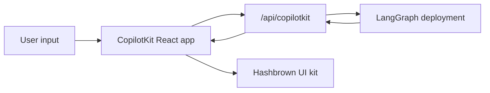

[CopilotKit](https://www.copilotkit.ai/) 提供了一个完整的 React 聊天运行时，当您希望代理返回 **结构化 UI 有效载荷** 而不是仅返回纯文本时，它与 LangGraph 特别搭配。在本模式中，您的 LangGraph 部署同时提供图形 API 和自定义 CopilotKit 端点，而前端在渲染时将助手消息解析为动态 React 组件。

这种方法在以下情况下很有用：

- 一个现成的聊天运行时，而不是自己连接 `stream.messages`
- 一个可以与已部署图形一起添加特定于提供商行为的自定义服务器端点
- 从约束组件注册表渲染的结构化生成式 UI

<Info>
  有关 CopilotKit 特定的 API、UI 模式和运行时配置，请参阅 [CopilotKit 文档](https://docs.copilotkit.ai/langgraph)。
</Info>

import { ExampleEmbed } from "/snippets/example-embed.jsx"

<ExampleEmbed example="copilotkit" minHeight={700} />

## 工作原理

从高层次来看，CopilotKit 位于您的 React 应用程序和 LangGraph 部署之间。前端将对话状态发送到 mounted 在图形 API 旁边的自定义 `/api/copilotkit` 路由，该路由将请求转发到 LangGraph，响应返回时带有助手消息和组件注册表可以在渲染时解析的任何结构化 UI 有效载荷。

1. **按常规部署图形** 使用 LangSmith 或使用 LangGraph 开发服务器。
2. **使用 HTTP 应用程序扩展部署** 在图形 API 旁边安装 CopilotKit 路由。
3. **用 `CopilotKit` 包装前端** 并将其指向自定义运行时 URL。
4. **注册动态 UI 组件** 并在渲染时将助手响应解析为这些组件。



## 安装

对于后端端点：


```bash
uv add copilotkit ag-ui-langgraph fastapi uvicorn
```


对于前端应用程序：

```bash
bun add @copilotkit/react-core @copilotkit/react-ui @hashbrownai/core @hashbrownai/react
```

## 使用自定义端点扩展 LangGraph 部署

关键思想是 LangGraph 部署不仅服务于图形。它还可以加载 HTTP 应用程序，这允许您在部署本身旁边安装额外的路由。

在 `langgraph.json` 中，将 `http.app` 指向您的自定义应用程序入口点：


```json
{
  "dependencies": ["."],
  "graphs": {
    "copilotkit_shadify": "./main.py:agent"
  },
  "http": {
    "app": "./main.py:app"
  }
}
```


在 Python 中，创建一个 `FastAPI` 应用程序，并通过 CopilotKit 的 AG-UI 桥接将 LangGraph 代理暴露：

```python main.py
from typing import Any, TypedDict

from ag_ui_langgraph import add_langgraph_fastapi_endpoint
from copilotkit import CopilotKitMiddleware, CopilotKitState, LangGraphAGUIAgent
from fastapi import FastAPI
from langchain.agents import create_agent

from src.middleware import apply_structured_output_schema, normalize_context


class AgentState(CopilotKitState):
    pass


class AgentContext(TypedDict, total=False):
    output_schema: dict[str, Any]


agent = create_agent(
    model="openai:gpt-5.4",
    middleware=[
        normalize_context,
        CopilotKitMiddleware(),
        apply_structured_output_schema,
    ],
    context_schema=AgentContext,
    state_schema=AgentState,
    system_prompt=(
        "You are a helpful UI assistant. Build visual responses using the "
        "available components."
    ),
)

app = FastAPI()

add_langgraph_fastapi_endpoint(
    app=app,
    agent=LangGraphAGUIAgent(
        name="copilotkit_shadify",
        description="A UI assistant that returns structured component payloads.",
        graph=agent,
    ),
    path="/",
)
```


这个自定义应用程序是重要的扩展点：它安装了一个 CopilotKit 感知的运行时，而不替换底层 LangGraph 部署。


在 Python 中，等效的工作发生在中间件中：规范化 CopilotKit 上下文并将 `output_schema` 从 `useAgentContext(...)` 转发到模型的结构化输出配置。

```python expandable src/middleware.py
import json
from collections.abc import Mapping

from langchain.agents.middleware import before_agent, wrap_model_call
from langchain.agents.structured_output import ProviderStrategy


@wrap_model_call
async def apply_structured_output_schema(request, handler):
    schema = None
    runtime = getattr(request, "runtime", None)
    runtime_context = getattr(runtime, "context", None)

    if isinstance(runtime_context, Mapping):
        schema = runtime_context.get("output_schema")

    if schema is None and isinstance(getattr(request, "state", None), dict):
        copilot_context = request.state.get("copilotkit", {}).get("context")
        if isinstance(copilot_context, list):
            for item in copilot_context:
                if isinstance(item, dict) and item.get("description") == "output_schema":
                    schema = item.get("value")
                    break

    if isinstance(schema, str):
        try:
            schema = json.loads(schema)
        except json.JSONDecodeError:
            schema = None

    if isinstance(schema, dict):
        request = request.override(
            response_format=ProviderStrategy(schema=schema, strict=True),
        )

    return await handler(request)


@before_agent
def normalize_context(state, runtime):
    copilotkit_state = state.get("copilotkit", {})
    context = copilotkit_state.get("context")

    if isinstance(context, list):
        normalized = [
            item.model_dump() if hasattr(item, "model_dump") else item
            for item in context
        ]
        return {"copilotkit": {**copilotkit_state, "context": normalized}}

    return None
```


结果是清晰的关注点分离：

- LangGraph 仍然拥有图形执行和持久化
- CopilotKit 拥有面向聊天的运行时契约
- 您的自定义端点在一次部署中将它们粘合在一起

## 构建前端应用程序结构

在前端，将您的应用程序包装在 `CopilotKit` 中并将其指向自定义运行时 URL：

```tsx
import { CopilotKit } from "@copilotkit/react-core";
import { CopilotChat, useAgentContext } from "@copilotkit/react-core/v2";
import { s } from "@hashbrownai/core";

import { useChatKit } from "@/components/chat/chat-kit";
import { chatTheme } from "@/lib/chat-theme";

export function App() {
  return (
    <CopilotKit runtimeUrl={import.meta.env.VITE_RUNTIME_URL ?? "/api/copilotkit"}>
      <Page />
    </CopilotKit>
  );
}

function Page() {
  const chatKit = useChatKit();

  useAgentContext({
    description: "output_schema",
    value: s.toJsonSchema(chatKit.schema),
  });

  return <CopilotChat {...chatTheme} />;
}
```

这里有两个重要的部分：

- `runtimeUrl="/api/copilotkit"` 将聊天发送到您的自定义后端路由，而不是直接发送到原始 LangGraph API
- `useAgentContext(...)` 将 UI 模式发送给代理，以便模型知道它应该产生什么结构化输出格式

## 注册动态组件

组件注册表位于 `useChatKit()` 中。这是你定义代理被允许发出的组件集的地方，例如卡片、行、列、图表、代码块和按钮。

```tsx
import { s } from "@hashbrownai/core";
import { exposeComponent, exposeMarkdown, useUiKit } from "@hashbrownai/react";

import { Button } from "@/components/ui/button";
import { Card } from "@/components/ui/card";
import { CodeBlock } from "@/components/ui/code-block";
import { Row, Column } from "@/components/ui/layout";
import { SimpleChart } from "@/components/ui/simple-chart";

export function useChatKit() {
  return useUiKit({
    components: [
      exposeMarkdown(),
      exposeComponent(Card, {
        name: "card",
        description: "Card to wrap generative UI content.",
        children: "any",
      }),
      exposeComponent(Row, {
        name: "row",
        props: {
          gap: s.string("Tailwind gap size") as never,
        },
        children: "any",
      }),
      exposeComponent(Column, {
        name: "column",
        children: "any",
      }),
      exposeComponent(SimpleChart, {
        name: "chart",
        props: {
          labels: s.array("Category labels", s.string("A label")),
          values: s.array("Numeric values", s.number("A value")),
        },
        children: false,
      }),
      exposeComponent(CodeBlock, {
        name: "code_block",
        props: {
          code: s.streaming.string("The code to display"),
          language: s.string("Programming language") as never,
        },
        children: false,
      }),
      exposeComponent(Button, {
        name: "button",
        children: "text",
      }),
    ],
  });
}
```

这个注册表成为代理和 UI 之间的契约。模型不是生成任意 JSX。它是在生成必须根据您公开的组件和 props 进行验证的结构化数据。

## 将助手消息渲染为动态 UI

一旦助手响应到达，自定义消息渲染器决定如何显示它。在这个例子中：

- 助手消息作为针对 UI kit 模式的结构化 JSON 进行解析
- 有效的结构化输出作为真正的 React 组件渲染
- 用户消息作为普通聊天气泡渲染

```tsx
import type { AssistantMessage } from "@ag-ui/core";
import type { RenderMessageProps } from "@copilotkit/react-ui";
import { useJsonParser } from "@hashbrownai/react";
import { memo } from "react";

import { useChatKit } from "@/components/chat/chat-kit";
import { Squircle } from "@/components/squircle";

const AssistantMessageRenderer = memo(function AssistantMessageRenderer({
  message,
}: {
  message: AssistantMessage;
}) {
  const kit = useChatKit();
  const { value } = useJsonParser(message.content ?? "", kit.schema);

  if (!value) return null;

  return (
    <div className="group/msg mt-2 flex w-full justify-start">
      <div className="magic-text-output w-full px-1 py-1">{kit.render(value)}</div>
    </div>
  );
});

export function CustomMessageRenderer({ message }: RenderMessageProps) {
  if (message.role === "assistant") {
    return <AssistantMessageRenderer message={message} />;
  }

  return (
    <div className="flex w-full justify-end">
      <Squircle className="w-full max-w-[64ch] px-4 py-3">
        <pre>{typeof message.content === "string" ? message.content : JSON.stringify(message.content, null, 2)}</pre>
      </Squircle>
    </div>
  );
}
```

这个渲染器模式使集成感觉原生：

- CopilotKit 处理聊天状态和传输
- 自定义渲染器决定助手有效载荷如何成为 UI
- [Hashbrown](https://hashbrown.dev/) 将经过验证的结构化数据转换为具体的 React 元素

## 最佳实践

- **保持自定义端点精简：** 用它来适配 CopilotKit 到您的图形部署，而不是复制已经存在于图形内部的业务逻辑
- **明确发送模式：** `useAgentContext` 应该在每次页面挂载时描述 UI 契约
- **注册约束组件集：** 仅公开您实际希望模型使用的组件和 props
- **将渲染视为解析步骤：** 在渲染之前根据您的模式解析助手内容
- **保持用户消息普通：** 只有助手消息需要结构化渲染器；用户消息可以保持普通聊天气泡

---

<div className="source-links">
<Callout icon="terminal-2">
    [Connect these docs](/use-these-docs) to Claude, VSCode, and more via MCP for real-time answers.
</Callout>
<Callout icon="edit">
    [Edit this page on GitHub](https://github.com/langchain-ai/docs/edit/main/src/oss\langchain\frontend\integrations\copilotkit.mdx) or [file an issue](https://github.com/langchain-ai/docs/issues/new/choose).
</Callout>
</div>
