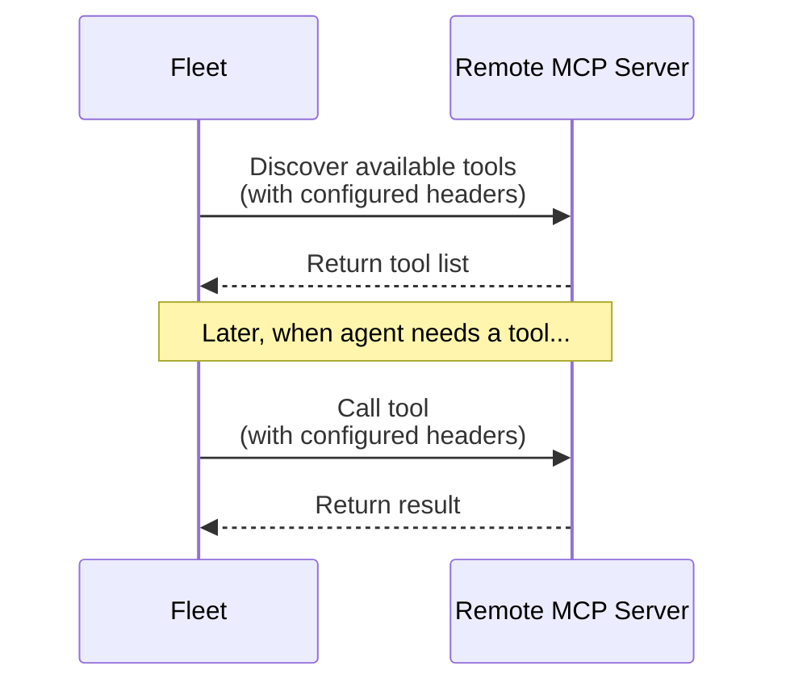

您可以将 LangSmith Fleet 连接到远程 MCP 服务器，以使用额外的工具和集成来扩展您的智能体。本页介绍了如何添加自定义 MCP 服务器，并提供了流行远程服务器的配置详细信息。

[MCP（模型上下文协议）服务器](https://modelcontextprotocol.io/docs/getting-started/intro)暴露了智能体可以在运行时调用的工具。

远程 MCP 服务器：

- 在 LangSmith 之外运行（通常通过 HTTPS）。
- 拥有自己的身份验证和授权。
- 充当您的智能体与外部系统之间的桥梁。

LangSmith Fleet 本身不执行这些工具，它将请求转发到 MCP 服务器并将结果返回给智能体。

### 工作原理

- Fleet 通过标准 MCP 协议从远程 MCP 服务器发现工具。
- 在您的工作区中配置的标头在获取工具或调用工具时会自动附加。标头是随每个 HTTP 请求发送到您的 MCP 服务器的键值对。它们通常用于身份验证（如 API 密钥或承载令牌），但也可以提供配置信息、内容类型或自定义元数据。
- 远程服务器的工具与 Fleet 中的内置工具一起可用。

**运行时**：Fleet 自动连接到您的 MCP 服务器并使用其工具。

## 添加远程 MCP 服务器

您可以直接从智能体或从工作区设置添加 MCP 服务器。

<Note>
添加 MCP 服务器需要**管理员**权限。
</Note>

### 添加到特定智能体

要将远程 MCP 服务器添加到特定智能体：

<Steps>
  <Step title="打开智能体编辑器">
    在 [Fleet](https://smith.langchain.com/agents) 收件箱中打开您的智能体。在智能体名称旁边，点击<Icon icon="pencil"/>**编辑智能体**图标。
  </Step>
  <Step title="添加 MCP 服务器">
    在**工具箱**部分，点击**MCP**。输入服务器名称和 URL，然后配置身份验证（请参阅[身份验证类型](#authentication-types)）。
  </Step>
  <Step title="保存您的智能体">
    点击**保存更改**。Fleet 将从您的 MCP 服务器发现可用工具，并在此智能体中提供它们。
  </Step>
</Steps>

### 添加到工作区中的所有智能体

要将远程 MCP 服务器添加到工作区中的所有智能体：

<Tabs>
  <Tab title="从 Fleet > 集成">

    <Steps>
      <Step title="导航到 Fleet > 集成">
        在 LangSmith UI 中，导航到[**Fleet** > **集成**](https://smith.langchain.com/agents/tools)选项卡。
      </Step>

      <Step title="添加服务器">
        1. 在左侧边栏底部点击**+ 自定义 MCP**。
        1. 为 MCP 服务器添加**名称**。
        1. 添加 MCP **URL**（例如，`https://api.example.com/mcp`）
        1. 选择**身份验证**类型。请参阅[身份验证类型](#authentication-types)了解更多详细信息。
      </Step>

      <Step title="保存服务器">
        点击**保存服务器**。Fleet 将自动从您的 MCP 服务器发现可用工具，并在您的智能体中提供它们。配置的标头将应用于工具发现请求和工具执行请求。
      </Step>
    </Steps>
  </Tab>
  <Tab title="从工作区设置">
    <Steps>
      <Step title="导航到 MCP 服务器设置">
        在 LangSmith UI 中，导航到[设置 > MCP 服务器](https://smith.langchain.com/settings/workspaces/mcp-servers)选项卡。
      </Step>
      <Step title="添加服务器">
        点击**添加服务器**并输入服务器名称和 URL，然后配置身份验证（请参阅[身份验证类型](#authentication-types)）。
      </Step>
      <Step title="保存服务器">
        点击**保存服务器**。Fleet 将自动从您的 MCP 服务器发现可用工具，并在您的智能体中提供它们。配置的标头将应用于工具发现请求和工具执行请求。
      </Step>
    </Steps>
  </Tab>
</Tabs>

### 身份验证类型

根据服务器的要求选择身份验证类型：

- **标头**：添加随每个请求发送的键值对。最常见的模式是使用 Authorization 承载令牌：
    - **密钥**：`Authorization`
    - **值**：`Bearer API_KEY`

    <Info>
    如果您的 MCP 服务器需要额外的身份验证或配置参数，您可以添加多个标头。每个标头键值对都会随每个请求发送到服务器。
    </Info>

- **OAuth 2.1（自动）**：对于支持通过动态客户端注册进行 OAuth 的服务器选择此项。系统将提示您登录该服务的账户。
- **OAuth 2.1（手动）**：对于支持 OAuth 但需要预先指定客户端 ID/密钥的服务器选择此项。此流程中使用的 OAuth 提供程序必须启用 **PKCE**。

## 更新您的 MCP 服务器 URL

<Warning>
更改自定义 MCP 服务器的 URL 将导致使用该服务器工具的任何智能体中断。
</Warning>

Fleet 通过 MCP 服务器 URL 存储工具引用。如果您更新自定义 MCP 服务器的 URL，现有智能体在尝试调用这些工具时会失败，因为存储的 URL 不再匹配。

要更新 MCP 服务器 URL：

1. 在工作区设置中更新您的 MCP 服务器 URL。
2. 对于使用该服务器工具的每个智能体：
   - 从智能体配置中移除受影响的工具。
   - 重新添加工具（它们现在将引用新 URL）。
3. 测试智能体以确认工具正常工作。

## 支持的服务器

要查看所有可用的 MCP 服务器和配置详细信息，请导航到 [Fleet > 集成选项卡](https://smith.langchain.com/agents/tools)。
